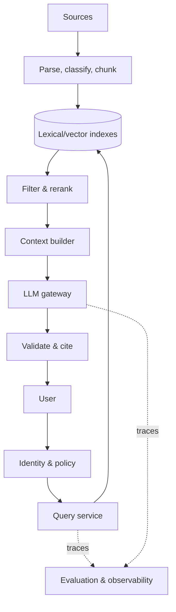

# Enterprise RAG

## Goal

Answer employee questions using authorized enterprise sources with citations, freshness controls, and operational evidence.

## Critical decisions

| Decision | Options | Key trade-off |
|---|---|---|
| Authorization | Filter at retrieval; separate indexes; both | Simplicity versus isolation |
| Retrieval | Lexical; vector; hybrid | Exactness versus semantic recall |
| Model | Hosted; self-hosted; routed | Control versus operational burden |
| Freshness | Events; schedules; on-demand | Cost versus staleness |
| Citation | Chunk; page; passage | Precision versus implementation effort |

## Failure scenarios

Unauthorized retrieval, stale index, parse loss, missing source, adversarial document, irrelevant top-k, context overflow, unsupported synthesis, provider timeout, and misleading citation.

## Evaluation

Maintain separate ingestion, authorization, retrieval, grounded-answer, citation, safety, latency, and cost test suites. Add realistic user journeys and high-risk departmental slices.

## Studio exercise

Adapt the design for a hospital, replacing generic assumptions with data classification, clinical review, regional residency, audit retention, and safe failure behavior.
