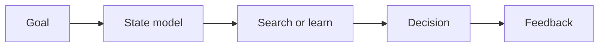

# 1.1 — What Intelligence Means

*Book 1: Foundations of Intelligence · Read 25 min · Worked example 20 min · Code/design practice 45–60 min · Review 10 min*

## Before you begin

- No AI background required
- Comfort reading simple Python
- Basic algebra

If a prerequisite is unfamiliar, use site search and read only enough to explain it and complete a small example. Do not block progress by mastering every upstream topic first.

## Why this chapter exists

Treat intelligence as a collection of capabilities rather than a mystical substance. Separate perception, representation, memory, learning, reasoning, planning, action, and adaptation.

The engineering objective is not to memorize vocabulary. By the end, you should be able to describe the mechanism, build or inspect a small implementation, recognize its failure modes, and decide where it belongs in a larger system.

## Learning objectives

- Explain why what intelligence means matters using the chapter scenario, not abstract definitions alone.
- Trace how **goal-directed behavior** and **rational agents** interact in the book-level visual.
- Implement or design the bounded practice while holding evaluation cases fixed.
- Diagnose at least two failure modes specific to feedback.
- Decide where this chapter's mechanism belongs in a production architecture and what evidence justifies it.

!!! note "Enduring principle"
    Intelligence is system behavior under goals and constraints, not a property inferred from fluent language.

## Mental model



Read the visual from left to right, then trace failures from right to left. The diagram is a book-level map; this chapter explains how **what intelligence means** changes one or more transitions.

## Core concepts

The concepts form a system, not a vocabulary list. Read each section below before attempting the practice exercise.

### Goal-Directed Behavior

Goal-directed behavior means selecting actions to reduce distance to an explicit objective rather than producing unconstrained text. Engineers care because fluent language can mask the absence of a measurable goal. See the [Goal-Directed Behavior concept card](../../concepts/cards/goal-directed-behavior.md).

**Example:** An incident router should minimize misroutes and escalation time, not maximize eloquent ticket summaries.

**Evidence of understanding:** Define the goal metric and show one action that improves it versus one that sounds better but scores worse.

### Rational Agents

Rational agents choose actions that maximize expected utility toward a goal given perceived state and known constraints. The design question is whether the system's action policy aligns with business utility, not model confidence. See the [Rational Agents concept card](../../concepts/cards/rational-agents.md).

**Example:** A lending assistant should prefer declining uncertain high-risk cases when false approvals cost more than false declines.

**Evidence of understanding:** Write the utility function and compare two candidate actions by expected cost, not by response fluency.

### Bounded Rationality

Bounded rationality acknowledges limited compute, time, memory, and information—systems must satisfice within budgets. Production AI rarely has the luxury of exhaustive search or perfect retrieval. See the [Bounded Rationality concept card](../../concepts/cards/bounded-rationality.md).

**Example:** An on-call copilot stops after three retrieval attempts within a 5-second latency SLO instead of searching until theoretical certainty.

**Evidence of understanding:** Document the stopping budget and demonstrate a case where more compute would help but violates the SLO.

### Capability Decomposition

Capability decomposition splits intelligence into perception, memory, learning, planning, and action so teams can own, test, and debug each part. Without it, fluent outputs hide which capability failed. See the [Capability Decomposition concept card](../../concepts/cards/capability-decomposition.md).

**Example:** Incident routing can fail in classification while generation still reads naturally—decomposition exposes the failing box.

**Evidence of understanding:** Draw a capability map and mark which component owns each failure from a real incident postmortem.

### Feedback

Feedback closes the loop: outcomes from actions update beliefs, models, or policies for subsequent decisions. Without feedback channels, the same mistakes repeat indefinitely. See the [Feedback concept card](../../concepts/cards/feedback.md).

**Example:** Misrouted tickets returned by engineers should update routing features so the error rate on that category is trackable week over week.

**Evidence of understanding:** Identify one feedback signal, where it is stored, and measure how many days until it influences the next decision.

## Worked example

**Book scenario:** A support team must route incidents without mistaking fluent descriptions for reliable decisions.

**Situation:** A support team routes incidents without mistaking fluent descriptions for reliable decisions. New hires paste long customer narratives into a shared inbox and guess severity from tone.

**Baseline:** A keyword-free queue that assigns tickets round-robin regardless of content—fast but blind to outage language.

**Application:** Decompose incident handling into perception (parse subject/body), representation (severity features), memory (recent duplicates), and decision (route to on-call vs backlog). Map each capability to an observable checkpoint before any model is introduced.

**Test cases:** (1) Normal: "API latency elevated in us-east" → P2 routing. (2) Boundary: empty body with P1 in subject only. (3) Adversarial: polite prose hiding "data loss" and "all regions down."

**Measurement:** Track precision@P1, median time-to-on-call, and false-P1 rate per 100 tickets; compare capability-map pipeline vs round-robin.

**Design question:** Which capability—perception, representation, or decision—would fail first if you removed human review, and what evidence from the three cases proves it?

## Chapter hook

Run this short snippet first to anchor **what intelligence means** before the book-level sample:

```python
GOAL = "route P1 incidents to on-call"
CAPABILITIES = ["perceive", "represent", "decide", "act"]
ticket = "All regions down — writes failing"
features = set(ticket.lower().split())
severity = "P1" if {"down", "failing"} & features else "P2"
trace = {cap: cap for cap in CAPABILITIES}
trace["represent"] = sorted(features)
trace["decide"] = severity
print({"goal": GOAL, "trace": trace})
```

Predict the printed values, then change one line tied to **goal-directed behavior** or **rational agents** and observe how the chapter mechanism moves.

## Runnable code sample

The following dependency-free sample supports this book. Download it from the [code-sample library](../../code-samples/01-search-planning.py) or run the matching file under `examples/`.

```python
--8<-- "docs/code-samples/01-search-planning.py"
```

Expected output is printed to the terminal. Before running it, predict which values or decisions should change. Then introduce one failure and convert the observation into a test.

??? success "Expected observation"
    A* should reach the same shortest path as breadth-first search while often expanding fewer states when the heuristic is informative.

This is a **book-level sample**. Its relevance to this chapter is the boundary between **goal-directed behavior** and **rational agents**. Modify that boundary, not unrelated lines, when completing the chapter exercise.

## Engineering practice

**Build:** Create a capability map for a familiar human task.

Work in three passes tailored to this chapter:

1. **Baseline:** Implement the task without goal-directed behavior and record quality, latency, and failure cases.
2. **Mechanism:** Add rational agents while keeping inputs and evaluation fixed; note what changed in intermediate state.
3. **Judgment:** Compare outcomes on normal, boundary, and adversarial cases; document when what intelligence means earns its operational cost.

Capture assumptions, test cases, results, and one architecture decision record. A successful lab explains *why* behavior changed, not merely that the program ran.

## Architecture lens

For a production design in **Foundations of Intelligence**, make the following explicit for **what intelligence means**:

| Concern | Question to answer |
|---|---|
| **Ownership** | Which service owns goal-directed behavior versus downstream consumers of its output? |
| **Contract** | What typed inputs, outputs, errors, and version does the bounded rationality boundary expose? |
| **Evidence** | Which eval slices prove what intelligence means meets requirements before and after each release? |
| **Security** | What untrusted data crosses the feedback boundary and how is it sanitized or authorized? |
| **Operations** | What is logged at this chapter's transition, what triggers retry or rollback, and what is cached? |
| **Economics** | Which resource—tokens, retrieval calls, GPU seconds, human review—dominates cost for this mechanism? |

## Failure clinic

Reproduce failures at the chapter boundary—do not debug only final output.

| Failure | Symptom | Likely cause | First response |
|---|---|---|---|
| **Baseline illusion** | The system looks fine on demo prompts but fails on the book scenario | Evaluation cases do not cover goal-directed behavior or rational agents | Add the chapter's normal, boundary, and adversarial cases before tuning |
| **Mechanism mismatch** | Adding complexity does not improve the measured outcome | what intelligence means is applied at the wrong layer or without fixing inputs | Trace the book visual and verify the transition this chapter owns |
| **Silent degradation** | Outputs remain fluent while decisions become wrong | Failure in feedback without observability at that boundary | Log intermediate state, version config, and compare against the baseline |
| **Operational drift** | Quality changes after deploy though prompts are unchanged | Data, permissions, or upstream goal-directed behavior behavior shifted | Pin versions, inspect ingestion and policy filters, re-run slice evals |

Treat intelligence as a collection of capabilities rather than a mystical substance. When triaging, preserve full inputs, retrieved evidence, tool traces, and model or index versions.

## Evolution lens

- **Yesterday:** Manual playbooks, brittle rules, or single-pass models handled parts of what intelligence means without explicit goal-directed behavior.
- **Today:** Engineering teams implement what intelligence means as testable components with baselines, typed boundaries, and stage-specific evaluation.
- **Tomorrow:** Better automation may reduce toil, but feedback and governance constraints will still require explicit design.
- **What survives:** Intelligence is system behavior under goals and constraints, not a property inferred from fluent language.

## Knowledge check

1. If the team removed explicit goal-directed behavior from the router, what would still look intelligent but fail on the book scenario?
2. How would you distinguish a failure in bounded rationality from a failure in capability decomposition using ticket logs?
3. What is the simplest baseline that proves fluent language alone is insufficient for routing?

??? question "Answer guidance"
    Q1: Without goals, the system might still produce coherent summaries while routing P1 outages to low-priority queues—observable as high false-negative rate on outage keywords. Q2: Bounded-rationality failures show resource limits (timeouts, truncated context); decomposition failures show the wrong module owning the decision. Q3: Round-robin assignment with the same evaluation cases; it ignores content and fails adversarial polite-outage cases.

## Mastery questions

??? tip "Model answers (proficient level)"
        1. **Explain goal-directed behavior without jargon and give a counterexample.**
       *Proficient answer:* goal-directed behavior means selecting actions to reduce distance to an explicit objective rather than producing unconstrained text. Counterexample: applying it when the task is fully deterministic and cheaper to hard-code.
    2. **Compare rational agents with feedback using quality, cost, latency, and risk.**
       *Proficient answer:* rational agents choose actions that maximize expected utility toward a goal given perceived state and known constraints; feedback closes the loop: outcomes from actions update beliefs, models, or policies for subsequent decisions. Trade quality gains against operational and security cost on the chapter scenario.
    3. **Design a minimal experiment that tests the chapter's central claim.**
       *Proficient answer:* Fix a baseline and three cases (normal, boundary, adversarial). Add only the chapter mechanism, measure one task metric plus cost/latency, and pre-register what result would falsify the claim.
    4. **Identify which component should own validation, authorization, and observability.**
       *Proficient answer:* Validation belongs at the typed boundary after rational agents; authorization before any side effect or retrieval of restricted data; observability at the transition what intelligence means introduces in the book visual.
    5. **State what would remain true if today's leading libraries and vendors disappeared.**
       *Proficient answer:* Intelligence is system behavior under goals and constraints, not a property inferred from fluent language.

## Self-assessment rubric

| Level | Evidence |
|---|---|
| Not yet | Can repeat terms but cannot trace the visual or predict the sample. |
| Developing | Can explain the mechanism and complete the normal case with help. |
| Proficient | Can implement the exercise, diagnose a failure, and compare a baseline. |
| Transfer | Can defend an architecture choice in a new domain with evaluation evidence. |

## Evidence and further study

- Russell & Norvig — Artificial Intelligence: A Modern Approach
- Sutton & Barto — Reinforcement Learning: An Introduction

Use primary sources for technical claims and official documentation for current product behavior. Record the version or access date for evolving material.

## Continue

Return to the [book index](index.md) or use site search to follow the chapter's concepts into the knowledge-area and reference pages.
