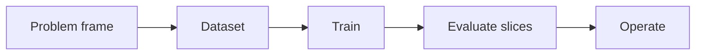

# 2.1 — Problems, Data, and Baselines

*Book 2: Machine Learning Systems · Read 25 min · Worked example 20 min · Code/design practice 45–60 min · Review 10 min*

## Before you begin

- Book 1 or equivalent
- Basic Python
- Graphs and averages

If a prerequisite is unfamiliar, use site search and read only enough to explain it and complete a small example. Do not block progress by mastering every upstream topic first.

## Why this chapter exists

Frame an ML task before choosing an algorithm. Define the unit of prediction, target, decision, population, time boundary, data availability, and a simple baseline.

The engineering objective is not to memorize vocabulary. By the end, you should be able to describe the mechanism, build or inspect a small implementation, recognize its failure modes, and decide where it belongs in a larger system.

## Learning objectives

- Explain the problem that motivated problems, data, and baselines.
- Connect the chapter's concepts into one causal mental model.
- Implement or design the bounded practice exercise.
- Evaluate quality, latency, cost, safety, and operational consequences.
- Distinguish enduring principles from current products and APIs.

!!! note "Enduring principle"
    Most model failures begin as problem or data-definition failures.

## Mental model



Read the visual from left to right, then trace failures from right to left. The diagram is a book-level map; this chapter explains how **problems, data, and baselines** changes one or more transitions.

## Core concepts

The concepts form a system, not a vocabulary list. Read across the table before studying any row in isolation.

| Concept | Role in this chapter | Evidence of understanding |
|---|---|---|
| **Problem Framing** | establishes the first representation or decision boundary | Define inputs and outputs; construct a minimal example; identify one invalid assumption. |
| **Features And Labels** | adds the main transformation or comparison | Define inputs and outputs; construct a minimal example; identify one invalid assumption. |
| **Sampling** | connects the mechanism to the surrounding system | Define inputs and outputs; construct a minimal example; identify one invalid assumption. |
| **Data Leakage** | controls quality, efficiency, or behavior | Define inputs and outputs; construct a minimal example; identify one invalid assumption. |
| **Baselines** | exposes an important operating constraint or failure mode | Define inputs and outputs; construct a minimal example; identify one invalid assumption. |
## Worked example

**Book scenario:** A lender needs a prediction service whose errors can be explained across customer groups.

**Chapter focus:** Frame an ML task before choosing an algorithm. Define the unit of prediction, target, decision, population, time boundary, data availability, and a simple baseline.

Apply this chapter in four moves:

1. Write the observable task and the simplest baseline before selecting a model or framework.
2. Locate where problem framing and features and labels enter the book-level visual above.
3. Create one normal case, one boundary case, and one adversarial or failure case.
4. Compare the result using a task-quality measure plus latency, cost, and risk notes.

The design question is: **What evidence would show that problems, data, and baselines addresses this chapter's problem better than the baseline?** Answer with measured observations rather than intuition alone.

## Runnable code sample

The following dependency-free sample supports this book. Download it from the [code-sample library](../../code-samples/02-gradient-descent.py) or run the matching file under `examples/`.

```python
--8<-- "docs/code-samples/02-gradient-descent.py"
```

Expected output is printed to the terminal. Before running it, predict which values or decisions should change. Then introduce one failure and convert the observation into a test.

??? success "Expected observation"
    Loss should decline while the learned line approaches the data-generating relationship y = 2x + 1.

This is a **book-level sample**. Its relevance to this chapter is the boundary between **problem framing** and **features and labels**. Modify that boundary, not unrelated lines, when completing the chapter exercise.

## Engineering practice

**Build:** Create a dataset split that respects time and entity boundaries.

Work in three passes:

1. Establish the simplest deterministic or naive baseline.
2. Add the chapter mechanism while keeping inputs and evaluation fixed.
3. Compare outcomes, inspect failures, and document when the extra complexity is justified.

Capture the code or diagram, assumptions, test cases, results, and one architecture decision record. A successful lab explains *why* behavior changed, not merely that the program ran.

## Architecture lens

For a production design, make the following explicit:

| Concern | Question to answer |
|---|---|
| Boundary | Which component owns this capability? |
| Contract | What are its inputs, outputs, errors, and version? |
| Evidence | How will quality be measured before and after release? |
| Security | What data, identity, permission, or misuse risk crosses the boundary? |
| Operations | What is traced, monitored, cached, retried, and rolled back? |
| Economics | Which resource drives latency and cost, and what is the budget? |

## Failure clinic

Do not debug only the final output. Reproduce the failure, preserve the full input and versioned configuration, inspect intermediate state, compare a baseline, and classify the cause. Typical categories are missing or biased data, representation loss, incorrect assumptions, weak retrieval or planning, ambiguous contracts, invalid output, excessive autonomy, authorization gaps, and evaluation mismatch.

## Evolution lens

- **Yesterday:** identify the earlier manual, symbolic, statistical, or single-model approach.
- **Today:** describe the current engineering pattern without tying the principle to one vendor.
- **Tomorrow:** look for better representations, automatic optimization, stronger verification, lower cost, and clearer control.
- **What survives:** Most model failures begin as problem or data-definition failures.

## Knowledge check

1. What problem would remain if problem framing were removed from the system?
2. Which observation would distinguish a failure in features and labels from a failure in baselines?
3. What simpler alternative should be the baseline?

??? question "Answer guidance"
    A strong answer names an observable failure, traces it to a specific boundary in the chapter visual, and proposes a test that could disconfirm the explanation. The baseline should remove the chapter mechanism while holding the task and evaluation cases fixed.

## Mastery questions

1. Explain problem framing without jargon and give a counterexample.
2. Compare features and labels with baselines using quality, cost, latency, and risk.
3. Design a minimal experiment that tests the chapter's central claim.
4. Identify which component should own validation, authorization, and observability.
5. State what would remain true if today's leading libraries and vendors disappeared.

## Self-assessment rubric

| Level | Evidence |
|---|---|
| Not yet | Can repeat terms but cannot trace the visual or predict the sample. |
| Developing | Can explain the mechanism and complete the normal case with help. |
| Proficient | Can implement the exercise, diagnose a failure, and compare a baseline. |
| Transfer | Can defend an architecture choice in a new domain with evaluation evidence. |

## Evidence and further study

- Hastie, Tibshirani & Friedman — The Elements of Statistical Learning
- Mitchell — Machine Learning

Use primary sources for technical claims and official documentation for current product behavior. Record the version or access date for evolving material.

## Continue

Return to the [book index](index.md) or use site search to follow the chapter's concepts into the knowledge-area and reference pages.
