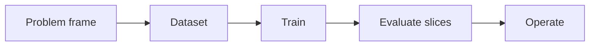

# 2.1 — Problems, Data, and Baselines

*Book 2: Machine Learning Systems · Read 25 min · Worked example 20 min · Code/design practice 45–60 min · Review 10 min*

## Before you begin

- Book 1 or equivalent
- Basic Python
- Graphs and averages

If a prerequisite is unfamiliar, use site search and read only enough to explain it and complete a small example. Do not block progress by mastering every upstream topic first.

## Why this chapter exists

Frame an ML task before choosing an algorithm. Define the unit of prediction, target, decision, population, time boundary, data availability, and a simple baseline.

The engineering objective is not to memorize vocabulary. By the end, you should be able to describe the mechanism, build or inspect a small implementation, recognize its failure modes, and decide where it belongs in a larger system.

## Learning objectives

- Explain why problems, data, and baselines matters using the chapter scenario, not abstract definitions alone.
- Trace how **problem framing** and **features and labels** interact in the book-level visual.
- Implement or design the bounded practice while holding evaluation cases fixed.
- Diagnose at least two failure modes specific to baselines.
- Decide where this chapter's mechanism belongs in a production architecture and what evidence justifies it.

!!! note "Enduring principle"
    Most model failures begin as problem or data-definition failures.

## Mental model



Read the visual from left to right, then trace failures from right to left. The diagram is a book-level map; this chapter explains how **problems, data, and baselines** changes one or more transitions.

## Core concepts

The concepts form a system, not a vocabulary list. Read each section below before attempting the practice exercise.

### Problem Framing

Problem framing defines the unit of prediction, target label, decision, population, and time boundary before choosing algorithms. Most ML failures are mis-specified problems, not wrong models. See the [Problem Framing concept card](../../concepts/cards/problem-framing.md).

**Example:** Predicting 'will this ticket reopen within 7 days' differs from 'summarize this ticket'—only the first is a measurable ML task.

**Evidence of understanding:** Write the prediction unit, label definition, and decision rule; verify each is observable in production logs.

### Features And Labels

Features are inputs; labels are supervised targets—both must be available at the decision time you actually deploy. Leaking future information creates impressive offline metrics and production disasters. See the [Features And Labels concept card](../../concepts/cards/features-and-labels.md).

**Example:** Using 'time to resolution' as a feature to predict escalation leaks the outcome into the input.

**Evidence of understanding:** For each feature, document availability timestamp relative to prediction time and reject any post-outcome fields.

### Sampling

Sampling draws next tokens from the predicted distribution rather than always taking the argmax. It enables diverse outputs but introduces nondeterminism unless seeded. See the [Sampling concept card](../../concepts/cards/sampling.md).

**Example:** Creative writing uses sampling; factual extraction often uses greedy or low-temperature decoding.

**Evidence of understanding:** Generate 20 completions at temperature 0 versus 1 and measure factual consistency.

### Data Leakage

Data leakage lets information from the target or future timesteps into features or labels during training. It inflates offline metrics while production performance collapses. See the [Data Leakage concept card](../../concepts/cards/data-leakage.md).

**Example:** Including the support agent's resolution note written after closure as a feature perfectly predicts reopen—uselessly.

**Evidence of understanding:** Run a feature audit: remove each suspicious column and watch for unrealistic AUC drops that signal leakage.

### Baselines

Baselines are simple reference methods—majority class, linear model, keyword rules—that quantify what complexity must beat. Without them, teams cannot justify neural networks or LLMs. See the [Baselines concept card](../../concepts/cards/baselines.md).

**Example:** A TF–IDF logistic regression baseline on ticket routing sets the bar before trying embeddings.

**Evidence of understanding:** Report baseline and candidate metrics on identical splits; require statistically meaningful uplift for release.

## Worked example

**Book scenario:** A lender needs a prediction service whose errors can be explained across customer groups.

**Situation:** A lender needs a prediction service whose errors can be explained across customer groups. Product asks for "approve/deny" but data only has past committee decisions.

**Baseline:** Predict majority class (approve) for every application—high accuracy, useless for risk.

**Application:** Frame unit of prediction (application at submission time), label (committee decision within 30 days), forbid future payment behavior as features, split by application date and customer entity, and ship a frequency baseline before any complex model.

**Test cases:** (1) Normal: complete application with stable income fields. (2) Boundary: application submitted at midnight UTC boundary. (3) Adversarial: duplicate applications with synchronized IDs leaking target via entity overlap in train and test.

**Measurement:** AUC vs baseline, slice metrics by region, and leakage audit checklist pass/fail.

**Design question:** Which feature would you ban first after a leakage review, and how would slice metrics expose it?

## Chapter hook

Run this short snippet first to anchor **problems, data, and baselines** before the book-level sample:

```python
apps = [
    {"id": 1, "income": 80000, "decision": 1},
    {"id": 2, "income": 40000, "decision": 0},
    {"id": 3, "income": 120000, "decision": 1},
]
baseline_rate = sum(a["decision"] for a in apps) / len(apps)
pred = 1 if baseline_rate >= 0.5 else 0
acc = sum(pred == a["decision"] for a in apps) / len(apps)
print({"majority_pred": pred, "accuracy": round(acc, 3)})
```

Predict the printed values, then change one line tied to **problem framing** or **features and labels** and observe how the chapter mechanism moves.

## Runnable code sample

The following dependency-free sample supports this book. Download it from the [code-sample library](../../code-samples/02-gradient-descent.py) or run the matching file under `examples/`.

```python
--8<-- "docs/code-samples/02-gradient-descent.py"
```

Expected output is printed to the terminal. Before running it, predict which values or decisions should change. Then introduce one failure and convert the observation into a test.

??? success "Expected observation"
    Loss should decline while the learned line approaches the data-generating relationship y = 2x + 1.

This is a **book-level sample**. Its relevance to this chapter is the boundary between **problem framing** and **features and labels**. Modify that boundary, not unrelated lines, when completing the chapter exercise.

## Engineering practice

**Build:** Create a dataset split that respects time and entity boundaries.

Work in three passes tailored to this chapter:

1. **Baseline:** Implement the task without problem framing and record quality, latency, and failure cases.
2. **Mechanism:** Add features and labels while keeping inputs and evaluation fixed; note what changed in intermediate state.
3. **Judgment:** Compare outcomes on normal, boundary, and adversarial cases; document when problems, data, and baselines earns its operational cost.

Capture assumptions, test cases, results, and one architecture decision record. A successful lab explains *why* behavior changed, not merely that the program ran.

## Architecture lens

For a production design in **Machine Learning Systems**, make the following explicit for **problems, data, and baselines**:

| Concern | Question to answer |
|---|---|
| **Ownership** | Which service owns problem framing versus downstream consumers of its output? |
| **Contract** | What typed inputs, outputs, errors, and version does the sampling boundary expose? |
| **Evidence** | Which eval slices prove problems, data, and baselines meets requirements before and after each release? |
| **Security** | What untrusted data crosses the baselines boundary and how is it sanitized or authorized? |
| **Operations** | What is logged at this chapter's transition, what triggers retry or rollback, and what is cached? |
| **Economics** | Which resource—tokens, retrieval calls, GPU seconds, human review—dominates cost for this mechanism? |

## Failure clinic

Reproduce failures at the chapter boundary—do not debug only final output.

| Failure | Symptom | Likely cause | First response |
|---|---|---|---|
| **Baseline illusion** | The system looks fine on demo prompts but fails on the book scenario | Evaluation cases do not cover problem framing or features and labels | Add the chapter's normal, boundary, and adversarial cases before tuning |
| **Mechanism mismatch** | Adding complexity does not improve the measured outcome | problems, data, and baselines is applied at the wrong layer or without fixing inputs | Trace the book visual and verify the transition this chapter owns |
| **Silent degradation** | Outputs remain fluent while decisions become wrong | Failure in baselines without observability at that boundary | Log intermediate state, version config, and compare against the baseline |
| **Operational drift** | Quality changes after deploy though prompts are unchanged | Data, permissions, or upstream problem framing behavior shifted | Pin versions, inspect ingestion and policy filters, re-run slice evals |

Frame an ML task before choosing an algorithm. When triaging, preserve full inputs, retrieved evidence, tool traces, and model or index versions.

## Evolution lens

- **Yesterday:** Manual playbooks, brittle rules, or single-pass models handled parts of problems, data, and baselines without explicit problem framing.
- **Today:** Engineering teams implement problems, data, and baselines as testable components with baselines, typed boundaries, and stage-specific evaluation.
- **Tomorrow:** Better automation may reduce toil, but baselines and governance constraints will still require explicit design.
- **What survives:** Most model failures begin as problem or data-definition failures.

## Knowledge check

1. What problem remains if you optimize accuracy without defining the prediction unit?
2. How would entity leakage differ from temporal leakage in metrics?
3. What baseline must every lending model beat before release?

??? question "Answer guidance"
    Q1: Wrong granularity makes metrics non-actionable and hides cohort drift. Q2: Entity leakage inflates all slices; temporal leakage shows val superiority on future-dated features. Q3: Majority-class baseline with same split protocol.

## Mastery questions

??? tip "Model answers (proficient level)"
        1. **Explain problem framing without jargon and give a counterexample.**
       *Proficient answer:* problem framing defines the unit of prediction, target label, decision, population, and time boundary before choosing algorithms. Counterexample: applying it when the task is fully deterministic and cheaper to hard-code.
    2. **Compare features and labels with baselines using quality, cost, latency, and risk.**
       *Proficient answer:* features are inputs; labels are supervised targets—both must be available at the decision time you actually deploy; baselines are simple reference methods—majority class, linear model, keyword rules—that quantify what complexity must beat. Trade quality gains against operational and security cost on the chapter scenario.
    3. **Design a minimal experiment that tests the chapter's central claim.**
       *Proficient answer:* Fix a baseline and three cases (normal, boundary, adversarial). Add only the chapter mechanism, measure one task metric plus cost/latency, and pre-register what result would falsify the claim.
    4. **Identify which component should own validation, authorization, and observability.**
       *Proficient answer:* Validation belongs at the typed boundary after features and labels; authorization before any side effect or retrieval of restricted data; observability at the transition problems, data, and baselines introduces in the book visual.
    5. **State what would remain true if today's leading libraries and vendors disappeared.**
       *Proficient answer:* Most model failures begin as problem or data-definition failures.

## Self-assessment rubric

| Level | Evidence |
|---|---|
| Not yet | Can repeat terms but cannot trace the visual or predict the sample. |
| Developing | Can explain the mechanism and complete the normal case with help. |
| Proficient | Can implement the exercise, diagnose a failure, and compare a baseline. |
| Transfer | Can defend an architecture choice in a new domain with evaluation evidence. |

## Evidence and further study

- Hastie, Tibshirani & Friedman — The Elements of Statistical Learning
- Mitchell — Machine Learning

Use primary sources for technical claims and official documentation for current product behavior. Record the version or access date for evolving material.

## Continue

Return to the [book index](index.md) or use site search to follow the chapter's concepts into the knowledge-area and reference pages.
