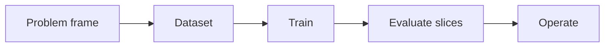

# 2.2 — Supervised Learning

*Book 2: Machine Learning Systems · Read 25 min · Worked example 20 min · Code/design practice 45–60 min · Review 10 min*

## Before you begin

- Book 1 or equivalent
- Basic Python
- Graphs and averages

If a prerequisite is unfamiliar, use site search and read only enough to explain it and complete a small example. Do not block progress by mastering every upstream topic first.

## Why this chapter exists

Understand regression and classification as function approximation under a chosen loss. Connect linear models, trees, and neural networks through their assumptions.

The engineering objective is not to memorize vocabulary. By the end, you should be able to describe the mechanism, build or inspect a small implementation, recognize its failure modes, and decide where it belongs in a larger system.

## Learning objectives

- Explain why supervised learning matters using the chapter scenario, not abstract definitions alone.
- Trace how **regression** and **classification** interact in the book-level visual.
- Implement or design the bounded practice while holding evaluation cases fixed.
- Diagnose at least two failure modes specific to optimization.
- Decide where this chapter's mechanism belongs in a production architecture and what evidence justifies it.

!!! note "Enduring principle"
    The best model is the simplest one that meets the real decision requirement.

## Mental model



Read the visual from left to right, then trace failures from right to left. The diagram is a book-level map; this chapter explains how **supervised learning** changes one or more transitions.

## Core concepts

The concepts form a system, not a vocabulary list. Read each section below before attempting the practice exercise.

### Regression

Regression predicts continuous targets—latency, revenue, temperature—by minimizing loss over numeric outputs. Choice of loss (MSE, Huber) reflects outlier sensitivity in operations. See the [Regression concept card](../../concepts/cards/regression.md).

**Example:** Forecasting queue wait time uses regression; thresholds on predicted minutes trigger staffing alerts.

**Evidence of understanding:** Compare MAE and RMSE on a holdout set and inspect worst 5% errors for systematic bias.

### Classification

Classification assigns inputs to discrete categories via scores converted to labels. Thresholds, class imbalance, and cost asymmetry matter as much as raw accuracy. See the [Classification concept card](../../concepts/cards/classification.md).

**Example:** Binary fraud classification at 0.5 default threshold wastes money when false positives cost $2 and false negatives cost $200.

**Evidence of understanding:** Publish confusion matrix and per-class recall on a stratified validation set.

### Loss Functions

Loss functions score how wrong predictions are and drive optimization—cross-entropy for classes, MSE for regression, custom losses for ranking. The loss encodes what the system is punished for. See the [Loss Functions concept card](../../concepts/cards/loss-functions.md).

**Example:** Using focal loss down-weights easy negatives so a rare-defect detector trains on hard examples.

**Evidence of understanding:** Train with two losses on the same data and compare which aligns with the business metric.

### Regularization

Regularization penalizes complexity—L2 weight decay, dropout, early stopping—to improve generalization. It trades training fit for deployment stability. See the [Regularization concept card](../../concepts/cards/regularization.md).

**Example:** Dropout on a small tabular network prevents memorizing 500 rows of customer data.

**Evidence of understanding:** Plot train versus validation loss with and without regularization and note the generalization gap.

### Optimization

Optimization finds parameters that minimize loss—SGD, Adam, learning-rate schedules, and batch size interact with convergence speed and final quality. See the [Optimization concept card](../../concepts/cards/optimization.md).

**Example:** A too-high learning rate oscillates; too-low wastes GPU hours on a plateau.

**Evidence of understanding:** Log loss per step for three learning rates and pick the fastest stable convergence.

## Worked example

**Book scenario:** A lender needs a prediction service whose errors can be explained across customer groups.

**Situation:** The lender must predict default risk from twelve numeric features with interpretability requirements for compliance.

**Baseline:** Linear logistic regression with L2 regularization—coefficients readable by auditors.

**Application:** Implement linear and small tree models, compare loss curves, inspect coefficient signs vs domain expectations, and choose the simplest meeting recall@deny threshold.

**Test cases:** (1) Normal: mid-range credit utilization. (2) Boundary: missing income imputed to median. (3) Adversarial: extreme outliers in debt-to-income after unit confusion (dollars vs cents).

**Measurement:** Recall on deny class, Brier score, and coefficient stability under bootstrap.

**Design question:** When would a tree ensemble beat linear regression without violating interpretability requirements?

## Chapter hook

Run this short snippet first to anchor **supervised learning** before the book-level sample:

```python
X = [[1.0, 0.5], [1.0, 1.2], [1.0, 2.0]]
y = [0, 0, 1]
w = [0.0, 0.0]
lr = 0.3
for _ in range(30):
    for xi, yi in zip(X, y):
        z = sum(wj*xij for wj, xij in zip(w, xi))
        pred = 1 / (1 + pow(2.718281828, -z))
        err = pred - yi
        w = [wj - lr * err * xij for wj, xij in zip(w, xi)]
print("weights:", [round(v, 3) for v in w])
```

Predict the printed values, then change one line tied to **regression** or **classification** and observe how the chapter mechanism moves.

## Runnable code sample

The following dependency-free sample supports this book. Download it from the [code-sample library](../../code-samples/02-gradient-descent.py) or run the matching file under `examples/`.

```python
--8<-- "docs/code-samples/02-gradient-descent.py"
```

Expected output is printed to the terminal. Before running it, predict which values or decisions should change. Then introduce one failure and convert the observation into a test.

??? success "Expected observation"
    Loss should decline while the learned line approaches the data-generating relationship y = 2x + 1.

This is a **book-level sample**. Its relevance to this chapter is the boundary between **regression** and **classification**. Modify that boundary, not unrelated lines, when completing the chapter exercise.

## Engineering practice

**Build:** Implement linear and logistic regression before using a library.

Work in three passes tailored to this chapter:

1. **Baseline:** Implement the task without regression and record quality, latency, and failure cases.
2. **Mechanism:** Add classification while keeping inputs and evaluation fixed; note what changed in intermediate state.
3. **Judgment:** Compare outcomes on normal, boundary, and adversarial cases; document when supervised learning earns its operational cost.

Capture assumptions, test cases, results, and one architecture decision record. A successful lab explains *why* behavior changed, not merely that the program ran.

## Architecture lens

For a production design in **Machine Learning Systems**, make the following explicit for **supervised learning**:

| Concern | Question to answer |
|---|---|
| **Ownership** | Which service owns regression versus downstream consumers of its output? |
| **Contract** | What typed inputs, outputs, errors, and version does the loss functions boundary expose? |
| **Evidence** | Which eval slices prove supervised learning meets requirements before and after each release? |
| **Security** | What untrusted data crosses the optimization boundary and how is it sanitized or authorized? |
| **Operations** | What is logged at this chapter's transition, what triggers retry or rollback, and what is cached? |
| **Economics** | Which resource—tokens, retrieval calls, GPU seconds, human review—dominates cost for this mechanism? |

## Failure clinic

Reproduce failures at the chapter boundary—do not debug only final output.

| Failure | Symptom | Likely cause | First response |
|---|---|---|---|
| **Baseline illusion** | The system looks fine on demo prompts but fails on the book scenario | Evaluation cases do not cover regression or classification | Add the chapter's normal, boundary, and adversarial cases before tuning |
| **Mechanism mismatch** | Adding complexity does not improve the measured outcome | supervised learning is applied at the wrong layer or without fixing inputs | Trace the book visual and verify the transition this chapter owns |
| **Silent degradation** | Outputs remain fluent while decisions become wrong | Failure in optimization without observability at that boundary | Log intermediate state, version config, and compare against the baseline |
| **Operational drift** | Quality changes after deploy though prompts are unchanged | Data, permissions, or upstream regression behavior shifted | Pin versions, inspect ingestion and policy filters, re-run slice evals |

Understand regression and classification as function approximation under a chosen loss. When triaging, preserve full inputs, retrieved evidence, tool traces, and model or index versions.

## Evolution lens

- **Yesterday:** Manual playbooks, brittle rules, or single-pass models handled parts of supervised learning without explicit regression.
- **Today:** Engineering teams implement supervised learning as testable components with baselines, typed boundaries, and stage-specific evaluation.
- **Tomorrow:** Better automation may reduce toil, but optimization and governance constraints will still require explicit design.
- **What survives:** The best model is the simplest one that meets the real decision requirement.

## Knowledge check

1. Why specify the loss function before choosing model architecture?
2. What symptom indicates regularization is too weak on small lending data?
3. What linear baseline anchors complex model comparisons?

??? question "Answer guidance"
    Q1: Wrong loss optimizes accuracy while compliance needs recall on denies. Q2: Large train/val gap and wild coefficients. Q3: Logistic regression with L2 and same features.

## Mastery questions

??? tip "Model answers (proficient level)"
        1. **Explain regression without jargon and give a counterexample.**
       *Proficient answer:* regression predicts continuous targets—latency, revenue, temperature—by minimizing loss over numeric outputs. Counterexample: applying it when the task is fully deterministic and cheaper to hard-code.
    2. **Compare classification with optimization using quality, cost, latency, and risk.**
       *Proficient answer:* classification assigns inputs to discrete categories via scores converted to labels; optimization finds parameters that minimize loss—sgd, adam, learning-rate schedules, and batch size interact with convergence speed and final quality. Trade quality gains against operational and security cost on the chapter scenario.
    3. **Design a minimal experiment that tests the chapter's central claim.**
       *Proficient answer:* Fix a baseline and three cases (normal, boundary, adversarial). Add only the chapter mechanism, measure one task metric plus cost/latency, and pre-register what result would falsify the claim.
    4. **Identify which component should own validation, authorization, and observability.**
       *Proficient answer:* Validation belongs at the typed boundary after classification; authorization before any side effect or retrieval of restricted data; observability at the transition supervised learning introduces in the book visual.
    5. **State what would remain true if today's leading libraries and vendors disappeared.**
       *Proficient answer:* The best model is the simplest one that meets the real decision requirement.

## Self-assessment rubric

| Level | Evidence |
|---|---|
| Not yet | Can repeat terms but cannot trace the visual or predict the sample. |
| Developing | Can explain the mechanism and complete the normal case with help. |
| Proficient | Can implement the exercise, diagnose a failure, and compare a baseline. |
| Transfer | Can defend an architecture choice in a new domain with evaluation evidence. |

## Evidence and further study

- Hastie, Tibshirani & Friedman — The Elements of Statistical Learning
- Mitchell — Machine Learning

Use primary sources for technical claims and official documentation for current product behavior. Record the version or access date for evolving material.

## Continue

Return to the [book index](index.md) or use site search to follow the chapter's concepts into the knowledge-area and reference pages.
