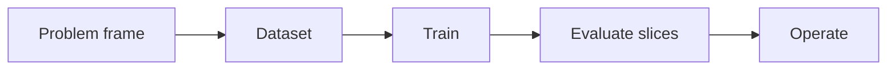

# 2.3 — Unsupervised and Representation Learning

*Book 2: Machine Learning Systems · Read 25 min · Worked example 20 min · Code/design practice 45–60 min · Review 10 min*

## Before you begin

- Book 1 or equivalent
- Basic Python
- Graphs and averages

If a prerequisite is unfamiliar, use site search and read only enough to explain it and complete a small example. Do not block progress by mastering every upstream topic first.

## Why this chapter exists

Use unlabeled data to discover structure, compress observations, and learn reusable representations.

The engineering objective is not to memorize vocabulary. By the end, you should be able to describe the mechanism, build or inspect a small implementation, recognize its failure modes, and decide where it belongs in a larger system.

## Learning objectives

- Explain why unsupervised and representation learning matters using the chapter scenario, not abstract definitions alone.
- Trace how **clustering** and **dimensionality reduction** interact in the book-level visual.
- Implement or design the bounded practice while holding evaluation cases fixed.
- Diagnose at least two failure modes specific to representation learning.
- Decide where this chapter's mechanism belongs in a production architecture and what evidence justifies it.

!!! note "Enduring principle"
    Structure found by an algorithm is a hypothesis to validate, not a fact.

## Mental model



Read the visual from left to right, then trace failures from right to left. The diagram is a book-level map; this chapter explains how **unsupervised and representation learning** changes one or more transitions.

## Core concepts

The concepts form a system, not a vocabulary list. Read each section below before attempting the practice exercise.

### Clustering

Clustering groups unlabeled points by similarity—k-means, hierarchical, or density methods. Clusters are hypotheses about structure that require domain validation. See the [Clustering concept card](../../concepts/cards/clustering.md).

**Example:** Grouping support tickets by embedding clusters reveals recurring themes but does not automatically name them correctly.

**Evidence of understanding:** Measure cluster stability under bootstrap resampling and have a domain expert label ten clusters for coherence.

### Dimensionality Reduction

Dimensionality reduction projects high-dimensional data to fewer dimensions for visualization, compression, or denoising—PCA, t-SNE, UMAP. Preserved geometry depends on the method. See the [Dimensionality Reduction concept card](../../concepts/cards/dimensionality-reduction.md).

**Example:** PCA on ticket embeddings for dashboard visualization may linearly mix topics; UMAP preserves local neighborhoods differently.

**Evidence of understanding:** Compare reconstruction error (PCA) or neighborhood preservation metrics on a fixed sample.

### Autoencoders

Autoencoders learn compressed representations by reconstructing inputs through a bottleneck layer. They support anomaly detection and pretraining when labels are scarce. See the [Autoencoders concept card](../../concepts/cards/autoencoders.md).

**Example:** Reconstruction error spikes on malformed log lines that never appeared in training—useful for anomaly alerts.

**Evidence of understanding:** Flag the top 1% reconstruction errors and measure precision of true anomalies among them.

### Self-Supervision

Self-supervision creates training signal from the data itself—mask prediction, contrastive pairs—without manual labels. It scales representation learning to massive unlabeled corpora. See the [Self-Supervision concept card](../../concepts/cards/self-supervision.md).

**Example:** BERT-style masked language modeling learns syntax and semantics from raw text before task fine-tuning.

**Evidence of understanding:** Pretrain on domain corpus and compare downstream task accuracy versus training from scratch.

### Representation Learning

Representation learning discovers features automatically instead of hand-engineering them. Quality of representations determines retrieval, transfer, and sample efficiency. See the [Representation Learning concept card](../../concepts/cards/representation-learning.md).

**Example:** Sentence embeddings trained on internal docs outperform bag-of-words on paraphrase-heavy policy search.

**Evidence of understanding:** Evaluate embeddings on a retrieval benchmark with paraphrases and hard negatives.

## Worked example

**Book scenario:** A lender needs a prediction service whose errors can be explained across customer groups.

**Situation:** Unlabeled merchant transaction narratives pile up; compliance wants emergent fraud motifs without predefined labels.

**Baseline:** Random cluster assignment—stable clusters but meaningless.

**Application:** Embed narratives with TF–IDF, k-means with k sweep, visualize with PCA, then manually validate whether clusters align with known fraud typologies or artifacts (merchant category codes).

**Test cases:** (1) Normal: clear separation of payroll vs retail vocabularies. (2) Boundary: k equals number of MCC codes—clusters mirror metadata not text. (3) Adversarial: duplicate boilerplate terms dominating centroids.

**Measurement:** Silhouette score, cluster purity vs small labeled audit set, and analyst time to narrate cluster meaning.

**Design question:** What evidence would convince you a cluster is a fraud hypothesis rather than a preprocessing artifact?

## Chapter hook

Run this short snippet first to anchor **unsupervised and representation learning** before the book-level sample:

```python
import math
docs = {"payroll": "salary direct deposit batch", "retail": "card swipe retail purchase"}
words = sorted(set(w for d in docs.values() for w in d.split()))
def vec(doc):
    counts = {w: doc.split().count(w) for w in words}
    df = {w: sum(w in d.split() for d in docs.values()) for w in words}
    n = len(docs)
    return {w: counts[w] * math.log(n / df[w]) for w in words}
va, vb = vec(docs["payroll"]), vec(docs["retail"])
dot = sum(va[w]*vb[w] for w in words)
print("payroll vs retail dot:", round(dot, 3))
```

Predict the printed values, then change one line tied to **clustering** or **dimensionality reduction** and observe how the chapter mechanism moves.

## Runnable code sample

The following dependency-free sample supports this book. Download it from the [code-sample library](../../code-samples/02-gradient-descent.py) or run the matching file under `examples/`.

```python
--8<-- "docs/code-samples/02-gradient-descent.py"
```

Expected output is printed to the terminal. Before running it, predict which values or decisions should change. Then introduce one failure and convert the observation into a test.

??? success "Expected observation"
    Loss should decline while the learned line approaches the data-generating relationship y = 2x + 1.

This is a **book-level sample**. Its relevance to this chapter is the boundary between **clustering** and **dimensionality reduction**. Modify that boundary, not unrelated lines, when completing the chapter exercise.

## Engineering practice

**Build:** Cluster a dataset, visualize it, and explain why clusters are not automatically meaningful categories.

Work in three passes tailored to this chapter:

1. **Baseline:** Implement the task without clustering and record quality, latency, and failure cases.
2. **Mechanism:** Add dimensionality reduction while keeping inputs and evaluation fixed; note what changed in intermediate state.
3. **Judgment:** Compare outcomes on normal, boundary, and adversarial cases; document when unsupervised and representation learning earns its operational cost.

Capture assumptions, test cases, results, and one architecture decision record. A successful lab explains *why* behavior changed, not merely that the program ran.

## Architecture lens

For a production design in **Machine Learning Systems**, make the following explicit for **unsupervised and representation learning**:

| Concern | Question to answer |
|---|---|
| **Ownership** | Which service owns clustering versus downstream consumers of its output? |
| **Contract** | What typed inputs, outputs, errors, and version does the autoencoders boundary expose? |
| **Evidence** | Which eval slices prove unsupervised and representation learning meets requirements before and after each release? |
| **Security** | What untrusted data crosses the representation learning boundary and how is it sanitized or authorized? |
| **Operations** | What is logged at this chapter's transition, what triggers retry or rollback, and what is cached? |
| **Economics** | Which resource—tokens, retrieval calls, GPU seconds, human review—dominates cost for this mechanism? |

## Failure clinic

Reproduce failures at the chapter boundary—do not debug only final output.

| Failure | Symptom | Likely cause | First response |
|---|---|---|---|
| **Baseline illusion** | The system looks fine on demo prompts but fails on the book scenario | Evaluation cases do not cover clustering or dimensionality reduction | Add the chapter's normal, boundary, and adversarial cases before tuning |
| **Mechanism mismatch** | Adding complexity does not improve the measured outcome | unsupervised and representation learning is applied at the wrong layer or without fixing inputs | Trace the book visual and verify the transition this chapter owns |
| **Silent degradation** | Outputs remain fluent while decisions become wrong | Failure in representation learning without observability at that boundary | Log intermediate state, version config, and compare against the baseline |
| **Operational drift** | Quality changes after deploy though prompts are unchanged | Data, permissions, or upstream clustering behavior shifted | Pin versions, inspect ingestion and policy filters, re-run slice evals |

Use unlabeled data to discover structure, compress observations, and learn reusable representations. When triaging, preserve full inputs, retrieved evidence, tool traces, and model or index versions.

## Evolution lens

- **Yesterday:** Manual playbooks, brittle rules, or single-pass models handled parts of unsupervised and representation learning without explicit clustering.
- **Today:** Engineering teams implement unsupervised and representation learning as testable components with baselines, typed boundaries, and stage-specific evaluation.
- **Tomorrow:** Better automation may reduce toil, but representation learning and governance constraints will still require explicit design.
- **What survives:** Structure found by an algorithm is a hypothesis to validate, not a fact.

## Knowledge check

1. Why are unsupervised clusters hypotheses rather than ground truth?
2. How would you detect clusters driven by MCC metadata instead of text?
3. What random baseline shows structure is non-trivial?

??? question "Answer guidance"
    Q1: No label alignment—clusters may reflect formatting artifacts. Q2: Cluster purity tracks MCC one-to-one. Q3: Random cluster labels with same k.

## Mastery questions

??? tip "Model answers (proficient level)"
        1. **Explain clustering without jargon and give a counterexample.**
       *Proficient answer:* clustering groups unlabeled points by similarity—k-means, hierarchical, or density methods. Counterexample: applying it when the task is fully deterministic and cheaper to hard-code.
    2. **Compare dimensionality reduction with representation learning using quality, cost, latency, and risk.**
       *Proficient answer:* dimensionality reduction projects high-dimensional data to fewer dimensions for visualization, compression, or denoising—pca, t-sne, umap; representation learning discovers features automatically instead of hand-engineering them. Trade quality gains against operational and security cost on the chapter scenario.
    3. **Design a minimal experiment that tests the chapter's central claim.**
       *Proficient answer:* Fix a baseline and three cases (normal, boundary, adversarial). Add only the chapter mechanism, measure one task metric plus cost/latency, and pre-register what result would falsify the claim.
    4. **Identify which component should own validation, authorization, and observability.**
       *Proficient answer:* Validation belongs at the typed boundary after dimensionality reduction; authorization before any side effect or retrieval of restricted data; observability at the transition unsupervised and representation learning introduces in the book visual.
    5. **State what would remain true if today's leading libraries and vendors disappeared.**
       *Proficient answer:* Structure found by an algorithm is a hypothesis to validate, not a fact.

## Self-assessment rubric

| Level | Evidence |
|---|---|
| Not yet | Can repeat terms but cannot trace the visual or predict the sample. |
| Developing | Can explain the mechanism and complete the normal case with help. |
| Proficient | Can implement the exercise, diagnose a failure, and compare a baseline. |
| Transfer | Can defend an architecture choice in a new domain with evaluation evidence. |

## Evidence and further study

- Hastie, Tibshirani & Friedman — The Elements of Statistical Learning
- Mitchell — Machine Learning

Use primary sources for technical claims and official documentation for current product behavior. Record the version or access date for evolving material.

## Continue

Return to the [book index](index.md) or use site search to follow the chapter's concepts into the knowledge-area and reference pages.
