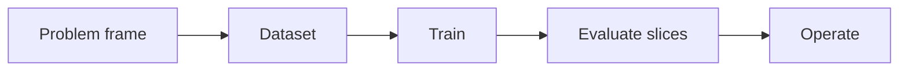

# 2.4 — Neural Networks

*Book 2: Machine Learning Systems · Read 25 min · Worked example 20 min · Code/design practice 45–60 min · Review 10 min*

## Before you begin

- Book 1 or equivalent
- Basic Python
- Graphs and averages

If a prerequisite is unfamiliar, use site search and read only enough to explain it and complete a small example. Do not block progress by mastering every upstream topic first.

## Why this chapter exists

Build the mental model of layers, activations, losses, backpropagation, initialization, normalization, and optimization.

The engineering objective is not to memorize vocabulary. By the end, you should be able to describe the mechanism, build or inspect a small implementation, recognize its failure modes, and decide where it belongs in a larger system.

## Learning objectives

- Explain why neural networks matters using the chapter scenario, not abstract definitions alone.
- Trace how **neurons and layers** and **activations** interact in the book-level visual.
- Implement or design the bounded practice while holding evaluation cases fixed.
- Diagnose at least two failure modes specific to optimizers.
- Decide where this chapter's mechanism belongs in a production architecture and what evidence justifies it.

!!! note "Enduring principle"
    Neural networks learn compositions of transformations; training adjusts those transformations to reduce loss.

## Mental model



Read the visual from left to right, then trace failures from right to left. The diagram is a book-level map; this chapter explains how **neural networks** changes one or more transitions.

## Core concepts

The concepts form a system, not a vocabulary list. Read each section below before attempting the practice exercise.

### Neurons And Layers

Neurons apply activations to weighted sums; layers stack these transforms into composable functions. Depth lets networks build hierarchical abstractions. See the [Neurons And Layers concept card](../../concepts/cards/neurons-and-layers.md).

**Example:** First layers in vision nets detect edges; deeper layers combine them into parts and objects.

**Evidence of understanding:** Inspect activation histograms per layer during training to catch dying ReLU or saturation.

### Activations

Activation functions introduce nonlinearity—ReLU, GELU, sigmoid—without which deep networks collapse to linear maps. Choice affects gradient flow and training stability. See the [Activations concept card](../../concepts/cards/activations.md).

**Example:** GELU in transformers smooths gradients compared to ReLU for language modeling at scale.

**Evidence of understanding:** Compare training convergence with ReLU versus GELU on the same architecture and seed.

### Backpropagation

Backpropagation applies the chain rule to compute gradients through layered computations efficiently. It enables training deep networks but requires careful initialization and normalization. See the [Backpropagation concept card](../../concepts/cards/backpropagation.md).

**Example:** One backward pass from loss to weights updates every layer in a classifier simultaneously.

**Evidence of understanding:** Verify gradients with finite differences on a tiny network for one batch.

### Normalization

Text normalization lowercases, strips diacritics, standardizes whitespace, and canonicalizes equivalents before indexing or tokenization. Over-normalization destroys discriminative identifiers. See the [Normalization concept card](../../concepts/cards/normalization.md).

**Example:** Collapsing hyphens in SKUs merges distinct product codes; preserving case matters for camelCase APIs.

**Evidence of understanding:** Compare retrieval recall with and without aggressive normalization on identifier-heavy queries.

### Optimizers

Optimizers like Adam, AdamW, and SGD with momentum adapt update rules beyond vanilla gradient descent. They affect convergence speed, final loss, and generalization. See the [Optimizers concept card](../../concepts/cards/optimizers.md).

**Example:** AdamW decouples weight decay from adaptive steps—common default for transformer fine-tuning.

**Evidence of understanding:** Compare final validation metric and training time for Adam versus SGD on the same task.

## Worked example

**Book scenario:** A lender needs a prediction service whose errors can be explained across customer groups.

**Situation:** A neural scorer must capture nonlinear interactions among debt, income, and employment length for the lender's API.

**Baseline:** Single-layer logistic regression plateau on validation AUC.

**Application:** Train a two-hidden-layer MLP with ReLU, track train/val loss, inspect gradient norms for vanishing/exploding signals, apply batch normalization ablation.

**Test cases:** (1) Normal: batch size 64, stable learning rate. (2) Boundary: very small batch with noisy gradients. (3) Adversarial: all-zero input column after pipeline bug.

**Measurement:** Val AUC vs epoch, gradient norm percentiles, and latency per inference at batch 1.

**Design question:** At what point does adding layers stop improving the deny-recall slice?

## Chapter hook

Run this short snippet first to anchor **neural networks** before the book-level sample:

```python
def relu(x):
    return max(0.0, x)
x, w1, b1, w2, b2 = 1.5, 0.8, -0.2, 1.2, 0.1
hidden = relu(x * w1 + b1)
y = hidden * w2 + b2
loss = (y - 1.0) ** 2
grad_w2 = 2 * (y - 1.0) * hidden
print({"hidden": round(hidden, 3), "y": round(y, 3), "grad_w2": round(grad_w2, 3)})
```

Predict the printed values, then change one line tied to **neurons and layers** or **activations** and observe how the chapter mechanism moves.

## Runnable code sample

The following dependency-free sample supports this book. Download it from the [code-sample library](../../code-samples/02-gradient-descent.py) or run the matching file under `examples/`.

```python
--8<-- "docs/code-samples/02-gradient-descent.py"
```

Expected output is printed to the terminal. Before running it, predict which values or decisions should change. Then introduce one failure and convert the observation into a test.

??? success "Expected observation"
    Loss should decline while the learned line approaches the data-generating relationship y = 2x + 1.

This is a **book-level sample**. Its relevance to this chapter is the boundary between **neurons and layers** and **activations**. Modify that boundary, not unrelated lines, when completing the chapter exercise.

## Engineering practice

**Build:** Train a small network and inspect gradients and learning curves.

Work in three passes tailored to this chapter:

1. **Baseline:** Implement the task without neurons and layers and record quality, latency, and failure cases.
2. **Mechanism:** Add activations while keeping inputs and evaluation fixed; note what changed in intermediate state.
3. **Judgment:** Compare outcomes on normal, boundary, and adversarial cases; document when neural networks earns its operational cost.

Capture assumptions, test cases, results, and one architecture decision record. A successful lab explains *why* behavior changed, not merely that the program ran.

## Spec-driven habit

Every chapter lab pairs reading with **executable acceptance**. Before implementing book 2.4 — neural networks:

1. Draft cases in `test_lab.py` or `specs/lab-0204.yaml`.
2. Use [Cursor Plan/Agent](https://cursor.com/) with "read spec first, then minimal diff".
3. Or use [OpenSpec](https://openspec.dev/) `/opsx:propose` so requirements live in `openspec/` next to code.

→ [Spec-driven workflow guide](../../getting-started/spec-driven-workflow.md) · [Lab 2.4](../../labs/0204-neural-networks.md)


## Architecture lens

For a production design in **Machine Learning Systems**, make the following explicit for **neural networks**:

| Concern | Question to answer |
|---|---|
| **Ownership** | Which service owns neurons and layers versus downstream consumers of its output? |
| **Contract** | What typed inputs, outputs, errors, and version does the backpropagation boundary expose? |
| **Evidence** | Which eval slices prove neural networks meets requirements before and after each release? |
| **Security** | What untrusted data crosses the optimizers boundary and how is it sanitized or authorized? |
| **Operations** | What is logged at this chapter's transition, what triggers retry or rollback, and what is cached? |
| **Economics** | Which resource—tokens, retrieval calls, GPU seconds, human review—dominates cost for this mechanism? |

## Failure clinic

Reproduce failures at the chapter boundary—do not debug only final output.

| Failure | Symptom | Likely cause | First response |
|---|---|---|---|
| **Baseline illusion** | The system looks fine on demo prompts but fails on the book scenario | Evaluation cases do not cover neurons and layers or activations | Add the chapter's normal, boundary, and adversarial cases before tuning |
| **Mechanism mismatch** | Adding complexity does not improve the measured outcome | neural networks is applied at the wrong layer or without fixing inputs | Trace the book visual and verify the transition this chapter owns |
| **Silent degradation** | Outputs remain fluent while decisions become wrong | Failure in optimizers without observability at that boundary | Log intermediate state, version config, and compare against the baseline |
| **Operational drift** | Quality changes after deploy though prompts are unchanged | Data, permissions, or upstream neurons and layers behavior shifted | Pin versions, inspect ingestion and policy filters, re-run slice evals |

Build the mental model of layers, activations, losses, backpropagation, initialization, normalization, and optimization. When triaging, preserve full inputs, retrieved evidence, tool traces, and model or index versions.

## Evolution lens

- **Yesterday:** Manual playbooks, brittle rules, or single-pass models handled parts of neural networks without explicit neurons and layers.
- **Today:** Engineering teams implement neural networks as testable components with baselines, typed boundaries, and stage-specific evaluation.
- **Tomorrow:** Better automation may reduce toil, but optimizers and governance constraints will still require explicit design.
- **What survives:** Neural networks learn compositions of transformations; training adjusts those transformations to reduce loss.

## Knowledge check

1. What does a flat validation curve alongside falling training loss suggest?
2. How would a zero-input-column bug manifest in gradients?
3. What non-neural baseline must the MLP beat?

??? question "Answer guidance"
    Q1: Overfitting—capacity exceeds data signal. Q2: Weights on dead feature stay near init. Q3: Same-data logistic regression.

## Mastery questions

??? tip "Model answers (proficient level)"
        1. **Explain neurons and layers without jargon and give a counterexample.**
       *Proficient answer:* neurons apply activations to weighted sums; layers stack these transforms into composable functions. Counterexample: applying it when the task is fully deterministic and cheaper to hard-code.
    2. **Compare activations with optimizers using quality, cost, latency, and risk.**
       *Proficient answer:* activation functions introduce nonlinearity—relu, gelu, sigmoid—without which deep networks collapse to linear maps; optimizers like adam, adamw, and sgd with momentum adapt update rules beyond vanilla gradient descent. Trade quality gains against operational and security cost on the chapter scenario.
    3. **Design a minimal experiment that tests the chapter's central claim.**
       *Proficient answer:* Fix a baseline and three cases (normal, boundary, adversarial). Add only the chapter mechanism, measure one task metric plus cost/latency, and pre-register what result would falsify the claim.
    4. **Identify which component should own validation, authorization, and observability.**
       *Proficient answer:* Validation belongs at the typed boundary after activations; authorization before any side effect or retrieval of restricted data; observability at the transition neural networks introduces in the book visual.
    5. **State what would remain true if today's leading libraries and vendors disappeared.**
       *Proficient answer:* Neural networks learn compositions of transformations; training adjusts those transformations to reduce loss.

## Self-assessment rubric

| Level | Evidence |
|---|---|
| Not yet | Can repeat terms but cannot trace the visual or predict the sample. |
| Developing | Can explain the mechanism and complete the normal case with help. |
| Proficient | Can implement the exercise, diagnose a failure, and compare a baseline. |
| Transfer | Can defend an architecture choice in a new domain with evaluation evidence. |

## Evidence and further study

- Hastie, Tibshirani & Friedman — The Elements of Statistical Learning
- Mitchell — Machine Learning

Use primary sources for technical claims and official documentation for current product behavior. Record the version or access date for evolving material.

## Continue

Return to the [book index](index.md) or use site search to follow the chapter's concepts into the knowledge-area and reference pages.
