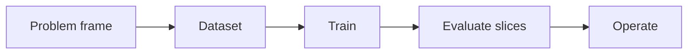

# 2.5 — Evaluation and Error Analysis

*Book 2: Machine Learning Systems · Read 25 min · Worked example 20 min · Code/design practice 45–60 min · Review 10 min*

## Before you begin

- Book 1 or equivalent
- Basic Python
- Graphs and averages

If a prerequisite is unfamiliar, use site search and read only enough to explain it and complete a small example. Do not block progress by mastering every upstream topic first.

## Why this chapter exists

Choose metrics from the decision context, estimate uncertainty, inspect slices, and turn mistakes into the next experiment.

The engineering objective is not to memorize vocabulary. By the end, you should be able to describe the mechanism, build or inspect a small implementation, recognize its failure modes, and decide where it belongs in a larger system.

## Learning objectives

- Explain why evaluation and error analysis matters using the chapter scenario, not abstract definitions alone.
- Trace how **confusion matrix** and **precision and recall** interact in the book-level visual.
- Implement or design the bounded practice while holding evaluation cases fixed.
- Diagnose at least two failure modes specific to slice analysis.
- Decide where this chapter's mechanism belongs in a production architecture and what evidence justifies it.

!!! note "Enduring principle"
    An aggregate metric can hide the exact population where a system is unsafe or useless.

## Mental model



Read the visual from left to right, then trace failures from right to left. The diagram is a book-level map; this chapter explains how **evaluation and error analysis** changes one or more transitions.

## Core concepts

The concepts form a system, not a vocabulary list. Read each section below before attempting the practice exercise.

### Confusion Matrix

A confusion matrix counts predicted versus actual classes, exposing which errors dominate. It is essential when classes are imbalanced or costs asymmetric. See the [Confusion Matrix concept card](../../concepts/cards/confusion-matrix.md).

**Example:** A router may confuse 'billing' with 'refund' while rarely missing 'outage'—the matrix shows where to invest labeling.

**Evidence of understanding:** Compute per-class precision and recall from the matrix on a stratified test set.

### Precision And Recall

Precision is correctness among positive predictions; recall is coverage of actual positives. Trading them off reflects whether false positives or false negatives hurt more. See the [Precision And Recall concept card](../../concepts/cards/precision-and-recall.md).

**Example:** High recall in safety alerts catches more incidents; high precision in auto-replies avoids annoying customers.

**Evidence of understanding:** Plot precision-recall curve and mark the operating point that meets your cost constraint.

### Calibration

Calibration means predicted probabilities align with observed frequencies—70% confidence should be right about 70% of the time. Uncalibrated scores mislead threshold and cost decisions. See the [Calibration concept card](../../concepts/cards/calibration.md).

**Example:** A medical triage model with miscalibrated probabilities causes undertriage when 0.9 confidence actually means 0.6 accuracy.

**Evidence of understanding:** Plot a reliability diagram and report expected calibration error before setting production thresholds.

### Cross-Validation

Cross-validation rotates train and validation folds to estimate performance variance with limited data. It reduces luck from a single split but must respect temporal or group structure when required. See the [Cross-Validation concept card](../../concepts/cards/cross-validation.md).

**Example:** K-fold on i.i.d. tabular data estimates variance; time-series tasks need forward-chaining instead.

**Evidence of understanding:** Report mean and standard deviation of the metric across folds, not just the best fold.

### Slice Analysis

Slice analysis evaluates metrics on subpopulations—language, product, tenant—to catch aggregate illusions. A model can pass overall while failing high-value segments. See the [Slice Analysis concept card](../../concepts/cards/slice-analysis.md).

**Example:** 95% accuracy overall can hide 60% on enterprise accounts or non-English queries.

**Evidence of understanding:** Define three production-representative slices and require each meets its release threshold.

## Worked example

**Book scenario:** A lender needs a prediction service whose errors can be explained across customer groups.

**Situation:** Regulators ask why the model denies more applications in one region; aggregate AUC masks the disparity.

**Baseline:** Report global AUC only—hides regional recall collapse.

**Application:** Build confusion matrices overall and by region, compute recall@deny with Wilson confidence intervals, run slice analysis on income bands, write error taxonomy (data missing vs true risk vs score threshold).

**Test cases:** (1) Normal: balanced region with adequate sample size. (2) Boundary: region with n=30—wide confidence intervals. (3) Adversarial: proxy feature encoding zip code leading to disparate impact.

**Measurement:** Slice recall CIs, calibration by region, and taxonomy counts driving next experiment.

**Design question:** Which slice would you gate release on despite strong global AUC?

## Chapter hook

Run this short snippet first to anchor **evaluation and error analysis** before the book-level sample:

```python
confusion = {"TP": 40, "FP": 10, "FN": 8, "TN": 142}
def metrics(c):
    prec = c["TP"] / (c["TP"] + c["FP"] + 1e-9)
    rec = c["TP"] / (c["TP"] + c["FN"] + 1e-9)
    return round(prec, 3), round(rec, 3)
slice_b = {"TP": 5, "FP": 12, "FN": 6, "TN": 20}
print("overall:", metrics(confusion))
print("slice_b:", metrics(slice_b))
```

Predict the printed values, then change one line tied to **confusion matrix** or **precision and recall** and observe how the chapter mechanism moves.

## Runnable code sample

The following dependency-free sample supports this book. Download it from the [code-sample library](../../code-samples/02-gradient-descent.py) or run the matching file under `examples/`.

```python
--8<-- "docs/code-samples/02-gradient-descent.py"
```

Expected output is printed to the terminal. Before running it, predict which values or decisions should change. Then introduce one failure and convert the observation into a test.

??? success "Expected observation"
    Loss should decline while the learned line approaches the data-generating relationship y = 2x + 1.

This is a **book-level sample**. Its relevance to this chapter is the boundary between **confusion matrix** and **precision and recall**. Modify that boundary, not unrelated lines, when completing the chapter exercise.

## Engineering practice

**Build:** Write an error taxonomy and compare two models with confidence intervals.

Work in three passes tailored to this chapter:

1. **Baseline:** Implement the task without confusion matrix and record quality, latency, and failure cases.
2. **Mechanism:** Add precision and recall while keeping inputs and evaluation fixed; note what changed in intermediate state.
3. **Judgment:** Compare outcomes on normal, boundary, and adversarial cases; document when evaluation and error analysis earns its operational cost.

Capture assumptions, test cases, results, and one architecture decision record. A successful lab explains *why* behavior changed, not merely that the program ran.

## Architecture lens

For a production design in **Machine Learning Systems**, make the following explicit for **evaluation and error analysis**:

| Concern | Question to answer |
|---|---|
| **Ownership** | Which service owns confusion matrix versus downstream consumers of its output? |
| **Contract** | What typed inputs, outputs, errors, and version does the calibration boundary expose? |
| **Evidence** | Which eval slices prove evaluation and error analysis meets requirements before and after each release? |
| **Security** | What untrusted data crosses the slice analysis boundary and how is it sanitized or authorized? |
| **Operations** | What is logged at this chapter's transition, what triggers retry or rollback, and what is cached? |
| **Economics** | Which resource—tokens, retrieval calls, GPU seconds, human review—dominates cost for this mechanism? |

## Failure clinic

Reproduce failures at the chapter boundary—do not debug only final output.

| Failure | Symptom | Likely cause | First response |
|---|---|---|---|
| **Baseline illusion** | The system looks fine on demo prompts but fails on the book scenario | Evaluation cases do not cover confusion matrix or precision and recall | Add the chapter's normal, boundary, and adversarial cases before tuning |
| **Mechanism mismatch** | Adding complexity does not improve the measured outcome | evaluation and error analysis is applied at the wrong layer or without fixing inputs | Trace the book visual and verify the transition this chapter owns |
| **Silent degradation** | Outputs remain fluent while decisions become wrong | Failure in slice analysis without observability at that boundary | Log intermediate state, version config, and compare against the baseline |
| **Operational drift** | Quality changes after deploy though prompts are unchanged | Data, permissions, or upstream confusion matrix behavior shifted | Pin versions, inspect ingestion and policy filters, re-run slice evals |

Choose metrics from the decision context, estimate uncertainty, inspect slices, and turn mistakes into the next experiment. When triaging, preserve full inputs, retrieved evidence, tool traces, and model or index versions.

## Evolution lens

- **Yesterday:** Manual playbooks, brittle rules, or single-pass models handled parts of evaluation and error analysis without explicit confusion matrix.
- **Today:** Engineering teams implement evaluation and error analysis as testable components with baselines, typed boundaries, and stage-specific evaluation.
- **Tomorrow:** Better automation may reduce toil, but slice analysis and governance constraints will still require explicit design.
- **What survives:** An aggregate metric can hide the exact population where a system is unsafe or useless.

## Knowledge check

1. Why can aggregate AUC hide an unsafe slice?
2. What distinguishes calibration failure from threshold failure in one region?
3. What evaluation baseline uses only global accuracy?

??? question "Answer guidance"
    Q1: Strong performance on majority slice dominates AUC. Q2: Calibration: miscalibrated scores; threshold: wrong operating point. Q3: Majority-class predictor on accuracy only.

## Mastery questions

??? tip "Model answers (proficient level)"
        1. **Explain confusion matrix without jargon and give a counterexample.**
       *Proficient answer:* a confusion matrix counts predicted versus actual classes, exposing which errors dominate. Counterexample: applying it when the task is fully deterministic and cheaper to hard-code.
    2. **Compare precision and recall with slice analysis using quality, cost, latency, and risk.**
       *Proficient answer:* precision is correctness among positive predictions; recall is coverage of actual positives; slice analysis evaluates metrics on subpopulations—language, product, tenant—to catch aggregate illusions. Trade quality gains against operational and security cost on the chapter scenario.
    3. **Design a minimal experiment that tests the chapter's central claim.**
       *Proficient answer:* Fix a baseline and three cases (normal, boundary, adversarial). Add only the chapter mechanism, measure one task metric plus cost/latency, and pre-register what result would falsify the claim.
    4. **Identify which component should own validation, authorization, and observability.**
       *Proficient answer:* Validation belongs at the typed boundary after precision and recall; authorization before any side effect or retrieval of restricted data; observability at the transition evaluation and error analysis introduces in the book visual.
    5. **State what would remain true if today's leading libraries and vendors disappeared.**
       *Proficient answer:* An aggregate metric can hide the exact population where a system is unsafe or useless.

## Self-assessment rubric

| Level | Evidence |
|---|---|
| Not yet | Can repeat terms but cannot trace the visual or predict the sample. |
| Developing | Can explain the mechanism and complete the normal case with help. |
| Proficient | Can implement the exercise, diagnose a failure, and compare a baseline. |
| Transfer | Can defend an architecture choice in a new domain with evaluation evidence. |

## Evidence and further study

- Hastie, Tibshirani & Friedman — The Elements of Statistical Learning
- Mitchell — Machine Learning

Use primary sources for technical claims and official documentation for current product behavior. Record the version or access date for evolving material.

## Continue

Return to the [book index](index.md) or use site search to follow the chapter's concepts into the knowledge-area and reference pages.
