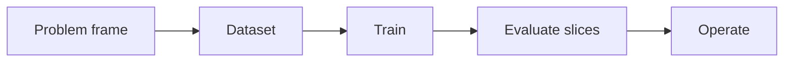

# 2.6 — The ML Lifecycle

*Book 2: Machine Learning Systems · Read 25 min · Worked example 20 min · Code/design practice 45–60 min · Review 10 min*

## Before you begin

- Book 1 or equivalent
- Basic Python
- Graphs and averages

If a prerequisite is unfamiliar, use site search and read only enough to explain it and complete a small example. Do not block progress by mastering every upstream topic first.

## Why this chapter exists

Connect data, experiments, models, releases, monitoring, drift, retraining, and retirement into an accountable lifecycle.

The engineering objective is not to memorize vocabulary. By the end, you should be able to describe the mechanism, build or inspect a small implementation, recognize its failure modes, and decide where it belongs in a larger system.

## Learning objectives

- Explain why the ml lifecycle matters using the chapter scenario, not abstract definitions alone.
- Trace how **experiment tracking** and **model registry** interact in the book-level visual.
- Implement or design the bounded practice while holding evaluation cases fixed.
- Diagnose at least two failure modes specific to monitoring.
- Decide where this chapter's mechanism belongs in a production architecture and what evidence justifies it.

!!! note "Enduring principle"
    A trained model is an artifact; value and risk emerge from its full operating system.

## Mental model



Read the visual from left to right, then trace failures from right to left. The diagram is a book-level map; this chapter explains how **the ml lifecycle** changes one or more transitions.

## Core concepts

The concepts form a system, not a vocabulary list. Read each section below before attempting the practice exercise.

### Experiment Tracking

Experiment tracking logs hyperparameters, data versions, metrics, and artifacts for every training run. Without it, teams cannot reproduce or compare results. See the [Experiment Tracking concept card](../../concepts/cards/experiment-tracking.md).

**Example:** Logging learning rate, seed, and dataset hash explains why run 47 beat run 46.

**Evidence of understanding:** Reproduce a logged run from its metadata and verify metric within 1% of the original.

### Model Registry

A model registry stores versioned models with stage labels—staging, production, archived—and metadata for audit. It is the handoff point between ML and serving teams. See the [Model Registry concept card](../../concepts/cards/model-registry.md).

**Example:** Promoting v3.2 to production requires passing eval gates linked in the registry entry.

**Evidence of understanding:** Trace one production prediction back to registry version, training data hash, and eval report.

### Data Validation

Data validation checks schema, ranges, distributions, and freshness of incoming data before training or inference. Silent schema drift breaks pipelines quietly. See the [Data Validation concept card](../../concepts/cards/data-validation.md).

**Example:** A new optional field arriving as null for 40% of rows should block training until investigated.

**Evidence of understanding:** Run validation rules on daily ingest and alert when any column exceeds drift thresholds.

### Drift

Drift is change in input or label distributions over time—covariate, prior, or concept drift. Unmonitored drift erodes model value without code changes. See the [Drift concept card](../../concepts/cards/drift.md).

**Example:** New product vocabulary after a launch shifts ticket text while labels stay stable—covariate drift.

**Evidence of understanding:** Monitor population stability index or embedding centroid shift weekly with alert thresholds.

### Monitoring

Monitoring observes live inputs, outputs, latency, errors, and business metrics continuously. It connects production behavior to retraining and incident response. See the [Monitoring concept card](../../concepts/cards/monitoring.md).

**Example:** A spike in abstention rate may signal upstream data breakage before users complain.

**Evidence of understanding:** Dashboard p95 latency, error rate, and task success with alerts tied to runbooks.

## Worked example

**Book scenario:** A lender needs a prediction service whose errors can be explained across customer groups.

**Situation:** The prediction service moves to production; six months later income verification vendor changes JSON schema silently.

**Baseline:** Deploy model once with no monitoring—silent feature nulling.

**Application:** Define ML lifecycle checklist: data validation on ingest, model registry version, shadow deploy, drift alarms on feature null rate and PSI, documented rollback to prior artifact.

**Test cases:** (1) Normal: weekly retrain with stable schema. (2) Boundary: partial null spike on one feature 2%→40%. (3) Adversarial: schema rename bypassing validation rules.

**Measurement:** Time-to-detect drift, rollback duration, and decision quality before/after rollback.

**Design question:** Which monitor fires first—data validation or outcome-based performance—and why?

## Chapter hook

Run this short snippet first to anchor **the ml lifecycle** before the book-level sample:

```python
CHAPTER = "2.6"
print("chapter hook:", CHAPTER)
registry = {"model_v3": {"features": ["income", "debt"]}}
live = {"income": None, "debt": 1200}
def validate(row, schema):
    return [f for f in schema["features"] if row.get(f) is None]
issues = validate(live, registry["model_v3"])
print({"issues": issues, "action": "rollback" if issues else "serve"})
print("---")
print("change one input above, predict output, re-run")
```

Predict the printed values, then change one line tied to **experiment tracking** or **model registry** and observe how the chapter mechanism moves.

## Runnable code sample

The following dependency-free sample supports this book. Download it from the [code-sample library](../../code-samples/02-gradient-descent.py) or run the matching file under `examples/`.

```python
--8<-- "docs/code-samples/02-gradient-descent.py"
```

Expected output is printed to the terminal. Before running it, predict which values or decisions should change. Then introduce one failure and convert the observation into a test.

??? success "Expected observation"
    Loss should decline while the learned line approaches the data-generating relationship y = 2x + 1.

This is a **book-level sample**. Its relevance to this chapter is the boundary between **experiment tracking** and **model registry**. Modify that boundary, not unrelated lines, when completing the chapter exercise.

## Engineering practice

**Build:** Write a release checklist and a rollback plan for a prediction service.

Work in three passes tailored to this chapter:

1. **Baseline:** Implement the task without experiment tracking and record quality, latency, and failure cases.
2. **Mechanism:** Add model registry while keeping inputs and evaluation fixed; note what changed in intermediate state.
3. **Judgment:** Compare outcomes on normal, boundary, and adversarial cases; document when the ml lifecycle earns its operational cost.

Capture assumptions, test cases, results, and one architecture decision record. A successful lab explains *why* behavior changed, not merely that the program ran.

## Architecture lens

For a production design in **Machine Learning Systems**, make the following explicit for **the ml lifecycle**:

| Concern | Question to answer |
|---|---|
| **Ownership** | Which service owns experiment tracking versus downstream consumers of its output? |
| **Contract** | What typed inputs, outputs, errors, and version does the data validation boundary expose? |
| **Evidence** | Which eval slices prove the ml lifecycle meets requirements before and after each release? |
| **Security** | What untrusted data crosses the monitoring boundary and how is it sanitized or authorized? |
| **Operations** | What is logged at this chapter's transition, what triggers retry or rollback, and what is cached? |
| **Economics** | Which resource—tokens, retrieval calls, GPU seconds, human review—dominates cost for this mechanism? |

## Failure clinic

Reproduce failures at the chapter boundary—do not debug only final output.

| Failure | Symptom | Likely cause | First response |
|---|---|---|---|
| **Baseline illusion** | The system looks fine on demo prompts but fails on the book scenario | Evaluation cases do not cover experiment tracking or model registry | Add the chapter's normal, boundary, and adversarial cases before tuning |
| **Mechanism mismatch** | Adding complexity does not improve the measured outcome | the ml lifecycle is applied at the wrong layer or without fixing inputs | Trace the book visual and verify the transition this chapter owns |
| **Silent degradation** | Outputs remain fluent while decisions become wrong | Failure in monitoring without observability at that boundary | Log intermediate state, version config, and compare against the baseline |
| **Operational drift** | Quality changes after deploy though prompts are unchanged | Data, permissions, or upstream experiment tracking behavior shifted | Pin versions, inspect ingestion and policy filters, re-run slice evals |

Connect data, experiments, models, releases, monitoring, drift, retraining, and retirement into an accountable lifecycle. When triaging, preserve full inputs, retrieved evidence, tool traces, and model or index versions.

## Evolution lens

- **Yesterday:** Manual playbooks, brittle rules, or single-pass models handled parts of the ml lifecycle without explicit experiment tracking.
- **Today:** Engineering teams implement the ml lifecycle as testable components with baselines, typed boundaries, and stage-specific evaluation.
- **Tomorrow:** Better automation may reduce toil, but monitoring and governance constraints will still require explicit design.
- **What survives:** A trained model is an artifact; value and risk emerge from its full operating system.

## Knowledge check

1. What is the difference between a model artifact and its operating system?
2. How does schema drift appear before label drift?
3. What release process lacks rollback evidence?

??? question "Answer guidance"
    Q1: Artifact is weights; operating system includes pipes, monitors, policy. Q2: Feature null rates spike while labels lag weeks. Q3: Direct promote without registry pin or canary.

## Mastery questions

??? tip "Model answers (proficient level)"
        1. **Explain experiment tracking without jargon and give a counterexample.**
       *Proficient answer:* experiment tracking logs hyperparameters, data versions, metrics, and artifacts for every training run. Counterexample: applying it when the task is fully deterministic and cheaper to hard-code.
    2. **Compare model registry with monitoring using quality, cost, latency, and risk.**
       *Proficient answer:* a model registry stores versioned models with stage labels—staging, production, archived—and metadata for audit; monitoring observes live inputs, outputs, latency, errors, and business metrics continuously. Trade quality gains against operational and security cost on the chapter scenario.
    3. **Design a minimal experiment that tests the chapter's central claim.**
       *Proficient answer:* Fix a baseline and three cases (normal, boundary, adversarial). Add only the chapter mechanism, measure one task metric plus cost/latency, and pre-register what result would falsify the claim.
    4. **Identify which component should own validation, authorization, and observability.**
       *Proficient answer:* Validation belongs at the typed boundary after model registry; authorization before any side effect or retrieval of restricted data; observability at the transition the ml lifecycle introduces in the book visual.
    5. **State what would remain true if today's leading libraries and vendors disappeared.**
       *Proficient answer:* A trained model is an artifact; value and risk emerge from its full operating system.

## Self-assessment rubric

| Level | Evidence |
|---|---|
| Not yet | Can repeat terms but cannot trace the visual or predict the sample. |
| Developing | Can explain the mechanism and complete the normal case with help. |
| Proficient | Can implement the exercise, diagnose a failure, and compare a baseline. |
| Transfer | Can defend an architecture choice in a new domain with evaluation evidence. |

## Evidence and further study

- Hastie, Tibshirani & Friedman — The Elements of Statistical Learning
- Mitchell — Machine Learning

Use primary sources for technical claims and official documentation for current product behavior. Record the version or access date for evolving material.

## Continue

Return to the [book index](index.md) or use site search to follow the chapter's concepts into the knowledge-area and reference pages.
