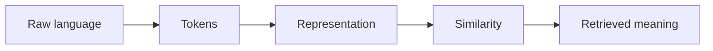

# 3.2 — Corpora and Text Pipelines

*Book 3: Language and Representation · Read 25 min · Worked example 20 min · Code/design practice 45–60 min · Review 10 min*

## Before you begin

- Books 1–2
- Vectors and dot products
- Basic text processing

If a prerequisite is unfamiliar, use site search and read only enough to explain it and complete a small example. Do not block progress by mastering every upstream topic first.

## Why this chapter exists

Learn how collection, encoding, normalization, language detection, segmentation, privacy, and provenance shape every downstream model.

The engineering objective is not to memorize vocabulary. By the end, you should be able to describe the mechanism, build or inspect a small implementation, recognize its failure modes, and decide where it belongs in a larger system.

## Learning objectives

- Explain why corpora and text pipelines matters using the chapter scenario, not abstract definitions alone.
- Trace how **Unicode** and **normalization** interact in the book-level visual.
- Implement or design the bounded practice while holding evaluation cases fixed.
- Diagnose at least two failure modes specific to data provenance.
- Decide where this chapter's mechanism belongs in a production architecture and what evidence justifies it.

!!! note "Enduring principle"
    Representation quality cannot recover information destroyed during ingestion.

## Mental model



Read the visual from left to right, then trace failures from right to left. The diagram is a book-level map; this chapter explains how **corpora and text pipelines** changes one or more transitions.

## Core concepts

The concepts form a system, not a vocabulary list. Read each section below before attempting the practice exercise.

### Unicode

Unicode assigns code points to characters across scripts; mishandling causes mojibake, broken tokens, and security bypasses via homoglyphs. See the [Unicode concept card](../../concepts/cards/unicode.md).

**Example:** Normalizing NFC versus NFD changes string equality for accented characters in user names.

**Evidence of understanding:** Run ingestion on ten multilingual samples and verify round-trip display matches source glyphs.

### Normalization

Text normalization lowercases, strips diacritics, standardizes whitespace, and canonicalizes equivalents before indexing or tokenization. Over-normalization destroys discriminative identifiers. See the [Normalization concept card](../../concepts/cards/normalization.md).

**Example:** Collapsing hyphens in SKUs merges distinct product codes; preserving case matters for camelCase APIs.

**Evidence of understanding:** Compare retrieval recall with and without aggressive normalization on identifier-heavy queries.

### Corpora

Corpora are curated text collections whose composition, licensing, and bias shape every downstream model. Provenance and consent determine legal and ethical use. See the [Corpora concept card](../../concepts/cards/corpora.md).

**Example:** Training on public forums without filtering includes toxic threads that surface in generations.

**Evidence of understanding:** Document source, license, date range, and language distribution in a corpus card.

### Segmentation

Segmentation splits text into sentences, paragraphs, or utterances for processing pipelines. Wrong boundaries merge unrelated content or split entities across chunks. See the [Segmentation concept card](../../concepts/cards/segmentation.md).

**Example:** Legal documents need section-aware segmentation so clauses are not cut mid-sentence.

**Evidence of understanding:** Measure boundary error rate on 50 manually segmented pages including tables and lists.

### Data Provenance

Data provenance records origin, transformations, timestamps, and responsible parties for each document. It enables audit, takedown, and debugging retrieval mistakes. See the [Data Provenance concept card](../../concepts/cards/data-provenance.md).

**Example:** Knowing a policy chunk came from v3.2 PDF page 14—not an outdated wiki—fixes wrong answers.

**Evidence of understanding:** Every retrieved chunk should carry source URI, version, and ingest timestamp in metadata.

## Worked example

**Book scenario:** Employees search for policies using vocabulary different from the source documents.

**Situation:** The policy corpus mixes UTF-8 PDFs, legacy Windows-1252 exports, and chat logs pasted into tickets. Search quality varies wildly by source.

**Baseline:** Lowercase and split on whitespace only—breaks on composed characters and mojibake.

**Application:** Build normalization pipeline: NFC Unicode normalization, language detection, sentence segmentation, PII redaction logging, and provenance tags (source system, ingest time, author).

**Test cases:** (1) Normal: clean UTF-8 markdown policy. (2) Boundary: Turkish dotted/dotless I casing. (3) Adversarial: zero-width joiners hiding banned terms from indexers.

**Measurement:** Character preservation rate, false language-detection rate, and downstream retrieval MRR before/after pipeline.

**Design question:** Which normalization step is irreversible and therefore requires archived raw copies?

## Chapter hook

Run this short snippet first to anchor **corpora and text pipelines** before the book-level sample:

```python
CHAPTER = "3.2"
print("chapter hook:", CHAPTER)
import unicodedata
samples = ["café", "caf\u0301", "PT\u200bO policy"]
for s in samples:
    nfc = unicodedata.normalize("NFC", s)
    print({"raw": repr(s), "nfc": repr(nfc), "len": len(s), "nfc_len": len(nfc)})
print("---")
print("change one input above, predict output, re-run")
```

Predict the printed values, then change one line tied to **Unicode** or **normalization** and observe how the chapter mechanism moves.

## Runnable code sample

The following dependency-free sample supports this book. Download it from the [code-sample library](../../code-samples/03-tokenization-vectors.py) or run the matching file under `examples/`.

```python
--8<-- "docs/code-samples/03-tokenization-vectors.py"
```

Expected output is printed to the terminal. Before running it, predict which values or decisions should change. Then introduce one failure and convert the observation into a test.

??? success "Expected observation"
    The outage document should rank highest because it shares the query's weighted terms; the example also exposes the limits of lexical features.

This is a **book-level sample**. Its relevance to this chapter is the boundary between **Unicode** and **normalization**. Modify that boundary, not unrelated lines, when completing the chapter exercise.

## Engineering practice

**Build:** Build a normalization pipeline and test it on multilingual and adversarial text.

Work in three passes tailored to this chapter:

1. **Baseline:** Implement the task without unicode and record quality, latency, and failure cases.
2. **Mechanism:** Add normalization while keeping inputs and evaluation fixed; note what changed in intermediate state.
3. **Judgment:** Compare outcomes on normal, boundary, and adversarial cases; document when corpora and text pipelines earns its operational cost.

Capture assumptions, test cases, results, and one architecture decision record. A successful lab explains *why* behavior changed, not merely that the program ran.

## Spec-driven habit

Every chapter lab pairs reading with **executable acceptance**. Before implementing book 3.2 — corpora and text pipelines:

1. Draft cases in `test_lab.py` or `specs/lab-0302.yaml`.
2. Use [Cursor Plan/Agent](https://cursor.com/) with "read spec first, then minimal diff".
3. Or use [OpenSpec](https://openspec.dev/) `/opsx:propose` so requirements live in `openspec/` next to code.

→ [Spec-driven workflow guide](../../getting-started/spec-driven-workflow.md) · [Lab 3.2](../../labs/0302-corpora-and-text-pipelines.md)


## Architecture lens

For a production design in **Language and Representation**, make the following explicit for **corpora and text pipelines**:

| Concern | Question to answer |
|---|---|
| **Ownership** | Which service owns unicode versus downstream consumers of its output? |
| **Contract** | What typed inputs, outputs, errors, and version does the corpora boundary expose? |
| **Evidence** | Which eval slices prove corpora and text pipelines meets requirements before and after each release? |
| **Security** | What untrusted data crosses the data provenance boundary and how is it sanitized or authorized? |
| **Operations** | What is logged at this chapter's transition, what triggers retry or rollback, and what is cached? |
| **Economics** | Which resource—tokens, retrieval calls, GPU seconds, human review—dominates cost for this mechanism? |

## Failure clinic

Reproduce failures at the chapter boundary—do not debug only final output.

| Failure | Symptom | Likely cause | First response |
|---|---|---|---|
| **Baseline illusion** | The system looks fine on demo prompts but fails on the book scenario | Evaluation cases do not cover unicode or normalization | Add the chapter's normal, boundary, and adversarial cases before tuning |
| **Mechanism mismatch** | Adding complexity does not improve the measured outcome | corpora and text pipelines is applied at the wrong layer or without fixing inputs | Trace the book visual and verify the transition this chapter owns |
| **Silent degradation** | Outputs remain fluent while decisions become wrong | Failure in data provenance without observability at that boundary | Log intermediate state, version config, and compare against the baseline |
| **Operational drift** | Quality changes after deploy though prompts are unchanged | Data, permissions, or upstream unicode behavior shifted | Pin versions, inspect ingestion and policy filters, re-run slice evals |

Learn how collection, encoding, normalization, language detection, segmentation, privacy, and provenance shape every downstream model. When triaging, preserve full inputs, retrieved evidence, tool traces, and model or index versions.

## Evolution lens

- **Yesterday:** Manual playbooks, brittle rules, or single-pass models handled parts of corpora and text pipelines without explicit unicode.
- **Today:** Engineering teams implement corpora and text pipelines as testable components with baselines, typed boundaries, and stage-specific evaluation.
- **Tomorrow:** Better automation may reduce toil, but data provenance and governance constraints will still require explicit design.
- **What survives:** Representation quality cannot recover information destroyed during ingestion.

## Knowledge check

1. Why cannot downstream embeddings recover information destroyed at ingestion?
2. How would zero-width characters evade a naive tokenizer?
3. What baseline pipeline only lowercases text?

??? question "Answer guidance"
    Q1: Over-aggressive stemming, wrong encoding, or dropped metadata cannot be reconstructed. Q2: Invisible chars split tokens so banned terms never index. Q3: lowercase().split() with no normalization.

## Mastery questions

??? tip "Model answers (proficient level)"
        1. **Explain Unicode without jargon and give a counterexample.**
       *Proficient answer:* unicode assigns code points to characters across scripts; mishandling causes mojibake, broken tokens, and security bypasses via homoglyphs. Counterexample: applying it when the task is fully deterministic and cheaper to hard-code.
    2. **Compare normalization with data provenance using quality, cost, latency, and risk.**
       *Proficient answer:* text normalization lowercases, strips diacritics, standardizes whitespace, and canonicalizes equivalents before indexing or tokenization; data provenance records origin, transformations, timestamps, and responsible parties for each document. Trade quality gains against operational and security cost on the chapter scenario.
    3. **Design a minimal experiment that tests the chapter's central claim.**
       *Proficient answer:* Fix a baseline and three cases (normal, boundary, adversarial). Add only the chapter mechanism, measure one task metric plus cost/latency, and pre-register what result would falsify the claim.
    4. **Identify which component should own validation, authorization, and observability.**
       *Proficient answer:* Validation belongs at the typed boundary after normalization; authorization before any side effect or retrieval of restricted data; observability at the transition corpora and text pipelines introduces in the book visual.
    5. **State what would remain true if today's leading libraries and vendors disappeared.**
       *Proficient answer:* Representation quality cannot recover information destroyed during ingestion.

## Self-assessment rubric

| Level | Evidence |
|---|---|
| Not yet | Can repeat terms but cannot trace the visual or predict the sample. |
| Developing | Can explain the mechanism and complete the normal case with help. |
| Proficient | Can implement the exercise, diagnose a failure, and compare a baseline. |
| Transfer | Can defend an architecture choice in a new domain with evaluation evidence. |

## Evidence and further study

- Manning, Raghavan & Schütze — Introduction to Information Retrieval
- Mikolov et al. — Efficient Estimation of Word Representations in Vector Space

Use primary sources for technical claims and official documentation for current product behavior. Record the version or access date for evolving material.

## Continue

Return to the [book index](index.md) or use site search to follow the chapter's concepts into the knowledge-area and reference pages.
