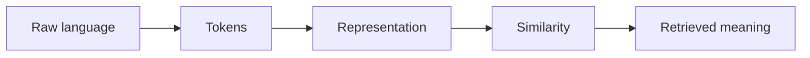

# 3.3 — Tokenization

*Book 3: Language and Representation · Read 25 min · Worked example 20 min · Code/design practice 45–60 min · Review 10 min*

## Before you begin

- Books 1–2
- Vectors and dot products
- Basic text processing

If a prerequisite is unfamiliar, use site search and read only enough to explain it and complete a small example. Do not block progress by mastering every upstream topic first.

## Why this chapter exists

Understand character, word, and subword tokenization; BPE, WordPiece, and SentencePiece; and the impact on cost, latency, languages, and code.

The engineering objective is not to memorize vocabulary. By the end, you should be able to describe the mechanism, build or inspect a small implementation, recognize its failure modes, and decide where it belongs in a larger system.

## Learning objectives

- Explain why tokenization matters using the chapter scenario, not abstract definitions alone.
- Trace how **vocabulary** and **subwords** interact in the book-level visual.
- Implement or design the bounded practice while holding evaluation cases fixed.
- Diagnose at least two failure modes specific to token budgets.
- Decide where this chapter's mechanism belongs in a production architecture and what evidence justifies it.

!!! note "Enduring principle"
    Tokenization is an engineering boundary that determines what units the model can efficiently process.

## Mental model



Read the visual from left to right, then trace failures from right to left. The diagram is a book-level map; this chapter explains how **tokenization** changes one or more transitions.

## Core concepts

The concepts form a system, not a vocabulary list. Read each section below before attempting the practice exercise.

### Vocabulary

Vocabulary is the set of tokens a model or index recognizes; out-of-vocabulary items become unknown or split subwords. Size trades coverage against memory and sparsity. See the [Vocabulary concept card](../../concepts/cards/vocabulary.md).

**Example:** A 32k BPE vocabulary handles common English and code fragments but may fragment rare product SKUs.

**Evidence of understanding:** Measure OOV rate on production queries and track how subword splits affect identifier retrieval.

### Subwords

Subword units split rare words into frequent pieces so models handle morphology and typos without huge vocabularies. Splitting affects cost, semantics, and cross-lingual behavior. See the [Subwords concept card](../../concepts/cards/subwords.md).

**Example:** 'unhappiness' may become ['un', 'happiness'] preserving morphemes better than character splits.

**Evidence of understanding:** Compare token counts for 100 product names under word versus BPE tokenizers.

### BPE

Byte-pair encoding iteratively merges frequent symbol pairs to build a subword vocabulary from corpus statistics. It balances compression and interpretability for LLM tokenizers. See the [BPE concept card](../../concepts/cards/bpe.md).

**Example:** Training BPE on code-heavy corpora merges operators like '=>' into single tokens, saving context budget.

**Evidence of understanding:** Train a toy BPE on 1MB text and report compression ratio versus character count.

### SentencePiece

SentencePiece trains subword models directly on raw text without pre-tokenization, simplifying multilingual pipelines. It supports unigram and BPE objectives with shared vocabularies. See the [SentencePiece concept card](../../concepts/cards/sentencepiece.md).

**Example:** One SentencePiece model covers Japanese and English in a single vocabulary for multilingual search.

**Evidence of understanding:** Compare segmentation consistency across languages on parallel sentences.

### Token Budgets

Token budgets cap how many tokens each prompt section—system, evidence, user—may consume. Hard budgets prevent silent truncation of safety instructions. See the [Token Budgets concept card](../../concepts/cards/token-budgets.md).

**Example:** Allocating 2k tokens to evidence and 500 to instructions ensures policy text survives long retrievals.

**Evidence of understanding:** Log token counts per section and alert when any section exceeds its budget before send.

## Worked example

**Book scenario:** Employees search for policies using vocabulary different from the source documents.

**Situation:** The semantic search engine must handle product codes (XR-9000), multilingual policy names, and long compound German words within a fixed token budget.

**Baseline:** Whitespace word tokenizer—splits codes and inflates rare words.

**Application:** Implement toy byte-pair encoding on a small corpus, compare segmentations vs word and character tokenizers, and estimate token cost for top queries.

**Test cases:** (1) Normal: "paid time off accrual cap." (2) Boundary: "XR-9000" as one product token. (3) Adversarial: homoglyph "РTO" (Cyrillic R) vs Latin PTO.

**Measurement:** Tokens per document, OOV rate by language, and retrieval latency proxy vs vocabulary size.

**Design question:** When does subword tokenization help product codes but hurt exact identifier search?

## Chapter hook

Run this short snippet first to anchor **tokenization** before the book-level sample:

```python
corpus = "PTO PTO accrual XR-9000 XR-9000 policy"
words = corpus.split()
pairs = {}
for w in words:
    for i in range(len(w)-1):
        p = w[i:i+2]
        pairs[p] = pairs.get(p, 0) + 1
merge = max(pairs, key=pairs.get)
print("most frequent pair:", merge, "count:", pairs[merge])
print("word token count:", len(words))
```

Predict the printed values, then change one line tied to **vocabulary** or **subwords** and observe how the chapter mechanism moves.

## Runnable code sample

The following dependency-free sample supports this book. Download it from the [code-sample library](../../code-samples/03-tokenization-vectors.py) or run the matching file under `examples/`.

```python
--8<-- "docs/code-samples/03-tokenization-vectors.py"
```

Expected output is printed to the terminal. Before running it, predict which values or decisions should change. Then introduce one failure and convert the observation into a test.

??? success "Expected observation"
    The outage document should rank highest because it shares the query's weighted terms; the example also exposes the limits of lexical features.

This is a **book-level sample**. Its relevance to this chapter is the boundary between **vocabulary** and **subwords**. Modify that boundary, not unrelated lines, when completing the chapter exercise.

## Engineering practice

**Build:** Write a toy byte-pair tokenizer and compare segmentations.

Work in three passes tailored to this chapter:

1. **Baseline:** Implement the task without vocabulary and record quality, latency, and failure cases.
2. **Mechanism:** Add subwords while keeping inputs and evaluation fixed; note what changed in intermediate state.
3. **Judgment:** Compare outcomes on normal, boundary, and adversarial cases; document when tokenization earns its operational cost.

Capture assumptions, test cases, results, and one architecture decision record. A successful lab explains *why* behavior changed, not merely that the program ran.

## Architecture lens

For a production design in **Language and Representation**, make the following explicit for **tokenization**:

| Concern | Question to answer |
|---|---|
| **Ownership** | Which service owns vocabulary versus downstream consumers of its output? |
| **Contract** | What typed inputs, outputs, errors, and version does the bpe boundary expose? |
| **Evidence** | Which eval slices prove tokenization meets requirements before and after each release? |
| **Security** | What untrusted data crosses the token budgets boundary and how is it sanitized or authorized? |
| **Operations** | What is logged at this chapter's transition, what triggers retry or rollback, and what is cached? |
| **Economics** | Which resource—tokens, retrieval calls, GPU seconds, human review—dominates cost for this mechanism? |

## Failure clinic

Reproduce failures at the chapter boundary—do not debug only final output.

| Failure | Symptom | Likely cause | First response |
|---|---|---|---|
| **Baseline illusion** | The system looks fine on demo prompts but fails on the book scenario | Evaluation cases do not cover vocabulary or subwords | Add the chapter's normal, boundary, and adversarial cases before tuning |
| **Mechanism mismatch** | Adding complexity does not improve the measured outcome | tokenization is applied at the wrong layer or without fixing inputs | Trace the book visual and verify the transition this chapter owns |
| **Silent degradation** | Outputs remain fluent while decisions become wrong | Failure in token budgets without observability at that boundary | Log intermediate state, version config, and compare against the baseline |
| **Operational drift** | Quality changes after deploy though prompts are unchanged | Data, permissions, or upstream vocabulary behavior shifted | Pin versions, inspect ingestion and policy filters, re-run slice evals |

Understand character, word, and subword tokenization; BPE, WordPiece, and SentencePiece; and the impact on cost, latency, languages, and code. When triaging, preserve full inputs, retrieved evidence, tool traces, and model or index versions.

## Evolution lens

- **Yesterday:** Manual playbooks, brittle rules, or single-pass models handled parts of tokenization without explicit vocabulary.
- **Today:** Engineering teams implement tokenization as testable components with baselines, typed boundaries, and stage-specific evaluation.
- **Tomorrow:** Better automation may reduce toil, but token budgets and governance constraints will still require explicit design.
- **What survives:** Tokenization is an engineering boundary that determines what units the model can efficiently process.

## Knowledge check

1. Why is tokenization an engineering boundary rather than a linguistic detail?
2. How would character-level tokenization change cost for English vs agglutinative text?
3. What baseline tokenizer ignores subwords?

??? question "Answer guidance"
    Q1: It fixes the units models process, affecting cost, latency, and OOV behavior. Q2: English explodes sequence length; agglutinative may compress poorly at char level. Q3: Whitespace split with no BPE.

## Mastery questions

??? tip "Model answers (proficient level)"
        1. **Explain vocabulary without jargon and give a counterexample.**
       *Proficient answer:* vocabulary is the set of tokens a model or index recognizes; out-of-vocabulary items become unknown or split subwords. Counterexample: applying it when the task is fully deterministic and cheaper to hard-code.
    2. **Compare subwords with token budgets using quality, cost, latency, and risk.**
       *Proficient answer:* subword units split rare words into frequent pieces so models handle morphology and typos without huge vocabularies; token budgets cap how many tokens each prompt section—system, evidence, user—may consume. Trade quality gains against operational and security cost on the chapter scenario.
    3. **Design a minimal experiment that tests the chapter's central claim.**
       *Proficient answer:* Fix a baseline and three cases (normal, boundary, adversarial). Add only the chapter mechanism, measure one task metric plus cost/latency, and pre-register what result would falsify the claim.
    4. **Identify which component should own validation, authorization, and observability.**
       *Proficient answer:* Validation belongs at the typed boundary after subwords; authorization before any side effect or retrieval of restricted data; observability at the transition tokenization introduces in the book visual.
    5. **State what would remain true if today's leading libraries and vendors disappeared.**
       *Proficient answer:* Tokenization is an engineering boundary that determines what units the model can efficiently process.

## Self-assessment rubric

| Level | Evidence |
|---|---|
| Not yet | Can repeat terms but cannot trace the visual or predict the sample. |
| Developing | Can explain the mechanism and complete the normal case with help. |
| Proficient | Can implement the exercise, diagnose a failure, and compare a baseline. |
| Transfer | Can defend an architecture choice in a new domain with evaluation evidence. |

## Evidence and further study

- Manning, Raghavan & Schütze — Introduction to Information Retrieval
- Mikolov et al. — Efficient Estimation of Word Representations in Vector Space

Use primary sources for technical claims and official documentation for current product behavior. Record the version or access date for evolving material.

## Continue

Return to the [book index](index.md) or use site search to follow the chapter's concepts into the knowledge-area and reference pages.
