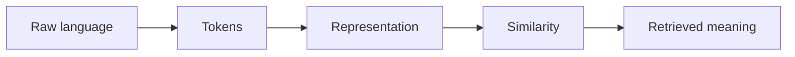

# 3.5 — Similarity and Vector Search

*Book 3: Language and Representation · Read 25 min · Worked example 20 min · Code/design practice 45–60 min · Review 10 min*

## Before you begin

- Books 1–2
- Vectors and dot products
- Basic text processing

If a prerequisite is unfamiliar, use site search and read only enough to explain it and complete a small example. Do not block progress by mastering every upstream topic first.

## Why this chapter exists

Connect distance metrics, normalization, nearest neighbors, approximate indexes, clustering, filtering, and ranking.

The engineering objective is not to memorize vocabulary. By the end, you should be able to describe the mechanism, build or inspect a small implementation, recognize its failure modes, and decide where it belongs in a larger system.

## Learning objectives

- Explain why similarity and vector search matters using the chapter scenario, not abstract definitions alone.
- Trace how **dot product** and **cosine similarity** interact in the book-level visual.
- Implement or design the bounded practice while holding evaluation cases fixed.
- Diagnose at least two failure modes specific to metadata filtering.
- Decide where this chapter's mechanism belongs in a production architecture and what evidence justifies it.

!!! note "Enduring principle"
    Retrieval quality depends on representation, metric, index, filters, and query—not the database brand.

## Mental model



Read the visual from left to right, then trace failures from right to left. The diagram is a book-level map; this chapter explains how **similarity and vector search** changes one or more transitions.

## Core concepts

The concepts form a system, not a vocabulary list. Read each section below before attempting the practice exercise.

### Dot Product

Dot product measures alignment between vectors—used in attention scores and similarity when magnitudes carry signal. Scale affects ranking unless normalized. See the [Dot Product concept card](../../concepts/cards/dot-product.md).

**Example:** Unnormalized dot products favor longer document embeddings; cosine similarity removes length bias.

**Evidence of understanding:** Compare ranking order for ten queries using dot product versus cosine on the same vectors.

### Cosine Similarity

Cosine similarity measures the angle between vectors, ignoring magnitude—standard for normalized embeddings in retrieval. See the [Cosine Similarity concept card](../../concepts/cards/cosine-similarity.md).

**Example:** Two policy summaries of different lengths can match semantically when cosine is high despite different norms.

**Evidence of understanding:** Verify identical rankings after L2-normalizing embeddings versus raw cosine computation.

### Nearest Neighbors

Nearest-neighbor search returns the closest vectors to a query by a chosen metric. Exact search is fine for small indexes; production scales require approximate methods. See the [Nearest Neighbors concept card](../../concepts/cards/nearest-neighbors.md).

**Example:** Brute-force cosine over 10k chunks is fast; at 10M you need ANN indexes with recall trade-offs.

**Evidence of understanding:** Measure recall@10 of ANN versus exact search on a held-out query set.

### Ann Indexes

Approximate nearest neighbor indexes—HNSW, IVF, LSH—trade recall for speed at million-plus scale. Index parameters must be tuned on representative queries. See the [Ann Indexes concept card](../../concepts/cards/ann-indexes.md).

**Example:** HNSW with efSearch=100 may hit 98% recall@10 at 5ms versus 50ms exact on 1M vectors.

**Evidence of understanding:** Plot latency versus recall@k for three index configurations on production query sample.

### Metadata Filtering

Metadata filtering restricts vector or lexical search by tenant, date, permission, or document type before or after similarity scoring. It enforces policy and improves precision. See the [Metadata Filtering concept card](../../concepts/cards/metadata-filtering.md).

**Example:** Searching only documents where tenant_id matches and effective_date ≤ today prevents cross-customer leakage.

**Evidence of understanding:** Run ten queries with filters and confirm zero results violate authorization metadata.

## Worked example

**Book scenario:** Employees search for policies using vocabulary different from the source documents.

**Situation:** Hybrid search must return the right policy when some queries are keyword-heavy ("form 1040") and others are conceptual ("can managers deny leave?").

**Baseline:** Single dense retriever only—misses exact form numbers.

**Application:** Run cosine similarity lab, add metadata filters (department, effective date), implement reciprocal rank fusion between BM25 and dense rankings, measure recall@10.

**Test cases:** (1) Normal: paraphrase query. (2) Boundary: filter excludes superseded policy version. (3) Adversarial: query embedding dominated by generic HR words.

**Measurement:** Recall@k per query class (lexical vs semantic), p95 latency with ANN index vs brute force.

**Design question:** Which failure mode justifies adding metadata filters before upgrading the embedding model?

## Chapter hook

Run this short snippet first to anchor **similarity and vector search** before the book-level sample:

```python
def cosine(a, b):
    dot = sum(x*y for x, y in zip(a, b))
    na = sum(x*x for x in a) ** 0.5
    nb = sum(y*y for y in b) ** 0.5
    return dot / (na * nb + 1e-9)
q = [0.2, 0.9, 0.1]
docs = {"leave": [0.3, 0.8, 0.0], "expense": [0.9, 0.1, 0.2]}
ranked = sorted(((k, cosine(q, v)) for k, v in docs.items()), key=lambda x: -x[1])
print("dense ranking:", ranked)
```

Predict the printed values, then change one line tied to **dot product** or **cosine similarity** and observe how the chapter mechanism moves.

## Runnable code sample

The following dependency-free sample supports this book. Download it from the [code-sample library](../../code-samples/03-tokenization-vectors.py) or run the matching file under `examples/`.

```python
--8<-- "docs/code-samples/03-tokenization-vectors.py"
```

Expected output is printed to the terminal. Before running it, predict which values or decisions should change. Then introduce one failure and convert the observation into a test.

??? success "Expected observation"
    The outage document should rank highest because it shares the query's weighted terms; the example also exposes the limits of lexical features.

This is a **book-level sample**. Its relevance to this chapter is the boundary between **dot product** and **cosine similarity**. Modify that boundary, not unrelated lines, when completing the chapter exercise.

## Engineering practice

**Build:** Run the cosine and semantic-search labs, then add hybrid scoring.

Work in three passes tailored to this chapter:

1. **Baseline:** Implement the task without dot product and record quality, latency, and failure cases.
2. **Mechanism:** Add cosine similarity while keeping inputs and evaluation fixed; note what changed in intermediate state.
3. **Judgment:** Compare outcomes on normal, boundary, and adversarial cases; document when similarity and vector search earns its operational cost.

Capture assumptions, test cases, results, and one architecture decision record. A successful lab explains *why* behavior changed, not merely that the program ran.

## Architecture lens

For a production design in **Language and Representation**, make the following explicit for **similarity and vector search**:

| Concern | Question to answer |
|---|---|
| **Ownership** | Which service owns dot product versus downstream consumers of its output? |
| **Contract** | What typed inputs, outputs, errors, and version does the nearest neighbors boundary expose? |
| **Evidence** | Which eval slices prove similarity and vector search meets requirements before and after each release? |
| **Security** | What untrusted data crosses the metadata filtering boundary and how is it sanitized or authorized? |
| **Operations** | What is logged at this chapter's transition, what triggers retry or rollback, and what is cached? |
| **Economics** | Which resource—tokens, retrieval calls, GPU seconds, human review—dominates cost for this mechanism? |

## Failure clinic

Reproduce failures at the chapter boundary—do not debug only final output.

| Failure | Symptom | Likely cause | First response |
|---|---|---|---|
| **Baseline illusion** | The system looks fine on demo prompts but fails on the book scenario | Evaluation cases do not cover dot product or cosine similarity | Add the chapter's normal, boundary, and adversarial cases before tuning |
| **Mechanism mismatch** | Adding complexity does not improve the measured outcome | similarity and vector search is applied at the wrong layer or without fixing inputs | Trace the book visual and verify the transition this chapter owns |
| **Silent degradation** | Outputs remain fluent while decisions become wrong | Failure in metadata filtering without observability at that boundary | Log intermediate state, version config, and compare against the baseline |
| **Operational drift** | Quality changes after deploy though prompts are unchanged | Data, permissions, or upstream dot product behavior shifted | Pin versions, inspect ingestion and policy filters, re-run slice evals |

Connect distance metrics, normalization, nearest neighbors, approximate indexes, clustering, filtering, and ranking. When triaging, preserve full inputs, retrieved evidence, tool traces, and model or index versions.

## Evolution lens

- **Yesterday:** Manual playbooks, brittle rules, or single-pass models handled parts of similarity and vector search without explicit dot product.
- **Today:** Engineering teams implement similarity and vector search as testable components with baselines, typed boundaries, and stage-specific evaluation.
- **Tomorrow:** Better automation may reduce toil, but metadata filtering and governance constraints will still require explicit design.
- **What survives:** Retrieval quality depends on representation, metric, index, filters, and query—not the database brand.

## Knowledge check

1. Why does retrieval depend on metric and index—not just embedding model brand?
2. How would metadata filtering fix a semantic false positive?
3. What single-signal baseline should hybrid search beat?

??? question "Answer guidance"
    Q1: Wrong metric or unnormalized vectors invert rankings; bad index misses neighbors. Q2: Exclude wrong department or expired docs before similarity. Q3: BM25-only or dense-only on full eval set.

## Mastery questions

??? tip "Model answers (proficient level)"
        1. **Explain dot product without jargon and give a counterexample.**
       *Proficient answer:* dot product measures alignment between vectors—used in attention scores and similarity when magnitudes carry signal. Counterexample: applying it when the task is fully deterministic and cheaper to hard-code.
    2. **Compare cosine similarity with metadata filtering using quality, cost, latency, and risk.**
       *Proficient answer:* cosine similarity measures the angle between vectors, ignoring magnitude—standard for normalized embeddings in retrieval; metadata filtering restricts vector or lexical search by tenant, date, permission, or document type before or after similarity scoring. Trade quality gains against operational and security cost on the chapter scenario.
    3. **Design a minimal experiment that tests the chapter's central claim.**
       *Proficient answer:* Fix a baseline and three cases (normal, boundary, adversarial). Add only the chapter mechanism, measure one task metric plus cost/latency, and pre-register what result would falsify the claim.
    4. **Identify which component should own validation, authorization, and observability.**
       *Proficient answer:* Validation belongs at the typed boundary after cosine similarity; authorization before any side effect or retrieval of restricted data; observability at the transition similarity and vector search introduces in the book visual.
    5. **State what would remain true if today's leading libraries and vendors disappeared.**
       *Proficient answer:* Retrieval quality depends on representation, metric, index, filters, and query—not the database brand.

## Self-assessment rubric

| Level | Evidence |
|---|---|
| Not yet | Can repeat terms but cannot trace the visual or predict the sample. |
| Developing | Can explain the mechanism and complete the normal case with help. |
| Proficient | Can implement the exercise, diagnose a failure, and compare a baseline. |
| Transfer | Can defend an architecture choice in a new domain with evaluation evidence. |

## Evidence and further study

- Manning, Raghavan & Schütze — Introduction to Information Retrieval
- Mikolov et al. — Efficient Estimation of Word Representations in Vector Space

Use primary sources for technical claims and official documentation for current product behavior. Record the version or access date for evolving material.

## Continue

Return to the [book index](index.md) or use site search to follow the chapter's concepts into the knowledge-area and reference pages.
