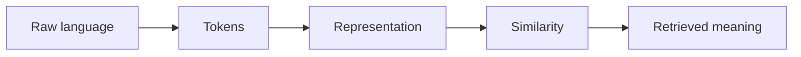

# 3.6 — Embedding Systems in Production

*Book 3: Language and Representation · Read 25 min · Worked example 20 min · Code/design practice 45–60 min · Review 10 min*

## Before you begin

- Books 1–2
- Vectors and dot products
- Basic text processing

If a prerequisite is unfamiliar, use site search and read only enough to explain it and complete a small example. Do not block progress by mastering every upstream topic first.

## Why this chapter exists

Select and evaluate embedding models, manage versions and re-indexing, protect tenant boundaries, and monitor drift.

The engineering objective is not to memorize vocabulary. By the end, you should be able to describe the mechanism, build or inspect a small implementation, recognize its failure modes, and decide where it belongs in a larger system.

## Learning objectives

- Explain why embedding systems in production matters using the chapter scenario, not abstract definitions alone.
- Trace how **embedding evaluation** and **multilingual models** interact in the book-level visual.
- Implement or design the bounded practice while holding evaluation cases fixed.
- Diagnose at least two failure modes specific to vector governance.
- Decide where this chapter's mechanism belongs in a production architecture and what evidence justifies it.

!!! note "Enduring principle"
    Embedding changes are data migrations with quality, compatibility, and operational consequences.

## Mental model



Read the visual from left to right, then trace failures from right to left. The diagram is a book-level map; this chapter explains how **embedding systems in production** changes one or more transitions.

## Core concepts

The concepts form a system, not a vocabulary list. Read each section below before attempting the practice exercise.

### Embedding Evaluation

Embedding evaluation measures retrieval quality—recall, MRR, nDCG—on realistic queries with hard negatives. Benchmarks must mirror production language and domains. See the [Embedding Evaluation concept card](../../concepts/cards/embedding-evaluation.md).

**Example:** Evaluating only easy paraphrases overstates performance versus queries with acronyms and typos.

**Evidence of understanding:** Build 50 queries with annotated gold passages and hard negatives; report recall@5 and MRR.

### Multilingual Models

Multilingual models share parameters across languages, enabling cross-lingual retrieval and generation. Performance varies by language pair and training data balance. See the [Multilingual Models concept card](../../concepts/cards/multilingual-models.md).

**Example:** A Spanish employee query can retrieve English policy text if the embedding space aligns concepts.

**Evidence of understanding:** Evaluate recall@5 separately per language on parallel query sets.

### Hard Negatives

Hard negatives are plausible but incorrect passages that confuse retrievers—essential for training and evaluation realism. Easy negatives inflate metrics. See the [Hard Negatives concept card](../../concepts/cards/hard-negatives.md).

**Example:** A chunk about vacation policy is a hard negative for a sick-leave query sharing HR vocabulary.

**Evidence of understanding:** Include at least three hard negatives per query in eval sets and report recall drop versus easy-only sets.

### Re-Indexing

Re-indexing rebuilds search indexes after embedding model or chunking changes. It is a data migration with downtime, cost, and quality validation requirements. See the [Re-Indexing concept card](../../concepts/cards/re-indexing.md).

**Example:** Switching embedding models requires dual-running indexes until recall parity is proven.

**Evidence of understanding:** Compare recall@10 old versus new index on the same eval set before cutover.

### Vector Governance

Vector governance covers access control, versioning, retention, and audit for embedding stores and indexes. Vectors can leak semantic content of restricted documents if misconfigured. See the [Vector Governance concept card](../../concepts/cards/vector-governance.md).

**Example:** Tenant-isolated namespaces prevent one customer's embeddings appearing in another's search results.

**Evidence of understanding:** Attempt cross-tenant retrieval in tests and verify zero unauthorized hits.

## Worked example

**Book scenario:** Employees search for policies using vocabulary different from the source documents.

**Situation:** The company swaps embedding models quarterly; after re-indexing, previously correct answers disappear for French and Portuguese policies.

**Baseline:** Silent model swap with no eval regression gate.

**Application:** Build retrieval eval with realistic queries, hard negatives, multilingual slice; version embedding model in registry; plan re-index with shadow traffic and tenant-scoped indexes.

**Test cases:** (1) Normal: English policy query post-upgrade. (2) Boundary: cross-lingual query (Spanish query, English doc). (3) Adversarial: tenant A index accidentally includes tenant B vectors.

**Measurement:** NDCG@10 by language slice before/after re-index; time-to-rollback; hard-negative false-positive rate.

**Design question:** What contract must the embedding service expose so product teams treat upgrades as data migrations?

## Chapter hook

Run this short snippet first to anchor **embedding systems in production** before the book-level sample:

```python
eval_set = [
    {"q": "PTO carryover", "gold": "doc-leave-2024", "lang": "en"},
    {"q": "congé report", "gold": "doc-leave-fr", "lang": "fr"},
]
model_versions = {"v1": 0.82, "v2": 0.71}
for row in eval_set:
    score = model_versions["v2"] if row["lang"] == "fr" else model_versions["v1"]
    print({"query": row["q"], "ndcg_proxy": score, "pass": score >= 0.75})
```

Predict the printed values, then change one line tied to **embedding evaluation** or **multilingual models** and observe how the chapter mechanism moves.

## Runnable code sample

The following dependency-free sample supports this book. Download it from the [code-sample library](../../code-samples/03-tokenization-vectors.py) or run the matching file under `examples/`.

```python
--8<-- "docs/code-samples/03-tokenization-vectors.py"
```

Expected output is printed to the terminal. Before running it, predict which values or decisions should change. Then introduce one failure and convert the observation into a test.

??? success "Expected observation"
    The outage document should rank highest because it shares the query's weighted terms; the example also exposes the limits of lexical features.

This is a **book-level sample**. Its relevance to this chapter is the boundary between **embedding evaluation** and **multilingual models**. Modify that boundary, not unrelated lines, when completing the chapter exercise.

## Engineering practice

**Build:** Create a retrieval evaluation set with realistic queries and hard negatives.

Work in three passes tailored to this chapter:

1. **Baseline:** Implement the task without embedding evaluation and record quality, latency, and failure cases.
2. **Mechanism:** Add multilingual models while keeping inputs and evaluation fixed; note what changed in intermediate state.
3. **Judgment:** Compare outcomes on normal, boundary, and adversarial cases; document when embedding systems in production earns its operational cost.

Capture assumptions, test cases, results, and one architecture decision record. A successful lab explains *why* behavior changed, not merely that the program ran.

## Spec-driven habit

Every chapter lab pairs reading with **executable acceptance**. Before implementing book 3.6 — embedding systems in production:

1. Draft cases in `test_lab.py` or `specs/lab-0306.yaml`.
2. Use [Cursor Plan/Agent](https://cursor.com/) with "read spec first, then minimal diff".
3. Or use [OpenSpec](https://openspec.dev/) `/opsx:propose` so requirements live in `openspec/` next to code.

→ [Spec-driven workflow guide](../../getting-started/spec-driven-workflow.md) · [Lab 3.6](../../labs/0306-embedding-systems-in-production.md)


## Architecture lens

For a production design in **Language and Representation**, make the following explicit for **embedding systems in production**:

| Concern | Question to answer |
|---|---|
| **Ownership** | Which service owns embedding evaluation versus downstream consumers of its output? |
| **Contract** | What typed inputs, outputs, errors, and version does the hard negatives boundary expose? |
| **Evidence** | Which eval slices prove embedding systems in production meets requirements before and after each release? |
| **Security** | What untrusted data crosses the vector governance boundary and how is it sanitized or authorized? |
| **Operations** | What is logged at this chapter's transition, what triggers retry or rollback, and what is cached? |
| **Economics** | Which resource—tokens, retrieval calls, GPU seconds, human review—dominates cost for this mechanism? |

## Failure clinic

Reproduce failures at the chapter boundary—do not debug only final output.

| Failure | Symptom | Likely cause | First response |
|---|---|---|---|
| **Baseline illusion** | The system looks fine on demo prompts but fails on the book scenario | Evaluation cases do not cover embedding evaluation or multilingual models | Add the chapter's normal, boundary, and adversarial cases before tuning |
| **Mechanism mismatch** | Adding complexity does not improve the measured outcome | embedding systems in production is applied at the wrong layer or without fixing inputs | Trace the book visual and verify the transition this chapter owns |
| **Silent degradation** | Outputs remain fluent while decisions become wrong | Failure in vector governance without observability at that boundary | Log intermediate state, version config, and compare against the baseline |
| **Operational drift** | Quality changes after deploy though prompts are unchanged | Data, permissions, or upstream embedding evaluation behavior shifted | Pin versions, inspect ingestion and policy filters, re-run slice evals |

Select and evaluate embedding models, manage versions and re-indexing, protect tenant boundaries, and monitor drift. When triaging, preserve full inputs, retrieved evidence, tool traces, and model or index versions.

## Evolution lens

- **Yesterday:** Manual playbooks, brittle rules, or single-pass models handled parts of embedding systems in production without explicit embedding evaluation.
- **Today:** Engineering teams implement embedding systems in production as testable components with baselines, typed boundaries, and stage-specific evaluation.
- **Tomorrow:** Better automation may reduce toil, but vector governance and governance constraints will still require explicit design.
- **What survives:** Embedding changes are data migrations with quality, compatibility, and operational consequences.

## Knowledge check

1. Why are embedding changes data migrations rather than config tweaks?
2. How do hard negatives reveal regressions average metrics hide?
3. What baseline skips re-index evaluation?

??? question "Answer guidance"
    Q1: Vector space geometry changes—indexes must rebuild and compat breaks. Q2: Top doc is plausible but wrong; average NDCG stays flat. Q3: Deploy new model without shadow eval on multilingual slice.

## Mastery questions

??? tip "Model answers (proficient level)"
        1. **Explain embedding evaluation without jargon and give a counterexample.**
       *Proficient answer:* embedding evaluation measures retrieval quality—recall, mrr, ndcg—on realistic queries with hard negatives. Counterexample: applying it when the task is fully deterministic and cheaper to hard-code.
    2. **Compare multilingual models with vector governance using quality, cost, latency, and risk.**
       *Proficient answer:* multilingual models share parameters across languages, enabling cross-lingual retrieval and generation; vector governance covers access control, versioning, retention, and audit for embedding stores and indexes. Trade quality gains against operational and security cost on the chapter scenario.
    3. **Design a minimal experiment that tests the chapter's central claim.**
       *Proficient answer:* Fix a baseline and three cases (normal, boundary, adversarial). Add only the chapter mechanism, measure one task metric plus cost/latency, and pre-register what result would falsify the claim.
    4. **Identify which component should own validation, authorization, and observability.**
       *Proficient answer:* Validation belongs at the typed boundary after multilingual models; authorization before any side effect or retrieval of restricted data; observability at the transition embedding systems in production introduces in the book visual.
    5. **State what would remain true if today's leading libraries and vendors disappeared.**
       *Proficient answer:* Embedding changes are data migrations with quality, compatibility, and operational consequences.

## Self-assessment rubric

| Level | Evidence |
|---|---|
| Not yet | Can repeat terms but cannot trace the visual or predict the sample. |
| Developing | Can explain the mechanism and complete the normal case with help. |
| Proficient | Can implement the exercise, diagnose a failure, and compare a baseline. |
| Transfer | Can defend an architecture choice in a new domain with evaluation evidence. |

## Evidence and further study

- Manning, Raghavan & Schütze — Introduction to Information Retrieval
- Mikolov et al. — Efficient Estimation of Word Representations in Vector Space

Use primary sources for technical claims and official documentation for current product behavior. Record the version or access date for evolving material.

## Continue

Return to the [book index](index.md) or use site search to follow the chapter's concepts into the knowledge-area and reference pages.
