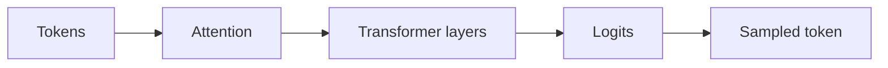

# 4.1 — Sequence Models Before Transformers

*Book 4: Transformers and Foundation Models · Read 25 min · Worked example 20 min · Code/design practice 45–60 min · Review 10 min*

## Before you begin

- Books 1–3
- Matrix multiplication intuition
- Neural-network basics

If a prerequisite is unfamiliar, use site search and read only enough to explain it and complete a small example. Do not block progress by mastering every upstream topic first.

## Why this chapter exists

Understand n-grams, recurrent networks, LSTMs, encoder–decoder models, bottlenecks, and why long-range dependencies and serial computation were difficult.

The engineering objective is not to memorize vocabulary. By the end, you should be able to describe the mechanism, build or inspect a small implementation, recognize its failure modes, and decide where it belongs in a larger system.

## Learning objectives

- Explain why sequence models before transformers matters using the chapter scenario, not abstract definitions alone.
- Trace how **n-grams** and **RNNs** interact in the book-level visual.
- Implement or design the bounded practice while holding evaluation cases fixed.
- Diagnose at least two failure modes specific to bottlenecks.
- Decide where this chapter's mechanism belongs in a production architecture and what evidence justifies it.

!!! note "Enduring principle"
    Architectures evolve in response to information-flow and optimization bottlenecks.

## Mental model



Read the visual from left to right, then trace failures from right to left. The diagram is a book-level map; this chapter explains how **sequence models before transformers** changes one or more transitions.

## Core concepts

The concepts form a system, not a vocabulary list. Read each section below before attempting the practice exercise.

### N-Grams

N-gram models predict tokens from local history of n−1 prior tokens—simple, fast, and limited to short context. They remain baselines for compression and sanity checks. See the [N-Grams concept card](../../concepts/cards/n-grams.md).

**Example:** A trigram model captures 'New York' but not dependencies spanning whole paragraphs.

**Evidence of understanding:** Compare perplexity of n-gram versus small neural LM on the same held-out corpus.

### RNNs

Recurrent neural networks process sequences step by step, maintaining hidden state across time. Serial computation limits parallel training and long-range credit assignment. See the [RNNs concept card](../../concepts/cards/rnns.md).

**Example:** Character-level RNN language models learn spelling but struggle with paragraph-level coherence.

**Evidence of understanding:** Measure training steps/sec versus transformer on the same sequence length.

### LSTMs

LSTMs add gating to RNNs to mitigate vanishing gradients and capture longer dependencies than plain RNNs. They dominated seq2seq before transformers but remain in some streaming pipelines. See the [LSTMs concept card](../../concepts/cards/lstms.md).

**Example:** LSTM encoders for time-series logs capture hourly patterns over days of context.

**Evidence of understanding:** Compare validation loss at step 10k for LSTM versus transformer on identical data.

### Seq2Seq

Sequence-to-sequence models map input sequences to output sequences via encoder–decoder architectures. They underpin translation, summarization, and tool-output generation patterns. See the [Seq2Seq concept card](../../concepts/cards/seq2seq.md).

**Example:** An encoder compresses ticket text; a decoder generates structured JSON fields.

**Evidence of understanding:** Evaluate BLEU or field-level F1 on a held-out seq2seq task with beam search.

### Bottlenecks

Information bottlenecks force compressive representations—fixed-size context vectors or limited bandwidth channels. They create trade-offs between memory and expressiveness. See the [Bottlenecks concept card](../../concepts/cards/bottlenecks.md).

**Example:** Early seq2seq used a single context vector for entire sentences, losing detail on long inputs.

**Evidence of understanding:** Compare output quality on 50-token versus 500-token inputs through a fixed bottleneck.

## Worked example

**Book scenario:** A team must explain why decoding settings change model output and latency.

**Situation:** A team must explain why decoding settings change model output and latency. They prototype next-token prediction with n-grams before adopting transformers.

**Baseline:** Trigram model over support macros—fails when incident description exceeds three-token context.

**Application:** Train n-gram on ticket corpus, identify failure at long-range dependency ("region" ... "failover"), contrast with RNN-style hidden state carry (simulated) showing bottleneck.

**Test cases:** (1) Normal: complete trigram match in template. (2) Boundary: context exactly at n-gram window edge. (3) Adversarial: repeated padding tokens dilute probability mass.

**Measurement:** Perplexity vs context length; latency per token for serial RNN simulation vs parallel n-gram lookup.

**Design question:** At what context length does the n-gram baseline break on the book scenario, and why?

## Chapter hook

Run this short snippet first to anchor **sequence models before transformers** before the book-level sample:

```python
CHAPTER = "4.1"
print("chapter hook:", CHAPTER)
from collections import Counter
text = "region east failover region west failover"
n = 3
grams = Counter(tuple(text.split()[i:i+n]) for i in range(len(text.split())-n+1))
context = ("region", "east")
candidates = [g[-1] for g in grams if g[:2] == context]
print({"context": context, "next_token_candidates": candidates})
print("---")
print("change one input above, predict output, re-run")
```

Predict the printed values, then change one line tied to **n-grams** or **RNNs** and observe how the chapter mechanism moves.

## Runnable code sample

The following dependency-free sample supports this book. Download it from the [code-sample library](../../code-samples/04-attention-sampling.py) or run the matching file under `examples/`.

```python
--8<-- "docs/code-samples/04-attention-sampling.py"
```

Expected output is printed to the terminal. Before running it, predict which values or decisions should change. Then introduce one failure and convert the observation into a test.

??? success "Expected observation"
    The query-aligned value receives more attention, and lower temperature concentrates the sampling distribution.

This is a **book-level sample**. Its relevance to this chapter is the boundary between **n-grams** and **RNNs**. Modify that boundary, not unrelated lines, when completing the chapter exercise.

## Engineering practice

**Build:** Train an n-gram model and inspect where local context fails.

Work in three passes tailored to this chapter:

1. **Baseline:** Implement the task without n-grams and record quality, latency, and failure cases.
2. **Mechanism:** Add rnns while keeping inputs and evaluation fixed; note what changed in intermediate state.
3. **Judgment:** Compare outcomes on normal, boundary, and adversarial cases; document when sequence models before transformers earns its operational cost.

Capture assumptions, test cases, results, and one architecture decision record. A successful lab explains *why* behavior changed, not merely that the program ran.

## Spec-driven habit

Every chapter lab pairs reading with **executable acceptance**. Before implementing book 4.1 — sequence models before transformers:

1. Draft cases in `test_lab.py` or `specs/lab-0401.yaml`.
2. Use [Cursor Plan/Agent](https://cursor.com/) with "read spec first, then minimal diff".
3. Or use [OpenSpec](https://openspec.dev/) `/opsx:propose` so requirements live in `openspec/` next to code.

→ [Spec-driven workflow guide](../../getting-started/spec-driven-workflow.md) · [Lab 4.1](../../labs/0401-sequence-models-before-transformers.md)


## Architecture lens

For a production design in **Transformers and Foundation Models**, make the following explicit for **sequence models before transformers**:

| Concern | Question to answer |
|---|---|
| **Ownership** | Which service owns n-grams versus downstream consumers of its output? |
| **Contract** | What typed inputs, outputs, errors, and version does the lstms boundary expose? |
| **Evidence** | Which eval slices prove sequence models before transformers meets requirements before and after each release? |
| **Security** | What untrusted data crosses the bottlenecks boundary and how is it sanitized or authorized? |
| **Operations** | What is logged at this chapter's transition, what triggers retry or rollback, and what is cached? |
| **Economics** | Which resource—tokens, retrieval calls, GPU seconds, human review—dominates cost for this mechanism? |

## Failure clinic

Reproduce failures at the chapter boundary—do not debug only final output.

| Failure | Symptom | Likely cause | First response |
|---|---|---|---|
| **Baseline illusion** | The system looks fine on demo prompts but fails on the book scenario | Evaluation cases do not cover n-grams or rnns | Add the chapter's normal, boundary, and adversarial cases before tuning |
| **Mechanism mismatch** | Adding complexity does not improve the measured outcome | sequence models before transformers is applied at the wrong layer or without fixing inputs | Trace the book visual and verify the transition this chapter owns |
| **Silent degradation** | Outputs remain fluent while decisions become wrong | Failure in bottlenecks without observability at that boundary | Log intermediate state, version config, and compare against the baseline |
| **Operational drift** | Quality changes after deploy though prompts are unchanged | Data, permissions, or upstream n-grams behavior shifted | Pin versions, inspect ingestion and policy filters, re-run slice evals |

Understand n-grams, recurrent networks, LSTMs, encoder–decoder models, bottlenecks, and why long-range dependencies and serial computation were difficult. When triaging, preserve full inputs, retrieved evidence, tool traces, and model or index versions.

## Evolution lens

- **Yesterday:** Manual playbooks, brittle rules, or single-pass models handled parts of sequence models before transformers without explicit n-grams.
- **Today:** Engineering teams implement sequence models before transformers as testable components with baselines, typed boundaries, and stage-specific evaluation.
- **Tomorrow:** Better automation may reduce toil, but bottlenecks and governance constraints will still require explicit design.
- **What survives:** Architectures evolve in response to information-flow and optimization bottlenecks.

## Knowledge check

1. Why did long-range dependencies motivate architectures beyond n-grams?
2. What symptom shows an RNN bottleneck without mentioning transformers?
3. What n-gram order baseline should precede neural sequence models?

??? question "Answer guidance"
    Q1: n-grams cannot relate distant tokens; probability tables explode. Q2: Hidden state saturates—early tokens forgotten in long tickets. Q3: Fixed-order n-gram with same corpus and perplexity eval.

## Mastery questions

??? tip "Model answers (proficient level)"
        1. **Explain n-grams without jargon and give a counterexample.**
       *Proficient answer:* n-gram models predict tokens from local history of n−1 prior tokens—simple, fast, and limited to short context. Counterexample: applying it when the task is fully deterministic and cheaper to hard-code.
    2. **Compare RNNs with bottlenecks using quality, cost, latency, and risk.**
       *Proficient answer:* recurrent neural networks process sequences step by step, maintaining hidden state across time; information bottlenecks force compressive representations—fixed-size context vectors or limited bandwidth channels. Trade quality gains against operational and security cost on the chapter scenario.
    3. **Design a minimal experiment that tests the chapter's central claim.**
       *Proficient answer:* Fix a baseline and three cases (normal, boundary, adversarial). Add only the chapter mechanism, measure one task metric plus cost/latency, and pre-register what result would falsify the claim.
    4. **Identify which component should own validation, authorization, and observability.**
       *Proficient answer:* Validation belongs at the typed boundary after rnns; authorization before any side effect or retrieval of restricted data; observability at the transition sequence models before transformers introduces in the book visual.
    5. **State what would remain true if today's leading libraries and vendors disappeared.**
       *Proficient answer:* Architectures evolve in response to information-flow and optimization bottlenecks.

## Self-assessment rubric

| Level | Evidence |
|---|---|
| Not yet | Can repeat terms but cannot trace the visual or predict the sample. |
| Developing | Can explain the mechanism and complete the normal case with help. |
| Proficient | Can implement the exercise, diagnose a failure, and compare a baseline. |
| Transfer | Can defend an architecture choice in a new domain with evaluation evidence. |

## Evidence and further study

- Vaswani et al. — Attention Is All You Need
- Devlin et al. — BERT
- Brown et al. — Language Models are Few-Shot Learners

Use primary sources for technical claims and official documentation for current product behavior. Record the version or access date for evolving material.

## Continue

Return to the [book index](index.md) or use site search to follow the chapter's concepts into the knowledge-area and reference pages.
