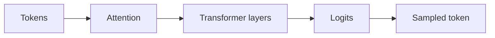

# 4.2 — Attention

*Book 4: Transformers and Foundation Models · Read 25 min · Worked example 20 min · Code/design practice 45–60 min · Review 10 min*

## Before you begin

- Books 1–3
- Matrix multiplication intuition
- Neural-network basics

If a prerequisite is unfamiliar, use site search and read only enough to explain it and complete a small example. Do not block progress by mastering every upstream topic first.

## Why this chapter exists

Build attention from queries, keys, values, similarity scores, normalization, and weighted aggregation.

The engineering objective is not to memorize vocabulary. By the end, you should be able to describe the mechanism, build or inspect a small implementation, recognize its failure modes, and decide where it belongs in a larger system.

## Learning objectives

- Explain why attention matters using the chapter scenario, not abstract definitions alone.
- Trace how **queries** and **keys** interact in the book-level visual.
- Implement or design the bounded practice while holding evaluation cases fixed.
- Diagnose at least two failure modes specific to attention masks.
- Decide where this chapter's mechanism belongs in a production architecture and what evidence justifies it.

!!! note "Enduring principle"
    Attention is content-dependent routing of information.

## Mental model



Read the visual from left to right, then trace failures from right to left. The diagram is a book-level map; this chapter explains how **attention** changes one or more transitions.

## Core concepts

The concepts form a system, not a vocabulary list. Read each section below before attempting the practice exercise.

### Queries

In attention, queries represent what information a position seeks from other positions. They are learned projections of hidden states, not user search queries. See the [Queries concept card](../../concepts/cards/queries.md).

**Example:** Each decoder token issues a query vector to attend over encoder keys during translation.

**Evidence of understanding:** Visualize query-key dot products and verify peak weights align with alignments.

### Keys

Keys are attention projections indexed for lookup—compatible queries receive high weights. Together with values they implement content-addressable memory over sequences. See the [Keys concept card](../../concepts/cards/keys.md).

**Example:** A pronoun's query should match keys at its antecedent position for correct coreference routing.

**Evidence of understanding:** Mask illegal keys and confirm attention mass stays on permitted positions only.

### Values

Values carry the content aggregated by attention weights—what actually flows between positions. Weighted sums of values update each position's representation. See the [Values concept card](../../concepts/cards/values.md).

**Example:** Attending to a verb's value brings predicate information into the subject's representation.

**Evidence of understanding:** Compare hidden states with and without value projection on a toy attention module.

### Scaled Dot Product

Scaled dot-product attention computes softmax(QKᵀ/√d)V, scaling dot products to stable gradients. It is the core operation inside transformer blocks. See the [Scaled Dot Product concept card](../../concepts/cards/scaled-dot-product.md).

**Example:** Without scaling, large dimensions push softmax into near one-hot distributions and vanishing gradients.

**Evidence of understanding:** Implement attention and verify gradient norms remain stable with versus without √d scaling.

### Attention Masks

Attention masks zero out disallowed positions—future tokens in decoding, padding, or cross-segment boundaries. Masks enforce causality and ignore irrelevant tokens. See the [Attention Masks concept card](../../concepts/cards/attention-masks.md).

**Example:** Causal masks prevent a language model from peeking at answer tokens during training.

**Evidence of understanding:** Apply a causal mask and confirm no weight connects position i to j > i.

## Worked example

**Book scenario:** A team must explain why decoding settings change model output and latency.

**Situation:** Engineers need intuition for why certain tokens in a policy snippet receive more weight when summarizing an incident tied to that policy.

**Baseline:** Uniform averaging of token vectors—ignores relevance.

**Application:** Implement scaled dot-product attention: queries from summary slot, keys/values from policy tokens, visualize weight distribution over "outage", "SLA", "escalation."

**Test cases:** (1) Normal: query token aligns with one key. (2) Boundary: all keys orthogonal—uniform weights. (3) Adversarial: one key with huge norm dominates without scaling.

**Measurement:** Entropy of attention weights; summarization ROUGE vs uniform baseline on three snippets.

**Design question:** Why divide dot products by sqrt(d_k) before softmax in production-sized models?

## Chapter hook

Run this short snippet first to anchor **attention** before the book-level sample:

```python
import math
q = [1.0, 0.0]
keys = [[0.9, 0.1], [0.0, 1.0], [0.9, 0.1]]
def scaled_dot(q, k, scale):
    return sum(a*b for a, b in zip(q, k)) / scale
scale = math.sqrt(len(q))
scores = [scaled_dot(q, k, scale) for k in keys]
m = max(scores)
weights = [math.exp(s-m) for s in scores]
Z = sum(weights)
weights = [w/Z for w in weights]
print("weights:", [round(w, 3) for w in weights])
```

Predict the printed values, then change one line tied to **queries** or **keys** and observe how the chapter mechanism moves.

## Runnable code sample

The following dependency-free sample supports this book. Download it from the [code-sample library](../../code-samples/04-attention-sampling.py) or run the matching file under `examples/`.

```python
--8<-- "docs/code-samples/04-attention-sampling.py"
```

Expected output is printed to the terminal. Before running it, predict which values or decisions should change. Then introduce one failure and convert the observation into a test.

??? success "Expected observation"
    The query-aligned value receives more attention, and lower temperature concentrates the sampling distribution.

This is a **book-level sample**. Its relevance to this chapter is the boundary between **queries** and **keys**. Modify that boundary, not unrelated lines, when completing the chapter exercise.

## Engineering practice

**Build:** Implement scaled dot-product attention and visualize weights.

Work in three passes tailored to this chapter:

1. **Baseline:** Implement the task without queries and record quality, latency, and failure cases.
2. **Mechanism:** Add keys while keeping inputs and evaluation fixed; note what changed in intermediate state.
3. **Judgment:** Compare outcomes on normal, boundary, and adversarial cases; document when attention earns its operational cost.

Capture assumptions, test cases, results, and one architecture decision record. A successful lab explains *why* behavior changed, not merely that the program ran.

## Architecture lens

For a production design in **Transformers and Foundation Models**, make the following explicit for **attention**:

| Concern | Question to answer |
|---|---|
| **Ownership** | Which service owns queries versus downstream consumers of its output? |
| **Contract** | What typed inputs, outputs, errors, and version does the values boundary expose? |
| **Evidence** | Which eval slices prove attention meets requirements before and after each release? |
| **Security** | What untrusted data crosses the attention masks boundary and how is it sanitized or authorized? |
| **Operations** | What is logged at this chapter's transition, what triggers retry or rollback, and what is cached? |
| **Economics** | Which resource—tokens, retrieval calls, GPU seconds, human review—dominates cost for this mechanism? |

## Failure clinic

Reproduce failures at the chapter boundary—do not debug only final output.

| Failure | Symptom | Likely cause | First response |
|---|---|---|---|
| **Baseline illusion** | The system looks fine on demo prompts but fails on the book scenario | Evaluation cases do not cover queries or keys | Add the chapter's normal, boundary, and adversarial cases before tuning |
| **Mechanism mismatch** | Adding complexity does not improve the measured outcome | attention is applied at the wrong layer or without fixing inputs | Trace the book visual and verify the transition this chapter owns |
| **Silent degradation** | Outputs remain fluent while decisions become wrong | Failure in attention masks without observability at that boundary | Log intermediate state, version config, and compare against the baseline |
| **Operational drift** | Quality changes after deploy though prompts are unchanged | Data, permissions, or upstream queries behavior shifted | Pin versions, inspect ingestion and policy filters, re-run slice evals |

Build attention from queries, keys, values, similarity scores, normalization, and weighted aggregation. When triaging, preserve full inputs, retrieved evidence, tool traces, and model or index versions.

## Evolution lens

- **Yesterday:** Manual playbooks, brittle rules, or single-pass models handled parts of attention without explicit queries.
- **Today:** Engineering teams implement attention as testable components with baselines, typed boundaries, and stage-specific evaluation.
- **Tomorrow:** Better automation may reduce toil, but attention masks and governance constraints will still require explicit design.
- **What survives:** Attention is content-dependent routing of information.

## Knowledge check

1. What does attention compute that a fixed convolution cannot?
2. How would an unscaled dot product distort weights when dimension grows?
3. What baseline aggregation ignores content-dependent routing?

??? question "Answer guidance"
    Q1: Dynamic routing based on query-key compatibility. Q2: Large dimensions inflate dot products → sharp softmax → vanishing gradients for other keys. Q3: Mean pooling over token vectors.

## Mastery questions

??? tip "Model answers (proficient level)"
        1. **Explain queries without jargon and give a counterexample.**
       *Proficient answer:* in attention, queries represent what information a position seeks from other positions. Counterexample: applying it when the task is fully deterministic and cheaper to hard-code.
    2. **Compare keys with attention masks using quality, cost, latency, and risk.**
       *Proficient answer:* keys are attention projections indexed for lookup—compatible queries receive high weights; attention masks zero out disallowed positions—future tokens in decoding, padding, or cross-segment boundaries. Trade quality gains against operational and security cost on the chapter scenario.
    3. **Design a minimal experiment that tests the chapter's central claim.**
       *Proficient answer:* Fix a baseline and three cases (normal, boundary, adversarial). Add only the chapter mechanism, measure one task metric plus cost/latency, and pre-register what result would falsify the claim.
    4. **Identify which component should own validation, authorization, and observability.**
       *Proficient answer:* Validation belongs at the typed boundary after keys; authorization before any side effect or retrieval of restricted data; observability at the transition attention introduces in the book visual.
    5. **State what would remain true if today's leading libraries and vendors disappeared.**
       *Proficient answer:* Attention is content-dependent routing of information.

## Self-assessment rubric

| Level | Evidence |
|---|---|
| Not yet | Can repeat terms but cannot trace the visual or predict the sample. |
| Developing | Can explain the mechanism and complete the normal case with help. |
| Proficient | Can implement the exercise, diagnose a failure, and compare a baseline. |
| Transfer | Can defend an architecture choice in a new domain with evaluation evidence. |

## Evidence and further study

- Vaswani et al. — Attention Is All You Need
- Devlin et al. — BERT
- Brown et al. — Language Models are Few-Shot Learners

Use primary sources for technical claims and official documentation for current product behavior. Record the version or access date for evolving material.

## Continue

Return to the [book index](index.md) or use site search to follow the chapter's concepts into the knowledge-area and reference pages.
