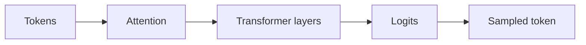

# 4.3 — The Transformer Block

*Book 4: Transformers and Foundation Models · Read 25 min · Worked example 20 min · Code/design practice 45–60 min · Review 10 min*

## Before you begin

- Books 1–3
- Matrix multiplication intuition
- Neural-network basics

If a prerequisite is unfamiliar, use site search and read only enough to explain it and complete a small example. Do not block progress by mastering every upstream topic first.

## Why this chapter exists

Compose multi-head attention, feed-forward layers, residual paths, normalization, positional information, and masking.

The engineering objective is not to memorize vocabulary. By the end, you should be able to describe the mechanism, build or inspect a small implementation, recognize its failure modes, and decide where it belongs in a larger system.

## Learning objectives

- Explain why the transformer block matters using the chapter scenario, not abstract definitions alone.
- Trace how **multi-head attention** and **residual connections** interact in the book-level visual.
- Implement or design the bounded practice while holding evaluation cases fixed.
- Diagnose at least two failure modes specific to position.
- Decide where this chapter's mechanism belongs in a production architecture and what evidence justifies it.

!!! note "Enduring principle"
    Depth repeatedly mixes information and transforms representations.

## Mental model



Read the visual from left to right, then trace failures from right to left. The diagram is a book-level map; this chapter explains how **the transformer block** changes one or more transitions.

## Core concepts

The concepts form a system, not a vocabulary list. Read each section below before attempting the practice exercise.

### Multi-Head Attention

Multi-head attention runs several attention operations in parallel with separate projections, letting different heads capture diverse relations. Heads are often redundant but increase capacity. See the [Multi-Head Attention concept card](../../concepts/cards/multi-head-attention.md).

**Example:** One head may track syntax; another tracks coreference in the same layer.

**Evidence of understanding:** Ablate heads individually and measure perplexity or task metric impact per head.

### Residual Connections

Residual connections add layer inputs to outputs, easing gradient flow through deep stacks. They let layers learn incremental refinements instead of full remappings. See the [Residual Connections concept card](../../concepts/cards/residual-connections.md).

**Example:** Transformer blocks compute attention(x) + x rather than attention(x) alone.

**Evidence of understanding:** Train depth-12 with and without residuals and compare convergence speed.

### Normalization

Text normalization lowercases, strips diacritics, standardizes whitespace, and canonicalizes equivalents before indexing or tokenization. Over-normalization destroys discriminative identifiers. See the [Normalization concept card](../../concepts/cards/normalization.md).

**Example:** Collapsing hyphens in SKUs merges distinct product codes; preserving case matters for camelCase APIs.

**Evidence of understanding:** Compare retrieval recall with and without aggressive normalization on identifier-heavy queries.

### Mlp Blocks

MLP blocks apply position-wise feed-forward networks after attention, adding nonlinear capacity per token. They typically expand dimension 4× then project back. See the [Mlp Blocks concept card](../../concepts/cards/mlp-blocks.md).

**Example:** FFN layers store factual associations in some interpretability studies of LMs.

**Evidence of understanding:** Measure parameter count and FLOPs share of MLP versus attention in one block.

### Position

Position information tells transformers token order since self-attention is permutation-invariant without it. Methods include sinusoidal, learned, and rotary (RoPE) encodings. See the [Position concept card](../../concepts/cards/position.md).

**Example:** Rotary embeddings encode relative position in Q/K products for long-context models.

**Evidence of understanding:** Shuffle token order without position encodings and observe catastrophic perplexity increase.

## Worked example

**Book scenario:** A team must explain why decoding settings change model output and latency.

**Situation:** The team assembles a minimal transformer block to predict the next token in incident summaries, ensuring tensor shapes flow correctly through attention and FFN.

**Baseline:** Single attention head without residuals—training unstable on small data.

**Application:** Stack multi-head attention (2 heads), residual connections, layer norm, and two-layer FFN; verify shape (batch, seq, dim) at each sub-layer; apply causal mask for autoregressive training.

**Test cases:** (1) Normal: seq_len=8, dim=16. (2) Boundary: seq_len=1 (degenerate attention). (3) Adversarial: mask bug allowing peek at future tokens.

**Measurement:** Training loss stability with/without residuals; shape assertion pass rate in unit tests.

**Design question:** Which component—residual path or normalization—would you remove first to demonstrate training failure?

## Chapter hook

Run this short snippet first to anchor **the transformer block** before the book-level sample:

```python
seq, dim, heads = 4, 8, 2
assert dim % heads == 0
head_dim = dim // heads
x = [[0.1 * (i+j) for j in range(dim)] for i in range(seq)]
def layer_norm(row):
    mu = sum(row) / len(row)
    var = sum((v-mu)**2 for v in row) / len(row)
    return [(v-mu)/(var+1e-5)**0.5 for v in row]
out = [layer_norm(row) for row in x]
print({"seq": seq, "dim": dim, "head_dim": head_dim, "row0_norm_mean": round(sum(out[0])/len(out[0]), 3)})
```

Predict the printed values, then change one line tied to **multi-head attention** or **residual connections** and observe how the chapter mechanism moves.

## Runnable code sample

The following dependency-free sample supports this book. Download it from the [code-sample library](../../code-samples/04-attention-sampling.py) or run the matching file under `examples/`.

```python
--8<-- "docs/code-samples/04-attention-sampling.py"
```

Expected output is printed to the terminal. Before running it, predict which values or decisions should change. Then introduce one failure and convert the observation into a test.

??? success "Expected observation"
    The query-aligned value receives more attention, and lower temperature concentrates the sampling distribution.

This is a **book-level sample**. Its relevance to this chapter is the boundary between **multi-head attention** and **residual connections**. Modify that boundary, not unrelated lines, when completing the chapter exercise.

## Engineering practice

**Build:** Assemble one transformer block and test tensor shapes.

Work in three passes tailored to this chapter:

1. **Baseline:** Implement the task without multi-head attention and record quality, latency, and failure cases.
2. **Mechanism:** Add residual connections while keeping inputs and evaluation fixed; note what changed in intermediate state.
3. **Judgment:** Compare outcomes on normal, boundary, and adversarial cases; document when the transformer block earns its operational cost.

Capture assumptions, test cases, results, and one architecture decision record. A successful lab explains *why* behavior changed, not merely that the program ran.

## Architecture lens

For a production design in **Transformers and Foundation Models**, make the following explicit for **the transformer block**:

| Concern | Question to answer |
|---|---|
| **Ownership** | Which service owns multi-head attention versus downstream consumers of its output? |
| **Contract** | What typed inputs, outputs, errors, and version does the normalization boundary expose? |
| **Evidence** | Which eval slices prove the transformer block meets requirements before and after each release? |
| **Security** | What untrusted data crosses the position boundary and how is it sanitized or authorized? |
| **Operations** | What is logged at this chapter's transition, what triggers retry or rollback, and what is cached? |
| **Economics** | Which resource—tokens, retrieval calls, GPU seconds, human review—dominates cost for this mechanism? |

## Failure clinic

Reproduce failures at the chapter boundary—do not debug only final output.

| Failure | Symptom | Likely cause | First response |
|---|---|---|---|
| **Baseline illusion** | The system looks fine on demo prompts but fails on the book scenario | Evaluation cases do not cover multi-head attention or residual connections | Add the chapter's normal, boundary, and adversarial cases before tuning |
| **Mechanism mismatch** | Adding complexity does not improve the measured outcome | the transformer block is applied at the wrong layer or without fixing inputs | Trace the book visual and verify the transition this chapter owns |
| **Silent degradation** | Outputs remain fluent while decisions become wrong | Failure in position without observability at that boundary | Log intermediate state, version config, and compare against the baseline |
| **Operational drift** | Quality changes after deploy though prompts are unchanged | Data, permissions, or upstream multi-head attention behavior shifted | Pin versions, inspect ingestion and policy filters, re-run slice evals |

Compose multi-head attention, feed-forward layers, residual paths, normalization, positional information, and masking. When triaging, preserve full inputs, retrieved evidence, tool traces, and model or index versions.

## Evolution lens

- **Yesterday:** Manual playbooks, brittle rules, or single-pass models handled parts of the transformer block without explicit multi-head attention.
- **Today:** Engineering teams implement the transformer block as testable components with baselines, typed boundaries, and stage-specific evaluation.
- **Tomorrow:** Better automation may reduce toil, but position and governance constraints will still require explicit design.
- **What survives:** Depth repeatedly mixes information and transforms representations.

## Knowledge check

1. Why do residual connections help deep transformer stacks?
2. What bug does a causal mask prevent in autoregressive training?
3. What shallow baseline lacks multi-head mixing?

??? question "Answer guidance"
    Q1: Gradients flow around sublayers; identity path stabilizes early training. Q2: Position t attends to t+1, leaking future tokens. Q3: Single-head attention without FFN or residuals.

## Mastery questions

??? tip "Model answers (proficient level)"
        1. **Explain multi-head attention without jargon and give a counterexample.**
       *Proficient answer:* multi-head attention runs several attention operations in parallel with separate projections, letting different heads capture diverse relations. Counterexample: applying it when the task is fully deterministic and cheaper to hard-code.
    2. **Compare residual connections with position using quality, cost, latency, and risk.**
       *Proficient answer:* residual connections add layer inputs to outputs, easing gradient flow through deep stacks; position information tells transformers token order since self-attention is permutation-invariant without it. Trade quality gains against operational and security cost on the chapter scenario.
    3. **Design a minimal experiment that tests the chapter's central claim.**
       *Proficient answer:* Fix a baseline and three cases (normal, boundary, adversarial). Add only the chapter mechanism, measure one task metric plus cost/latency, and pre-register what result would falsify the claim.
    4. **Identify which component should own validation, authorization, and observability.**
       *Proficient answer:* Validation belongs at the typed boundary after residual connections; authorization before any side effect or retrieval of restricted data; observability at the transition the transformer block introduces in the book visual.
    5. **State what would remain true if today's leading libraries and vendors disappeared.**
       *Proficient answer:* Depth repeatedly mixes information and transforms representations.

## Self-assessment rubric

| Level | Evidence |
|---|---|
| Not yet | Can repeat terms but cannot trace the visual or predict the sample. |
| Developing | Can explain the mechanism and complete the normal case with help. |
| Proficient | Can implement the exercise, diagnose a failure, and compare a baseline. |
| Transfer | Can defend an architecture choice in a new domain with evaluation evidence. |

## Evidence and further study

- Vaswani et al. — Attention Is All You Need
- Devlin et al. — BERT
- Brown et al. — Language Models are Few-Shot Learners

Use primary sources for technical claims and official documentation for current product behavior. Record the version or access date for evolving material.

## Continue

Return to the [book index](index.md) or use site search to follow the chapter's concepts into the knowledge-area and reference pages.
