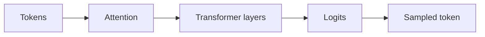

# 4.5 — Inference and Sampling

*Book 4: Transformers and Foundation Models · Read 25 min · Worked example 20 min · Code/design practice 45–60 min · Review 10 min*

## Before you begin

- Books 1–3
- Matrix multiplication intuition
- Neural-network basics

If a prerequisite is unfamiliar, use site search and read only enough to explain it and complete a small example. Do not block progress by mastering every upstream topic first.

## Why this chapter exists

Trace logits, softmax, temperature, top-k, top-p, streaming, batching, KV cache, prefix cache, and speculative decoding.

The engineering objective is not to memorize vocabulary. By the end, you should be able to describe the mechanism, build or inspect a small implementation, recognize its failure modes, and decide where it belongs in a larger system.

## Learning objectives

- Explain why inference and sampling matters using the chapter scenario, not abstract definitions alone.
- Trace how **logits** and **sampling** interact in the book-level visual.
- Implement or design the bounded practice while holding evaluation cases fixed.
- Diagnose at least two failure modes specific to batching.
- Decide where this chapter's mechanism belongs in a production architecture and what evidence justifies it.

!!! note "Enduring principle"
    Generation is repeated conditional prediction shaped by decoding and system context.

## Mental model



Read the visual from left to right, then trace failures from right to left. The diagram is a book-level map; this chapter explains how **inference and sampling** changes one or more transitions.

## Core concepts

The concepts form a system, not a vocabulary list. Read each section below before attempting the practice exercise.

### Logits

Logits are raw pre-softmax scores over the vocabulary for the next token. Decoding policies—temperature, top-k—operate on logits before sampling. See the [Logits concept card](../../concepts/cards/logits.md).

**Example:** Inspecting logits reveals whether the model hesitates between two equally likely tokens.

**Evidence of understanding:** Log top-5 logits for ten prompts and verify sampling changes when temperature increases.

### Sampling

Sampling draws next tokens from the predicted distribution rather than always taking the argmax. It enables diverse outputs but introduces nondeterminism unless seeded. See the [Sampling concept card](../../concepts/cards/sampling.md).

**Example:** Creative writing uses sampling; factual extraction often uses greedy or low-temperature decoding.

**Evidence of understanding:** Generate 20 completions at temperature 0 versus 1 and measure factual consistency.

### Temperature

Temperature scales logits before softmax—lower sharpens the distribution (more deterministic), higher flattens it (more random). It is a primary creativity-versus-consistency knob. See the [Temperature concept card](../../concepts/cards/temperature.md).

**Example:** Temperature 0.2 keeps support answers stable; 1.2 increases phrasing variety for marketing copy.

**Evidence of understanding:** Plot entropy of next-token distribution versus temperature on a fixed prompt set.

### Kv Cache

The KV cache stores key and value tensors for prior tokens during autoregressive decoding, avoiding recomputation of the prefix. Memory grows linearly with context length. See the [Kv Cache concept card](../../concepts/cards/kv-cache.md).

**Example:** Streaming chat reuses cached states for system prompt and prior turns, cutting latency after the first token.

**Evidence of understanding:** Compare tokens-per-second with and without KV cache on a 2k-token prefix.

### Batching

Batching groups requests to amortize GPU kernel overhead, improving throughput at possible latency cost. Continuous batching in servers interleaves sequences of different lengths. See the [Batching concept card](../../concepts/cards/batching.md).

**Example:** Batch size 32 may double throughput versus batch 1 but increase p95 latency for short prompts.

**Evidence of understanding:** Load-test at concurrency 1, 8, and 32; report throughput and p95 latency.

## Worked example

**Book scenario:** A team must explain why decoding settings change model output and latency.

**Situation:** A team must explain why decoding settings change model output and latency when serving incident summaries from a local model.

**Baseline:** Greedy decoding (argmax) only—deterministic but often repetitive.

**Application:** Build sampling playground: logits → temperature-scaled softmax → top-k and top-p filters; simulate KV cache hit on repeated prefix tokens; compare tokens/sec with and without cache.

**Test cases:** (1) Normal: temperature=0.7, top_p=0.9. (2) Boundary: temperature→0 approaches greedy. (3) Adversarial: top_k=1 still stochastic if temperature high.

**Measurement:** Output diversity (distinct n-grams), latency per token, cache memory vs prefix length.

**Design question:** When does KV caching stop helping because the prefix changes every request?

## Chapter hook

Run this short snippet first to anchor **inference and sampling** before the book-level sample:

```python
import random
logits = [2.0, 1.0, 0.5, 0.1]
def sample_temp(logits, temp=1.0):
    scaled = [l/temp for l in logits]
    m = max(scaled)
    ex = [math.exp(l-m) for l in scaled]
    s = sum(ex)
    probs = [e/s for e in ex]
    r = random.random()
    c = 0
    for i, p in enumerate(probs):
        c += p
        if r <= c:
            return i, probs
    return len(probs)-1, probs
import math
idx, probs = sample_temp(logits, temp=0.8)
print({"sampled_index": idx, "probs": [round(p, 3) for p in probs]})
```

Predict the printed values, then change one line tied to **logits** or **sampling** and observe how the chapter mechanism moves.

## Runnable code sample

The following dependency-free sample supports this book. Download it from the [code-sample library](../../code-samples/04-attention-sampling.py) or run the matching file under `examples/`.

```python
--8<-- "docs/code-samples/04-attention-sampling.py"
```

Expected output is printed to the terminal. Before running it, predict which values or decisions should change. Then introduce one failure and convert the observation into a test.

??? success "Expected observation"
    The query-aligned value receives more attention, and lower temperature concentrates the sampling distribution.

This is a **book-level sample**. Its relevance to this chapter is the boundary between **logits** and **sampling**. Modify that boundary, not unrelated lines, when completing the chapter exercise.

## Engineering practice

**Build:** Build a sampling playground and compare decoding strategies.

Work in three passes tailored to this chapter:

1. **Baseline:** Implement the task without logits and record quality, latency, and failure cases.
2. **Mechanism:** Add sampling while keeping inputs and evaluation fixed; note what changed in intermediate state.
3. **Judgment:** Compare outcomes on normal, boundary, and adversarial cases; document when inference and sampling earns its operational cost.

Capture assumptions, test cases, results, and one architecture decision record. A successful lab explains *why* behavior changed, not merely that the program ran.

## Spec-driven habit

Every chapter lab pairs reading with **executable acceptance**. Before implementing book 4.5 — inference and sampling:

1. Draft cases in `test_lab.py` or `specs/lab-0405.yaml`.
2. Use [Cursor Plan/Agent](https://cursor.com/) with "read spec first, then minimal diff".
3. Or use [OpenSpec](https://openspec.dev/) `/opsx:propose` so requirements live in `openspec/` next to code.

→ [Spec-driven workflow guide](../../getting-started/spec-driven-workflow.md) · [Lab 4.5](../../labs/0405-inference-and-sampling.md)


## Architecture lens

For a production design in **Transformers and Foundation Models**, make the following explicit for **inference and sampling**:

| Concern | Question to answer |
|---|---|
| **Ownership** | Which service owns logits versus downstream consumers of its output? |
| **Contract** | What typed inputs, outputs, errors, and version does the temperature boundary expose? |
| **Evidence** | Which eval slices prove inference and sampling meets requirements before and after each release? |
| **Security** | What untrusted data crosses the batching boundary and how is it sanitized or authorized? |
| **Operations** | What is logged at this chapter's transition, what triggers retry or rollback, and what is cached? |
| **Economics** | Which resource—tokens, retrieval calls, GPU seconds, human review—dominates cost for this mechanism? |

## Failure clinic

Reproduce failures at the chapter boundary—do not debug only final output.

| Failure | Symptom | Likely cause | First response |
|---|---|---|---|
| **Baseline illusion** | The system looks fine on demo prompts but fails on the book scenario | Evaluation cases do not cover logits or sampling | Add the chapter's normal, boundary, and adversarial cases before tuning |
| **Mechanism mismatch** | Adding complexity does not improve the measured outcome | inference and sampling is applied at the wrong layer or without fixing inputs | Trace the book visual and verify the transition this chapter owns |
| **Silent degradation** | Outputs remain fluent while decisions become wrong | Failure in batching without observability at that boundary | Log intermediate state, version config, and compare against the baseline |
| **Operational drift** | Quality changes after deploy though prompts are unchanged | Data, permissions, or upstream logits behavior shifted | Pin versions, inspect ingestion and policy filters, re-run slice evals |

Trace logits, softmax, temperature, top-k, top-p, streaming, batching, KV cache, prefix cache, and speculative decoding. When triaging, preserve full inputs, retrieved evidence, tool traces, and model or index versions.

## Evolution lens

- **Yesterday:** Manual playbooks, brittle rules, or single-pass models handled parts of inference and sampling without explicit logits.
- **Today:** Engineering teams implement inference and sampling as testable components with baselines, typed boundaries, and stage-specific evaluation.
- **Tomorrow:** Better automation may reduce toil, but batching and governance constraints will still require explicit design.
- **What survives:** Generation is repeated conditional prediction shaped by decoding and system context.

## Knowledge check

1. How does temperature change the sampling distribution?
2. Why does KV cache reduce latency in autoregressive decoding?
3. What decoding baseline removes all randomness?

??? question "Answer guidance"
    Q1: Lower temp sharpens distribution toward argmax; higher flattens it. Q2: Prefix keys/values reused instead of recomputed each step. Q3: Greedy argmax at temperature 0.

## Mastery questions

??? tip "Model answers (proficient level)"
        1. **Explain logits without jargon and give a counterexample.**
       *Proficient answer:* logits are raw pre-softmax scores over the vocabulary for the next token. Counterexample: applying it when the task is fully deterministic and cheaper to hard-code.
    2. **Compare sampling with batching using quality, cost, latency, and risk.**
       *Proficient answer:* sampling draws next tokens from the predicted distribution rather than always taking the argmax; batching groups requests to amortize gpu kernel overhead, improving throughput at possible latency cost. Trade quality gains against operational and security cost on the chapter scenario.
    3. **Design a minimal experiment that tests the chapter's central claim.**
       *Proficient answer:* Fix a baseline and three cases (normal, boundary, adversarial). Add only the chapter mechanism, measure one task metric plus cost/latency, and pre-register what result would falsify the claim.
    4. **Identify which component should own validation, authorization, and observability.**
       *Proficient answer:* Validation belongs at the typed boundary after sampling; authorization before any side effect or retrieval of restricted data; observability at the transition inference and sampling introduces in the book visual.
    5. **State what would remain true if today's leading libraries and vendors disappeared.**
       *Proficient answer:* Generation is repeated conditional prediction shaped by decoding and system context.

## Self-assessment rubric

| Level | Evidence |
|---|---|
| Not yet | Can repeat terms but cannot trace the visual or predict the sample. |
| Developing | Can explain the mechanism and complete the normal case with help. |
| Proficient | Can implement the exercise, diagnose a failure, and compare a baseline. |
| Transfer | Can defend an architecture choice in a new domain with evaluation evidence. |

## Evidence and further study

- Vaswani et al. — Attention Is All You Need
- Devlin et al. — BERT
- Brown et al. — Language Models are Few-Shot Learners

Use primary sources for technical claims and official documentation for current product behavior. Record the version or access date for evolving material.

## Continue

Return to the [book index](index.md) or use site search to follow the chapter's concepts into the knowledge-area and reference pages.
