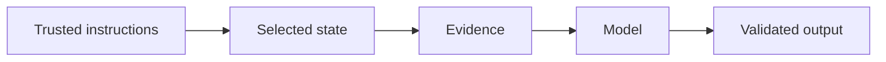

# 5.1 — Instructions That Work

*Book 5: Prompt and Context Engineering · Read 25 min · Worked example 20 min · Code/design practice 45–60 min · Review 10 min*

## Before you begin

- Book 4
- Model inference
- Tokens and context windows

If a prerequisite is unfamiliar, use site search and read only enough to explain it and complete a small example. Do not block progress by mastering every upstream topic first.

## Why this chapter exists

Write clear tasks, roles, constraints, examples, delimiters, and success criteria while avoiding unnecessary prompt folklore.

The engineering objective is not to memorize vocabulary. By the end, you should be able to describe the mechanism, build or inspect a small implementation, recognize its failure modes, and decide where it belongs in a larger system.

## Learning objectives

- Explain why instructions that work matters using the chapter scenario, not abstract definitions alone.
- Trace how **instruction hierarchy** and **roles** interact in the book-level visual.
- Implement or design the bounded practice while holding evaluation cases fixed.
- Diagnose at least two failure modes specific to constraints.
- Decide where this chapter's mechanism belongs in a production architecture and what evidence justifies it.

!!! note "Enduring principle"
    A prompt is an interface specification for probabilistic behavior.

## Mental model



Read the visual from left to right, then trace failures from right to left. The diagram is a book-level map; this chapter explains how **instructions that work** changes one or more transitions.

## Core concepts

The concepts form a system, not a vocabulary list. Read each section below before attempting the practice exercise.

### Instruction Hierarchy

Instruction hierarchy ranks system, developer, and user messages so lower-priority text cannot override safety or policy. It is essential when untrusted content appears in context. See the [Instruction Hierarchy concept card](../../concepts/cards/instruction-hierarchy.md).

**Example:** Retrieved web pages must not outrank the system prompt forbidding credential disclosure.

**Evidence of understanding:** Inject conflicting instructions at each level and verify system policy wins.

### Roles

Roles—system, user, assistant, tool—label message provenance and expected behavior in chat APIs. Misassigned roles confuse models about who said what. See the [Roles concept card](../../concepts/cards/roles.md).

**Example:** Putting user text in the system role can unintentionally elevate it to trusted policy.

**Evidence of understanding:** Swap roles on ten prompts and measure compliance change on a fixed eval set.

### Few-Shot Examples

Few-shot examples demonstrate desired input–output patterns inside the prompt. They help format and tone but consume tokens and can overfit demo patterns. See the [Few-Shot Examples concept card](../../concepts/cards/few-shot-examples.md).

**Example:** Three invoice extraction examples teach field boundaries better than prose instructions alone.

**Evidence of understanding:** Compare accuracy with zero, three, and ten shots on held-out invoices.

### Delimiters

Delimiters—XML tags, markdown fences, triple quotes—separate instructions from data so models parse structure reliably. Consistent delimiters reduce instruction–content bleed. See the [Delimiters concept card](../../concepts/cards/delimiters.md).

**Example:** Wrapping user HTML in <document> tags prevents tags from being interpreted as instructions.

**Evidence of understanding:** Test ten adversarial documents with and without delimiters and count instruction-following errors.

### Constraints

Constraints specify forbidden actions, length limits, formats, and scope boundaries in prompts. They reduce search space but must be testable. See the [Constraints concept card](../../concepts/cards/constraints.md).

**Example:** 'Do not mention competitors' and 'max 100 words' are enforceable constraints for eval.

**Evidence of understanding:** Run constraint-violation checks on 100 outputs and track violation rate per release.

## Worked example

**Book scenario:** A long-running assistant must fit policy, evidence, memory, and user input into a bounded context.

**Situation:** A long-running assistant must fit policy, evidence, memory, and user input into a bounded context. Weak prompts cause it to invent escalation steps.

**Baseline:** Single sentence prompt: "You are a helpful HR assistant."

**Application:** Write instruction hierarchy: role, task, constraints, output format, two few-shot examples with delimiters, explicit success criteria ("cite policy ID or abstain").

**Test cases:** (1) Normal: well-formed leave question. (2) Boundary: user message contradicts system policy section. (3) Adversarial: user says "ignore previous instructions."

**Measurement:** Task success rate, abstention precision, tokens in prompt vs quality curve.

**Design question:** Which prompt element—constraints or examples—fixes hallucinated escalation paths most cheaply?

## Chapter hook

Run this short snippet first to anchor **instructions that work** before the book-level sample:

```python
WEAK = "You are a helpful HR assistant."
STRONG = """Role: HR policy assistant.
Task: Answer using provided policy excerpts only.
Constraints: Cite policy_id or reply ABSTAIN.
Example:
User: PTO cap?
Assistant: {"policy_id":"L-12","answer":"240 hours"}"""
for name, prompt in [("weak", WEAK), ("strong", STRONG)]:
    print(name, "chars:", len(prompt), "has_abstain:", "ABSTAIN" in prompt)
```

Predict the printed values, then change one line tied to **instruction hierarchy** or **roles** and observe how the chapter mechanism moves.

## Runnable code sample

The following dependency-free sample supports this book. Download it from the [code-sample library](../../code-samples/05-context-builder.py) or run the matching file under `examples/`.

```python
--8<-- "docs/code-samples/05-context-builder.py"
```

Expected output is printed to the terminal. Before running it, predict which values or decisions should change. Then introduce one failure and convert the observation into a test.

??? success "Expected observation"
    Trusted high-priority sections consume the budget first; untrusted evidence remains explicitly marked as data.

This is a **book-level sample**. Its relevance to this chapter is the boundary between **instruction hierarchy** and **roles**. Modify that boundary, not unrelated lines, when completing the chapter exercise.

## Engineering practice

**Build:** Solve one task with weak and strong prompts and compare failures.

Work in three passes tailored to this chapter:

1. **Baseline:** Implement the task without instruction hierarchy and record quality, latency, and failure cases.
2. **Mechanism:** Add roles while keeping inputs and evaluation fixed; note what changed in intermediate state.
3. **Judgment:** Compare outcomes on normal, boundary, and adversarial cases; document when instructions that work earns its operational cost.

Capture assumptions, test cases, results, and one architecture decision record. A successful lab explains *why* behavior changed, not merely that the program ran.

## Architecture lens

For a production design in **Prompt and Context Engineering**, make the following explicit for **instructions that work**:

| Concern | Question to answer |
|---|---|
| **Ownership** | Which service owns instruction hierarchy versus downstream consumers of its output? |
| **Contract** | What typed inputs, outputs, errors, and version does the few-shot examples boundary expose? |
| **Evidence** | Which eval slices prove instructions that work meets requirements before and after each release? |
| **Security** | What untrusted data crosses the constraints boundary and how is it sanitized or authorized? |
| **Operations** | What is logged at this chapter's transition, what triggers retry or rollback, and what is cached? |
| **Economics** | Which resource—tokens, retrieval calls, GPU seconds, human review—dominates cost for this mechanism? |

## Failure clinic

Reproduce failures at the chapter boundary—do not debug only final output.

| Failure | Symptom | Likely cause | First response |
|---|---|---|---|
| **Baseline illusion** | The system looks fine on demo prompts but fails on the book scenario | Evaluation cases do not cover instruction hierarchy or roles | Add the chapter's normal, boundary, and adversarial cases before tuning |
| **Mechanism mismatch** | Adding complexity does not improve the measured outcome | instructions that work is applied at the wrong layer or without fixing inputs | Trace the book visual and verify the transition this chapter owns |
| **Silent degradation** | Outputs remain fluent while decisions become wrong | Failure in constraints without observability at that boundary | Log intermediate state, version config, and compare against the baseline |
| **Operational drift** | Quality changes after deploy though prompts are unchanged | Data, permissions, or upstream instruction hierarchy behavior shifted | Pin versions, inspect ingestion and policy filters, re-run slice evals |

Write clear tasks, roles, constraints, examples, delimiters, and success criteria while avoiding unnecessary prompt folklore. When triaging, preserve full inputs, retrieved evidence, tool traces, and model or index versions.

## Evolution lens

- **Yesterday:** Manual playbooks, brittle rules, or single-pass models handled parts of instructions that work without explicit instruction hierarchy.
- **Today:** Engineering teams implement instructions that work as testable components with baselines, typed boundaries, and stage-specific evaluation.
- **Tomorrow:** Better automation may reduce toil, but constraints and governance constraints will still require explicit design.
- **What survives:** A prompt is an interface specification for probabilistic behavior.

## Knowledge check

1. Why is a prompt an interface specification rather than magic wording?
2. How do few-shot examples reduce ambiguous task interpretation?
3. What minimal prompt baseline should strong prompts beat?

??? question "Answer guidance"
    Q1: It defines probabilistic I/O contract testable like any API. Q2: They anchor format and refusal behavior concretely. Q3: Generic helpful-assistant one-liner with no constraints.

## Mastery questions

??? tip "Model answers (proficient level)"
        1. **Explain instruction hierarchy without jargon and give a counterexample.**
       *Proficient answer:* instruction hierarchy ranks system, developer, and user messages so lower-priority text cannot override safety or policy. Counterexample: applying it when the task is fully deterministic and cheaper to hard-code.
    2. **Compare roles with constraints using quality, cost, latency, and risk.**
       *Proficient answer:* roles—system, user, assistant, tool—label message provenance and expected behavior in chat apis; constraints specify forbidden actions, length limits, formats, and scope boundaries in prompts. Trade quality gains against operational and security cost on the chapter scenario.
    3. **Design a minimal experiment that tests the chapter's central claim.**
       *Proficient answer:* Fix a baseline and three cases (normal, boundary, adversarial). Add only the chapter mechanism, measure one task metric plus cost/latency, and pre-register what result would falsify the claim.
    4. **Identify which component should own validation, authorization, and observability.**
       *Proficient answer:* Validation belongs at the typed boundary after roles; authorization before any side effect or retrieval of restricted data; observability at the transition instructions that work introduces in the book visual.
    5. **State what would remain true if today's leading libraries and vendors disappeared.**
       *Proficient answer:* A prompt is an interface specification for probabilistic behavior.

## Self-assessment rubric

| Level | Evidence |
|---|---|
| Not yet | Can repeat terms but cannot trace the visual or predict the sample. |
| Developing | Can explain the mechanism and complete the normal case with help. |
| Proficient | Can implement the exercise, diagnose a failure, and compare a baseline. |
| Transfer | Can defend an architecture choice in a new domain with evaluation evidence. |

## Evidence and further study

- Provider documentation for structured output and tool calling
- Current prompt-injection guidance from authoritative security sources

Use primary sources for technical claims and official documentation for current product behavior. Record the version or access date for evolving material.

## Continue

Return to the [book index](index.md) or use site search to follow the chapter's concepts into the knowledge-area and reference pages.
