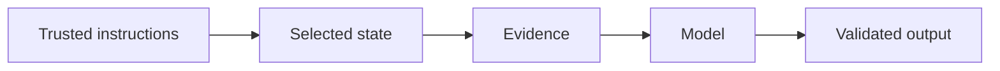

# 5.2 — Structured Generation

*Book 5: Prompt and Context Engineering · Read 25 min · Worked example 20 min · Code/design practice 45–60 min · Review 10 min*

## Before you begin

- Book 4
- Model inference
- Tokens and context windows

If a prerequisite is unfamiliar, use site search and read only enough to explain it and complete a small example. Do not block progress by mastering every upstream topic first.

## Why this chapter exists

Use schemas, constrained decoding, validation, repair, retries, and typed application boundaries.

The engineering objective is not to memorize vocabulary. By the end, you should be able to describe the mechanism, build or inspect a small implementation, recognize its failure modes, and decide where it belongs in a larger system.

## Learning objectives

- Explain why structured generation matters using the chapter scenario, not abstract definitions alone.
- Trace how **JSON Schema** and **structured output** interact in the book-level visual.
- Implement or design the bounded practice while holding evaluation cases fixed.
- Diagnose at least two failure modes specific to retries.
- Decide where this chapter's mechanism belongs in a production architecture and what evidence justifies it.

!!! note "Enduring principle"
    Free-form model output must become validated data before software trusts it.

## Mental model



Read the visual from left to right, then trace failures from right to left. The diagram is a book-level map; this chapter explains how **structured generation** changes one or more transitions.

## Core concepts

The concepts form a system, not a vocabulary list. Read each section below before attempting the practice exercise.

### Json Schema

JSON Schema declares required fields, types, and constraints that validators enforce after model generation. It turns free-form text into typed data boundaries. See the [Json Schema concept card](../../concepts/cards/json-schema.md).

**Example:** Rejecting payloads where 'total' is a string prevents silent accounting errors from plausible JSON.

**Evidence of understanding:** Validate three intentionally invalid payloads and confirm distinct error reasons.

### Structured Output

Structured output forces models to emit machine-parseable formats—JSON, XML, tool calls—via prompting or constrained decoding. Parsers must still validate because models can violate schema. See the [Structured Output concept card](../../concepts/cards/structured-output.md).

**Example:** An invoice extractor returns JSON fields consumed directly by ERP ingestion.

**Evidence of understanding:** Measure schema pass rate on 200 adversarial and normal inputs post-generation.

### Validation

Validation checks model outputs against schemas, business rules, and safety policies before downstream use. It belongs in application code, not trust in model compliance. See the [Validation concept card](../../concepts/cards/validation.md).

**Example:** A date field must parse as ISO-8601 and fall within contract term bounds.

**Evidence of understanding:** Define ten validation rules and report pass rate on production sample weekly.

### Repair

Repair loops attempt to fix invalid model outputs—re-prompting with errors, partial parsing, or constrained retries. They improve yield but add latency and cost. See the [Repair concept card](../../concepts/cards/repair.md).

**Example:** When JSON is malformed, a repair prompt includes the parse error and asks for correction.

**Evidence of understanding:** Track repair success rate and average extra tokens per successful repair.

### Retries

Retries re-invoke models or tools after transient failures or validation misses, with backoff and limits. Unbounded retries cause runaway cost and duplicate side effects. See the [Retries concept card](../../concepts/cards/retries.md).

**Example:** Three retries with exponential backoff on 429 rate limits recover most requests without overload.

**Evidence of understanding:** Cap retries at N and measure success rate versus total token spend.

## Worked example

**Book scenario:** A long-running assistant must fit policy, evidence, memory, and user input into a bounded context.

**Situation:** Finance wants invoice fields extracted from email text into ERP JSON; free-form model output breaks downstream automation.

**Baseline:** Ask model to "return JSON" without schema—malformed keys and string amounts.

**Application:** Define JSON Schema, use constrained decoding or parse-repair loop, validate types, retry with error feedback, wrap in typed application boundary raising on invalid payloads.

**Test cases:** (1) Normal: well-formed invoice email. (2) Boundary: missing optional field. (3) Adversarial: extra fields attempting SQL injection in string values.

**Measurement:** Schema validation pass rate, repair attempts per doc, ERP import error rate.

**Design question:** Where should validation live—inside the model prompt or in application code after generation?

## Chapter hook

Run this short snippet first to anchor **structured generation** before the book-level sample:

```python
schema = {"type": "object", "required": ["total"], "properties": {"total": {"type": "number"}}}
payloads = [{"total": 12.5}, {"total": "12.50"}, {"total": 12.5, "note": "'; DROP TABLE--"}]
def validate(p):
    if not isinstance(p.get("total"), (int, float)):
        return False, "total must be numeric"
    return True, "ok"
for p in payloads:
    ok, msg = validate(p)
    print({"payload": p, "valid": ok, "msg": msg})
```

Predict the printed values, then change one line tied to **JSON Schema** or **structured output** and observe how the chapter mechanism moves.

## Runnable code sample

The following dependency-free sample supports this book. Download it from the [code-sample library](../../code-samples/05-context-builder.py) or run the matching file under `examples/`.

```python
--8<-- "docs/code-samples/05-context-builder.py"
```

Expected output is printed to the terminal. Before running it, predict which values or decisions should change. Then introduce one failure and convert the observation into a test.

??? success "Expected observation"
    Trusted high-priority sections consume the budget first; untrusted evidence remains explicitly marked as data.

This is a **book-level sample**. Its relevance to this chapter is the boundary between **JSON Schema** and **structured output**. Modify that boundary, not unrelated lines, when completing the chapter exercise.

## Engineering practice

**Build:** Build an invoice extractor with schema validation and adversarial inputs.

Work in three passes tailored to this chapter:

1. **Baseline:** Implement the task without json schema and record quality, latency, and failure cases.
2. **Mechanism:** Add structured output while keeping inputs and evaluation fixed; note what changed in intermediate state.
3. **Judgment:** Compare outcomes on normal, boundary, and adversarial cases; document when structured generation earns its operational cost.

Capture assumptions, test cases, results, and one architecture decision record. A successful lab explains *why* behavior changed, not merely that the program ran.

## Architecture lens

For a production design in **Prompt and Context Engineering**, make the following explicit for **structured generation**:

| Concern | Question to answer |
|---|---|
| **Ownership** | Which service owns json schema versus downstream consumers of its output? |
| **Contract** | What typed inputs, outputs, errors, and version does the validation boundary expose? |
| **Evidence** | Which eval slices prove structured generation meets requirements before and after each release? |
| **Security** | What untrusted data crosses the retries boundary and how is it sanitized or authorized? |
| **Operations** | What is logged at this chapter's transition, what triggers retry or rollback, and what is cached? |
| **Economics** | Which resource—tokens, retrieval calls, GPU seconds, human review—dominates cost for this mechanism? |

## Failure clinic

Reproduce failures at the chapter boundary—do not debug only final output.

| Failure | Symptom | Likely cause | First response |
|---|---|---|---|
| **Baseline illusion** | The system looks fine on demo prompts but fails on the book scenario | Evaluation cases do not cover json schema or structured output | Add the chapter's normal, boundary, and adversarial cases before tuning |
| **Mechanism mismatch** | Adding complexity does not improve the measured outcome | structured generation is applied at the wrong layer or without fixing inputs | Trace the book visual and verify the transition this chapter owns |
| **Silent degradation** | Outputs remain fluent while decisions become wrong | Failure in retries without observability at that boundary | Log intermediate state, version config, and compare against the baseline |
| **Operational drift** | Quality changes after deploy though prompts are unchanged | Data, permissions, or upstream json schema behavior shifted | Pin versions, inspect ingestion and policy filters, re-run slice evals |

Use schemas, constrained decoding, validation, repair, retries, and typed application boundaries. When triaging, preserve full inputs, retrieved evidence, tool traces, and model or index versions.

## Evolution lens

- **Yesterday:** Manual playbooks, brittle rules, or single-pass models handled parts of structured generation without explicit json schema.
- **Today:** Engineering teams implement structured generation as testable components with baselines, typed boundaries, and stage-specific evaluation.
- **Tomorrow:** Better automation may reduce toil, but retries and governance constraints will still require explicit design.
- **What survives:** Free-form model output must become validated data before software trusts it.

## Knowledge check

1. Why must free-form output become validated data before software trusts it?
2. How do repair loops differ from hoping the model self-corrects silently?
3. What baseline skips schema validation entirely?

??? question "Answer guidance"
    Q1: Models emit syntactic and type errors; downstream systems need contracts. Q2: Repairs log failures and feed errors back explicitly. Q3: Regex extract with no type checks.

## Mastery questions

??? tip "Model answers (proficient level)"
        1. **Explain JSON Schema without jargon and give a counterexample.**
       *Proficient answer:* json schema declares required fields, types, and constraints that validators enforce after model generation. Counterexample: applying it when the task is fully deterministic and cheaper to hard-code.
    2. **Compare structured output with retries using quality, cost, latency, and risk.**
       *Proficient answer:* structured output forces models to emit machine-parseable formats—json, xml, tool calls—via prompting or constrained decoding; retries re-invoke models or tools after transient failures or validation misses, with backoff and limits. Trade quality gains against operational and security cost on the chapter scenario.
    3. **Design a minimal experiment that tests the chapter's central claim.**
       *Proficient answer:* Fix a baseline and three cases (normal, boundary, adversarial). Add only the chapter mechanism, measure one task metric plus cost/latency, and pre-register what result would falsify the claim.
    4. **Identify which component should own validation, authorization, and observability.**
       *Proficient answer:* Validation belongs at the typed boundary after structured output; authorization before any side effect or retrieval of restricted data; observability at the transition structured generation introduces in the book visual.
    5. **State what would remain true if today's leading libraries and vendors disappeared.**
       *Proficient answer:* Free-form model output must become validated data before software trusts it.

## Self-assessment rubric

| Level | Evidence |
|---|---|
| Not yet | Can repeat terms but cannot trace the visual or predict the sample. |
| Developing | Can explain the mechanism and complete the normal case with help. |
| Proficient | Can implement the exercise, diagnose a failure, and compare a baseline. |
| Transfer | Can defend an architecture choice in a new domain with evaluation evidence. |

## Evidence and further study

- Provider documentation for structured output and tool calling
- Current prompt-injection guidance from authoritative security sources

Use primary sources for technical claims and official documentation for current product behavior. Record the version or access date for evolving material.

## Continue

Return to the [book index](index.md) or use site search to follow the chapter's concepts into the knowledge-area and reference pages.
