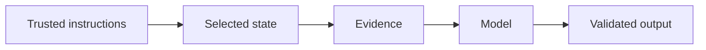

# 5.3 — Context Construction

*Book 5: Prompt and Context Engineering · Read 25 min · Worked example 20 min · Code/design practice 45–60 min · Review 10 min*

## Before you begin

- Book 4
- Model inference
- Tokens and context windows

If a prerequisite is unfamiliar, use site search and read only enough to explain it and complete a small example. Do not block progress by mastering every upstream topic first.

## Why this chapter exists

Assemble instructions, user input, state, evidence, tools, and examples under priority and token constraints.

The engineering objective is not to memorize vocabulary. By the end, you should be able to describe the mechanism, build or inspect a small implementation, recognize its failure modes, and decide where it belongs in a larger system.

## Learning objectives

- Explain why context construction matters using the chapter scenario, not abstract definitions alone.
- Trace how **context windows** and **token budgeting** interact in the book-level visual.
- Implement or design the bounded practice while holding evaluation cases fixed.
- Diagnose at least two failure modes specific to context assembly.
- Decide where this chapter's mechanism belongs in a production architecture and what evidence justifies it.

!!! note "Enduring principle"
    Context is a scarce, ordered working set—not a dumping ground.

## Mental model



Read the visual from left to right, then trace failures from right to left. The diagram is a book-level map; this chapter explains how **context construction** changes one or more transitions.

## Core concepts

The concepts form a system, not a vocabulary list. Read each section below before attempting the practice exercise.

### Context Windows

Context windows cap tokens the model attends to in one forward pass—prompt, evidence, tools, and output compete for this budget. See the [Context Windows concept card](../../concepts/cards/context-windows.md).

**Example:** A 128k window still requires prioritization when ten long documents are retrieved.

**Evidence of understanding:** Measure task quality versus tokens used and find the knee of the curve for your workload.

### Token Budgeting

Token budgeting allocates fixed slices of the context window to system, history, evidence, and completion. Explicit budgets prevent silent truncation of critical sections. See the [Token Budgeting concept card](../../concepts/cards/token-budgeting.md).

**Example:** Reserving 500 tokens for output ensures answers are not cut mid-sentence when evidence fills the window.

**Evidence of understanding:** Log per-section token usage and alert when system prompt exceeds 10% of window.

### Ranking

Ranking orders candidates—retrieved passages or context sections—by relevance, recency, or priority before the model sees them. Final order determines what fits in the token budget and what the model can cite. See the [Ranking concept card](../../concepts/cards/ranking.md).

**Example:** Reranking retrieved chunks by cross-encoder score beats vector order alone for policy QA.

**Evidence of understanding:** Compare nDCG@5 or answer faithfulness before and after reranking at equal token budget.

### Compression

Context compression summarizes, extracts, or prunes evidence to fit token limits while preserving decision-critical facts. Lossy compression can drop citations or qualifiers. See the [Compression concept card](../../concepts/cards/compression.md).

**Example:** Summarizing ten pages into bullet points may omit exception clauses unless extraction is structured.

**Evidence of understanding:** Measure citation recall and answer correctness before and after compression at fixed budget.

### Context Assembly

Context assembly is the pipeline that gathers instructions, state, evidence, tools, and examples into the final prompt. Order and separation affect model behavior. See the [Context Assembly concept card](../../concepts/cards/context-assembly.md).

**Example:** Placing evidence after instructions but before the user question reduces instruction drift in long contexts.

**Evidence of understanding:** Trace one request's assembly stages and verify each section matches the spec template.

## Worked example

**Book scenario:** A long-running assistant must fit policy, evidence, memory, and user input into a bounded context.

**Situation:** The assistant must assemble instructions, retrieved policies, tool results, and chat history within an 8k token budget without dropping authorization context.

**Baseline:** Concatenate everything in arrival order until truncation.

**Application:** Implement context builder with section priorities (system > auth > evidence > user), per-section token budgets, compression for old turns, and explicit untrusted markers on retrieved text.

**Test cases:** (1) Normal: medium history and two policy chunks. (2) Boundary: exactly at budget limit. (3) Adversarial: oversized retrieved doc attempting to push out system instructions.

**Measurement:** Task success vs total tokens; which section got truncated in failures; latency of assembly step.

**Design question:** Which section would you never compress, even when over budget?

## Chapter hook

Run this short snippet first to anchor **context construction** before the book-level sample:

```python
BUDGET = 100
sections = [("system", 30, 1), ("auth", 20, 1), ("evidence", 80, 2), ("user", 40, 3)]
sections.sort(key=lambda x: x[2])
used = 0
packed = []
for name, tokens, _prio in sections:
    allow = min(tokens, BUDGET - used)
    if allow <= 0:
        packed.append((name, "TRUNCATED"))
    else:
        packed.append((name, allow))
        used += allow
print({"budget": BUDGET, "packed": packed, "used": used})
```

Predict the printed values, then change one line tied to **context windows** or **token budgeting** and observe how the chapter mechanism moves.

## Runnable code sample

The following dependency-free sample supports this book. Download it from the [code-sample library](../../code-samples/05-context-builder.py) or run the matching file under `examples/`.

```python
--8<-- "docs/code-samples/05-context-builder.py"
```

Expected output is printed to the terminal. Before running it, predict which values or decisions should change. Then introduce one failure and convert the observation into a test.

??? success "Expected observation"
    Trusted high-priority sections consume the budget first; untrusted evidence remains explicitly marked as data.

This is a **book-level sample**. Its relevance to this chapter is the boundary between **context windows** and **token budgeting**. Modify that boundary, not unrelated lines, when completing the chapter exercise.

## Engineering practice

**Build:** Implement a context builder with explicit section budgets.

Work in three passes tailored to this chapter:

1. **Baseline:** Implement the task without context windows and record quality, latency, and failure cases.
2. **Mechanism:** Add token budgeting while keeping inputs and evaluation fixed; note what changed in intermediate state.
3. **Judgment:** Compare outcomes on normal, boundary, and adversarial cases; document when context construction earns its operational cost.

Capture assumptions, test cases, results, and one architecture decision record. A successful lab explains *why* behavior changed, not merely that the program ran.

## Architecture lens

For a production design in **Prompt and Context Engineering**, make the following explicit for **context construction**:

| Concern | Question to answer |
|---|---|
| **Ownership** | Which service owns context windows versus downstream consumers of its output? |
| **Contract** | What typed inputs, outputs, errors, and version does the ranking boundary expose? |
| **Evidence** | Which eval slices prove context construction meets requirements before and after each release? |
| **Security** | What untrusted data crosses the context assembly boundary and how is it sanitized or authorized? |
| **Operations** | What is logged at this chapter's transition, what triggers retry or rollback, and what is cached? |
| **Economics** | Which resource—tokens, retrieval calls, GPU seconds, human review—dominates cost for this mechanism? |

## Failure clinic

Reproduce failures at the chapter boundary—do not debug only final output.

| Failure | Symptom | Likely cause | First response |
|---|---|---|---|
| **Baseline illusion** | The system looks fine on demo prompts but fails on the book scenario | Evaluation cases do not cover context windows or token budgeting | Add the chapter's normal, boundary, and adversarial cases before tuning |
| **Mechanism mismatch** | Adding complexity does not improve the measured outcome | context construction is applied at the wrong layer or without fixing inputs | Trace the book visual and verify the transition this chapter owns |
| **Silent degradation** | Outputs remain fluent while decisions become wrong | Failure in context assembly without observability at that boundary | Log intermediate state, version config, and compare against the baseline |
| **Operational drift** | Quality changes after deploy though prompts are unchanged | Data, permissions, or upstream context windows behavior shifted | Pin versions, inspect ingestion and policy filters, re-run slice evals |

Assemble instructions, user input, state, evidence, tools, and examples under priority and token constraints. When triaging, preserve full inputs, retrieved evidence, tool traces, and model or index versions.

## Evolution lens

- **Yesterday:** Manual playbooks, brittle rules, or single-pass models handled parts of context construction without explicit context windows.
- **Today:** Engineering teams implement context construction as testable components with baselines, typed boundaries, and stage-specific evaluation.
- **Tomorrow:** Better automation may reduce toil, but context assembly and governance constraints will still require explicit design.
- **What survives:** Context is a scarce, ordered working set—not a dumping ground.

## Knowledge check

1. Why is context a scarce ordered working set?
2. How does priority-based packing differ from FIFO truncation?
3. What baseline concatenates all sections without budgets?

??? question "Answer guidance"
    Q1: Window limits force trade-offs; order affects behavior. Q2: Critical instructions survive while low-priority history compresses first. Q3: Append until tokenizer overflow.

## Mastery questions

??? tip "Model answers (proficient level)"
        1. **Explain context windows without jargon and give a counterexample.**
       *Proficient answer:* context windows cap tokens the model attends to in one forward pass—prompt, evidence, tools, and output compete for this budget. Counterexample: applying it when the task is fully deterministic and cheaper to hard-code.
    2. **Compare token budgeting with context assembly using quality, cost, latency, and risk.**
       *Proficient answer:* token budgeting allocates fixed slices of the context window to system, history, evidence, and completion; context assembly is the pipeline that gathers instructions, state, evidence, tools, and examples into the final prompt. Trade quality gains against operational and security cost on the chapter scenario.
    3. **Design a minimal experiment that tests the chapter's central claim.**
       *Proficient answer:* Fix a baseline and three cases (normal, boundary, adversarial). Add only the chapter mechanism, measure one task metric plus cost/latency, and pre-register what result would falsify the claim.
    4. **Identify which component should own validation, authorization, and observability.**
       *Proficient answer:* Validation belongs at the typed boundary after token budgeting; authorization before any side effect or retrieval of restricted data; observability at the transition context construction introduces in the book visual.
    5. **State what would remain true if today's leading libraries and vendors disappeared.**
       *Proficient answer:* Context is a scarce, ordered working set—not a dumping ground.

## Self-assessment rubric

| Level | Evidence |
|---|---|
| Not yet | Can repeat terms but cannot trace the visual or predict the sample. |
| Developing | Can explain the mechanism and complete the normal case with help. |
| Proficient | Can implement the exercise, diagnose a failure, and compare a baseline. |
| Transfer | Can defend an architecture choice in a new domain with evaluation evidence. |

## Evidence and further study

- Provider documentation for structured output and tool calling
- Current prompt-injection guidance from authoritative security sources

Use primary sources for technical claims and official documentation for current product behavior. Record the version or access date for evolving material.

## Continue

Return to the [book index](index.md) or use site search to follow the chapter's concepts into the knowledge-area and reference pages.
