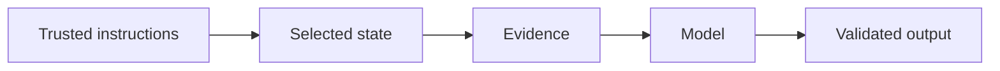

# 5.4 — Conversation and Memory

*Book 5: Prompt and Context Engineering · Read 25 min · Worked example 20 min · Code/design practice 45–60 min · Review 10 min*

## Before you begin

- Book 4
- Model inference
- Tokens and context windows

If a prerequisite is unfamiliar, use site search and read only enough to explain it and complete a small example. Do not block progress by mastering every upstream topic first.

## Why this chapter exists

Separate transcript, session state, summaries, semantic memory, episodic memory, user preferences, and source-of-truth data.

The engineering objective is not to memorize vocabulary. By the end, you should be able to describe the mechanism, build or inspect a small implementation, recognize its failure modes, and decide where it belongs in a larger system.

## Learning objectives

- Explain why conversation and memory matters using the chapter scenario, not abstract definitions alone.
- Trace how **working memory** and **session memory** interact in the book-level visual.
- Implement or design the bounded practice while holding evaluation cases fixed.
- Diagnose at least two failure modes specific to memory retrieval.
- Decide where this chapter's mechanism belongs in a production architecture and what evidence justifies it.

!!! note "Enduring principle"
    Memory is selected state reconstructed for the next decision.

## Mental model



Read the visual from left to right, then trace failures from right to left. The diagram is a book-level map; this chapter explains how **conversation and memory** changes one or more transitions.

## Core concepts

The concepts form a system, not a vocabulary list. Read each section below before attempting the practice exercise.

### Working Memory

Working memory holds transient state for the current turn—scratchpad notes, intermediate calculations—not durable across sessions. It clears when the task completes. See the [Working Memory concept card](../../concepts/cards/working-memory.md).

**Example:** A calculator agent keeps running totals in working memory while parsing a multi-step word problem.

**Evidence of understanding:** Verify working memory resets between unrelated tasks in the same session.

### Session Memory

Session memory persists within a conversation—recent turns, pending clarifications—without long-term storage. TTL and summarization policies prevent unbounded growth. See the [Session Memory concept card](../../concepts/cards/session-memory.md).

**Example:** Remembering the user's chosen account ID this session avoids re-asking on every message.

**Evidence of understanding:** Measure token growth over 20-turn dialogues with and without rolling summarization.

### Long-Term Memory

Long-term memory stores durable facts—preferences, past resolutions—retrieved selectively for future sessions. It requires consent, expiry, and correction paths. See the [Long-Term Memory concept card](../../concepts/cards/long-term-memory.md).

**Example:** Storing preferred language and timezone reduces friction but must be deletable on request.

**Evidence of understanding:** Test memory write, retrieval, update, and deletion with audit logs for GDPR requests.

### Summarization

Summarization compresses dialogue or documents into shorter forms for memory or display. Summaries lose detail; critical constraints may need structured extraction instead. See the [Summarization concept card](../../concepts/cards/summarization.md).

**Example:** Rolling summaries of support chats preserve issue status but may drop exact error codes.

**Evidence of understanding:** Compare task success using full transcript versus summary after 30 turns.

### Memory Retrieval

Memory retrieval selects relevant past facts given the current query—vector search, keyword, or structured lookup. Irrelevant memories pollute context and cause confabulation. See the [Memory Retrieval concept card](../../concepts/cards/memory-retrieval.md).

**Example:** Retrieving only memories tagged with the current project ID avoids cross-project contamination.

**Evidence of understanding:** Measure precision@5 of retrieved memories on labeled session continuations.

## Worked example

**Book scenario:** A long-running assistant must fit policy, evidence, memory, and user input into a bounded context.

**Situation:** The long-running assistant must remember prior approvals without stuffing full transcripts into every request.

**Baseline:** Send entire chat history verbatim—hits token limits and leaks stale facts.

**Application:** Separate working transcript, rolling summary, and semantic memory store; score memory candidates by recency, relevance, and source authority; inject top-k into context builder.

**Test cases:** (1) Normal: user references decision from yesterday. (2) Boundary: summary contradicts episodic log. (3) Adversarial: user claims false prior approval stored in memory.

**Measurement:** Recall of needed facts vs tokens used; conflict detection rate between summary and log.

**Design question:** When should semantic memory yield to authoritative database lookup?

## Chapter hook

Run this short snippet first to anchor **conversation and memory** before the book-level sample:

```python
memories = [
    {"text": "Approved WFH stipend", "score": 0.9, "source": "db"},
    {"text": "User likes concise answers", "score": 0.4, "source": "summary"},
]
query = "WFH stipend approval"
def relevance(m, q):
    return m["score"] * (1 if any(w in m["text"].lower() for w in q.lower().split()) else 0.2)
ranked = sorted(memories, key=lambda m: -relevance(m, query))
print("selected:", ranked[0])
```

Predict the printed values, then change one line tied to **working memory** or **session memory** and observe how the chapter mechanism moves.

## Runnable code sample

The following dependency-free sample supports this book. Download it from the [code-sample library](../../code-samples/05-context-builder.py) or run the matching file under `examples/`.

```python
--8<-- "docs/code-samples/05-context-builder.py"
```

Expected output is printed to the terminal. Before running it, predict which values or decisions should change. Then introduce one failure and convert the observation into a test.

??? success "Expected observation"
    Trusted high-priority sections consume the budget first; untrusted evidence remains explicitly marked as data.

This is a **book-level sample**. Its relevance to this chapter is the boundary between **working memory** and **session memory**. Modify that boundary, not unrelated lines, when completing the chapter exercise.

## Engineering practice

**Build:** Implement a conversation summarizer and memory scoring policy.

Work in three passes tailored to this chapter:

1. **Baseline:** Implement the task without working memory and record quality, latency, and failure cases.
2. **Mechanism:** Add session memory while keeping inputs and evaluation fixed; note what changed in intermediate state.
3. **Judgment:** Compare outcomes on normal, boundary, and adversarial cases; document when conversation and memory earns its operational cost.

Capture assumptions, test cases, results, and one architecture decision record. A successful lab explains *why* behavior changed, not merely that the program ran.

## Architecture lens

For a production design in **Prompt and Context Engineering**, make the following explicit for **conversation and memory**:

| Concern | Question to answer |
|---|---|
| **Ownership** | Which service owns working memory versus downstream consumers of its output? |
| **Contract** | What typed inputs, outputs, errors, and version does the long-term memory boundary expose? |
| **Evidence** | Which eval slices prove conversation and memory meets requirements before and after each release? |
| **Security** | What untrusted data crosses the memory retrieval boundary and how is it sanitized or authorized? |
| **Operations** | What is logged at this chapter's transition, what triggers retry or rollback, and what is cached? |
| **Economics** | Which resource—tokens, retrieval calls, GPU seconds, human review—dominates cost for this mechanism? |

## Failure clinic

Reproduce failures at the chapter boundary—do not debug only final output.

| Failure | Symptom | Likely cause | First response |
|---|---|---|---|
| **Baseline illusion** | The system looks fine on demo prompts but fails on the book scenario | Evaluation cases do not cover working memory or session memory | Add the chapter's normal, boundary, and adversarial cases before tuning |
| **Mechanism mismatch** | Adding complexity does not improve the measured outcome | conversation and memory is applied at the wrong layer or without fixing inputs | Trace the book visual and verify the transition this chapter owns |
| **Silent degradation** | Outputs remain fluent while decisions become wrong | Failure in memory retrieval without observability at that boundary | Log intermediate state, version config, and compare against the baseline |
| **Operational drift** | Quality changes after deploy though prompts are unchanged | Data, permissions, or upstream working memory behavior shifted | Pin versions, inspect ingestion and policy filters, re-run slice evals |

Separate transcript, session state, summaries, semantic memory, episodic memory, user preferences, and source-of-truth data. When triaging, preserve full inputs, retrieved evidence, tool traces, and model or index versions.

## Evolution lens

- **Yesterday:** Manual playbooks, brittle rules, or single-pass models handled parts of conversation and memory without explicit working memory.
- **Today:** Engineering teams implement conversation and memory as testable components with baselines, typed boundaries, and stage-specific evaluation.
- **Tomorrow:** Better automation may reduce toil, but memory retrieval and governance constraints will still require explicit design.
- **What survives:** Memory is selected state reconstructed for the next decision.

## Knowledge check

1. Why is memory selected state rather than full transcript storage?
2. How would conflicting summary and episodic log appear at runtime?
3. What baseline sends full history every turn?

??? question "Answer guidance"
    Q1: Reconstruction for next decision must be bounded and scored. Q2: Assistant cites summary fact absent from authoritative log. Q3: Unbounded chat append with no summarization.

## Mastery questions

??? tip "Model answers (proficient level)"
        1. **Explain working memory without jargon and give a counterexample.**
       *Proficient answer:* working memory holds transient state for the current turn—scratchpad notes, intermediate calculations—not durable across sessions. Counterexample: applying it when the task is fully deterministic and cheaper to hard-code.
    2. **Compare session memory with memory retrieval using quality, cost, latency, and risk.**
       *Proficient answer:* session memory persists within a conversation—recent turns, pending clarifications—without long-term storage; memory retrieval selects relevant past facts given the current query—vector search, keyword, or structured lookup. Trade quality gains against operational and security cost on the chapter scenario.
    3. **Design a minimal experiment that tests the chapter's central claim.**
       *Proficient answer:* Fix a baseline and three cases (normal, boundary, adversarial). Add only the chapter mechanism, measure one task metric plus cost/latency, and pre-register what result would falsify the claim.
    4. **Identify which component should own validation, authorization, and observability.**
       *Proficient answer:* Validation belongs at the typed boundary after session memory; authorization before any side effect or retrieval of restricted data; observability at the transition conversation and memory introduces in the book visual.
    5. **State what would remain true if today's leading libraries and vendors disappeared.**
       *Proficient answer:* Memory is selected state reconstructed for the next decision.

## Self-assessment rubric

| Level | Evidence |
|---|---|
| Not yet | Can repeat terms but cannot trace the visual or predict the sample. |
| Developing | Can explain the mechanism and complete the normal case with help. |
| Proficient | Can implement the exercise, diagnose a failure, and compare a baseline. |
| Transfer | Can defend an architecture choice in a new domain with evaluation evidence. |

## Evidence and further study

- Provider documentation for structured output and tool calling
- Current prompt-injection guidance from authoritative security sources

Use primary sources for technical claims and official documentation for current product behavior. Record the version or access date for evolving material.

## Continue

Return to the [book index](index.md) or use site search to follow the chapter's concepts into the knowledge-area and reference pages.
