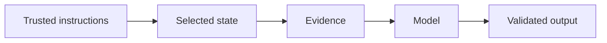

# 5.6 — Prompt and Context Operations

*Book 5: Prompt and Context Engineering · Read 25 min · Worked example 20 min · Code/design practice 45–60 min · Review 10 min*

## Before you begin

- Book 4
- Model inference
- Tokens and context windows

If a prerequisite is unfamiliar, use site search and read only enough to explain it and complete a small example. Do not block progress by mastering every upstream topic first.

## Why this chapter exists

Version prompts, trace context, cache safely, run regressions, compare variants, and monitor cost and quality.

The engineering objective is not to memorize vocabulary. By the end, you should be able to describe the mechanism, build or inspect a small implementation, recognize its failure modes, and decide where it belongs in a larger system.

## Learning objectives

- Explain why prompt and context operations matters using the chapter scenario, not abstract definitions alone.
- Trace how **prompt versioning** and **context traces** interact in the book-level visual.
- Implement or design the bounded practice while holding evaluation cases fixed.
- Diagnose at least two failure modes specific to regression evaluation.
- Decide where this chapter's mechanism belongs in a production architecture and what evidence justifies it.

!!! note "Enduring principle"
    Context changes are software changes and require evidence, review, and rollback.

## Mental model



Read the visual from left to right, then trace failures from right to left. The diagram is a book-level map; this chapter explains how **prompt and context operations** changes one or more transitions.

## Core concepts

The concepts form a system, not a vocabulary list. Read each section below before attempting the practice exercise.

### Prompt Versioning

Prompt versioning tracks template changes with IDs, authors, and diffs like code. Unversioned prompt edits cause silent regressions impossible to roll back. See the [Prompt Versioning concept card](../../concepts/cards/prompt-versioning.md).

**Example:** Prompt v2.3.1 changes abstention wording—eval must compare v2.3.0 versus v2.3.1 before deploy.

**Evidence of understanding:** Store prompt hash on every trace and correlate with quality metrics by version.

### Context Traces

Context traces log the assembled prompt sections, token counts, and sources for debugging and compliance. They make probabilistic failures reproducible. See the [Context Traces concept card](../../concepts/cards/context-traces.md).

**Example:** Replaying a failed answer with its trace shows whether retrieval or ranking dropped the key passage.

**Evidence of understanding:** Sample 1% of requests with full traces retained for 30 days minimum.

### Caching

Caching stores prompt prefixes, embeddings, or completions to cut latency and cost. Cache keys must include model version and prompt hash to avoid stale wrong answers. See the [Caching concept card](../../concepts/cards/caching.md).

**Example:** Caching the system prompt KV states saves compute on every request with identical instructions.

**Evidence of understanding:** Measure cache hit rate and verify cache invalidation when prompt version changes.

### A/B Tests

A/B tests compare prompt or context variants on live traffic with guardrail metrics. They need sufficient power and ethical review for user-facing experiments. See the [A/B Tests concept card](../../concepts/cards/a-b-tests.md).

**Example:** Testing two retrieval packing orders measures answer quality impact on 5% of queries.

**Evidence of understanding:** Pre-register primary metric, minimum detectable effect, and stopping rules before launch.

### Regression Evaluation

Regression evaluation re-runs fixed test suites after prompt or context changes to catch quality drops. It complements aggregate monitoring with known hard cases. See the [Regression Evaluation concept card](../../concepts/cards/regression-evaluation.md).

**Example:** A 30-case eval set includes injection attempts and acronym queries that must never regress.

**Evidence of understanding:** Block release if any P0 case fails or overall score drops more than two points.

## Worked example

**Book scenario:** A long-running assistant must fit policy, evidence, memory, and user input into a bounded context.

**Situation:** Prompt engineers ship weekly tweaks without regression tests; production quality swings unpredictably.

**Baseline:** Edit prompts in production with no version control or eval trail.

**Application:** Version prompts in git, trace context assembly per request, cache deterministic prefixes safely, run A/B eval on 50-case suite before promote, monitor cost and quality dashboards.

**Test cases:** (1) Normal: prompt v1.3 → v1.4 wording fix. (2) Boundary: cache key includes model version. (3) Adversarial: cached prefix from old policy after corpus update.

**Measurement:** Regression delta on eval suite, $/request trend, mean time to rollback prompt.

**Design question:** What must invalidate a cached prefix besides prompt text changes?

## Chapter hook

Run this short snippet first to anchor **prompt and context operations** before the book-level sample:

```python
CHAPTER = "5.6"
print("chapter hook:", CHAPTER)
prompts = {"v1.3": {"success": 0.84}, "v1.4": {"success": 0.81}}
active = "v1.3"
candidate = "v1.4"
gate = 0.02
delta = prompts[candidate]["success"] - prompts[active]["success"]
decision = "promote" if delta >= -gate else "rollback"
print({"active": active, "candidate": candidate, "delta": round(delta, 3), "decision": decision})
print("---")
print("change one input above, predict output, re-run")
```

Predict the printed values, then change one line tied to **prompt versioning** or **context traces** and observe how the chapter mechanism moves.

## Runnable code sample

The following dependency-free sample supports this book. Download it from the [code-sample library](../../code-samples/05-context-builder.py) or run the matching file under `examples/`.

```python
--8<-- "docs/code-samples/05-context-builder.py"
```

Expected output is printed to the terminal. Before running it, predict which values or decisions should change. Then introduce one failure and convert the observation into a test.

??? success "Expected observation"
    Trusted high-priority sections consume the budget first; untrusted evidence remains explicitly marked as data.

This is a **book-level sample**. Its relevance to this chapter is the boundary between **prompt versioning** and **context traces**. Modify that boundary, not unrelated lines, when completing the chapter exercise.

## Engineering practice

**Build:** Create a prompt change report with before/after evals.

Work in three passes tailored to this chapter:

1. **Baseline:** Implement the task without prompt versioning and record quality, latency, and failure cases.
2. **Mechanism:** Add context traces while keeping inputs and evaluation fixed; note what changed in intermediate state.
3. **Judgment:** Compare outcomes on normal, boundary, and adversarial cases; document when prompt and context operations earns its operational cost.

Capture assumptions, test cases, results, and one architecture decision record. A successful lab explains *why* behavior changed, not merely that the program ran.

## Spec-driven habit

Every chapter lab pairs reading with **executable acceptance**. Before implementing book 5.6 — prompt and context operations:

1. Draft cases in `test_lab.py` or `specs/lab-0506.yaml`.
2. Use [Cursor Plan/Agent](https://cursor.com/) with "read spec first, then minimal diff".
3. Or use [OpenSpec](https://openspec.dev/) `/opsx:propose` so requirements live in `openspec/` next to code.

→ [Spec-driven workflow guide](../../getting-started/spec-driven-workflow.md) · [Lab 5.6](../../labs/0506-prompt-and-context-operations.md)


## Architecture lens

For a production design in **Prompt and Context Engineering**, make the following explicit for **prompt and context operations**:

| Concern | Question to answer |
|---|---|
| **Ownership** | Which service owns prompt versioning versus downstream consumers of its output? |
| **Contract** | What typed inputs, outputs, errors, and version does the caching boundary expose? |
| **Evidence** | Which eval slices prove prompt and context operations meets requirements before and after each release? |
| **Security** | What untrusted data crosses the regression evaluation boundary and how is it sanitized or authorized? |
| **Operations** | What is logged at this chapter's transition, what triggers retry or rollback, and what is cached? |
| **Economics** | Which resource—tokens, retrieval calls, GPU seconds, human review—dominates cost for this mechanism? |

## Failure clinic

Reproduce failures at the chapter boundary—do not debug only final output.

| Failure | Symptom | Likely cause | First response |
|---|---|---|---|
| **Baseline illusion** | The system looks fine on demo prompts but fails on the book scenario | Evaluation cases do not cover prompt versioning or context traces | Add the chapter's normal, boundary, and adversarial cases before tuning |
| **Mechanism mismatch** | Adding complexity does not improve the measured outcome | prompt and context operations is applied at the wrong layer or without fixing inputs | Trace the book visual and verify the transition this chapter owns |
| **Silent degradation** | Outputs remain fluent while decisions become wrong | Failure in regression evaluation without observability at that boundary | Log intermediate state, version config, and compare against the baseline |
| **Operational drift** | Quality changes after deploy though prompts are unchanged | Data, permissions, or upstream prompt versioning behavior shifted | Pin versions, inspect ingestion and policy filters, re-run slice evals |

Version prompts, trace context, cache safely, run regressions, compare variants, and monitor cost and quality. When triaging, preserve full inputs, retrieved evidence, tool traces, and model or index versions.

## Evolution lens

- **Yesterday:** Manual playbooks, brittle rules, or single-pass models handled parts of prompt and context operations without explicit prompt versioning.
- **Today:** Engineering teams implement prompt and context operations as testable components with baselines, typed boundaries, and stage-specific evaluation.
- **Tomorrow:** Better automation may reduce toil, but regression evaluation and governance constraints will still require explicit design.
- **What survives:** Context changes are software changes and require evidence, review, and rollback.

## Knowledge check

1. Why are context changes software changes?
2. How do context traces help debug a regression?
3. What operations baseline skips versioning?

??? question "Answer guidance"
    Q1: Behavior shifts affect safety and cost—need review and rollback. Q2: Traces show which sections/assemblies differ between versions. Q3: Live-edit prompt with no git hash or eval gate.

## Mastery questions

??? tip "Model answers (proficient level)"
        1. **Explain prompt versioning without jargon and give a counterexample.**
       *Proficient answer:* prompt versioning tracks template changes with ids, authors, and diffs like code. Counterexample: applying it when the task is fully deterministic and cheaper to hard-code.
    2. **Compare context traces with regression evaluation using quality, cost, latency, and risk.**
       *Proficient answer:* context traces log the assembled prompt sections, token counts, and sources for debugging and compliance; regression evaluation re-runs fixed test suites after prompt or context changes to catch quality drops. Trade quality gains against operational and security cost on the chapter scenario.
    3. **Design a minimal experiment that tests the chapter's central claim.**
       *Proficient answer:* Fix a baseline and three cases (normal, boundary, adversarial). Add only the chapter mechanism, measure one task metric plus cost/latency, and pre-register what result would falsify the claim.
    4. **Identify which component should own validation, authorization, and observability.**
       *Proficient answer:* Validation belongs at the typed boundary after context traces; authorization before any side effect or retrieval of restricted data; observability at the transition prompt and context operations introduces in the book visual.
    5. **State what would remain true if today's leading libraries and vendors disappeared.**
       *Proficient answer:* Context changes are software changes and require evidence, review, and rollback.

## Self-assessment rubric

| Level | Evidence |
|---|---|
| Not yet | Can repeat terms but cannot trace the visual or predict the sample. |
| Developing | Can explain the mechanism and complete the normal case with help. |
| Proficient | Can implement the exercise, diagnose a failure, and compare a baseline. |
| Transfer | Can defend an architecture choice in a new domain with evaluation evidence. |

## Evidence and further study

- Provider documentation for structured output and tool calling
- Current prompt-injection guidance from authoritative security sources

Use primary sources for technical claims and official documentation for current product behavior. Record the version or access date for evolving material.

## Continue

Return to the [book index](index.md) or use site search to follow the chapter's concepts into the knowledge-area and reference pages.
