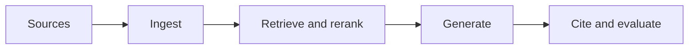

# 6.2 — Document Ingestion

*Book 6: Knowledge and Retrieval Systems · Read 25 min · Worked example 20 min · Code/design practice 45–60 min · Review 10 min*

## Before you begin

- Books 3–5
- Embeddings and search
- Structured model output

If a prerequisite is unfamiliar, use site search and read only enough to explain it and complete a small example. Do not block progress by mastering every upstream topic first.

## Why this chapter exists

Preserve provenance while parsing documents, OCR, tables, images, metadata, permissions, versions, and deletions.

The engineering objective is not to memorize vocabulary. By the end, you should be able to describe the mechanism, build or inspect a small implementation, recognize its failure modes, and decide where it belongs in a larger system.

## Learning objectives

- Explain why document ingestion matters using the chapter scenario, not abstract definitions alone.
- Trace how **parsing** and **OCR** interact in the book-level visual.
- Implement or design the bounded practice while holding evaluation cases fixed.
- Diagnose at least two failure modes specific to provenance.
- Decide where this chapter's mechanism belongs in a production architecture and what evidence justifies it.

!!! note "Enduring principle"
    Retrieval cannot recover content or permissions lost during ingestion.

## Mental model



Read the visual from left to right, then trace failures from right to left. The diagram is a book-level map; this chapter explains how **document ingestion** changes one or more transitions.

## Core concepts

The concepts form a system, not a vocabulary list. Read each section below before attempting the practice exercise.

### Parsing

Parsing converts documents—PDF, HTML, DOCX—into clean text and structure for indexing. Bad parsing loses tables, headings, and lists that retrieval cannot recover. See the [Parsing concept card](../../concepts/cards/parsing.md).

**Example:** OCR garbling a table of limits makes correct retrieval impossible regardless of embedding quality.

**Evidence of understanding:** Measure character-error rate and table cell accuracy on 50 representative documents.

### OCR

OCR extracts text from scanned images and photos, introducing recognition errors that propagate to chunks and answers. Confidence scores help gate low-quality extractions. See the [OCR concept card](../../concepts/cards/ocr.md).

**Example:** Scanned contracts with skewed pages need deskew preprocessing before OCR.

**Evidence of understanding:** Report word-error rate on ten scanned pages and abstain when mean confidence < threshold.

### Chunking

Chunking splits documents into index units sized for retrieval precision and generation context. Boundaries should respect sections, not arbitrary token counts alone. See the [Chunking concept card](../../concepts/cards/chunking.md).

**Example:** Splitting mid-table separates headers from values, producing useless retrieval hits.

**Evidence of understanding:** Compare recall@5 with fixed-size versus section-aware chunking on table-heavy docs.

### Metadata

Metadata tags documents with tenant, date, author, permissions, and type for filtering and ranking. Rich metadata enables policy enforcement beyond vector similarity. See the [Metadata concept card](../../concepts/cards/metadata.md).

**Example:** Filtering by effective_date prevents superseded policies from ranking above current ones.

**Evidence of understanding:** Verify every indexed chunk carries required metadata fields in ingest validation.

### Provenance

Provenance for generated media records model, prompt, timestamp, and user for copyright and authenticity disputes. See the [Provenance concept card](../../concepts/cards/provenance.md).

**Example:** C2PA metadata embeds creation tool and prompt hash in exported campaign image.

**Evidence of understanding:** Verify provenance survives export format and is readable by audit tool.

## Worked example

**Book scenario:** An enterprise assistant must answer from authorized policies and cite the exact passages used.

**Situation:** Policy PDFs include tables, footnotes, and permission labels; bad ingestion loses rows counsel needs for audits.

**Baseline:** Plain-text dump of PDF—tables collapse, page numbers lost.

**Application:** Build ingestion manifest tracking source URI, checksum, parse method, OCR confidence, chunk boundaries, ACL labels; measure field recovery on table-heavy pages.

**Test cases:** (1) Normal: digital PDF with text layer. (2) Boundary: scanned page OCR 85% confidence. (3) Adversarial: document marked confidential ingested into general index.

**Measurement:** Table cell recovery F1, provenance completeness score, ACL leak count (must be zero).

**Design question:** Which metadata field prevents a confidential chunk appearing in general retrieval?

## Chapter hook

Run this short snippet first to anchor **document ingestion** before the book-level sample:

```python
manifest = {
    "doc_id": "POL-441",
    "pages": 12,
    "acl": "HR-ONLY",
    "chunks": [{"id": 1, "page": 3, "text_hash": "abc123"}],
}
def allowed(chunk, user_groups):
    required = manifest["acl"]
    return required in user_groups
user = {"groups": ["ALL-STAFF"]}
print({"access": allowed(manifest["chunks"][0], user["groups"])})
```

Predict the printed values, then change one line tied to **parsing** or **OCR** and observe how the chapter mechanism moves.

## Runnable code sample

The following dependency-free sample supports this book. Download it from the [code-sample library](../../code-samples/06-hybrid-rag.py) or run the matching file under `examples/`.

```python
--8<-- "docs/code-samples/06-hybrid-rag.py"
```

Expected output is printed to the terminal. Before running it, predict which values or decisions should change. Then introduce one failure and convert the observation into a test.

??? success "Expected observation"
    Documents appearing high in both rankings receive the strongest reciprocal-rank-fusion scores.

This is a **book-level sample**. Its relevance to this chapter is the boundary between **parsing** and **OCR**. Modify that boundary, not unrelated lines, when completing the chapter exercise.

## Engineering practice

**Build:** Create an ingestion manifest and measure parse fidelity.

Work in three passes tailored to this chapter:

1. **Baseline:** Implement the task without parsing and record quality, latency, and failure cases.
2. **Mechanism:** Add ocr while keeping inputs and evaluation fixed; note what changed in intermediate state.
3. **Judgment:** Compare outcomes on normal, boundary, and adversarial cases; document when document ingestion earns its operational cost.

Capture assumptions, test cases, results, and one architecture decision record. A successful lab explains *why* behavior changed, not merely that the program ran.

## Architecture lens

For a production design in **Knowledge and Retrieval Systems**, make the following explicit for **document ingestion**:

| Concern | Question to answer |
|---|---|
| **Ownership** | Which service owns parsing versus downstream consumers of its output? |
| **Contract** | What typed inputs, outputs, errors, and version does the chunking boundary expose? |
| **Evidence** | Which eval slices prove document ingestion meets requirements before and after each release? |
| **Security** | What untrusted data crosses the provenance boundary and how is it sanitized or authorized? |
| **Operations** | What is logged at this chapter's transition, what triggers retry or rollback, and what is cached? |
| **Economics** | Which resource—tokens, retrieval calls, GPU seconds, human review—dominates cost for this mechanism? |

## Failure clinic

Reproduce failures at the chapter boundary—do not debug only final output.

| Failure | Symptom | Likely cause | First response |
|---|---|---|---|
| **Baseline illusion** | The system looks fine on demo prompts but fails on the book scenario | Evaluation cases do not cover parsing or ocr | Add the chapter's normal, boundary, and adversarial cases before tuning |
| **Mechanism mismatch** | Adding complexity does not improve the measured outcome | document ingestion is applied at the wrong layer or without fixing inputs | Trace the book visual and verify the transition this chapter owns |
| **Silent degradation** | Outputs remain fluent while decisions become wrong | Failure in provenance without observability at that boundary | Log intermediate state, version config, and compare against the baseline |
| **Operational drift** | Quality changes after deploy though prompts are unchanged | Data, permissions, or upstream parsing behavior shifted | Pin versions, inspect ingestion and policy filters, re-run slice evals |

Preserve provenance while parsing documents, OCR, tables, images, metadata, permissions, versions, and deletions. When triaging, preserve full inputs, retrieved evidence, tool traces, and model or index versions.

## Evolution lens

- **Yesterday:** Manual playbooks, brittle rules, or single-pass models handled parts of document ingestion without explicit parsing.
- **Today:** Engineering teams implement document ingestion as testable components with baselines, typed boundaries, and stage-specific evaluation.
- **Tomorrow:** Better automation may reduce toil, but provenance and governance constraints will still require explicit design.
- **What survives:** Retrieval cannot recover content or permissions lost during ingestion.

## Knowledge check

1. Why cannot retrieval recover permissions lost during ingestion?
2. How would collapsed tables cause citation failures?
3. What ingestion baseline ignores provenance?

??? question "Answer guidance"
    Q1: ACLs must attach to chunks at index time. Q2: Answers cite wrong numeric entitlements from garbled rows. Q3: strip-all-metadata text dump.

## Mastery questions

??? tip "Model answers (proficient level)"
        1. **Explain parsing without jargon and give a counterexample.**
       *Proficient answer:* parsing converts documents—pdf, html, docx—into clean text and structure for indexing. Counterexample: applying it when the task is fully deterministic and cheaper to hard-code.
    2. **Compare OCR with provenance using quality, cost, latency, and risk.**
       *Proficient answer:* ocr extracts text from scanned images and photos, introducing recognition errors that propagate to chunks and answers; provenance for generated media records model, prompt, timestamp, and user for copyright and authenticity disputes. Trade quality gains against operational and security cost on the chapter scenario.
    3. **Design a minimal experiment that tests the chapter's central claim.**
       *Proficient answer:* Fix a baseline and three cases (normal, boundary, adversarial). Add only the chapter mechanism, measure one task metric plus cost/latency, and pre-register what result would falsify the claim.
    4. **Identify which component should own validation, authorization, and observability.**
       *Proficient answer:* Validation belongs at the typed boundary after ocr; authorization before any side effect or retrieval of restricted data; observability at the transition document ingestion introduces in the book visual.
    5. **State what would remain true if today's leading libraries and vendors disappeared.**
       *Proficient answer:* Retrieval cannot recover content or permissions lost during ingestion.

## Self-assessment rubric

| Level | Evidence |
|---|---|
| Not yet | Can repeat terms but cannot trace the visual or predict the sample. |
| Developing | Can explain the mechanism and complete the normal case with help. |
| Proficient | Can implement the exercise, diagnose a failure, and compare a baseline. |
| Transfer | Can defend an architecture choice in a new domain with evaluation evidence. |

## Evidence and further study

- Lewis et al. — Retrieval-Augmented Generation
- Karpukhin et al. — Dense Passage Retrieval

Use primary sources for technical claims and official documentation for current product behavior. Record the version or access date for evolving material.

## Continue

Return to the [book index](index.md) or use site search to follow the chapter's concepts into the knowledge-area and reference pages.
