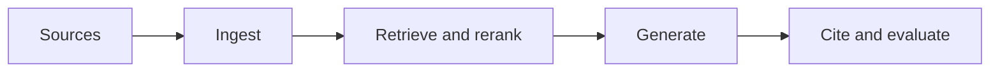

# 6.4 — Ranking and Context Selection

*Book 6: Knowledge and Retrieval Systems · Read 25 min · Worked example 20 min · Code/design practice 45–60 min · Review 10 min*

## Before you begin

- Books 3–5
- Embeddings and search
- Structured model output

If a prerequisite is unfamiliar, use site search and read only enough to explain it and complete a small example. Do not block progress by mastering every upstream topic first.

## Why this chapter exists

Use fusion, reranking, diversity, deduplication, compression, and token-aware packing.

The engineering objective is not to memorize vocabulary. By the end, you should be able to describe the mechanism, build or inspect a small implementation, recognize its failure modes, and decide where it belongs in a larger system.

## Learning objectives

- Explain why ranking and context selection matters using the chapter scenario, not abstract definitions alone.
- Trace how **reciprocal rank fusion** and **rerankers** interact in the book-level visual.
- Implement or design the bounded practice while holding evaluation cases fixed.
- Diagnose at least two failure modes specific to context packing.
- Decide where this chapter's mechanism belongs in a production architecture and what evidence justifies it.

!!! note "Enduring principle"
    Every selected passage competes for limited attention; more context can reduce quality.

## Mental model



Read the visual from left to right, then trace failures from right to left. The diagram is a book-level map; this chapter explains how **ranking and context selection** changes one or more transitions.

## Core concepts

The concepts form a system, not a vocabulary list. Read each section below before attempting the practice exercise.

### Reciprocal Rank Fusion

Reciprocal rank fusion merges ranked lists by summing 1/(k + rank) per document across retrievers. See the [Reciprocal Rank Fusion concept card](../../concepts/cards/reciprocal-rank-fusion.md).

**Example:** A document ranked third lexically and second densely outscores a single-list winner.

**Evidence of understanding:** Fuse two hand-built rankings and verify the dual-high document gets top fused score.

### Rerankers

Rerankers rescore top-k candidates with cross-attention models more accurate than bi-encoders alone. They add latency proportional to candidates rescored. See the [Rerankers concept card](../../concepts/cards/rerankers.md).

**Example:** Cross-encoder reranking top-50 BM25 hits improves precision@5 for policy QA.

**Evidence of understanding:** Measure nDCG@5 and p95 latency with reranker on versus off at k=50.

### Diversity

Diversity in context selection avoids redundant passages that waste tokens on repeated facts. Maximal marginal relevance is a common heuristic. See the [Diversity concept card](../../concepts/cards/diversity.md).

**Example:** Three chunks saying the same PTO limit add no value; one plus related exceptions is better.

**Evidence of understanding:** Compare unique fact coverage at fixed token budget with and without MMR selection.

### Deduplication

Deduplication removes near-duplicate training examples that inflate metrics and memorization. See the [Deduplication concept card](../../concepts/cards/deduplication.md).

**Example:** Duplicate FAQ pairs in SFT data cause verbatim regurgitation in deployment.

**Evidence of understanding:** Report duplicate rate before/after MinHash dedup on training corpus.

### Context Packing

Context packing fits selected passages into the token window respecting priority, citation needs, and truncation rules. Packing order affects what the model emphasizes. See the [Context Packing concept card](../../concepts/cards/context-packing.md).

**Example:** Place highest-scored evidence first when middle-context attention is weaker in long windows.

**Evidence of understanding:** Compare faithfulness when critical passage is first versus last at equal total tokens.

## Worked example

**Book scenario:** An enterprise assistant must answer from authorized policies and cite the exact passages used.

**Situation:** Initial retrieval returns twenty chunks but the model only accepts four; ranking and packing determine answer quality.

**Baseline:** Take top-4 by BM25 score—redundant sections crowd out diversity.

**Application:** Apply reciprocal rank fusion across retrievers, cross-encoder rerank, MMR diversity, deduplicate near-identical chunks, token-aware packer respecting citation metadata.

**Test cases:** (1) Normal: diverse relevant sections. (2) Boundary: token budget fits exactly three chunks. (3) Adversarial: near-duplicate chunks from template boilerplate flooding top ranks.

**Measurement:** Answer faithfulness vs number of chunks packed; latency added by reranker; redundancy rate in context.

**Design question:** When does adding more retrieved context reduce answer quality?

## Chapter hook

Run this short snippet first to anchor **ranking and context selection** before the book-level sample:

```python
rank_a = ["doc-leave", "doc-expense", "doc-security"]
rank_b = ["doc-expense", "doc-leave", "doc-onboarding"]
def rrf(lists, k=60):
    scores = {}
    for ranking in lists:
        for rank, doc in enumerate(ranking, 1):
            scores[doc] = scores.get(doc, 0) + 1/(k+rank)
    return sorted(scores.items(), key=lambda x: -x[1])
print("rrf top2:", rrf([rank_a, rank_b])[:2])
```

Predict the printed values, then change one line tied to **reciprocal rank fusion** or **rerankers** and observe how the chapter mechanism moves.

## Runnable code sample

The following dependency-free sample supports this book. Download it from the [code-sample library](../../code-samples/06-hybrid-rag.py) or run the matching file under `examples/`.

```python
--8<-- "docs/code-samples/06-hybrid-rag.py"
```

Expected output is printed to the terminal. Before running it, predict which values or decisions should change. Then introduce one failure and convert the observation into a test.

??? success "Expected observation"
    Documents appearing high in both rankings receive the strongest reciprocal-rank-fusion scores.

This is a **book-level sample**. Its relevance to this chapter is the boundary between **reciprocal rank fusion** and **rerankers**. Modify that boundary, not unrelated lines, when completing the chapter exercise.

## Engineering practice

**Build:** Add reranking and measure quality versus latency.

Work in three passes tailored to this chapter:

1. **Baseline:** Implement the task without reciprocal rank fusion and record quality, latency, and failure cases.
2. **Mechanism:** Add rerankers while keeping inputs and evaluation fixed; note what changed in intermediate state.
3. **Judgment:** Compare outcomes on normal, boundary, and adversarial cases; document when ranking and context selection earns its operational cost.

Capture assumptions, test cases, results, and one architecture decision record. A successful lab explains *why* behavior changed, not merely that the program ran.

## Architecture lens

For a production design in **Knowledge and Retrieval Systems**, make the following explicit for **ranking and context selection**:

| Concern | Question to answer |
|---|---|
| **Ownership** | Which service owns reciprocal rank fusion versus downstream consumers of its output? |
| **Contract** | What typed inputs, outputs, errors, and version does the diversity boundary expose? |
| **Evidence** | Which eval slices prove ranking and context selection meets requirements before and after each release? |
| **Security** | What untrusted data crosses the context packing boundary and how is it sanitized or authorized? |
| **Operations** | What is logged at this chapter's transition, what triggers retry or rollback, and what is cached? |
| **Economics** | Which resource—tokens, retrieval calls, GPU seconds, human review—dominates cost for this mechanism? |

## Failure clinic

Reproduce failures at the chapter boundary—do not debug only final output.

| Failure | Symptom | Likely cause | First response |
|---|---|---|---|
| **Baseline illusion** | The system looks fine on demo prompts but fails on the book scenario | Evaluation cases do not cover reciprocal rank fusion or rerankers | Add the chapter's normal, boundary, and adversarial cases before tuning |
| **Mechanism mismatch** | Adding complexity does not improve the measured outcome | ranking and context selection is applied at the wrong layer or without fixing inputs | Trace the book visual and verify the transition this chapter owns |
| **Silent degradation** | Outputs remain fluent while decisions become wrong | Failure in context packing without observability at that boundary | Log intermediate state, version config, and compare against the baseline |
| **Operational drift** | Quality changes after deploy though prompts are unchanged | Data, permissions, or upstream reciprocal rank fusion behavior shifted | Pin versions, inspect ingestion and policy filters, re-run slice evals |

Use fusion, reranking, diversity, deduplication, compression, and token-aware packing. When triaging, preserve full inputs, retrieved evidence, tool traces, and model or index versions.

## Evolution lens

- **Yesterday:** Manual playbooks, brittle rules, or single-pass models handled parts of ranking and context selection without explicit reciprocal rank fusion.
- **Today:** Engineering teams implement ranking and context selection as testable components with baselines, typed boundaries, and stage-specific evaluation.
- **Tomorrow:** Better automation may reduce toil, but context packing and governance constraints will still require explicit design.
- **What survives:** Every selected passage competes for limited attention; more context can reduce quality.

## Knowledge check

1. Why does every selected passage compete for limited attention?
2. How does reranking differ from fusion?
3. What baseline packs top-k without deduplication?

??? question "Answer guidance"
    Q1: Context window and model confusion limit useful evidence. Q2: Fusion merges lists; rerank scores query-passage pairs deeply. Q3: First-k BM25 hits verbatim.

## Mastery questions

??? tip "Model answers (proficient level)"
        1. **Explain reciprocal rank fusion without jargon and give a counterexample.**
       *Proficient answer:* reciprocal rank fusion merges ranked lists by summing 1/(k + rank) per document across retrievers. Counterexample: applying it when the task is fully deterministic and cheaper to hard-code.
    2. **Compare rerankers with context packing using quality, cost, latency, and risk.**
       *Proficient answer:* rerankers rescore top-k candidates with cross-attention models more accurate than bi-encoders alone; context packing fits selected passages into the token window respecting priority, citation needs, and truncation rules. Trade quality gains against operational and security cost on the chapter scenario.
    3. **Design a minimal experiment that tests the chapter's central claim.**
       *Proficient answer:* Fix a baseline and three cases (normal, boundary, adversarial). Add only the chapter mechanism, measure one task metric plus cost/latency, and pre-register what result would falsify the claim.
    4. **Identify which component should own validation, authorization, and observability.**
       *Proficient answer:* Validation belongs at the typed boundary after rerankers; authorization before any side effect or retrieval of restricted data; observability at the transition ranking and context selection introduces in the book visual.
    5. **State what would remain true if today's leading libraries and vendors disappeared.**
       *Proficient answer:* Every selected passage competes for limited attention; more context can reduce quality.

## Self-assessment rubric

| Level | Evidence |
|---|---|
| Not yet | Can repeat terms but cannot trace the visual or predict the sample. |
| Developing | Can explain the mechanism and complete the normal case with help. |
| Proficient | Can implement the exercise, diagnose a failure, and compare a baseline. |
| Transfer | Can defend an architecture choice in a new domain with evaluation evidence. |

## Evidence and further study

- Lewis et al. — Retrieval-Augmented Generation
- Karpukhin et al. — Dense Passage Retrieval

Use primary sources for technical claims and official documentation for current product behavior. Record the version or access date for evolving material.

## Continue

Return to the [book index](index.md) or use site search to follow the chapter's concepts into the knowledge-area and reference pages.
