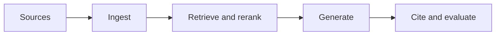

# 6.5 — RAG Generation and Citations

*Book 6: Knowledge and Retrieval Systems · Read 25 min · Worked example 20 min · Code/design practice 45–60 min · Review 10 min*

## Before you begin

- Books 3–5
- Embeddings and search
- Structured model output

If a prerequisite is unfamiliar, use site search and read only enough to explain it and complete a small example. Do not block progress by mastering every upstream topic first.

## Why this chapter exists

Construct grounded prompts, handle missing evidence, attribute claims, validate citations, and avoid unsupported synthesis.

The engineering objective is not to memorize vocabulary. By the end, you should be able to describe the mechanism, build or inspect a small implementation, recognize its failure modes, and decide where it belongs in a larger system.

## Learning objectives

- Explain why rag generation and citations matters using the chapter scenario, not abstract definitions alone.
- Trace how **grounded generation** and **abstention** interact in the book-level visual.
- Implement or design the bounded practice while holding evaluation cases fixed.
- Diagnose at least two failure modes specific to answer validation.
- Decide where this chapter's mechanism belongs in a production architecture and what evidence justifies it.

!!! note "Enduring principle"
    A citation is useful only when it supports the nearby claim and resolves to source evidence.

## Mental model



Read the visual from left to right, then trace failures from right to left. The diagram is a book-level map; this chapter explains how **rag generation and citations** changes one or more transitions.

## Core concepts

The concepts form a system, not a vocabulary list. Read each section below before attempting the practice exercise.

### Grounded Generation

Grounded generation conditions answers strictly on provided evidence, refusing when support is insufficient. Prompts and validators enforce cite-or-abstain behavior. See the [Grounded Generation concept card](../../concepts/cards/grounded-generation.md).

**Example:** The model quotes section 4.2 for refund rules instead of inventing a 30-day window.

**Evidence of understanding:** Score faithfulness and abstention rate on cases with and without supporting passages.

### Abstention

Abstention lets a system refuse or defer when confidence is insufficient, routing cases to humans or safer paths. It prevents forced wrong answers on ambiguous inputs. See the [Abstention concept card](../../concepts/cards/abstention.md).

**Example:** A benefits bot abstains on incomplete forms instead of guessing eligibility that triggers appeals.

**Evidence of understanding:** Measure coverage (non-abstain rate) versus accuracy on handled cases and set abstention to hit a risk target.

### Citation Precision

Citation precision measures whether cited sources actually support the adjacent claims. Wrong citations destroy trust faster than no citations. See the [Citation Precision concept card](../../concepts/cards/citation-precision.md).

**Example:** Linking a harassment policy to answer a parking question is high-recall citation but zero precision.

**Evidence of understanding:** Manually audit 50 claim–citation pairs and report precision and unsupported-claim rate.

### Faithfulness

Faithfulness checks that generated statements are entailed by retrieved evidence, not hallucinated additions. It is separate from fluency or user satisfaction. See the [Faithfulness concept card](../../concepts/cards/faithfulness.md).

**Example:** Correct tone but wrong deductible amount is unfaithful despite readable prose.

**Evidence of understanding:** Use NLI or human rubric on 100 answers; require faithfulness ≥ threshold for release.

### Answer Validation

Answer validation runs programmatic checks—schema, arithmetic, citation alignment—on model outputs before display. It catches errors sampling alone misses. See the [Answer Validation concept card](../../concepts/cards/answer-validation.md).

**Example:** Verify cited policy IDs exist and quoted numbers match source tables.

**Evidence of understanding:** Report validation failure rate by category on production sample weekly.

## Worked example

**Book scenario:** An enterprise assistant must answer from authorized policies and cite the exact passages used.

**Situation:** Legal requires every assistant answer to cite the exact policy passage; unsupported synthesis triggers compliance review.

**Baseline:** Model adds footnotes that do not match retrieved text.

**Application:** Ground generation on packed context only, abstain when evidence insufficient, validate each claim against cited chunk with string overlap and entailment check, reject misaligned citations.

**Test cases:** (1) Normal: answer fully supported by one chunk. (2) Boundary: partial support—should qualify or abstain. (3) Adversarial: model cites correct doc but claims opposite meaning.

**Measurement:** Citation precision/recall, faithfulness score, abstention rate on unanswerable queries.

**Design question:** What validator catches correct-doc wrong-claim citations?

## Chapter hook

Run this short snippet first to anchor **rag generation and citations** before the book-level sample:

```python
CHAPTER = "6.5"
print("chapter hook:", CHAPTER)
claim = "PTO cap is 300 hours"
source = "PTO accrual cap is 240 hours"
claim_tokens = set(claim.lower().split())
source_tokens = set(source.lower().split())
overlap = len(claim_tokens & source_tokens) / len(claim_tokens)
print({"overlap": round(overlap, 2), "supported": "240" in source and "240" in claim})
print("---")
print("change one input above, predict output, re-run")
```

Predict the printed values, then change one line tied to **grounded generation** or **abstention** and observe how the chapter mechanism moves.

## Runnable code sample

The following dependency-free sample supports this book. Download it from the [code-sample library](../../code-samples/06-hybrid-rag.py) or run the matching file under `examples/`.

```python
--8<-- "docs/code-samples/06-hybrid-rag.py"
```

Expected output is printed to the terminal. Before running it, predict which values or decisions should change. Then introduce one failure and convert the observation into a test.

??? success "Expected observation"
    Documents appearing high in both rankings receive the strongest reciprocal-rank-fusion scores.

This is a **book-level sample**. Its relevance to this chapter is the boundary between **grounded generation** and **abstention**. Modify that boundary, not unrelated lines, when completing the chapter exercise.

## Engineering practice

**Build:** Build a citation validator that checks claim-to-source alignment.

Work in three passes tailored to this chapter:

1. **Baseline:** Implement the task without grounded generation and record quality, latency, and failure cases.
2. **Mechanism:** Add abstention while keeping inputs and evaluation fixed; note what changed in intermediate state.
3. **Judgment:** Compare outcomes on normal, boundary, and adversarial cases; document when rag generation and citations earns its operational cost.

Capture assumptions, test cases, results, and one architecture decision record. A successful lab explains *why* behavior changed, not merely that the program ran.

## Architecture lens

For a production design in **Knowledge and Retrieval Systems**, make the following explicit for **rag generation and citations**:

| Concern | Question to answer |
|---|---|
| **Ownership** | Which service owns grounded generation versus downstream consumers of its output? |
| **Contract** | What typed inputs, outputs, errors, and version does the citation precision boundary expose? |
| **Evidence** | Which eval slices prove rag generation and citations meets requirements before and after each release? |
| **Security** | What untrusted data crosses the answer validation boundary and how is it sanitized or authorized? |
| **Operations** | What is logged at this chapter's transition, what triggers retry or rollback, and what is cached? |
| **Economics** | Which resource—tokens, retrieval calls, GPU seconds, human review—dominates cost for this mechanism? |

## Failure clinic

Reproduce failures at the chapter boundary—do not debug only final output.

| Failure | Symptom | Likely cause | First response |
|---|---|---|---|
| **Baseline illusion** | The system looks fine on demo prompts but fails on the book scenario | Evaluation cases do not cover grounded generation or abstention | Add the chapter's normal, boundary, and adversarial cases before tuning |
| **Mechanism mismatch** | Adding complexity does not improve the measured outcome | rag generation and citations is applied at the wrong layer or without fixing inputs | Trace the book visual and verify the transition this chapter owns |
| **Silent degradation** | Outputs remain fluent while decisions become wrong | Failure in answer validation without observability at that boundary | Log intermediate state, version config, and compare against the baseline |
| **Operational drift** | Quality changes after deploy though prompts are unchanged | Data, permissions, or upstream grounded generation behavior shifted | Pin versions, inspect ingestion and policy filters, re-run slice evals |

Construct grounded prompts, handle missing evidence, attribute claims, validate citations, and avoid unsupported synthesis. When triaging, preserve full inputs, retrieved evidence, tool traces, and model or index versions.

## Evolution lens

- **Yesterday:** Manual playbooks, brittle rules, or single-pass models handled parts of rag generation and citations without explicit grounded generation.
- **Today:** Engineering teams implement rag generation and citations as testable components with baselines, typed boundaries, and stage-specific evaluation.
- **Tomorrow:** Better automation may reduce toil, but answer validation and governance constraints will still require explicit design.
- **What survives:** A citation is useful only when it supports the nearby claim and resolves to source evidence.

## Knowledge check

1. When is a citation useful versus decorative?
2. How should the system behave with missing evidence?
3. What generation baseline skips citation validation?

??? question "Answer guidance"
    Q1: When nearby claim is entailed by cited span with correct pointer. Q2: Abstain or ask clarifying question—never invent. Q3: Free generation with post-hoc footnotes unverified.

## Mastery questions

??? tip "Model answers (proficient level)"
        1. **Explain grounded generation without jargon and give a counterexample.**
       *Proficient answer:* grounded generation conditions answers strictly on provided evidence, refusing when support is insufficient. Counterexample: applying it when the task is fully deterministic and cheaper to hard-code.
    2. **Compare abstention with answer validation using quality, cost, latency, and risk.**
       *Proficient answer:* abstention lets a system refuse or defer when confidence is insufficient, routing cases to humans or safer paths; answer validation runs programmatic checks—schema, arithmetic, citation alignment—on model outputs before display. Trade quality gains against operational and security cost on the chapter scenario.
    3. **Design a minimal experiment that tests the chapter's central claim.**
       *Proficient answer:* Fix a baseline and three cases (normal, boundary, adversarial). Add only the chapter mechanism, measure one task metric plus cost/latency, and pre-register what result would falsify the claim.
    4. **Identify which component should own validation, authorization, and observability.**
       *Proficient answer:* Validation belongs at the typed boundary after abstention; authorization before any side effect or retrieval of restricted data; observability at the transition rag generation and citations introduces in the book visual.
    5. **State what would remain true if today's leading libraries and vendors disappeared.**
       *Proficient answer:* A citation is useful only when it supports the nearby claim and resolves to source evidence.

## Self-assessment rubric

| Level | Evidence |
|---|---|
| Not yet | Can repeat terms but cannot trace the visual or predict the sample. |
| Developing | Can explain the mechanism and complete the normal case with help. |
| Proficient | Can implement the exercise, diagnose a failure, and compare a baseline. |
| Transfer | Can defend an architecture choice in a new domain with evaluation evidence. |

## Evidence and further study

- Lewis et al. — Retrieval-Augmented Generation
- Karpukhin et al. — Dense Passage Retrieval

Use primary sources for technical claims and official documentation for current product behavior. Record the version or access date for evolving material.

## Continue

Return to the [book index](index.md) or use site search to follow the chapter's concepts into the knowledge-area and reference pages.
