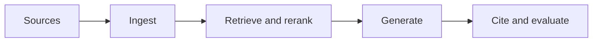

# 6.6 — Advanced and Enterprise RAG

*Book 6: Knowledge and Retrieval Systems · Read 25 min · Worked example 20 min · Code/design practice 45–60 min · Review 10 min*

## Before you begin

- Books 3–5
- Embeddings and search
- Structured model output

If a prerequisite is unfamiliar, use site search and read only enough to explain it and complete a small example. Do not block progress by mastering every upstream topic first.

## Why this chapter exists

Study graph, multi-hop, adaptive, and agentic retrieval together with tenancy, freshness, security, resilience, and cost.

The engineering objective is not to memorize vocabulary. By the end, you should be able to describe the mechanism, build or inspect a small implementation, recognize its failure modes, and decide where it belongs in a larger system.

## Learning objectives

- Explain why advanced and enterprise rag matters using the chapter scenario, not abstract definitions alone.
- Trace how **Graph RAG** and **multi-hop retrieval** interact in the book-level visual.
- Implement or design the bounded practice while holding evaluation cases fixed.
- Diagnose at least two failure modes specific to freshness.
- Decide where this chapter's mechanism belongs in a production architecture and what evidence justifies it.

!!! note "Enduring principle"
    Advanced orchestration cannot compensate for weak data, retrieval, authorization, or evaluation.

## Mental model



Read the visual from left to right, then trace failures from right to left. The diagram is a book-level map; this chapter explains how **advanced and enterprise rag** changes one or more transitions.

## Core concepts

The concepts form a system, not a vocabulary list. Read each section below before attempting the practice exercise.

### Graph Rag

Graph RAG combines knowledge graphs with retrieval so multi-hop relations traverse explicit edges. It helps when answers require chained entity relationships. See the [Graph Rag concept card](../../concepts/cards/graph-rag.md).

**Example:** 'Which vendor supplies part X used in product Y?' may need graph traversal, not one vector search.

**Evidence of understanding:** Compare multi-hop question accuracy versus flat chunk retrieval on ten linked-entity queries.

### Multi-Hop Retrieval

Multi-hop retrieval gathers evidence across sequential lookups when no single passage contains the answer. Orchestration must avoid error propagation from early hops. See the [Multi-Hop Retrieval concept card](../../concepts/cards/multi-hop-retrieval.md).

**Example:** Finding budget owner requires hop one: project ID → department; hop two: department → approver.

**Evidence of understanding:** Measure end-to-end accuracy and per-hop recall on labeled multi-hop questions.

### Adaptive Rag

Adaptive RAG chooses retrieval depth, query rewrite, or no retrieval based on question type and confidence. It saves cost on simple queries while going deep on hard ones. See the [Adaptive Rag concept card](../../concepts/cards/adaptive-rag.md).

**Example:** Greetings skip retrieval; compliance questions trigger hybrid search plus rerank.

**Evidence of understanding:** Compare average latency and accuracy versus always-retrieve baseline on mixed query set.

### Authorization

Authorization ensures retrieved and acted-upon data respects user permissions—not just authentication. RAG without authZ leaks restricted documents into answers. See the [Authorization concept card](../../concepts/cards/authorization.md).

**Example:** An employee should not retrieve executive compensation docs via semantic search without role checks.

**Evidence of understanding:** Run queries as low-privilege users and confirm zero restricted chunks appear in context.

### Freshness

Freshness policies define acceptable document age, re-ingest cadence, and TTL for cached answers. Regulated domains often require sub-daily updates for policy corpora. See the [Freshness concept card](../../concepts/cards/freshness.md).

**Example:** Benefits enrollment answers must exclude documents marked superseded after open enrollment ends.

**Evidence of understanding:** Reject or downgrade chunks where ingest_timestamp exceeds freshness SLA for the topic.

## Worked example

**Book scenario:** An enterprise assistant must answer from authorized policies and cite the exact passages used.

**Situation:** Enterprise RAG must support multi-hop questions, tenant isolation, and adaptive retrieval while staying within cost caps.

**Baseline:** Single-pass retrieve-then-generate for every query—expensive on simple lookups.

**Application:** Threat-model tenancy and injection, implement adaptive router (simple vs multi-hop), graph links for related policies, freshness timestamps, complete architecture studio exercise.

**Test cases:** (1) Normal: single-hop FAQ. (2) Boundary: multi-hop across leave and payroll policies. (3) Adversarial: cross-tenant ID in retrieved metadata.

**Measurement:** Cost per query type, tenant leak tests (zero tolerance), end-to-end accuracy on multi-hop slice.

**Design question:** What failure cannot be fixed by adding another retrieval hop?

## Chapter hook

Run this short snippet first to anchor **advanced and enterprise rag** before the book-level sample:

```python
CHAPTER = "6.6"
print("chapter hook:", CHAPTER)
routes = {"simple": {"hops": 1, "cost": 1}, "multi": {"hops": 3, "cost": 4}}
def adaptive(query):
    return "multi" if "and also" in query or "depending on" in query else "simple"
queries = ["PTO cap?", "PTO cap and carryover depending on tenure"]
for q in queries:
    r = adaptive(q)
    print({"query": q, "route": r, "cost_units": routes[r]["cost"]})
print("---")
print("change one input above, predict output, re-run")
```

Predict the printed values, then change one line tied to **Graph RAG** or **multi-hop retrieval** and observe how the chapter mechanism moves.

## Runnable code sample

The following dependency-free sample supports this book. Download it from the [code-sample library](../../code-samples/06-hybrid-rag.py) or run the matching file under `examples/`.

```python
--8<-- "docs/code-samples/06-hybrid-rag.py"
```

Expected output is printed to the terminal. Before running it, predict which values or decisions should change. Then introduce one failure and convert the observation into a test.

??? success "Expected observation"
    Documents appearing high in both rankings receive the strongest reciprocal-rank-fusion scores.

This is a **book-level sample**. Its relevance to this chapter is the boundary between **Graph RAG** and **multi-hop retrieval**. Modify that boundary, not unrelated lines, when completing the chapter exercise.

## Engineering practice

**Build:** Complete the enterprise RAG architecture studio and threat model.

Work in three passes tailored to this chapter:

1. **Baseline:** Implement the task without graph rag and record quality, latency, and failure cases.
2. **Mechanism:** Add multi-hop retrieval while keeping inputs and evaluation fixed; note what changed in intermediate state.
3. **Judgment:** Compare outcomes on normal, boundary, and adversarial cases; document when advanced and enterprise rag earns its operational cost.

Capture assumptions, test cases, results, and one architecture decision record. A successful lab explains *why* behavior changed, not merely that the program ran.

## Spec-driven habit

Every chapter lab pairs reading with **executable acceptance**. Before implementing book 6.6 — advanced and enterprise rag:

1. Draft cases in `test_lab.py` or `specs/lab-0606.yaml`.
2. Use [Cursor Plan/Agent](https://cursor.com/) with "read spec first, then minimal diff".
3. Or use [OpenSpec](https://openspec.dev/) `/opsx:propose` so requirements live in `openspec/` next to code.

→ [Spec-driven workflow guide](../../getting-started/spec-driven-workflow.md) · [Lab 6.6](../../labs/0606-advanced-and-enterprise-rag.md)


## Architecture lens

For a production design in **Knowledge and Retrieval Systems**, make the following explicit for **advanced and enterprise rag**:

| Concern | Question to answer |
|---|---|
| **Ownership** | Which service owns graph rag versus downstream consumers of its output? |
| **Contract** | What typed inputs, outputs, errors, and version does the adaptive rag boundary expose? |
| **Evidence** | Which eval slices prove advanced and enterprise rag meets requirements before and after each release? |
| **Security** | What untrusted data crosses the freshness boundary and how is it sanitized or authorized? |
| **Operations** | What is logged at this chapter's transition, what triggers retry or rollback, and what is cached? |
| **Economics** | Which resource—tokens, retrieval calls, GPU seconds, human review—dominates cost for this mechanism? |

## Failure clinic

Reproduce failures at the chapter boundary—do not debug only final output.

| Failure | Symptom | Likely cause | First response |
|---|---|---|---|
| **Baseline illusion** | The system looks fine on demo prompts but fails on the book scenario | Evaluation cases do not cover graph rag or multi-hop retrieval | Add the chapter's normal, boundary, and adversarial cases before tuning |
| **Mechanism mismatch** | Adding complexity does not improve the measured outcome | advanced and enterprise rag is applied at the wrong layer or without fixing inputs | Trace the book visual and verify the transition this chapter owns |
| **Silent degradation** | Outputs remain fluent while decisions become wrong | Failure in freshness without observability at that boundary | Log intermediate state, version config, and compare against the baseline |
| **Operational drift** | Quality changes after deploy though prompts are unchanged | Data, permissions, or upstream graph rag behavior shifted | Pin versions, inspect ingestion and policy filters, re-run slice evals |

Study graph, multi-hop, adaptive, and agentic retrieval together with tenancy, freshness, security, resilience, and cost. When triaging, preserve full inputs, retrieved evidence, tool traces, and model or index versions.

## Evolution lens

- **Yesterday:** Manual playbooks, brittle rules, or single-pass models handled parts of advanced and enterprise rag without explicit graph rag.
- **Today:** Engineering teams implement advanced and enterprise rag as testable components with baselines, typed boundaries, and stage-specific evaluation.
- **Tomorrow:** Better automation may reduce toil, but freshness and governance constraints will still require explicit design.
- **What survives:** Advanced orchestration cannot compensate for weak data, retrieval, authorization, or evaluation.

## Knowledge check

1. Why cannot orchestration compensate for weak authorization or data?
2. When is adaptive retrieval worth the routing complexity?
3. What baseline always runs Graph RAG?

??? question "Answer guidance"
    Q1: Bad ACLs, missing docs, or broken ingestion need foundational fixes. Q2: When simple queries dominate and multi-hop slice is small but costly. Q3: Maximum pipeline for every query regardless of complexity.

## Mastery questions

??? tip "Model answers (proficient level)"
        1. **Explain Graph RAG without jargon and give a counterexample.**
       *Proficient answer:* graph rag combines knowledge graphs with retrieval so multi-hop relations traverse explicit edges. Counterexample: applying it when the task is fully deterministic and cheaper to hard-code.
    2. **Compare multi-hop retrieval with freshness using quality, cost, latency, and risk.**
       *Proficient answer:* multi-hop retrieval gathers evidence across sequential lookups when no single passage contains the answer; freshness policies define acceptable document age, re-ingest cadence, and ttl for cached answers. Trade quality gains against operational and security cost on the chapter scenario.
    3. **Design a minimal experiment that tests the chapter's central claim.**
       *Proficient answer:* Fix a baseline and three cases (normal, boundary, adversarial). Add only the chapter mechanism, measure one task metric plus cost/latency, and pre-register what result would falsify the claim.
    4. **Identify which component should own validation, authorization, and observability.**
       *Proficient answer:* Validation belongs at the typed boundary after multi-hop retrieval; authorization before any side effect or retrieval of restricted data; observability at the transition advanced and enterprise rag introduces in the book visual.
    5. **State what would remain true if today's leading libraries and vendors disappeared.**
       *Proficient answer:* Advanced orchestration cannot compensate for weak data, retrieval, authorization, or evaluation.

## Self-assessment rubric

| Level | Evidence |
|---|---|
| Not yet | Can repeat terms but cannot trace the visual or predict the sample. |
| Developing | Can explain the mechanism and complete the normal case with help. |
| Proficient | Can implement the exercise, diagnose a failure, and compare a baseline. |
| Transfer | Can defend an architecture choice in a new domain with evaluation evidence. |

## Evidence and further study

- Lewis et al. — Retrieval-Augmented Generation
- Karpukhin et al. — Dense Passage Retrieval

Use primary sources for technical claims and official documentation for current product behavior. Record the version or access date for evolving material.

## Continue

Return to the [book index](index.md) or use site search to follow the chapter's concepts into the knowledge-area and reference pages.
