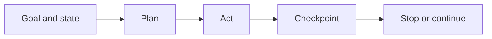

# 8.1 — Agent or Workflow?

*Book 8: Agent Systems · Read 25 min · Worked example 20 min · Code/design practice 45–60 min · Review 10 min*

## Before you begin

- Books 5–7
- State machines
- Tools and evaluation

If a prerequisite is unfamiliar, use site search and read only enough to explain it and complete a small example. Do not block progress by mastering every upstream topic first.

## Why this chapter exists

Define agents by goal-directed action selection in a loop and contrast them with deterministic workflows and single tool calls.

The engineering objective is not to memorize vocabulary. By the end, you should be able to describe the mechanism, build or inspect a small implementation, recognize its failure modes, and decide where it belongs in a larger system.

## Learning objectives

- Explain why agent or workflow? matters using the chapter scenario, not abstract definitions alone.
- Trace how **agency** and **workflows** interact in the book-level visual.
- Implement or design the bounded practice while holding evaluation cases fixed.
- Diagnose at least two failure modes specific to control.
- Decide where this chapter's mechanism belongs in a production architecture and what evidence justifies it.

!!! note "Enduring principle"
    Use the least autonomy that handles the uncertainty in the task.

## Mental model



Read the visual from left to right, then trace failures from right to left. The diagram is a book-level map; this chapter explains how **agent or workflow?** changes one or more transitions.

## Core concepts

The concepts form a system, not a vocabulary list. Read each section below before attempting the practice exercise.

### Agency

Agency is goal-directed action selection in a loop—observe, decide, act—rather than a single model call. It implies autonomy bounded by policy, tools, and termination rules. See the [Agency concept card](../../concepts/cards/agency.md).

**Example:** An agent chooses which tool to call next based on observations, unlike a fixed workflow script.

**Evidence of understanding:** Compare task completion on variable inputs between scripted workflow and agent with same tools.

### Workflows

Workflows are deterministic orchestrations with predefined steps, branches, and error handlers. They excel when paths are known and compliance requires repeatability. See the [Workflows concept card](../../concepts/cards/workflows.md).

**Example:** Invoice approval always follows submit → manager → finance with explicit gates.

**Evidence of understanding:** Measure success rate and change failure rate versus agent on identical structured tasks.

### State Machines

State machines model allowed statuses and transitions explicitly, making illegal steps unrepresentable. They clarify where agents pause, resume, or terminate. See the [State Machines concept card](../../concepts/cards/state-machines.md).

**Example:** Ticket automation states: open → pending_approval → resolved with defined transition triggers.

**Evidence of understanding:** Draw state diagram and verify code rejects all undefined transitions in tests.

### Autonomy

Autonomy is how much discretion the system has to choose actions without human approval. More autonomy demands stronger evals, budgets, and rollback. See the [Autonomy concept card](../../concepts/cards/autonomy.md).

**Example:** Auto-closing duplicate tickets is low autonomy; auto-issuing refunds is high and needs gates.

**Evidence of understanding:** Document autonomy level per action type and map each to required approval policy.

### Control

Control mechanisms—approvals, rate limits, tool allowlists— constrain agent behavior within safe envelopes. Control is designed, not emergent from prompts alone. See the [Control concept card](../../concepts/cards/control.md).

**Example:** Payments above $500 require human approval even if the agent recommends proceed.

**Evidence of understanding:** Attempt forbidden actions in red-team tests and verify control layer blocks 100%.

## Worked example

**Book scenario:** A multi-step task may pause for hours and must resume without repeating side effects.

**Situation:** A multi-step task may pause for hours and must resume without repeating side effects. Product wants an "agent" for employee onboarding; ops wants predictable workflows.

**Baseline:** Hard-coded workflow with 12 steps—breaks when vendor API response order changes.

**Application:** Model same onboarding task as deterministic workflow vs goal-directed agent loop; compare failure handling when optional branch appears; document where autonomy earns its cost.

**Test cases:** (1) Normal: happy-path hire with all docs present. (2) Boundary: optional visa check branch. (3) Adversarial: external API returns transient 503 mid-flow.

**Measurement:** Completion rate, recovery steps, human interventions per path; side-effect duplication count (must be zero).

**Design question:** Which onboarding subtask justifies agent autonomy over a workflow state machine?

## Chapter hook

Run this short snippet first to anchor **agent or workflow?** before the book-level sample:

```python
WORKFLOW = ["create_account", "assign_laptop", "grant_access"]
AGENT = {"goal": "complete onboarding", "actions": WORKFLOW, "replans": True}
def run(steps, fail_at=None):
    done = []
    for i, s in enumerate(steps):
        if fail_at == i:
            return done, "paused"
        done.append(s)
    return done, "complete"
print("workflow:", run(WORKFLOW, fail_at=1))
print("agent can resume:", AGENT["replans"])
```

Predict the printed values, then change one line tied to **agency** or **workflows** and observe how the chapter mechanism moves.

## Runnable code sample

The following dependency-free sample supports this book. Download it from the [code-sample library](../../code-samples/08-agent-state-machine.py) or run the matching file under `examples/`.

```python
--8<-- "docs/code-samples/08-agent-state-machine.py"
```

Expected output is printed to the terminal. Before running it, predict which values or decisions should change. Then introduce one failure and convert the observation into a test.

??? success "Expected observation"
    The state machine pauses at approval, resumes after approval, and terminates within the attempt budget.

This is a **book-level sample**. Its relevance to this chapter is the boundary between **agency** and **workflows**. Modify that boundary, not unrelated lines, when completing the chapter exercise.

## Engineering practice

**Build:** Model the same task as a workflow and as an agent, then compare.

Work in three passes tailored to this chapter:

1. **Baseline:** Implement the task without agency and record quality, latency, and failure cases.
2. **Mechanism:** Add workflows while keeping inputs and evaluation fixed; note what changed in intermediate state.
3. **Judgment:** Compare outcomes on normal, boundary, and adversarial cases; document when agent or workflow? earns its operational cost.

Capture assumptions, test cases, results, and one architecture decision record. A successful lab explains *why* behavior changed, not merely that the program ran.

## Spec-driven habit

Every chapter lab pairs reading with **executable acceptance**. Before implementing book 8.1 — agent or workflow?:

1. Draft cases in `test_lab.py` or `specs/lab-0801.yaml`.
2. Use [Cursor Plan/Agent](https://cursor.com/) with "read spec first, then minimal diff".
3. Or use [OpenSpec](https://openspec.dev/) `/opsx:propose` so requirements live in `openspec/` next to code.

→ [Spec-driven workflow guide](../../getting-started/spec-driven-workflow.md) · [Lab 8.1](../../labs/0801-agent-or-workflow.md)


## Architecture lens

For a production design in **Agent Systems**, make the following explicit for **agent or workflow?**:

| Concern | Question to answer |
|---|---|
| **Ownership** | Which service owns agency versus downstream consumers of its output? |
| **Contract** | What typed inputs, outputs, errors, and version does the state machines boundary expose? |
| **Evidence** | Which eval slices prove agent or workflow? meets requirements before and after each release? |
| **Security** | What untrusted data crosses the control boundary and how is it sanitized or authorized? |
| **Operations** | What is logged at this chapter's transition, what triggers retry or rollback, and what is cached? |
| **Economics** | Which resource—tokens, retrieval calls, GPU seconds, human review—dominates cost for this mechanism? |

## Failure clinic

Reproduce failures at the chapter boundary—do not debug only final output.

| Failure | Symptom | Likely cause | First response |
|---|---|---|---|
| **Baseline illusion** | The system looks fine on demo prompts but fails on the book scenario | Evaluation cases do not cover agency or workflows | Add the chapter's normal, boundary, and adversarial cases before tuning |
| **Mechanism mismatch** | Adding complexity does not improve the measured outcome | agent or workflow? is applied at the wrong layer or without fixing inputs | Trace the book visual and verify the transition this chapter owns |
| **Silent degradation** | Outputs remain fluent while decisions become wrong | Failure in control without observability at that boundary | Log intermediate state, version config, and compare against the baseline |
| **Operational drift** | Quality changes after deploy though prompts are unchanged | Data, permissions, or upstream agency behavior shifted | Pin versions, inspect ingestion and policy filters, re-run slice evals |

Define agents by goal-directed action selection in a loop and contrast them with deterministic workflows and single tool calls. When triaging, preserve full inputs, retrieved evidence, tool traces, and model or index versions.

## Evolution lens

- **Yesterday:** Manual playbooks, brittle rules, or single-pass models handled parts of agent or workflow? without explicit agency.
- **Today:** Engineering teams implement agent or workflow? as testable components with baselines, typed boundaries, and stage-specific evaluation.
- **Tomorrow:** Better automation may reduce toil, but control and governance constraints will still require explicit design.
- **What survives:** Use the least autonomy that handles the uncertainty in the task.

## Knowledge check

1. How do agents differ from workflows in handling unexpected observations?
2. When is autonomy unnecessary cost?
3. What baseline uses fixed scripts only?

??? question "Answer guidance"
    Q1: Agents replan; workflows need predefined branches. Q2: Fully deterministic tasks with stable APIs. Q3: Static DAG with no replanning.

## Mastery questions

??? tip "Model answers (proficient level)"
        1. **Explain agency without jargon and give a counterexample.**
       *Proficient answer:* agency is goal-directed action selection in a loop—observe, decide, act—rather than a single model call. Counterexample: applying it when the task is fully deterministic and cheaper to hard-code.
    2. **Compare workflows with control using quality, cost, latency, and risk.**
       *Proficient answer:* workflows are deterministic orchestrations with predefined steps, branches, and error handlers; control mechanisms—approvals, rate limits, tool allowlists— constrain agent behavior within safe envelopes. Trade quality gains against operational and security cost on the chapter scenario.
    3. **Design a minimal experiment that tests the chapter's central claim.**
       *Proficient answer:* Fix a baseline and three cases (normal, boundary, adversarial). Add only the chapter mechanism, measure one task metric plus cost/latency, and pre-register what result would falsify the claim.
    4. **Identify which component should own validation, authorization, and observability.**
       *Proficient answer:* Validation belongs at the typed boundary after workflows; authorization before any side effect or retrieval of restricted data; observability at the transition agent or workflow? introduces in the book visual.
    5. **State what would remain true if today's leading libraries and vendors disappeared.**
       *Proficient answer:* Use the least autonomy that handles the uncertainty in the task.

## Self-assessment rubric

| Level | Evidence |
|---|---|
| Not yet | Can repeat terms but cannot trace the visual or predict the sample. |
| Developing | Can explain the mechanism and complete the normal case with help. |
| Proficient | Can implement the exercise, diagnose a failure, and compare a baseline. |
| Transfer | Can defend an architecture choice in a new domain with evaluation evidence. |

## Evidence and further study

- Primary papers for the selected agent pattern
- Distributed-systems references for durable execution and idempotency

Use primary sources for technical claims and official documentation for current product behavior. Record the version or access date for evolving material.

## Continue

Return to the [book index](index.md) or use site search to follow the chapter's concepts into the knowledge-area and reference pages.
