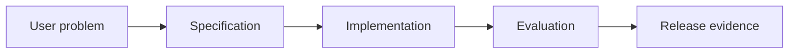

# 9.1 — Discovering the Right Problem

*Book 9: AI Software and Product Engineering · Read 25 min · Worked example 20 min · Code/design practice 45–60 min · Review 10 min*

## Before you begin

- Books 5–8
- Software testing
- Product discovery basics

If a prerequisite is unfamiliar, use site search and read only enough to explain it and complete a small example. Do not block progress by mastering every upstream topic first.

## Why this chapter exists

Identify user jobs, workflow constraints, baseline performance, capability fit, failure cost, and measurable value before building.

The engineering objective is not to memorize vocabulary. By the end, you should be able to describe the mechanism, build or inspect a small implementation, recognize its failure modes, and decide where it belongs in a larger system.

## Learning objectives

- Explain why discovering the right problem matters using the chapter scenario, not abstract definitions alone.
- Trace how **user research** and **jobs-to-be-done** interact in the book-level visual.
- Implement or design the bounded practice while holding evaluation cases fixed.
- Diagnose at least two failure modes specific to success metrics.
- Decide where this chapter's mechanism belongs in a production architecture and what evidence justifies it.

!!! note "Enduring principle"
    Optimize the human outcome, not the amount of AI in the product.

## Mental model



Read the visual from left to right, then trace failures from right to left. The diagram is a book-level map; this chapter explains how **discovering the right problem** changes one or more transitions.

## Core concepts

The concepts form a system, not a vocabulary list. Read each section below before attempting the practice exercise.

### User Research

User research observes real workflows, pain points, and workarounds before proposing AI features. It prevents building impressive demos nobody needs. See the [User Research concept card](../../concepts/cards/user-research.md).

**Example:** Watching support agents copy-paste from three systems reveals integration beats summarization.

**Evidence of understanding:** Document five observed user sessions and map pains to non-AI and AI options.

### Jobs-To-Be-Done

Jobs-to-be-done frames what users hire a product to accomplish, not which technology it uses. AI fits when it improves the job outcome measurably. See the [Jobs-To-Be-Done concept card](../../concepts/cards/jobs-to-be-done.md).

**Example:** Users hire expense tool to 'get reimbursed fast', not to 'chat with AI'.

**Evidence of understanding:** Write job statement and success metric independent of model choice.

### Baseline Workflow

Baseline workflow documents how users solve the task today—time, errors, tools—before AI intervention. Improvement requires beating this baseline. See the [Baseline Workflow concept card](../../concepts/cards/baseline-workflow.md).

**Example:** Manual ticket tagging takes 45s each; AI must beat accuracy and time with correction cost included.

**Evidence of understanding:** Measure baseline task time and error rate on ten representative sessions.

### Feasibility

Feasibility assesses whether data, latency, risk, and model capability can meet requirements—not whether a demo works once. See the [Feasibility concept card](../../concepts/cards/feasibility.md).

**Example:** If no labeled data exists and mistakes cost $10k, feasibility may be low despite flashy prototype.

**Evidence of understanding:** List top three feasibility risks with mitigation or kill criteria.

### Success Metrics

Success metrics tie releases to user-valued outcomes—task success, time saved, revenue—not model perplexity alone. See the [Success Metrics concept card](../../concepts/cards/success-metrics.md).

**Example:** Deflect 20% of L1 tickets without increasing reopen rate defines success for support bot.

**Evidence of understanding:** Pre-register primary and guardrail metrics before launch with target deltas.

## Worked example

**Book scenario:** A product team must convert a vague AI feature request into testable release evidence.

**Situation:** A product team must convert a vague AI feature request into testable release evidence. Sales promised "AI onboarding assistant" without defining success.

**Baseline:** Build chat UI immediately—demo impresses but no measurable workflow improvement.

**Application:** Write problem brief: user job, current baseline workflow, failure costs, non-AI alternative, capability fit, success metrics (time-to-productive, error rate).

**Test cases:** (1) Normal: new hire with complete data. (2) Boundary: hire lacking manager assignment. (3) Adversarial: success metric gameable by skipping compliance steps.

**Measurement:** Baseline workflow timing study n≥20, projected ROI with confidence range, feasibility red flags.

**Design question:** What non-AI alternative would you ship if models were unavailable?

## Chapter hook

Run this short snippet first to anchor **discovering the right problem** before the book-level sample:

```python
CHAPTER = "9.1"
print("chapter hook:", CHAPTER)
brief = {
    "job": "get employee productive day 1",
    "baseline_hours": 6.5,
    "failure_cost": "compliance breach",
    "non_ai": "checklist app with human verifier",
}
print(brief)
print("---")
print("change one input above, predict output, re-run")
```

Predict the printed values, then change one line tied to **user research** or **jobs-to-be-done** and observe how the chapter mechanism moves.

## Runnable code sample

The following dependency-free sample supports this book. Download it from the [code-sample library](../../code-samples/09-spec-driven-development.py) or run the matching file under `examples/`.

```python
--8<-- "docs/code-samples/09-spec-driven-development.py"
```

Expected output is printed to the terminal. Before running it, predict which values or decisions should change. Then introduce one failure and convert the observation into a test.

??? success "Expected observation"
    Both executable acceptance examples pass; changing the abstention behavior should fail the second case.

This is a **book-level sample**. Its relevance to this chapter is the boundary between **user research** and **jobs-to-be-done**. Modify that boundary, not unrelated lines, when completing the chapter exercise.

## Engineering practice

**Build:** Write a problem brief with a non-AI alternative.

Work in three passes tailored to this chapter:

1. **Baseline:** Implement the task without user research and record quality, latency, and failure cases.
2. **Mechanism:** Add jobs-to-be-done while keeping inputs and evaluation fixed; note what changed in intermediate state.
3. **Judgment:** Compare outcomes on normal, boundary, and adversarial cases; document when discovering the right problem earns its operational cost.

Capture assumptions, test cases, results, and one architecture decision record. A successful lab explains *why* behavior changed, not merely that the program ran.

## Spec-driven habit

Every chapter lab pairs reading with **executable acceptance**. Before implementing book 9.1 — discovering the right problem:

1. Draft cases in `test_lab.py` or `specs/lab-0901.yaml`.
2. Use [Cursor Plan/Agent](https://cursor.com/) with "read spec first, then minimal diff".
3. Or use [OpenSpec](https://openspec.dev/) `/opsx:propose` so requirements live in `openspec/` next to code.

→ [Spec-driven workflow guide](../../getting-started/spec-driven-workflow.md) · [Lab 9.1](../../labs/0901-discovering-the-right-problem.md)


## Architecture lens

For a production design in **AI Software and Product Engineering**, make the following explicit for **discovering the right problem**:

| Concern | Question to answer |
|---|---|
| **Ownership** | Which service owns user research versus downstream consumers of its output? |
| **Contract** | What typed inputs, outputs, errors, and version does the baseline workflow boundary expose? |
| **Evidence** | Which eval slices prove discovering the right problem meets requirements before and after each release? |
| **Security** | What untrusted data crosses the success metrics boundary and how is it sanitized or authorized? |
| **Operations** | What is logged at this chapter's transition, what triggers retry or rollback, and what is cached? |
| **Economics** | Which resource—tokens, retrieval calls, GPU seconds, human review—dominates cost for this mechanism? |

## Failure clinic

Reproduce failures at the chapter boundary—do not debug only final output.

| Failure | Symptom | Likely cause | First response |
|---|---|---|---|
| **Baseline illusion** | The system looks fine on demo prompts but fails on the book scenario | Evaluation cases do not cover user research or jobs-to-be-done | Add the chapter's normal, boundary, and adversarial cases before tuning |
| **Mechanism mismatch** | Adding complexity does not improve the measured outcome | discovering the right problem is applied at the wrong layer or without fixing inputs | Trace the book visual and verify the transition this chapter owns |
| **Silent degradation** | Outputs remain fluent while decisions become wrong | Failure in success metrics without observability at that boundary | Log intermediate state, version config, and compare against the baseline |
| **Operational drift** | Quality changes after deploy though prompts are unchanged | Data, permissions, or upstream user research behavior shifted | Pin versions, inspect ingestion and policy filters, re-run slice evals |

Identify user jobs, workflow constraints, baseline performance, capability fit, failure cost, and measurable value before building. When triaging, preserve full inputs, retrieved evidence, tool traces, and model or index versions.

## Evolution lens

- **Yesterday:** Manual playbooks, brittle rules, or single-pass models handled parts of discovering the right problem without explicit user research.
- **Today:** Engineering teams implement discovering the right problem as testable components with baselines, typed boundaries, and stage-specific evaluation.
- **Tomorrow:** Better automation may reduce toil, but success metrics and governance constraints will still require explicit design.
- **What survives:** Optimize the human outcome, not the amount of AI in the product.

## Knowledge check

1. Why optimize human outcome rather than amount of AI?
2. How do gameable metrics create false success?
3. What discovery baseline skips user research?

??? question "Answer guidance"
    Q1: AI is a means; value is workflow improvement. Q2: Metric improves while compliance worsens. Q3: Build because LLMs exist.

## Mastery questions

??? tip "Model answers (proficient level)"
        1. **Explain user research without jargon and give a counterexample.**
       *Proficient answer:* user research observes real workflows, pain points, and workarounds before proposing ai features. Counterexample: applying it when the task is fully deterministic and cheaper to hard-code.
    2. **Compare jobs-to-be-done with success metrics using quality, cost, latency, and risk.**
       *Proficient answer:* jobs-to-be-done frames what users hire a product to accomplish, not which technology it uses; success metrics tie releases to user-valued outcomes—task success, time saved, revenue—not model perplexity alone. Trade quality gains against operational and security cost on the chapter scenario.
    3. **Design a minimal experiment that tests the chapter's central claim.**
       *Proficient answer:* Fix a baseline and three cases (normal, boundary, adversarial). Add only the chapter mechanism, measure one task metric plus cost/latency, and pre-register what result would falsify the claim.
    4. **Identify which component should own validation, authorization, and observability.**
       *Proficient answer:* Validation belongs at the typed boundary after jobs-to-be-done; authorization before any side effect or retrieval of restricted data; observability at the transition discovering the right problem introduces in the book visual.
    5. **State what would remain true if today's leading libraries and vendors disappeared.**
       *Proficient answer:* Optimize the human outcome, not the amount of AI in the product.

## Self-assessment rubric

| Level | Evidence |
|---|---|
| Not yet | Can repeat terms but cannot trace the visual or predict the sample. |
| Developing | Can explain the mechanism and complete the normal case with help. |
| Proficient | Can implement the exercise, diagnose a failure, and compare a baseline. |
| Transfer | Can defend an architecture choice in a new domain with evaluation evidence. |

## Evidence and further study

- Repository contribution and test documentation
- Architecture Decision Record guidance and product experiment literature

Use primary sources for technical claims and official documentation for current product behavior. Record the version or access date for evolving material.

## Continue

Return to the [book index](index.md) or use site search to follow the chapter's concepts into the knowledge-area and reference pages.
