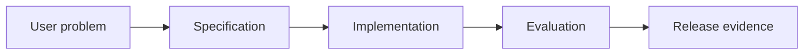

# 9.2 — Specification-Driven Development

*Book 9: AI Software and Product Engineering · Read 25 min · Worked example 20 min · Code/design practice 45–60 min · Review 10 min*

## Before you begin

- Books 5–8
- Software testing
- Product discovery basics

If a prerequisite is unfamiliar, use site search and read only enough to explain it and complete a small example. Do not block progress by mastering every upstream topic first.

## Why this chapter exists

Translate intent into functional, prompt, tool, agent, data, safety, and evaluation specifications with acceptance criteria.

The engineering objective is not to memorize vocabulary. By the end, you should be able to describe the mechanism, build or inspect a small implementation, recognize its failure modes, and decide where it belongs in a larger system.

## Learning objectives

- Explain why specification-driven development matters using the chapter scenario, not abstract definitions alone.
- Trace how **functional specifications** and **acceptance criteria** interact in the book-level visual.
- Implement or design the bounded practice while holding evaluation cases fixed.
- Diagnose at least two failure modes specific to evaluation specs.
- Decide where this chapter's mechanism belongs in a production architecture and what evidence justifies it.

!!! note "Enduring principle"
    Specifications align humans and agents around observable outcomes and constraints.

## Mental model



Read the visual from left to right, then trace failures from right to left. The diagram is a book-level map; this chapter explains how **specification-driven development** changes one or more transitions.

## Core concepts

The concepts form a system, not a vocabulary list. Read each section below before attempting the practice exercise.

### Functional Specifications

Functional specifications describe observable system behavior—inputs, outputs, errors—for builders and testers. They precede implementation and model choice. See the [Functional Specifications concept card](../../concepts/cards/functional-specifications.md).

**Example:** Spec states: given valid invoice PDF, return JSON with vendor, total, date or structured error code.

**Evidence of understanding:** Write acceptance examples as executable tests before coding.

### Acceptance Criteria

Acceptance criteria are pass/fail conditions for feature completion—testable, unambiguous, tied to user value. See the [Acceptance Criteria concept card](../../concepts/cards/acceptance-criteria.md).

**Example:** Given ambiguous date, system asks clarifying question rather than guessing—100% on test set.

**Evidence of understanding:** Convert each criterion into an automated or manual test case with owner.

### Prompt Specs

Prompt specs version instructions, constraints, examples, and expected behaviors like API contracts. They enable review and regression unlike ad hoc prompts. See the [Prompt Specs concept card](../../concepts/cards/prompt-specs.md).

**Example:** Prompt spec defines abstention when confidence low and JSON schema for outputs.

**Evidence of understanding:** Diff prompt spec versions in CI and run regression eval on every change.

### Tool Contracts

Tool contracts specify schemas, auth, idempotency, errors, and SLAs for each agent tool. They are integration boundaries models depend on. See the [Tool Contracts concept card](../../concepts/cards/tool-contracts.md).

**Example:** search_docs contract promises p95 500ms, max 10 results, ReadScope auth.

**Evidence of understanding:** Contract tests mock failures and verify agent handles each error code.

### Evaluation Specs

Evaluation specs define datasets, metrics, slices, and release thresholds before shipping. They turn 'good enough' into numbers. See the [Evaluation Specs concept card](../../concepts/cards/evaluation-specs.md).

**Example:** Eval spec: 200 cases, faithfulness ≥ 0.9, P0 safety cases 100% pass.

**Evidence of understanding:** Block merge if eval spec checklist incomplete in release ticket.

## Worked example

**Book scenario:** A product team must convert a vague AI feature request into testable release evidence.

**Situation:** The onboarding assistant needs specs engineering and compliance can audit—prompts, tools, and evals must align.

**Baseline:** Slack thread of informal requirements.

**Application:** Write functional spec, prompt spec with acceptance examples, tool contracts, safety constraints, evaluation spec with executable pass/fail cases before coding.

**Test cases:** (1) Normal: hire with standard role. (2) Boundary: abstain when policy missing. (3) Adversarial: attempt privilege escalation via chat.

**Measurement:** Spec review sign-offs, % acceptance examples automated, defects found pre-impl vs post-impl.

**Design question:** Which acceptance example would fail if abstention behavior regresses?

## Chapter hook

Run this short snippet first to anchor **specification-driven development** before the book-level sample:

```python
acceptance = [
    {"input": "grant admin access", "expect": "require approval"},
    {"input": "unknown policy", "expect": "abstain"},
]
def check(outcome, expected):
    return expected in outcome
for case in acceptance:
    simulated = "abstain: no policy found" if "unknown" in case["input"] else "require approval"
    print(case["input"], check(simulated, case["expect"]))
```

Predict the printed values, then change one line tied to **functional specifications** or **acceptance criteria** and observe how the chapter mechanism moves.

## Runnable code sample

The following dependency-free sample supports this book. Download it from the [code-sample library](../../code-samples/09-spec-driven-development.py) or run the matching file under `examples/`.

```python
--8<-- "docs/code-samples/09-spec-driven-development.py"
```

Expected output is printed to the terminal. Before running it, predict which values or decisions should change. Then introduce one failure and convert the observation into a test.

??? success "Expected observation"
    Both executable acceptance examples pass; changing the abstention behavior should fail the second case.

This is a **book-level sample**. Its relevance to this chapter is the boundary between **functional specifications** and **acceptance criteria**. Modify that boundary, not unrelated lines, when completing the chapter exercise.

## Engineering practice

**Build:** Write executable examples before implementation.

Work in three passes tailored to this chapter:

1. **Baseline:** Implement the task without functional specifications and record quality, latency, and failure cases.
2. **Mechanism:** Add acceptance criteria while keeping inputs and evaluation fixed; note what changed in intermediate state.
3. **Judgment:** Compare outcomes on normal, boundary, and adversarial cases; document when specification-driven development earns its operational cost.

Capture assumptions, test cases, results, and one architecture decision record. A successful lab explains *why* behavior changed, not merely that the program ran.

## Spec-driven tooling: OpenSpec and Cursor

Specification-driven development is how teams keep **humans, CI, and coding agents** aligned. Two common stacks:

| Tool | What it stores | Best for |
|---|---|---|
| **[OpenSpec](https://openspec.dev/)** | `openspec/specs/` truth + `openspec/changes/` proposals, delta specs, tasks | Repo-level requirements that survive chat sessions; brownfield changes |
| **[Cursor](https://cursor.com/)** | `.cursor/rules/`, `AGENTS.md`, skills, Plan/Agent sessions | Day-to-day implementation with spec-first prompts and review |

Both share the same discipline: **acceptance examples before code**.

### 1. Executable acceptance (language-agnostic)

```python
# specs/acceptance.py — run before and after implementation
CASES = [
    {"input": "grant admin access", "expect": "require approval"},
    {"input": "unknown policy", "expect": "abstain"},
]

def check(outcome: str, expected: str) -> bool:
    return expected in outcome.lower()

failures = []
for case in CASES:
    simulated = (
        "abstain: no policy found"
        if "unknown" in case["input"]
        else "require approval"
    )
    if not check(simulated, case["expect"]):
        failures.append(case)
raise SystemExit(1 if failures else 0)
```

```bash
python specs/acceptance.py && echo "spec green"
```

### 2. OpenSpec — init, propose, apply

Requires **Node.js 20.19+**.

```bash
npm install -g @fission-ai/openspec@latest
openspec init
openspec update          # refresh assistant slash commands after profile changes
```

Explore a fuzzy idea without artifacts yet:

```text
/opsx:explore
We need an onboarding assistant that abstains when policy is missing and requires approval for admin grants.
```

When scope is clear, propose a change (creates `openspec/changes/<id>/`):

```text
/opsx:propose Add onboarding assistant policy spec with abstention and approval gates
```

Review generated files before coding:

```text
openspec/changes/add-onboarding-policy/
  proposal.md     # why and what
  tasks.md        # implementation checklist
  specs/          # ADDED / MODIFIED / REMOVED requirements
  design.md       # how (optional)
```

Implement against the plan:

```text
/opsx:apply
python -m pytest labs/0902-specification-driven-development/test_lab.py -q
```

Archive merges deltas into `openspec/specs/`:

```text
/opsx:archive
```

Example delta requirement (inside a change folder):

```markdown
## ADDED Requirements
### Requirement: Admin grant approval
The system SHALL require explicit approval before granting admin access.

#### Scenario: Privileged grant request
- GIVEN a user requests admin access
- WHEN no approval token is present
- THEN the system SHALL respond with require approval
```

### 3. Cursor — rules, Plan mode, and lab workflow

**Project rules** (`.cursor/rules/spec-driven.mdc`):

```markdown
---
description: Spec-driven AI features
globs: labs/**, specs/**, openspec/**
---
- Read acceptance specs and failing tests before editing implementation files
- Prefer minimal diffs; do not expand scope beyond the spec
- Run: python -m pytest test_lab.py -q (or path shown in AGENTS.md)
- Treat openspec/changes/*/specs as authoritative during active changes
```

**Plan mode prompt** (paste before Agent edits):

```text
Context: Book 9.2 Specification-Driven Development.
Read openspec/changes/<active-change>/proposal.md OR specs/lab-0902-acceptance.yaml.
List any missing normal/boundary/adversarial cases.
Propose a plan that only passes existing tests plus the spec—no extra features.
```

**Commands to verify** (same gates as CI):

```bash
cursor .
python labs/0902-specification-driven-development/main.py
python -m pytest labs/0902-specification-driven-development/test_lab.py -q
mkdocs build --strict
```

### 4. Tie specs to eval and release

| Spec type | Lives in | Gates |
|---|---|---|
| Functional / acceptance | `specs/`, `test_lab.py`, OpenSpec deltas | Local pytest, PR review |
| Prompt / tool | `specs/prompts/`, OpenSpec `specs/` | Regression eval in CI |
| Evaluation | `eval/spec.yaml` | Release threshold ([eval-gated release](../../guides/eval-gated-release.md)) |

→ Continue with [Lab 9.2](../../labs/0902-specification-driven-development.md) · [Spec-to-production guide](../../guides/spec-to-production-feature.md) · [Coding agent workspace](../../guides/coding-agent-workspace.md)


## Architecture lens

For a production design in **AI Software and Product Engineering**, make the following explicit for **specification-driven development**:

| Concern | Question to answer |
|---|---|
| **Ownership** | Which service owns functional specifications versus downstream consumers of its output? |
| **Contract** | What typed inputs, outputs, errors, and version does the prompt specs boundary expose? |
| **Evidence** | Which eval slices prove specification-driven development meets requirements before and after each release? |
| **Security** | What untrusted data crosses the evaluation specs boundary and how is it sanitized or authorized? |
| **Operations** | What is logged at this chapter's transition, what triggers retry or rollback, and what is cached? |
| **Economics** | Which resource—tokens, retrieval calls, GPU seconds, human review—dominates cost for this mechanism? |

## Failure clinic

Reproduce failures at the chapter boundary—do not debug only final output.

| Failure | Symptom | Likely cause | First response |
|---|---|---|---|
| **Baseline illusion** | The system looks fine on demo prompts but fails on the book scenario | Evaluation cases do not cover functional specifications or acceptance criteria | Add the chapter's normal, boundary, and adversarial cases before tuning |
| **Mechanism mismatch** | Adding complexity does not improve the measured outcome | specification-driven development is applied at the wrong layer or without fixing inputs | Trace the book visual and verify the transition this chapter owns |
| **Silent degradation** | Outputs remain fluent while decisions become wrong | Failure in evaluation specs without observability at that boundary | Log intermediate state, version config, and compare against the baseline |
| **Operational drift** | Quality changes after deploy though prompts are unchanged | Data, permissions, or upstream functional specifications behavior shifted | Pin versions, inspect ingestion and policy filters, re-run slice evals |

Translate intent into functional, prompt, tool, agent, data, safety, and evaluation specifications with acceptance criteria. When triaging, preserve full inputs, retrieved evidence, tool traces, and model or index versions.

## Evolution lens

- **Yesterday:** Manual playbooks, brittle rules, or single-pass models handled parts of specification-driven development without explicit functional specifications.
- **Today:** Engineering teams implement specification-driven development as testable components with baselines, typed boundaries, and stage-specific evaluation.
- **Tomorrow:** Better automation may reduce toil, but evaluation specs and governance constraints will still require explicit design.
- **What survives:** Specifications align humans and agents around observable outcomes and constraints.

## Knowledge check

1. Why write executable examples before implementation?
2. What belongs in a tool contract versus a prompt?
3. What spec baseline is prose-only?

??? question "Answer guidance"
    Q1: They define observable done and enable regression tests. Q2: Contracts: types, errors, auth; prompts: intent and format. Q3: Marketing one-pager without acceptance tests.

## Mastery questions

??? tip "Model answers (proficient level)"
        1. **Explain functional specifications without jargon and give a counterexample.**
       *Proficient answer:* functional specifications describe observable system behavior—inputs, outputs, errors—for builders and testers. Counterexample: applying it when the task is fully deterministic and cheaper to hard-code.
    2. **Compare acceptance criteria with evaluation specs using quality, cost, latency, and risk.**
       *Proficient answer:* acceptance criteria are pass/fail conditions for feature completion—testable, unambiguous, tied to user value; evaluation specs define datasets, metrics, slices, and release thresholds before shipping. Trade quality gains against operational and security cost on the chapter scenario.
    3. **Design a minimal experiment that tests the chapter's central claim.**
       *Proficient answer:* Fix a baseline and three cases (normal, boundary, adversarial). Add only the chapter mechanism, measure one task metric plus cost/latency, and pre-register what result would falsify the claim.
    4. **Identify which component should own validation, authorization, and observability.**
       *Proficient answer:* Validation belongs at the typed boundary after acceptance criteria; authorization before any side effect or retrieval of restricted data; observability at the transition specification-driven development introduces in the book visual.
    5. **State what would remain true if today's leading libraries and vendors disappeared.**
       *Proficient answer:* Specifications align humans and agents around observable outcomes and constraints.

## Self-assessment rubric

| Level | Evidence |
|---|---|
| Not yet | Can repeat terms but cannot trace the visual or predict the sample. |
| Developing | Can explain the mechanism and complete the normal case with help. |
| Proficient | Can implement the exercise, diagnose a failure, and compare a baseline. |
| Transfer | Can defend an architecture choice in a new domain with evaluation evidence. |

## Evidence and further study

- Repository contribution and test documentation
- Architecture Decision Record guidance and product experiment literature

Use primary sources for technical claims and official documentation for current product behavior. Record the version or access date for evolving material.

## Continue

Return to the [book index](index.md) or use site search to follow the chapter's concepts into the knowledge-area and reference pages.
