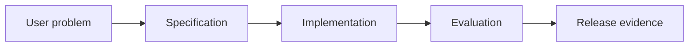

# 9.3 — AI-Native Development Workflow

*Book 9: AI Software and Product Engineering · Read 25 min · Worked example 20 min · Code/design practice 45–60 min · Review 10 min*

## Before you begin

- Books 5–8
- Software testing
- Product discovery basics

If a prerequisite is unfamiliar, use site search and read only enough to explain it and complete a small example. Do not block progress by mastering every upstream topic first.

## Why this chapter exists

Organize repositories, instructions, skills, context files, branches, reviews, tests, and coding-agent collaboration.

The engineering objective is not to memorize vocabulary. By the end, you should be able to describe the mechanism, build or inspect a small implementation, recognize its failure modes, and decide where it belongs in a larger system.

## Learning objectives

- Explain why ai-native development workflow matters using the chapter scenario, not abstract definitions alone.
- Trace how **repo instructions** and **skills** interact in the book-level visual.
- Implement or design the bounded practice while holding evaluation cases fixed.
- Diagnose at least two failure modes specific to code review.
- Decide where this chapter's mechanism belongs in a production architecture and what evidence justifies it.

!!! note "Enduring principle"
    AI accelerates change production, making specification and verification more important.

## Mental model



Read the visual from left to right, then trace failures from right to left. The diagram is a book-level map; this chapter explains how **ai-native development workflow** changes one or more transitions.

## Core concepts

The concepts form a system, not a vocabulary list. Read each section below before attempting the practice exercise.

### Repo Instructions

Repo instructions—AGENTS.md, CONTRIBUTING—orient coding agents to build, test, and review conventions. They reduce wrong-file edits and skipped tests. See the [Repo Instructions concept card](../../concepts/cards/repo-instructions.md).

**Example:** Instructions specify pytest command, lint rules, and forbidden directories.

**Evidence of understanding:** Run agent on sample task and measure review comments tied to instruction violations.

### Skills

Skills package reusable agent capabilities—prompts, scripts, checklists—for specific tasks in Cursor and similar tools. They encode institutional workflow knowledge. See the [Skills concept card](../../concepts/cards/skills.md).

**Example:** A 'create PR' skill runs tests, drafts description template, and calls gh CLI.

**Evidence of understanding:** Compare task success rate with skill versus generic agent on three repo tasks.

### Context Files

Context files—.cursorrules, architecture docs—supply persistent project knowledge to coding agents. Stale context misleads worse than no context. See the [Context Files concept card](../../concepts/cards/context-files.md).

**Example:** Architecture.md describes service boundaries so agent edits correct package.

**Evidence of understanding:** Update context file when ADR changes and note version in agent traces.

### Ai Coding Agents

AI coding agents autonomously edit repositories given goals, tools, and constraints. They amplify throughput but require specs, tests, and human review. See the [Ai Coding Agents concept card](../../concepts/cards/ai-coding-agents.md).

**Example:** Agent implements feature branch with tests; human reviews diff before merge.

**Evidence of understanding:** Track defect density and review time per agent-generated PR versus human-only.

### Code Review

Code review evaluates correctness, security, and maintainability of changes—including agent-written code. It remains accountability gate before merge. See the [Code Review concept card](../../concepts/cards/code-review.md).

**Example:** Reviewer checks agent did not skip auth on new endpoint despite passing happy-path tests.

**Evidence of understanding:** Measure post-merge incident rate for agent-authored versus human-authored merges.

## Worked example

**Book scenario:** A product team must convert a vague AI feature request into testable release evidence.

**Situation:** Team uses AI coding agents to implement onboarding; velocity rises but review burden spikes.

**Baseline:** Ad-hoc prompting in IDE with no repo instructions or test gates.

**Application:** Add AGENTS.md, skills for domain tasks, context files for architecture, require PR templates with eval evidence, compare review time across two assistant workflows.

**Test cases:** (1) Normal: bounded bugfix with tests. (2) Boundary: cross-module refactor. (3) Adversarial: agent adds silent dependency on deprecated API.

**Measurement:** PR review minutes, defect escape rate, test coverage delta.

**Design question:** Which repo instruction prevents agents from inventing nonexistent internal APIs?

## Chapter hook

Run this short snippet first to anchor **ai-native development workflow** before the book-level sample:

```python
CHAPTER = "9.3"
print("chapter hook:", CHAPTER)
REPO_RULES = ["run tests before commit", "use internal SDK docs", "no new deps without ADR"]
task = "add checkpoint resume"
checklist = [rule for rule in REPO_RULES]
print({"task": task, "agent_checklist": checklist})
print("---")
print("change one input above, predict output, re-run")
```

Predict the printed values, then change one line tied to **repo instructions** or **skills** and observe how the chapter mechanism moves.

## Runnable code sample

The following dependency-free sample supports this book. Download it from the [code-sample library](../../code-samples/09-spec-driven-development.py) or run the matching file under `examples/`.

```python
--8<-- "docs/code-samples/09-spec-driven-development.py"
```

Expected output is printed to the terminal. Before running it, predict which values or decisions should change. Then introduce one failure and convert the observation into a test.

??? success "Expected observation"
    Both executable acceptance examples pass; changing the abstention behavior should fail the second case.

This is a **book-level sample**. Its relevance to this chapter is the boundary between **repo instructions** and **skills**. Modify that boundary, not unrelated lines, when completing the chapter exercise.

## Engineering practice

**Build:** Run a bounded repository task with two assistants and compare review burden.

Work in three passes tailored to this chapter:

1. **Baseline:** Implement the task without repo instructions and record quality, latency, and failure cases.
2. **Mechanism:** Add skills while keeping inputs and evaluation fixed; note what changed in intermediate state.
3. **Judgment:** Compare outcomes on normal, boundary, and adversarial cases; document when ai-native development workflow earns its operational cost.

Capture assumptions, test cases, results, and one architecture decision record. A successful lab explains *why* behavior changed, not merely that the program ran.

## Spec-driven habit

Every chapter lab pairs reading with **executable acceptance**. Before implementing book 9.3 — ai-native development workflow:

1. Draft cases in `test_lab.py` or `specs/lab-0903.yaml`.
2. Use [Cursor Plan/Agent](https://cursor.com/) with "read spec first, then minimal diff".
3. Or use [OpenSpec](https://openspec.dev/) `/opsx:propose` so requirements live in `openspec/` next to code.

→ [Spec-driven workflow guide](../../getting-started/spec-driven-workflow.md) · [Lab 9.3](../../labs/0903-ai-native-development-workflow.md)


## Architecture lens

For a production design in **AI Software and Product Engineering**, make the following explicit for **ai-native development workflow**:

| Concern | Question to answer |
|---|---|
| **Ownership** | Which service owns repo instructions versus downstream consumers of its output? |
| **Contract** | What typed inputs, outputs, errors, and version does the context files boundary expose? |
| **Evidence** | Which eval slices prove ai-native development workflow meets requirements before and after each release? |
| **Security** | What untrusted data crosses the code review boundary and how is it sanitized or authorized? |
| **Operations** | What is logged at this chapter's transition, what triggers retry or rollback, and what is cached? |
| **Economics** | Which resource—tokens, retrieval calls, GPU seconds, human review—dominates cost for this mechanism? |

## Failure clinic

Reproduce failures at the chapter boundary—do not debug only final output.

| Failure | Symptom | Likely cause | First response |
|---|---|---|---|
| **Baseline illusion** | The system looks fine on demo prompts but fails on the book scenario | Evaluation cases do not cover repo instructions or skills | Add the chapter's normal, boundary, and adversarial cases before tuning |
| **Mechanism mismatch** | Adding complexity does not improve the measured outcome | ai-native development workflow is applied at the wrong layer or without fixing inputs | Trace the book visual and verify the transition this chapter owns |
| **Silent degradation** | Outputs remain fluent while decisions become wrong | Failure in code review without observability at that boundary | Log intermediate state, version config, and compare against the baseline |
| **Operational drift** | Quality changes after deploy though prompts are unchanged | Data, permissions, or upstream repo instructions behavior shifted | Pin versions, inspect ingestion and policy filters, re-run slice evals |

Organize repositories, instructions, skills, context files, branches, reviews, tests, and coding-agent collaboration. When triaging, preserve full inputs, retrieved evidence, tool traces, and model or index versions.

## Evolution lens

- **Yesterday:** Manual playbooks, brittle rules, or single-pass models handled parts of ai-native development workflow without explicit repo instructions.
- **Today:** Engineering teams implement ai-native development workflow as testable components with baselines, typed boundaries, and stage-specific evaluation.
- **Tomorrow:** Better automation may reduce toil, but code review and governance constraints will still require explicit design.
- **What survives:** AI accelerates change production, making specification and verification more important.

## Knowledge check

1. Why does AI acceleration increase need for verification?
2. How do skills differ from generic repo rules?
3. What workflow baseline lacks repo instructions?

??? question "Answer guidance"
    Q1: More code volume without spec/tests increases escape defects. Q2: Skills encode repeatable multi-step domain procedures. Q3: Blank repo with default Copilot only.

## Mastery questions

??? tip "Model answers (proficient level)"
        1. **Explain repo instructions without jargon and give a counterexample.**
       *Proficient answer:* repo instructions—agents. Counterexample: applying it when the task is fully deterministic and cheaper to hard-code.
    2. **Compare skills with code review using quality, cost, latency, and risk.**
       *Proficient answer:* skills package reusable agent capabilities—prompts, scripts, checklists—for specific tasks in cursor and similar tools; code review evaluates correctness, security, and maintainability of changes—including agent-written code. Trade quality gains against operational and security cost on the chapter scenario.
    3. **Design a minimal experiment that tests the chapter's central claim.**
       *Proficient answer:* Fix a baseline and three cases (normal, boundary, adversarial). Add only the chapter mechanism, measure one task metric plus cost/latency, and pre-register what result would falsify the claim.
    4. **Identify which component should own validation, authorization, and observability.**
       *Proficient answer:* Validation belongs at the typed boundary after skills; authorization before any side effect or retrieval of restricted data; observability at the transition ai-native development workflow introduces in the book visual.
    5. **State what would remain true if today's leading libraries and vendors disappeared.**
       *Proficient answer:* AI accelerates change production, making specification and verification more important.

## Self-assessment rubric

| Level | Evidence |
|---|---|
| Not yet | Can repeat terms but cannot trace the visual or predict the sample. |
| Developing | Can explain the mechanism and complete the normal case with help. |
| Proficient | Can implement the exercise, diagnose a failure, and compare a baseline. |
| Transfer | Can defend an architecture choice in a new domain with evaluation evidence. |

## Evidence and further study

- Repository contribution and test documentation
- Architecture Decision Record guidance and product experiment literature

Use primary sources for technical claims and official documentation for current product behavior. Record the version or access date for evolving material.

## Continue

Return to the [book index](index.md) or use site search to follow the chapter's concepts into the knowledge-area and reference pages.
