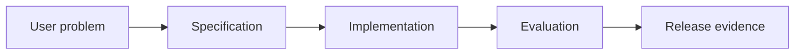

# 9.4 — Testing AI Systems

*Book 9: AI Software and Product Engineering · Read 25 min · Worked example 20 min · Code/design practice 45–60 min · Review 10 min*

## Before you begin

- Books 5–8
- Software testing
- Product discovery basics

If a prerequisite is unfamiliar, use site search and read only enough to explain it and complete a small example. Do not block progress by mastering every upstream topic first.

## Why this chapter exists

Combine unit, contract, integration, scenario, regression, adversarial, and human tests across deterministic and probabilistic components.

The engineering objective is not to memorize vocabulary. By the end, you should be able to describe the mechanism, build or inspect a small implementation, recognize its failure modes, and decide where it belongs in a larger system.

## Learning objectives

- Explain why testing ai systems matters using the chapter scenario, not abstract definitions alone.
- Trace how **unit tests** and **contract tests** interact in the book-level visual.
- Implement or design the bounded practice while holding evaluation cases fixed.
- Diagnose at least two failure modes specific to release gates.
- Decide where this chapter's mechanism belongs in a production architecture and what evidence justifies it.

!!! note "Enduring principle"
    Test deterministic properties deterministically and probabilistic behavior statistically.

## Mental model



Read the visual from left to right, then trace failures from right to left. The diagram is a book-level map; this chapter explains how **testing ai systems** changes one or more transitions.

## Core concepts

The concepts form a system, not a vocabulary list. Read each section below before attempting the practice exercise.

### Unit Tests

Unit tests verify deterministic functions and components in isolation with fast feedback. They anchor quality while model behavior stays statistical. See the [Unit Tests concept card](../../concepts/cards/unit-tests.md).

**Example:** Parser unit tests cover edge cases agents might not consider when editing.

**Evidence of understanding:** Require ≥80% coverage on changed deterministic modules per PR policy.

### Contract Tests

Contract tests verify integrations between services—API schemas, tool responses—without full end-to-end runs. They catch breaking changes early. See the [Contract Tests concept card](../../concepts/cards/contract-tests.md).

**Example:** Consumer test asserts search API returns fields reranker expects.

**Evidence of understanding:** Run contract tests in CI on every API schema change.

### Eval Datasets

Eval datasets are labeled or rubric-scored cases representing production risks and happy paths. They must refresh as products and policies evolve. See the [Eval Datasets concept card](../../concepts/cards/eval-datasets.md).

**Example:** 200 support queries with gold answers updated quarterly after product launches.

**Evidence of understanding:** Version eval dataset with changelog and rerun full suite monthly.

### Adversarial Tests

Adversarial tests probe injection, jailbreaks, edge inputs, and abuse scenarios. They belong in release gates for user-facing AI. See the [Adversarial Tests concept card](../../concepts/cards/adversarial-tests.md).

**Example:** Prompt injection via ticket body attempting credential exfil must fail closed.

**Evidence of understanding:** Maintain adversarial suite; require 100% pass on P0 cases before deploy.

### Release Gates

Release gates block deployment until eval, security, and performance criteria pass. They encode organizational risk tolerance numerically. See the [Release Gates concept card](../../concepts/cards/release-gates.md).

**Example:** No deploy if faithfulness drops >2 points or p95 latency exceeds SLO.

**Evidence of understanding:** Automate gate checks in CI/CD with auditable pass/fail artifacts.

## Worked example

**Book scenario:** A product team must convert a vague AI feature request into testable release evidence.

**Situation:** Onboarding assistant mixes deterministic validators and probabilistic generation; QA needs a coherent test strategy.

**Baseline:** Manual clicking in staging— misses regression on abstention behavior.

**Application:** Derive test pyramid: unit tests for validators, contract tests for tools, scenario tests for agent flows, eval dataset for language quality, adversarial injection cases.

**Test cases:** (1) Normal: schema validator unit test. (2) Boundary: flaky eval case near threshold. (3) Adversarial: prompt injection in integration scenario.

**Measurement:** Coverage by layer, release gate pass rate, escaped defects by test type.

**Design question:** Which layer catches abstention regression fastest and cheapest?

## Chapter hook

Run this short snippet first to anchor **testing ai systems** before the book-level sample:

```python
CHAPTER = "9.4"
print("chapter hook:", CHAPTER)
layers = ["unit", "contract", "scenario", "eval", "adversarial"]
catch_abstain = {"unit": False, "contract": False, "scenario": True, "eval": True, "adversarial": False}
for layer in layers:
    print(layer, "catches_abstain:", catch_abstain[layer])
print("---")
print("change one input above, predict output, re-run")
```

Predict the printed values, then change one line tied to **unit tests** or **contract tests** and observe how the chapter mechanism moves.

## Runnable code sample

The following dependency-free sample supports this book. Download it from the [code-sample library](../../code-samples/09-spec-driven-development.py) or run the matching file under `examples/`.

```python
--8<-- "docs/code-samples/09-spec-driven-development.py"
```

Expected output is printed to the terminal. Before running it, predict which values or decisions should change. Then introduce one failure and convert the observation into a test.

??? success "Expected observation"
    Both executable acceptance examples pass; changing the abstention behavior should fail the second case.

This is a **book-level sample**. Its relevance to this chapter is the boundary between **unit tests** and **contract tests**. Modify that boundary, not unrelated lines, when completing the chapter exercise.

## Engineering practice

**Build:** Derive a test pyramid from an AI system architecture.

Work in three passes tailored to this chapter:

1. **Baseline:** Implement the task without unit tests and record quality, latency, and failure cases.
2. **Mechanism:** Add contract tests while keeping inputs and evaluation fixed; note what changed in intermediate state.
3. **Judgment:** Compare outcomes on normal, boundary, and adversarial cases; document when testing ai systems earns its operational cost.

Capture assumptions, test cases, results, and one architecture decision record. A successful lab explains *why* behavior changed, not merely that the program ran.

## Architecture lens

For a production design in **AI Software and Product Engineering**, make the following explicit for **testing ai systems**:

| Concern | Question to answer |
|---|---|
| **Ownership** | Which service owns unit tests versus downstream consumers of its output? |
| **Contract** | What typed inputs, outputs, errors, and version does the eval datasets boundary expose? |
| **Evidence** | Which eval slices prove testing ai systems meets requirements before and after each release? |
| **Security** | What untrusted data crosses the release gates boundary and how is it sanitized or authorized? |
| **Operations** | What is logged at this chapter's transition, what triggers retry or rollback, and what is cached? |
| **Economics** | Which resource—tokens, retrieval calls, GPU seconds, human review—dominates cost for this mechanism? |

## Failure clinic

Reproduce failures at the chapter boundary—do not debug only final output.

| Failure | Symptom | Likely cause | First response |
|---|---|---|---|
| **Baseline illusion** | The system looks fine on demo prompts but fails on the book scenario | Evaluation cases do not cover unit tests or contract tests | Add the chapter's normal, boundary, and adversarial cases before tuning |
| **Mechanism mismatch** | Adding complexity does not improve the measured outcome | testing ai systems is applied at the wrong layer or without fixing inputs | Trace the book visual and verify the transition this chapter owns |
| **Silent degradation** | Outputs remain fluent while decisions become wrong | Failure in release gates without observability at that boundary | Log intermediate state, version config, and compare against the baseline |
| **Operational drift** | Quality changes after deploy though prompts are unchanged | Data, permissions, or upstream unit tests behavior shifted | Pin versions, inspect ingestion and policy filters, re-run slice evals |

Combine unit, contract, integration, scenario, regression, adversarial, and human tests across deterministic and probabilistic components. When triaging, preserve full inputs, retrieved evidence, tool traces, and model or index versions.

## Evolution lens

- **Yesterday:** Manual playbooks, brittle rules, or single-pass models handled parts of testing ai systems without explicit unit tests.
- **Today:** Engineering teams implement testing ai systems as testable components with baselines, typed boundaries, and stage-specific evaluation.
- **Tomorrow:** Better automation may reduce toil, but release gates and governance constraints will still require explicit design.
- **What survives:** Test deterministic properties deterministically and probabilistic behavior statistically.

## Knowledge check

1. How do you test probabilistic vs deterministic components differently?
2. What belongs in release gates?
3. What testing baseline is manual only?

??? question "Answer guidance"
    Q1: Deterministic: exact assertions; probabilistic: statistical eval over datasets. Q2: Automated scenarios plus eval thresholds block promote. Q3: QA clicks through UI before launch.

## Mastery questions

??? tip "Model answers (proficient level)"
        1. **Explain unit tests without jargon and give a counterexample.**
       *Proficient answer:* unit tests verify deterministic functions and components in isolation with fast feedback. Counterexample: applying it when the task is fully deterministic and cheaper to hard-code.
    2. **Compare contract tests with release gates using quality, cost, latency, and risk.**
       *Proficient answer:* contract tests verify integrations between services—api schemas, tool responses—without full end-to-end runs; release gates block deployment until eval, security, and performance criteria pass. Trade quality gains against operational and security cost on the chapter scenario.
    3. **Design a minimal experiment that tests the chapter's central claim.**
       *Proficient answer:* Fix a baseline and three cases (normal, boundary, adversarial). Add only the chapter mechanism, measure one task metric plus cost/latency, and pre-register what result would falsify the claim.
    4. **Identify which component should own validation, authorization, and observability.**
       *Proficient answer:* Validation belongs at the typed boundary after contract tests; authorization before any side effect or retrieval of restricted data; observability at the transition testing ai systems introduces in the book visual.
    5. **State what would remain true if today's leading libraries and vendors disappeared.**
       *Proficient answer:* Test deterministic properties deterministically and probabilistic behavior statistically.

## Self-assessment rubric

| Level | Evidence |
|---|---|
| Not yet | Can repeat terms but cannot trace the visual or predict the sample. |
| Developing | Can explain the mechanism and complete the normal case with help. |
| Proficient | Can implement the exercise, diagnose a failure, and compare a baseline. |
| Transfer | Can defend an architecture choice in a new domain with evaluation evidence. |

## Evidence and further study

- Repository contribution and test documentation
- Architecture Decision Record guidance and product experiment literature

Use primary sources for technical claims and official documentation for current product behavior. Record the version or access date for evolving material.

## Continue

Return to the [book index](index.md) or use site search to follow the chapter's concepts into the knowledge-area and reference pages.
