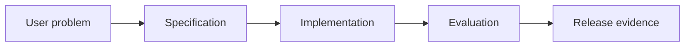

# 9.5 — Human-Centered AI UX

*Book 9: AI Software and Product Engineering · Read 25 min · Worked example 20 min · Code/design practice 45–60 min · Review 10 min*

## Before you begin

- Books 5–8
- Software testing
- Product discovery basics

If a prerequisite is unfamiliar, use site search and read only enough to explain it and complete a small example. Do not block progress by mastering every upstream topic first.

## Why this chapter exists

Design uncertainty, citations, previews, correction, undo, approval, feedback, accessibility, and graceful failure.

The engineering objective is not to memorize vocabulary. By the end, you should be able to describe the mechanism, build or inspect a small implementation, recognize its failure modes, and decide where it belongs in a larger system.

## Learning objectives

- Explain why human-centered ai ux matters using the chapter scenario, not abstract definitions alone.
- Trace how **uncertainty UX** and **citations** interact in the book-level visual.
- Implement or design the bounded practice while holding evaluation cases fixed.
- Diagnose at least two failure modes specific to accessibility.
- Decide where this chapter's mechanism belongs in a production architecture and what evidence justifies it.

!!! note "Enduring principle"
    Trust grows from control, evidence, and recoverability—not from confident prose.

## Mental model



Read the visual from left to right, then trace failures from right to left. The diagram is a book-level map; this chapter explains how **human-centered ai ux** changes one or more transitions.

## Core concepts

The concepts form a system, not a vocabulary list. Read each section below before attempting the practice exercise.

### Uncertainty Ux

Uncertainty UX communicates confidence, limits, and alternatives so users calibrate trust. Hiding uncertainty causes overreliance on wrong answers. See the [Uncertainty Ux concept card](../../concepts/cards/uncertainty-ux.md).

**Example:** Show 'I'm not sure—here are sources' instead of definitive tone on weak retrieval.

**Evidence of understanding:** User study: measure appropriate reliance rate with versus without confidence cues.

### Citations

Citations link UI claims to source passages users can verify. They must be accurate, clickable, and adjacent to the supported statement. See the [Citations concept card](../../concepts/cards/citations.md).

**Example:** Refund policy answer includes link jumping to handbook section 4.2.

**Evidence of understanding:** Audit 50 UI citations for precision and broken links monthly.

### Correction

Correction flows let users fix wrong AI outputs and feed improvements—labels, prompts, or models. Without correction, errors repeat silently. See the [Correction concept card](../../concepts/cards/correction.md).

**Example:** Thumbs-down on answer captures expected response for eval set addition.

**Evidence of understanding:** Track correction rate and time-to-incorporate into eval or training.

### Undo

Undo reverses AI-initiated or AI-assisted actions within a safe window. It is essential when actions affect user data or send communications. See the [Undo concept card](../../concepts/cards/undo.md).

**Example:** Auto-drafted email can be undone for 30 seconds before SMTP send.

**Evidence of understanding:** Verify undo restores prior state exactly on ten action types.

### Accessibility

Accessibility ensures AI features work with screen readers, keyboard navigation, and assistive tech—not only visual chat UIs. See the [Accessibility concept card](../../concepts/cards/accessibility.md).

**Example:** Streaming tokens must announce sensibly; citation links need accessible labels.

**Evidence of understanding:** Run WCAG-oriented audit on primary AI flows and fix P1 issues before launch.

## Worked example

**Book scenario:** A product team must convert a vague AI feature request into testable release evidence.

**Situation:** New hires trust the assistant's confident tone; a wrong access grant is hard to undo.

**Baseline:** Chat bubble streams answer with no preview or undo.

**Application:** Prototype high-risk flow: show policy evidence preview, require explicit approval, offer undo window, surface uncertainty, log corrections for feedback.

**Test cases:** (1) Normal: low-risk FAQ with citation. (2) Boundary: medium-risk suggestion needing confirm. (3) Adversarial: user rapidly confirms without reading preview.

**Measurement:** Mistake rate, time-on-preview, undo usage, accessibility audit score.

**Design question:** What UX pattern reduces irreversible confirmations without blocking flow entirely?

## Chapter hook

Run this short snippet first to anchor **human-centered ai ux** before the book-level sample:

```python
CHAPTER = "9.5"
print("chapter hook:", CHAPTER)
risk = "high"
ux = {"preview": True, "approval": risk == "high", "undo_sec": 30 if risk == "high" else 0}
print(ux)
print("inspect step", 1)
print("---")
print("change one input above, predict output, re-run")
```

Predict the printed values, then change one line tied to **uncertainty UX** or **citations** and observe how the chapter mechanism moves.

## Runnable code sample

The following dependency-free sample supports this book. Download it from the [code-sample library](../../code-samples/09-spec-driven-development.py) or run the matching file under `examples/`.

```python
--8<-- "docs/code-samples/09-spec-driven-development.py"
```

Expected output is printed to the terminal. Before running it, predict which values or decisions should change. Then introduce one failure and convert the observation into a test.

??? success "Expected observation"
    Both executable acceptance examples pass; changing the abstention behavior should fail the second case.

This is a **book-level sample**. Its relevance to this chapter is the boundary between **uncertainty UX** and **citations**. Modify that boundary, not unrelated lines, when completing the chapter exercise.

## Engineering practice

**Build:** Prototype a high-risk action flow with preview and approval.

Work in three passes tailored to this chapter:

1. **Baseline:** Implement the task without uncertainty ux and record quality, latency, and failure cases.
2. **Mechanism:** Add citations while keeping inputs and evaluation fixed; note what changed in intermediate state.
3. **Judgment:** Compare outcomes on normal, boundary, and adversarial cases; document when human-centered ai ux earns its operational cost.

Capture assumptions, test cases, results, and one architecture decision record. A successful lab explains *why* behavior changed, not merely that the program ran.

## Architecture lens

For a production design in **AI Software and Product Engineering**, make the following explicit for **human-centered ai ux**:

| Concern | Question to answer |
|---|---|
| **Ownership** | Which service owns uncertainty ux versus downstream consumers of its output? |
| **Contract** | What typed inputs, outputs, errors, and version does the correction boundary expose? |
| **Evidence** | Which eval slices prove human-centered ai ux meets requirements before and after each release? |
| **Security** | What untrusted data crosses the accessibility boundary and how is it sanitized or authorized? |
| **Operations** | What is logged at this chapter's transition, what triggers retry or rollback, and what is cached? |
| **Economics** | Which resource—tokens, retrieval calls, GPU seconds, human review—dominates cost for this mechanism? |

## Failure clinic

Reproduce failures at the chapter boundary—do not debug only final output.

| Failure | Symptom | Likely cause | First response |
|---|---|---|---|
| **Baseline illusion** | The system looks fine on demo prompts but fails on the book scenario | Evaluation cases do not cover uncertainty ux or citations | Add the chapter's normal, boundary, and adversarial cases before tuning |
| **Mechanism mismatch** | Adding complexity does not improve the measured outcome | human-centered ai ux is applied at the wrong layer or without fixing inputs | Trace the book visual and verify the transition this chapter owns |
| **Silent degradation** | Outputs remain fluent while decisions become wrong | Failure in accessibility without observability at that boundary | Log intermediate state, version config, and compare against the baseline |
| **Operational drift** | Quality changes after deploy though prompts are unchanged | Data, permissions, or upstream uncertainty ux behavior shifted | Pin versions, inspect ingestion and policy filters, re-run slice evals |

Design uncertainty, citations, previews, correction, undo, approval, feedback, accessibility, and graceful failure. When triaging, preserve full inputs, retrieved evidence, tool traces, and model or index versions.

## Evolution lens

- **Yesterday:** Manual playbooks, brittle rules, or single-pass models handled parts of human-centered ai ux without explicit uncertainty ux.
- **Today:** Engineering teams implement human-centered ai ux as testable components with baselines, typed boundaries, and stage-specific evaluation.
- **Tomorrow:** Better automation may reduce toil, but accessibility and governance constraints will still require explicit design.
- **What survives:** Trust grows from control, evidence, and recoverability—not from confident prose.

## Knowledge check

1. Why does trust come from control and recoverability?
2. How should citations appear in high-risk flows?
3. What UX baseline maximizes fluent prose only?

??? question "Answer guidance"
    Q1: Users trust systems they can verify and reverse. Q2: Inline evidence beside action buttons, not footnotes after confirm. Q3: Streaming confident text with one-click accept.

## Mastery questions

??? tip "Model answers (proficient level)"
        1. **Explain uncertainty UX without jargon and give a counterexample.**
       *Proficient answer:* uncertainty ux communicates confidence, limits, and alternatives so users calibrate trust. Counterexample: applying it when the task is fully deterministic and cheaper to hard-code.
    2. **Compare citations with accessibility using quality, cost, latency, and risk.**
       *Proficient answer:* citations link ui claims to source passages users can verify; accessibility ensures ai features work with screen readers, keyboard navigation, and assistive tech—not only visual chat uis. Trade quality gains against operational and security cost on the chapter scenario.
    3. **Design a minimal experiment that tests the chapter's central claim.**
       *Proficient answer:* Fix a baseline and three cases (normal, boundary, adversarial). Add only the chapter mechanism, measure one task metric plus cost/latency, and pre-register what result would falsify the claim.
    4. **Identify which component should own validation, authorization, and observability.**
       *Proficient answer:* Validation belongs at the typed boundary after citations; authorization before any side effect or retrieval of restricted data; observability at the transition human-centered ai ux introduces in the book visual.
    5. **State what would remain true if today's leading libraries and vendors disappeared.**
       *Proficient answer:* Trust grows from control, evidence, and recoverability—not from confident prose.

## Self-assessment rubric

| Level | Evidence |
|---|---|
| Not yet | Can repeat terms but cannot trace the visual or predict the sample. |
| Developing | Can explain the mechanism and complete the normal case with help. |
| Proficient | Can implement the exercise, diagnose a failure, and compare a baseline. |
| Transfer | Can defend an architecture choice in a new domain with evaluation evidence. |

## Evidence and further study

- Repository contribution and test documentation
- Architecture Decision Record guidance and product experiment literature

Use primary sources for technical claims and official documentation for current product behavior. Record the version or access date for evolving material.

## Continue

Return to the [book index](index.md) or use site search to follow the chapter's concepts into the knowledge-area and reference pages.
