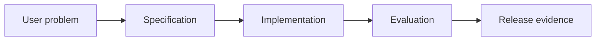

# 9.6 — Experiments, Adoption, and Value

*Book 9: AI Software and Product Engineering · Read 25 min · Worked example 20 min · Code/design practice 45–60 min · Review 10 min*

## Before you begin

- Books 5–8
- Software testing
- Product discovery basics

If a prerequisite is unfamiliar, use site search and read only enough to explain it and complete a small example. Do not block progress by mastering every upstream topic first.

## Why this chapter exists

Measure task success, time, correction effort, retention, adoption, cost, risk, and ROI through staged experiments.

The engineering objective is not to memorize vocabulary. By the end, you should be able to describe the mechanism, build or inspect a small implementation, recognize its failure modes, and decide where it belongs in a larger system.

## Learning objectives

- Explain why experiments, adoption, and value matters using the chapter scenario, not abstract definitions alone.
- Trace how **A/B testing** and **task success** interact in the book-level visual.
- Implement or design the bounded practice while holding evaluation cases fixed.
- Diagnose at least two failure modes specific to build versus buy.
- Decide where this chapter's mechanism belongs in a production architecture and what evidence justifies it.

!!! note "Enduring principle"
    A technically impressive feature is not successful until it improves a valued workflow.

## Mental model



Read the visual from left to right, then trace failures from right to left. The diagram is a book-level map; this chapter explains how **experiments, adoption, and value** changes one or more transitions.

## Core concepts

The concepts form a system, not a vocabulary list. Read each section below before attempting the practice exercise.

### A/B Testing

A/B testing compares product variants on live users with ethical guardrails and pre-registered metrics. See the [A/B Testing concept card](../../concepts/cards/a-b-testing.md).

**Example:** Test copilot placement in workflow A versus B measuring task completion time.

**Evidence of understanding:** Pre-register sample size, primary metric, and stop rules; monitor guardrails.

### Task Success

Task success measures whether users completed their intended job with acceptable quality—not click-through on AI features. See the [Task Success concept card](../../concepts/cards/task-success.md).

**Example:** User submitted correct expense report without support contact counts as success.

**Evidence of understanding:** Define success per job; sample sessions and label pass/fail weekly.

### Adoption

Adoption tracks who uses the feature, how often, and whether usage persists after novelty fades. See the [Adoption concept card](../../concepts/cards/adoption.md).

**Example:** 80% weekly active support agents using suggest-reply after 60 days indicates adoption.

**Evidence of understanding:** Plot cohort retention curve at 7, 30, and 90 days post-launch.

### ROI

ROI compares value gained—time saved, revenue, deflected tickets—to total cost—build, inference, review, incidents. See the [ROI concept card](../../concepts/cards/roi.md).

**Example:** Saving 500 agent-hours/month at $40/hr must exceed inference plus maintenance cost.

**Evidence of understanding:** Document ROI calculation assumptions and revisit quarterly with actuals.

### Build Versus Buy

Build versus buy weighs custom AI development against vendor APIs and platforms on control, cost, and time-to-value. See the [Build Versus Buy concept card](../../concepts/cards/build-versus-buy.md).

**Example:** Buy GPT-4 API for prototype; build fine-tuned model when volume makes unit economics favorable.

**Evidence of understanding:** ADR comparing three-year TCO and risk for build versus buy options.

## Worked example

**Book scenario:** A product team must convert a vague AI feature request into testable release evidence.

**Situation:** Leadership asks whether the onboarding assistant improved time-to-productive or merely added AI chrome.

**Baseline:** Launch to 100% users with no measurement plan.

**Application:** Design staged rollout with guardrails, A/B on task success and correction effort, track cost per successful onboarding, define stop thresholds for harm metrics.

**Test cases:** (1) Normal: stable improvement in pilot. (2) Boundary: metric improves for US not EU slice. (3) Adversarial: users skip steps faster by ignoring warnings—false time gain.

**Measurement:** Task success, correction rate, retention, $/success, incident count vs control.

**Design question:** Which metric would stop rollout despite positive average time savings?

## Chapter hook

Run this short snippet first to anchor **experiments, adoption, and value** before the book-level sample:

```python
CHAPTER = "9.6"
print("chapter hook:", CHAPTER)
metrics = {"time_saved": 0.15, "compliance_errors": 0.02, "slice_EU_success": -0.05}
gates = {"compliance_errors_max": 0.01, "slice_min_success": 0.0}
blocked = metrics["compliance_errors"] > gates["compliance_errors_max"]
blocked |= metrics["slice_EU_success"] < gates["slice_min_success"]
print({"blocked": blocked, "reason": "compliance or slice harm"})
print("---")
print("change one input above, predict output, re-run")
```

Predict the printed values, then change one line tied to **A/B testing** or **task success** and observe how the chapter mechanism moves.

## Runnable code sample

The following dependency-free sample supports this book. Download it from the [code-sample library](../../code-samples/09-spec-driven-development.py) or run the matching file under `examples/`.

```python
--8<-- "docs/code-samples/09-spec-driven-development.py"
```

Expected output is printed to the terminal. Before running it, predict which values or decisions should change. Then introduce one failure and convert the observation into a test.

??? success "Expected observation"
    Both executable acceptance examples pass; changing the abstention behavior should fail the second case.

This is a **book-level sample**. Its relevance to this chapter is the boundary between **A/B testing** and **task success**. Modify that boundary, not unrelated lines, when completing the chapter exercise.

## Engineering practice

**Build:** Design a rollout with guardrails and decision thresholds.

Work in three passes tailored to this chapter:

1. **Baseline:** Implement the task without a/b testing and record quality, latency, and failure cases.
2. **Mechanism:** Add task success while keeping inputs and evaluation fixed; note what changed in intermediate state.
3. **Judgment:** Compare outcomes on normal, boundary, and adversarial cases; document when experiments, adoption, and value earns its operational cost.

Capture assumptions, test cases, results, and one architecture decision record. A successful lab explains *why* behavior changed, not merely that the program ran.

## Spec-driven habit

Every chapter lab pairs reading with **executable acceptance**. Before implementing book 9.6 — experiments, adoption, and value:

1. Draft cases in `test_lab.py` or `specs/lab-0906.yaml`.
2. Use [Cursor Plan/Agent](https://cursor.com/) with "read spec first, then minimal diff".
3. Or use [OpenSpec](https://openspec.dev/) `/opsx:propose` so requirements live in `openspec/` next to code.

→ [Spec-driven workflow guide](../../getting-started/spec-driven-workflow.md) · [Lab 9.6](../../labs/0906-experiments-adoption-and-value.md)


## Architecture lens

For a production design in **AI Software and Product Engineering**, make the following explicit for **experiments, adoption, and value**:

| Concern | Question to answer |
|---|---|
| **Ownership** | Which service owns a/b testing versus downstream consumers of its output? |
| **Contract** | What typed inputs, outputs, errors, and version does the adoption boundary expose? |
| **Evidence** | Which eval slices prove experiments, adoption, and value meets requirements before and after each release? |
| **Security** | What untrusted data crosses the build versus buy boundary and how is it sanitized or authorized? |
| **Operations** | What is logged at this chapter's transition, what triggers retry or rollback, and what is cached? |
| **Economics** | Which resource—tokens, retrieval calls, GPU seconds, human review—dominates cost for this mechanism? |

## Failure clinic

Reproduce failures at the chapter boundary—do not debug only final output.

| Failure | Symptom | Likely cause | First response |
|---|---|---|---|
| **Baseline illusion** | The system looks fine on demo prompts but fails on the book scenario | Evaluation cases do not cover a/b testing or task success | Add the chapter's normal, boundary, and adversarial cases before tuning |
| **Mechanism mismatch** | Adding complexity does not improve the measured outcome | experiments, adoption, and value is applied at the wrong layer or without fixing inputs | Trace the book visual and verify the transition this chapter owns |
| **Silent degradation** | Outputs remain fluent while decisions become wrong | Failure in build versus buy without observability at that boundary | Log intermediate state, version config, and compare against the baseline |
| **Operational drift** | Quality changes after deploy though prompts are unchanged | Data, permissions, or upstream a/b testing behavior shifted | Pin versions, inspect ingestion and policy filters, re-run slice evals |

Measure task success, time, correction effort, retention, adoption, cost, risk, and ROI through staged experiments. When triaging, preserve full inputs, retrieved evidence, tool traces, and model or index versions.

## Evolution lens

- **Yesterday:** Manual playbooks, brittle rules, or single-pass models handled parts of experiments, adoption, and value without explicit a/b testing.
- **Today:** Engineering teams implement experiments, adoption, and value as testable components with baselines, typed boundaries, and stage-specific evaluation.
- **Tomorrow:** Better automation may reduce toil, but build versus buy and governance constraints will still require explicit design.
- **What survives:** A technically impressive feature is not successful until it improves a valued workflow.

## Knowledge check

1. Why is impressive tech not successful until workflow value improves?
2. How can faster completion indicate harm?
3. What rollout baseline skips guardrails?

??? question "Answer guidance"
    Q1: Value is measured in user outcomes and risk, not features. Q2: Users skip safety steps—time down, errors up. Q3: Big-bang release with vanity metrics only.

## Mastery questions

??? tip "Model answers (proficient level)"
        1. **Explain A/B testing without jargon and give a counterexample.**
       *Proficient answer:* a/b testing compares product variants on live users with ethical guardrails and pre-registered metrics. Counterexample: applying it when the task is fully deterministic and cheaper to hard-code.
    2. **Compare task success with build versus buy using quality, cost, latency, and risk.**
       *Proficient answer:* task success measures whether users completed their intended job with acceptable quality—not click-through on ai features; build versus buy weighs custom ai development against vendor apis and platforms on control, cost, and time-to-value. Trade quality gains against operational and security cost on the chapter scenario.
    3. **Design a minimal experiment that tests the chapter's central claim.**
       *Proficient answer:* Fix a baseline and three cases (normal, boundary, adversarial). Add only the chapter mechanism, measure one task metric plus cost/latency, and pre-register what result would falsify the claim.
    4. **Identify which component should own validation, authorization, and observability.**
       *Proficient answer:* Validation belongs at the typed boundary after task success; authorization before any side effect or retrieval of restricted data; observability at the transition experiments, adoption, and value introduces in the book visual.
    5. **State what would remain true if today's leading libraries and vendors disappeared.**
       *Proficient answer:* A technically impressive feature is not successful until it improves a valued workflow.

## Self-assessment rubric

| Level | Evidence |
|---|---|
| Not yet | Can repeat terms but cannot trace the visual or predict the sample. |
| Developing | Can explain the mechanism and complete the normal case with help. |
| Proficient | Can implement the exercise, diagnose a failure, and compare a baseline. |
| Transfer | Can defend an architecture choice in a new domain with evaluation evidence. |

## Evidence and further study

- Repository contribution and test documentation
- Architecture Decision Record guidance and product experiment literature

Use primary sources for technical claims and official documentation for current product behavior. Record the version or access date for evolving material.

## Continue

Return to the [book index](index.md) or use site search to follow the chapter's concepts into the knowledge-area and reference pages.
