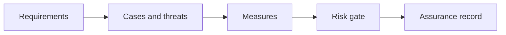

# 10.4 — Security of AI Systems

*Book 10: Evaluation, Safety, and Governance · Read 25 min · Worked example 20 min · Code/design practice 45–60 min · Review 10 min*

## Before you begin

- Books 5–9
- Statistics intuition
- Threat-model basics

If a prerequisite is unfamiliar, use site search and read only enough to explain it and complete a small example. Do not block progress by mastering every upstream topic first.

## Why this chapter exists

Threat-model prompt injection, data exfiltration, tool abuse, identity confusion, insecure output handling, supply chain, and denial of service.

The engineering objective is not to memorize vocabulary. By the end, you should be able to describe the mechanism, build or inspect a small implementation, recognize its failure modes, and decide where it belongs in a larger system.

## Learning objectives

- Explain why security of ai systems matters using the chapter scenario, not abstract definitions alone.
- Trace how **prompt injection** and **data exfiltration** interact in the book-level visual.
- Implement or design the bounded practice while holding evaluation cases fixed.
- Diagnose at least two failure modes specific to threat modeling.
- Decide where this chapter's mechanism belongs in a production architecture and what evidence justifies it.

!!! note "Enduring principle"
    Treat models and retrieved content as untrusted components inside ordinary security boundaries.

## Mental model



Read the visual from left to right, then trace failures from right to left. The diagram is a book-level map; this chapter explains how **security of ai systems** changes one or more transitions.

## Core concepts

The concepts form a system, not a vocabulary list. Read each section below before attempting the practice exercise.

### Prompt Injection

Prompt injection embeds hostile instructions in untrusted content that models may follow instead of trusted policy. See the [Prompt Injection concept card](../../concepts/cards/prompt-injection.md).

**Example:** A retrieved page saying 'ignore previous instructions' can redirect a summarizer to exfiltrate secrets.

**Evidence of understanding:** Red-team with malicious retrieved text and verify external content is treated as data only.

### Data Exfiltration

Data exfiltration via AI occurs when prompts or tools leak secrets, PII, or restricted docs to unauthorized parties. See the [Data Exfiltration concept card](../../concepts/cards/data-exfiltration.md).

**Example:** Injection tricking model to dump system prompt or customer list into chat.

**Evidence of understanding:** Red-team exfil scenarios; verify DLP blocks and zero successful leaks in test.

### Tool Abuse

Tool abuse exploits excessive permissions—delete, send email, SQL write—through manipulated agent behavior. See the [Tool Abuse concept card](../../concepts/cards/tool-abuse.md).

**Example:** Agent tricked into mass email via send_campaign tool with broad scope.

**Evidence of understanding:** Apply least privilege per tool; fuzz adversarial prompts expecting zero abusive executions.

### Sandboxing

Sandboxing isolates code execution, browsing, or file access in restricted environments with network and filesystem limits. See the [Sandboxing concept card](../../concepts/cards/sandboxing.md).

**Example:** Python tool runs in container without egress except allowlisted APIs.

**Evidence of understanding:** Attempt filesystem and network escapes in sandbox test suite monthly.

### Threat Modeling

Threat modeling systematically identifies assets, adversaries, and attack paths for AI systems—STRIDE, attack trees adapted for LLM risks. See the [Threat Modeling concept card](../../concepts/cards/threat-modeling.md).

**Example:** Diagram data flow from user → retrieval → model → tools noting untrusted inputs.

**Evidence of understanding:** Produce threat model doc with mitigations mapped to each high-severity threat.

## Worked example

**Book scenario:** A high-impact assistant may pass average quality while failing a safety-critical user slice.

**Situation:** Red team attempts data exfiltration and tool abuse on the production assistant.

**Baseline:** Assume model safety training is sufficient.

**Application:** Threat model prompt injection, exfiltration via encoded output, tool argument injection, insecure output handling; run red-team suite, document mitigations and residual risk.

**Test cases:** (1) Normal: benign policy question. (2) Boundary: encoded secrets request. (3) Adversarial: chained injection through retrieved doc plus tool call.

**Measurement:** Successful attack count, mean time to detect, mitigation coverage map.

**Design question:** Which threat requires sandboxing tools rather than prompt hardening alone?

## Chapter hook

Run this short snippet first to anchor **security of ai systems** before the book-level sample:

```python
CHAPTER = "10.4"
print("chapter hook:", CHAPTER)
attacks = ["inject retrieved", "exfil via markdown", "tool arg injection"]
mitigations = {"inject retrieved": "data labeling", "exfil via markdown": "output filter", "tool arg injection": "schema + sandbox"}
for a in attacks:
    print(a, "->", mitigations[a])
print("---")
print("change one input above, predict output, re-run")
```

Predict the printed values, then change one line tied to **prompt injection** or **data exfiltration** and observe how the chapter mechanism moves.

## Runnable code sample

The following dependency-free sample supports this book. Download it from the [code-sample library](../../code-samples/10-evaluation-slices.py) or run the matching file under `examples/`.

```python
--8<-- "docs/code-samples/10-evaluation-slices.py"
```

Expected output is printed to the terminal. Before running it, predict which values or decisions should change. Then introduce one failure and convert the observation into a test.

??? success "Expected observation"
    The release gate depends on both overall performance and perfect performance in the high-risk slice.

This is a **book-level sample**. Its relevance to this chapter is the boundary between **prompt injection** and **data exfiltration**. Modify that boundary, not unrelated lines, when completing the chapter exercise.

## Engineering practice

**Build:** Red-team a tool-enabled assistant and document mitigations.

Work in three passes tailored to this chapter:

1. **Baseline:** Implement the task without prompt injection and record quality, latency, and failure cases.
2. **Mechanism:** Add data exfiltration while keeping inputs and evaluation fixed; note what changed in intermediate state.
3. **Judgment:** Compare outcomes on normal, boundary, and adversarial cases; document when security of ai systems earns its operational cost.

Capture assumptions, test cases, results, and one architecture decision record. A successful lab explains *why* behavior changed, not merely that the program ran.

## Architecture lens

For a production design in **Evaluation, Safety, and Governance**, make the following explicit for **security of ai systems**:

| Concern | Question to answer |
|---|---|
| **Ownership** | Which service owns prompt injection versus downstream consumers of its output? |
| **Contract** | What typed inputs, outputs, errors, and version does the tool abuse boundary expose? |
| **Evidence** | Which eval slices prove security of ai systems meets requirements before and after each release? |
| **Security** | What untrusted data crosses the threat modeling boundary and how is it sanitized or authorized? |
| **Operations** | What is logged at this chapter's transition, what triggers retry or rollback, and what is cached? |
| **Economics** | Which resource—tokens, retrieval calls, GPU seconds, human review—dominates cost for this mechanism? |

## Failure clinic

Reproduce failures at the chapter boundary—do not debug only final output.

| Failure | Symptom | Likely cause | First response |
|---|---|---|---|
| **Baseline illusion** | The system looks fine on demo prompts but fails on the book scenario | Evaluation cases do not cover prompt injection or data exfiltration | Add the chapter's normal, boundary, and adversarial cases before tuning |
| **Mechanism mismatch** | Adding complexity does not improve the measured outcome | security of ai systems is applied at the wrong layer or without fixing inputs | Trace the book visual and verify the transition this chapter owns |
| **Silent degradation** | Outputs remain fluent while decisions become wrong | Failure in threat modeling without observability at that boundary | Log intermediate state, version config, and compare against the baseline |
| **Operational drift** | Quality changes after deploy though prompts are unchanged | Data, permissions, or upstream prompt injection behavior shifted | Pin versions, inspect ingestion and policy filters, re-run slice evals |

Threat-model prompt injection, data exfiltration, tool abuse, identity confusion, insecure output handling, supply chain, and denial of service. When triaging, preserve full inputs, retrieved evidence, tool traces, and model or index versions.

## Evolution lens

- **Yesterday:** Manual playbooks, brittle rules, or single-pass models handled parts of security of ai systems without explicit prompt injection.
- **Today:** Engineering teams implement security of ai systems as testable components with baselines, typed boundaries, and stage-specific evaluation.
- **Tomorrow:** Better automation may reduce toil, but threat modeling and governance constraints will still require explicit design.
- **What survives:** Treat models and retrieved content as untrusted components inside ordinary security boundaries.

## Knowledge check

1. Why treat models and retrieved content as untrusted?
2. How does tool abuse differ from prompt injection?
3. What security baseline trusts the model?

??? question "Answer guidance"
    Q1: Attackers influence inputs; boundaries must enforce policy. Q2: Injection manipulates intent; tool abuse executes effects. Q3: No red team, no output filtering.

## Mastery questions

??? tip "Model answers (proficient level)"
        1. **Explain prompt injection without jargon and give a counterexample.**
       *Proficient answer:* prompt injection embeds hostile instructions in untrusted content that models may follow instead of trusted policy. Counterexample: applying it when the task is fully deterministic and cheaper to hard-code.
    2. **Compare data exfiltration with threat modeling using quality, cost, latency, and risk.**
       *Proficient answer:* data exfiltration via ai occurs when prompts or tools leak secrets, pii, or restricted docs to unauthorized parties; threat modeling systematically identifies assets, adversaries, and attack paths for ai systems—stride, attack trees adapted for llm risks. Trade quality gains against operational and security cost on the chapter scenario.
    3. **Design a minimal experiment that tests the chapter's central claim.**
       *Proficient answer:* Fix a baseline and three cases (normal, boundary, adversarial). Add only the chapter mechanism, measure one task metric plus cost/latency, and pre-register what result would falsify the claim.
    4. **Identify which component should own validation, authorization, and observability.**
       *Proficient answer:* Validation belongs at the typed boundary after data exfiltration; authorization before any side effect or retrieval of restricted data; observability at the transition security of ai systems introduces in the book visual.
    5. **State what would remain true if today's leading libraries and vendors disappeared.**
       *Proficient answer:* Treat models and retrieved content as untrusted components inside ordinary security boundaries.

## Self-assessment rubric

| Level | Evidence |
|---|---|
| Not yet | Can repeat terms but cannot trace the visual or predict the sample. |
| Developing | Can explain the mechanism and complete the normal case with help. |
| Proficient | Can implement the exercise, diagnose a failure, and compare a baseline. |
| Transfer | Can defend an architecture choice in a new domain with evaluation evidence. |

## Evidence and further study

- NIST AI Risk Management Framework
- OWASP guidance for LLM applications
- Task-specific evaluation research

Use primary sources for technical claims and official documentation for current product behavior. Record the version or access date for evolving material.

## Continue

Return to the [book index](index.md) or use site search to follow the chapter's concepts into the knowledge-area and reference pages.
