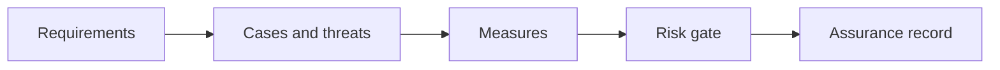

# 10.5 — Responsible AI and Risk

*Book 10: Evaluation, Safety, and Governance · Read 25 min · Worked example 20 min · Code/design practice 45–60 min · Review 10 min*

## Before you begin

- Books 5–9
- Statistics intuition
- Threat-model basics

If a prerequisite is unfamiliar, use site search and read only enough to explain it and complete a small example. Do not block progress by mastering every upstream topic first.

## Why this chapter exists

Assess bias, privacy, transparency, human impact, misuse, accessibility, high-impact decisions, and safe failure.

The engineering objective is not to memorize vocabulary. By the end, you should be able to describe the mechanism, build or inspect a small implementation, recognize its failure modes, and decide where it belongs in a larger system.

## Learning objectives

- Explain why responsible ai and risk matters using the chapter scenario, not abstract definitions alone.
- Trace how **fairness** and **privacy** interact in the book-level visual.
- Implement or design the bounded practice while holding evaluation cases fixed.
- Diagnose at least two failure modes specific to impact assessment.
- Decide where this chapter's mechanism belongs in a production architecture and what evidence justifies it.

!!! note "Enduring principle"
    Responsible AI is a lifecycle of decisions and evidence, not a one-time checklist.

## Mental model



Read the visual from left to right, then trace failures from right to left. The diagram is a book-level map; this chapter explains how **responsible ai and risk** changes one or more transitions.

## Core concepts

The concepts form a system, not a vocabulary list. Read each section below before attempting the practice exercise.

### Fairness

Fairness examines disparate performance or harm across demographic or regional groups. Legal and ethical requirements vary by jurisdiction and use case. See the [Fairness concept card](../../concepts/cards/fairness.md).

**Example:** Loan model approval rate disparity across groups triggers review even if aggregate AUC is high.

**Evidence of understanding:** Evaluate primary metric and error rates per protected slice; document mitigation plan.

### Privacy

Privacy limits collection, retention, and exposure of personal data in training, logs, and outputs. GDPR and similar laws define user rights. See the [Privacy concept card](../../concepts/cards/privacy.md).

**Example:** Support logs must redact credit card numbers; retention capped at 90 days.

**Evidence of understanding:** Run PII scanner on logs and outputs; zero high-severity findings before release.

### Transparency

Transparency discloses when users interact with AI, what data is used, and system limitations. It supports informed consent and trust. See the [Transparency concept card](../../concepts/cards/transparency.md).

**Example:** Chat banner states AI-generated; citations show source documents.

**Evidence of understanding:** Audit UX copy and logs for required disclosures per policy checklist.

### Human Oversight

Human oversight defines when and how people supervise agents—monitoring dashboards, escalation queues, kill switches. It scales only with clear triggers. See the [Human Oversight concept card](../../concepts/cards/human-oversight.md).

**Example:** Escalate to human when confidence < 0.7 or spend > $1 on a single task.

**Evidence of understanding:** Track escalation rate, human resolution time, and override frequency weekly.

### Impact Assessment

Impact assessment evaluates consequences of deploying AI on people, rights, and society before high-risk launch. See the [Impact Assessment concept card](../../concepts/cards/impact-assessment.md).

**Example:** Automated hiring tool requires assessment of bias, appeal process, and human override.

**Evidence of understanding:** Complete assessment template with sign-offs from legal, security, and product.

## Worked example

**Book scenario:** A high-impact assistant may pass average quality while failing a safety-critical user slice.

**Situation:** Assistant used for performance review summaries; HR worries about bias and privacy.

**Baseline:** Ship feature with generic "be fair" prompt line.

**Application:** Conduct impact assessment: affected populations, data minimization, transparency, human oversight for consequential outputs, accessibility, misuse scenarios, monitoring plan.

**Test cases:** (1) Normal: voluntary feedback summary. (2) Boundary: manager-only sensitive note. (3) Adversarial: inferring protected attributes from writing style.

**Measurement:** Bias slice metrics, privacy incident count, oversight compliance rate.

**Design question:** Which use case moves this feature into human-in-the-loop mandatory review?

## Chapter hook

Run this short snippet first to anchor **responsible ai and risk** before the book-level sample:

```python
CHAPTER = "10.5"
print("chapter hook:", CHAPTER)
use_cases = [
    {"name": "grammar fix", "impact": "low"},
    {"name": "promotion recommendation", "impact": "high"},
]
for uc in use_cases:
    hitl = uc["impact"] == "high"
    print(uc["name"], "human_review:", hitl)
print("---")
print("change one input above, predict output, re-run")
```

Predict the printed values, then change one line tied to **fairness** or **privacy** and observe how the chapter mechanism moves.

## Runnable code sample

The following dependency-free sample supports this book. Download it from the [code-sample library](../../code-samples/10-evaluation-slices.py) or run the matching file under `examples/`.

```python
--8<-- "docs/code-samples/10-evaluation-slices.py"
```

Expected output is printed to the terminal. Before running it, predict which values or decisions should change. Then introduce one failure and convert the observation into a test.

??? success "Expected observation"
    The release gate depends on both overall performance and perfect performance in the high-risk slice.

This is a **book-level sample**. Its relevance to this chapter is the boundary between **fairness** and **privacy**. Modify that boundary, not unrelated lines, when completing the chapter exercise.

## Engineering practice

**Build:** Write an impact assessment for a consequential use case.

Work in three passes tailored to this chapter:

1. **Baseline:** Implement the task without fairness and record quality, latency, and failure cases.
2. **Mechanism:** Add privacy while keeping inputs and evaluation fixed; note what changed in intermediate state.
3. **Judgment:** Compare outcomes on normal, boundary, and adversarial cases; document when responsible ai and risk earns its operational cost.

Capture assumptions, test cases, results, and one architecture decision record. A successful lab explains *why* behavior changed, not merely that the program ran.

## Spec-driven habit

Every chapter lab pairs reading with **executable acceptance**. Before implementing book 10.5 — responsible ai and risk:

1. Draft cases in `test_lab.py` or `specs/lab-1005.yaml`.
2. Use [Cursor Plan/Agent](https://cursor.com/) with "read spec first, then minimal diff".
3. Or use [OpenSpec](https://openspec.dev/) `/opsx:propose` so requirements live in `openspec/` next to code.

→ [Spec-driven workflow guide](../../getting-started/spec-driven-workflow.md) · [Lab 10.5](../../labs/1005-responsible-ai-and-risk.md)


## Architecture lens

For a production design in **Evaluation, Safety, and Governance**, make the following explicit for **responsible ai and risk**:

| Concern | Question to answer |
|---|---|
| **Ownership** | Which service owns fairness versus downstream consumers of its output? |
| **Contract** | What typed inputs, outputs, errors, and version does the transparency boundary expose? |
| **Evidence** | Which eval slices prove responsible ai and risk meets requirements before and after each release? |
| **Security** | What untrusted data crosses the impact assessment boundary and how is it sanitized or authorized? |
| **Operations** | What is logged at this chapter's transition, what triggers retry or rollback, and what is cached? |
| **Economics** | Which resource—tokens, retrieval calls, GPU seconds, human review—dominates cost for this mechanism? |

## Failure clinic

Reproduce failures at the chapter boundary—do not debug only final output.

| Failure | Symptom | Likely cause | First response |
|---|---|---|---|
| **Baseline illusion** | The system looks fine on demo prompts but fails on the book scenario | Evaluation cases do not cover fairness or privacy | Add the chapter's normal, boundary, and adversarial cases before tuning |
| **Mechanism mismatch** | Adding complexity does not improve the measured outcome | responsible ai and risk is applied at the wrong layer or without fixing inputs | Trace the book visual and verify the transition this chapter owns |
| **Silent degradation** | Outputs remain fluent while decisions become wrong | Failure in impact assessment without observability at that boundary | Log intermediate state, version config, and compare against the baseline |
| **Operational drift** | Quality changes after deploy though prompts are unchanged | Data, permissions, or upstream fairness behavior shifted | Pin versions, inspect ingestion and policy filters, re-run slice evals |

Assess bias, privacy, transparency, human impact, misuse, accessibility, high-impact decisions, and safe failure. When triaging, preserve full inputs, retrieved evidence, tool traces, and model or index versions.

## Evolution lens

- **Yesterday:** Manual playbooks, brittle rules, or single-pass models handled parts of responsible ai and risk without explicit fairness.
- **Today:** Engineering teams implement responsible ai and risk as testable components with baselines, typed boundaries, and stage-specific evaluation.
- **Tomorrow:** Better automation may reduce toil, but impact assessment and governance constraints will still require explicit design.
- **What survives:** Responsible AI is a lifecycle of decisions and evidence, not a one-time checklist.

## Knowledge check

1. Why is responsible AI a lifecycle not a checklist?
2. How does transparency differ from marketing trust badges?
3. What RAI baseline is a one-time legal sign-off?

??? question "Answer guidance"
    Q1: Risks evolve with data, users, and integrations. Q2: Transparency shows limits and data use; badges claim virtue without evidence. Q3: Checkbox at launch with no monitoring.

## Mastery questions

??? tip "Model answers (proficient level)"
        1. **Explain fairness without jargon and give a counterexample.**
       *Proficient answer:* fairness examines disparate performance or harm across demographic or regional groups. Counterexample: applying it when the task is fully deterministic and cheaper to hard-code.
    2. **Compare privacy with impact assessment using quality, cost, latency, and risk.**
       *Proficient answer:* privacy limits collection, retention, and exposure of personal data in training, logs, and outputs; impact assessment evaluates consequences of deploying ai on people, rights, and society before high-risk launch. Trade quality gains against operational and security cost on the chapter scenario.
    3. **Design a minimal experiment that tests the chapter's central claim.**
       *Proficient answer:* Fix a baseline and three cases (normal, boundary, adversarial). Add only the chapter mechanism, measure one task metric plus cost/latency, and pre-register what result would falsify the claim.
    4. **Identify which component should own validation, authorization, and observability.**
       *Proficient answer:* Validation belongs at the typed boundary after privacy; authorization before any side effect or retrieval of restricted data; observability at the transition responsible ai and risk introduces in the book visual.
    5. **State what would remain true if today's leading libraries and vendors disappeared.**
       *Proficient answer:* Responsible AI is a lifecycle of decisions and evidence, not a one-time checklist.

## Self-assessment rubric

| Level | Evidence |
|---|---|
| Not yet | Can repeat terms but cannot trace the visual or predict the sample. |
| Developing | Can explain the mechanism and complete the normal case with help. |
| Proficient | Can implement the exercise, diagnose a failure, and compare a baseline. |
| Transfer | Can defend an architecture choice in a new domain with evaluation evidence. |

## Evidence and further study

- NIST AI Risk Management Framework
- OWASP guidance for LLM applications
- Task-specific evaluation research

Use primary sources for technical claims and official documentation for current product behavior. Record the version or access date for evolving material.

## Continue

Return to the [book index](index.md) or use site search to follow the chapter's concepts into the knowledge-area and reference pages.
