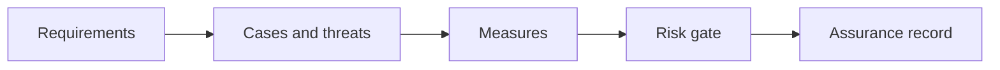

# 10.6 — Governance and Assurance

*Book 10: Evaluation, Safety, and Governance · Read 25 min · Worked example 20 min · Code/design practice 45–60 min · Review 10 min*

## Before you begin

- Books 5–9
- Statistics intuition
- Threat-model basics

If a prerequisite is unfamiliar, use site search and read only enough to explain it and complete a small example. Do not block progress by mastering every upstream topic first.

## Why this chapter exists

Define ownership, inventory, risk tiers, policies, approvals, audit evidence, incidents, exceptions, vendor review, and retirement.

The engineering objective is not to memorize vocabulary. By the end, you should be able to describe the mechanism, build or inspect a small implementation, recognize its failure modes, and decide where it belongs in a larger system.

## Learning objectives

- Explain why governance and assurance matters using the chapter scenario, not abstract definitions alone.
- Trace how **AI inventory** and **risk tiers** interact in the book-level visual.
- Implement or design the bounded practice while holding evaluation cases fixed.
- Diagnose at least two failure modes specific to incident response.
- Decide where this chapter's mechanism belongs in a production architecture and what evidence justifies it.

!!! note "Enduring principle"
    Governance should make safe delivery easier by clarifying authority, evidence, and escalation.

## Mental model



Read the visual from left to right, then trace failures from right to left. The diagram is a book-level map; this chapter explains how **governance and assurance** changes one or more transitions.

## Core concepts

The concepts form a system, not a vocabulary list. Read each section below before attempting the practice exercise.

### Ai Inventory

AI inventory catalogs models, datasets, prompts, and features with owners, risk tier, and dependencies. You cannot govern what you cannot find. See the [Ai Inventory concept card](../../concepts/cards/ai-inventory.md).

**Example:** Registry lists prod chatbot v3, embedding model e5-v2, fine-tune data v1.4 with owners.

**Evidence of understanding:** Quarterly audit: every production AI surface appears in inventory with current owner.

### Risk Tiers

Risk tiers classify AI systems by potential harm—low, medium, high—driving eval depth, approval path, and monitoring. See the [Risk Tiers concept card](../../concepts/cards/risk-tiers.md).

**Example:** Internal summarization is tier 1; automated credit decision is tier 3 with full gate package.

**Evidence of understanding:** Assign tier per system; verify tier-3 systems have required controls before deploy.

### Model Cards

Model cards document intended use, training data, limitations, metrics, and ethical considerations for a model version. See the [Model Cards concept card](../../concepts/cards/model-cards.md).

**Example:** Card states model not for legal advice; lists languages supported and known failure modes.

**Evidence of understanding:** Publish model card link in registry for every production model version.

### Audit Evidence

Audit evidence collects eval reports, approvals, change logs, and incident records demonstrating controlled AI delivery. See the [Audit Evidence concept card](../../concepts/cards/audit-evidence.md).

**Example:** Release ticket links eval v47 pass, security review, and canary metrics.

**Evidence of understanding:** Auditor can trace any prod model version to eval artifact and approver within 15 minutes.

### Incident Response

Incident response defines detect, triage, mitigate, communicate, and postmortem for AI failures—hallucination harm, data leak, outage. See the [Incident Response concept card](../../concepts/cards/incident-response.md).

**Example:** Kill switch disables feature flag within 5 minutes of P0 safety incident.

**Evidence of understanding:** Run tabletop exercise quarterly; measure time to mitigation in drill.

## Worked example

**Book scenario:** A high-impact assistant may pass average quality while failing a safety-critical user slice.

**Situation:** Company scales to 40 AI features; audits ask who owns risk acceptance for the onboarding assistant.

**Baseline:** Each team self-certifies with inconsistent evidence.

**Application:** Create lightweight governance model: AI inventory, risk tiers, required artifacts by tier, approval paths, incident process, vendor review, retirement criteria.

**Test cases:** (1) Normal: low-risk internal summarizer. (2) Boundary: medium-risk customer-facing bot. (3) Adversarial: shadow IT model deployed without inventory entry.

**Measurement:** Inventory coverage %, audit finding count, mean approval cycle time.

**Design question:** What artifact distinguishes tier-2 from tier-1 without bureaucratic overload?

## Chapter hook

Run this short snippet first to anchor **governance and assurance** before the book-level sample:

```python
CHAPTER = "10.6"
print("chapter hook:", CHAPTER)
tiers = {1: ["model card"], 2: ["model card", "eval report", "rollback plan"]}
feature = "onboarding assistant"
tier = 2
print({"required": tiers[tier]})
print("---")
print("change one input above, predict output, re-run")
```

Predict the printed values, then change one line tied to **AI inventory** or **risk tiers** and observe how the chapter mechanism moves.

## Runnable code sample

The following dependency-free sample supports this book. Download it from the [code-sample library](../../code-samples/10-evaluation-slices.py) or run the matching file under `examples/`.

```python
--8<-- "docs/code-samples/10-evaluation-slices.py"
```

Expected output is printed to the terminal. Before running it, predict which values or decisions should change. Then introduce one failure and convert the observation into a test.

??? success "Expected observation"
    The release gate depends on both overall performance and perfect performance in the high-risk slice.

This is a **book-level sample**. Its relevance to this chapter is the boundary between **AI inventory** and **risk tiers**. Modify that boundary, not unrelated lines, when completing the chapter exercise.

## Engineering practice

**Build:** Create a lightweight governance operating model for a mid-size company.

Work in three passes tailored to this chapter:

1. **Baseline:** Implement the task without ai inventory and record quality, latency, and failure cases.
2. **Mechanism:** Add risk tiers while keeping inputs and evaluation fixed; note what changed in intermediate state.
3. **Judgment:** Compare outcomes on normal, boundary, and adversarial cases; document when governance and assurance earns its operational cost.

Capture assumptions, test cases, results, and one architecture decision record. A successful lab explains *why* behavior changed, not merely that the program ran.

## Architecture lens

For a production design in **Evaluation, Safety, and Governance**, make the following explicit for **governance and assurance**:

| Concern | Question to answer |
|---|---|
| **Ownership** | Which service owns ai inventory versus downstream consumers of its output? |
| **Contract** | What typed inputs, outputs, errors, and version does the model cards boundary expose? |
| **Evidence** | Which eval slices prove governance and assurance meets requirements before and after each release? |
| **Security** | What untrusted data crosses the incident response boundary and how is it sanitized or authorized? |
| **Operations** | What is logged at this chapter's transition, what triggers retry or rollback, and what is cached? |
| **Economics** | Which resource—tokens, retrieval calls, GPU seconds, human review—dominates cost for this mechanism? |

## Failure clinic

Reproduce failures at the chapter boundary—do not debug only final output.

| Failure | Symptom | Likely cause | First response |
|---|---|---|---|
| **Baseline illusion** | The system looks fine on demo prompts but fails on the book scenario | Evaluation cases do not cover ai inventory or risk tiers | Add the chapter's normal, boundary, and adversarial cases before tuning |
| **Mechanism mismatch** | Adding complexity does not improve the measured outcome | governance and assurance is applied at the wrong layer or without fixing inputs | Trace the book visual and verify the transition this chapter owns |
| **Silent degradation** | Outputs remain fluent while decisions become wrong | Failure in incident response without observability at that boundary | Log intermediate state, version config, and compare against the baseline |
| **Operational drift** | Quality changes after deploy though prompts are unchanged | Data, permissions, or upstream ai inventory behavior shifted | Pin versions, inspect ingestion and policy filters, re-run slice evals |

Define ownership, inventory, risk tiers, policies, approvals, audit evidence, incidents, exceptions, vendor review, and retirement. When triaging, preserve full inputs, retrieved evidence, tool traces, and model or index versions.

## Evolution lens

- **Yesterday:** Manual playbooks, brittle rules, or single-pass models handled parts of governance and assurance without explicit ai inventory.
- **Today:** Engineering teams implement governance and assurance as testable components with baselines, typed boundaries, and stage-specific evaluation.
- **Tomorrow:** Better automation may reduce toil, but incident response and governance constraints will still require explicit design.
- **What survives:** Governance should make safe delivery easier by clarifying authority, evidence, and escalation.

## Knowledge check

1. How should governance make safe delivery easier?
2. What belongs in an AI inventory entry?
3. What governance baseline is ad hoc per project?

??? question "Answer guidance"
    Q1: Clear tiers, templates, and escalation reduce guesswork. Q2: Owner, data, model, evals, risk tier, approvals. Q3: No inventory, no standard evidence.

## Mastery questions

??? tip "Model answers (proficient level)"
        1. **Explain AI inventory without jargon and give a counterexample.**
       *Proficient answer:* ai inventory catalogs models, datasets, prompts, and features with owners, risk tier, and dependencies. Counterexample: applying it when the task is fully deterministic and cheaper to hard-code.
    2. **Compare risk tiers with incident response using quality, cost, latency, and risk.**
       *Proficient answer:* risk tiers classify ai systems by potential harm—low, medium, high—driving eval depth, approval path, and monitoring; incident response defines detect, triage, mitigate, communicate, and postmortem for ai failures—hallucination harm, data leak, outage. Trade quality gains against operational and security cost on the chapter scenario.
    3. **Design a minimal experiment that tests the chapter's central claim.**
       *Proficient answer:* Fix a baseline and three cases (normal, boundary, adversarial). Add only the chapter mechanism, measure one task metric plus cost/latency, and pre-register what result would falsify the claim.
    4. **Identify which component should own validation, authorization, and observability.**
       *Proficient answer:* Validation belongs at the typed boundary after risk tiers; authorization before any side effect or retrieval of restricted data; observability at the transition governance and assurance introduces in the book visual.
    5. **State what would remain true if today's leading libraries and vendors disappeared.**
       *Proficient answer:* Governance should make safe delivery easier by clarifying authority, evidence, and escalation.

## Self-assessment rubric

| Level | Evidence |
|---|---|
| Not yet | Can repeat terms but cannot trace the visual or predict the sample. |
| Developing | Can explain the mechanism and complete the normal case with help. |
| Proficient | Can implement the exercise, diagnose a failure, and compare a baseline. |
| Transfer | Can defend an architecture choice in a new domain with evaluation evidence. |

## Evidence and further study

- NIST AI Risk Management Framework
- OWASP guidance for LLM applications
- Task-specific evaluation research

Use primary sources for technical claims and official documentation for current product behavior. Record the version or access date for evolving material.

## Continue

Return to the [book index](index.md) or use site search to follow the chapter's concepts into the knowledge-area and reference pages.
