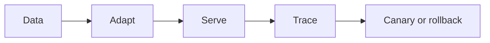

# 11.1 — Choosing Adaptation

*Book 11: Training, Serving, and AI Operations · Read 25 min · Worked example 20 min · Code/design practice 45–60 min · Review 10 min*

## Before you begin

- Books 2, 4, and 10
- Containers and APIs
- Performance measurement

If a prerequisite is unfamiliar, use site search and read only enough to explain it and complete a small example. Do not block progress by mastering every upstream topic first.

## Why this chapter exists

Diagnose whether a requirement needs prompting, retrieval, tools, fine-tuning, continued pretraining, or a different model.

The engineering objective is not to memorize vocabulary. By the end, you should be able to describe the mechanism, build or inspect a small implementation, recognize its failure modes, and decide where it belongs in a larger system.

## Learning objectives

- Explain why choosing adaptation matters using the chapter scenario, not abstract definitions alone.
- Trace how **behavior versus knowledge** and **prompting** interact in the book-level visual.
- Implement or design the bounded practice while holding evaluation cases fixed.
- Diagnose at least two failure modes specific to model selection.
- Decide where this chapter's mechanism belongs in a production architecture and what evidence justifies it.

!!! note "Enduring principle"
    Choose the smallest intervention at the correct system layer.

## Mental model



Read the visual from left to right, then trace failures from right to left. The diagram is a book-level map; this chapter explains how **choosing adaptation** changes one or more transitions.

## Core concepts

The concepts form a system, not a vocabulary list. Read each section below before attempting the practice exercise.

### Behavior Versus Knowledge

Behavior changes how the model acts—tone, format, policy—while knowledge is factual content. RAG adds knowledge; fine-tuning often shifts behavior. See the [Behavior Versus Knowledge concept card](../../concepts/cards/behavior-versus-knowledge.md).

**Example:** Model knows refunds exist but needs SFT to always ask order ID first—that is behavior.

**Evidence of understanding:** Classify ten requirements as behavior or knowledge and map to prompt, RAG, or fine-tune.

### Prompting

Prompting steers model behavior at inference via instructions and examples without weight updates. It is the fastest iteration path when context fits. See the [Prompting concept card](../../concepts/cards/prompting.md).

**Example:** Adding 'cite sources' instruction improves citation rate without retraining.

**Evidence of understanding:** Compare prompt variants on behavioral eval with fixed model weights.

### RAG

Retrieval-augmented generation retrieves external evidence at query time and conditions generation on it. See the [RAG concept card](../../concepts/cards/rag.md).

**Example:** HR assistant retrieves current travel policy and refuses when no supporting document exists.

**Evidence of understanding:** Evaluate retrieval recall and answer faithfulness separately before end-to-end judgment.

### Fine-Tuning

Fine-tuning adapts pretrained weights with supervised or preference data when prompts and RAG cannot stabilize behavior. It trades generality and ops simplicity for targeted changes. See the [Fine-Tuning concept card](../../concepts/cards/fine-tuning.md).

**Example:** Support tone and escalation policy may need SFT when prompts drift across thousands of ticket types.

**Evidence of understanding:** Compare fine-tuned and prompt-only models on held-out behavioral eval with rollback plan.

### Model Selection

Model selection matches capabilities, cost, latency, license, and risk to task requirements—not brand prestige. See the [Model Selection concept card](../../concepts/cards/model-selection.md).

**Example:** Small model handles classification; large model only for complex reasoning slice.

**Evidence of understanding:** Benchmark three candidates on task eval with cost and latency columns in ADR.

## Worked example

**Book scenario:** A service must route requests across models while controlling cost and retaining rollback.

**Situation:** A service must route requests across models while controlling cost and retaining rollback. Team debates prompt vs RAG vs fine-tune for tone compliance.

**Baseline:** Fine-tune immediately for every behavioral tweak.

**Application:** Decision table for ten scenarios separating knowledge gaps (RAG), style/behavior (prompt/fine-tune), tool needs, latency budgets; pick smallest intervention at correct layer.

**Test cases:** (1) Normal: update policy answer via retrieval. (2) Boundary: consistent refusal tone. (3) Adversarial: fine-tune on contaminated eval examples.

**Measurement:** Task success per intervention, operational cost, rollback complexity score.

**Design question:** Which scenario incorrectly defaults to fine-tuning when retrieval would suffice?

## Chapter hook

Run this short snippet first to anchor **choosing adaptation** before the book-level sample:

```python
CHAPTER = "11.1"
print("chapter hook:", CHAPTER)
scenarios = [
    ("new policy fact", "RAG"),
    ("consistent tone", "prompt/SFT"),
    ("live database count", "tool"),
]
for need, fix in scenarios:
    print({"need": need, "intervention": fix})
print("---")
print("change one input above, predict output, re-run")
```

Predict the printed values, then change one line tied to **behavior versus knowledge** or **prompting** and observe how the chapter mechanism moves.

## Runnable code sample

The following dependency-free sample supports this book. Download it from the [code-sample library](../../code-samples/11-model-router.py) or run the matching file under `examples/`.

```python
--8<-- "docs/code-samples/11-model-router.py"
```

Expected output is printed to the terminal. Before running it, predict which values or decisions should change. Then introduce one failure and convert the observation into a test.

??? success "Expected observation"
    Low-risk simple work routes to the cheaper model; high-risk work routes to the higher-quality model.

This is a **book-level sample**. Its relevance to this chapter is the boundary between **behavior versus knowledge** and **prompting**. Modify that boundary, not unrelated lines, when completing the chapter exercise.

## Engineering practice

**Build:** Create a decision table for ten adaptation scenarios.

Work in three passes tailored to this chapter:

1. **Baseline:** Implement the task without behavior versus knowledge and record quality, latency, and failure cases.
2. **Mechanism:** Add prompting while keeping inputs and evaluation fixed; note what changed in intermediate state.
3. **Judgment:** Compare outcomes on normal, boundary, and adversarial cases; document when choosing adaptation earns its operational cost.

Capture assumptions, test cases, results, and one architecture decision record. A successful lab explains *why* behavior changed, not merely that the program ran.

## Spec-driven habit

Every chapter lab pairs reading with **executable acceptance**. Before implementing book 11.1 — choosing adaptation:

1. Draft cases in `test_lab.py` or `specs/lab-1101.yaml`.
2. Use [Cursor Plan/Agent](https://cursor.com/) with "read spec first, then minimal diff".
3. Or use [OpenSpec](https://openspec.dev/) `/opsx:propose` so requirements live in `openspec/` next to code.

→ [Spec-driven workflow guide](../../getting-started/spec-driven-workflow.md) · [Lab 11.1](../../labs/1101-choosing-adaptation.md)


## Architecture lens

For a production design in **Training, Serving, and AI Operations**, make the following explicit for **choosing adaptation**:

| Concern | Question to answer |
|---|---|
| **Ownership** | Which service owns behavior versus knowledge versus downstream consumers of its output? |
| **Contract** | What typed inputs, outputs, errors, and version does the rag boundary expose? |
| **Evidence** | Which eval slices prove choosing adaptation meets requirements before and after each release? |
| **Security** | What untrusted data crosses the model selection boundary and how is it sanitized or authorized? |
| **Operations** | What is logged at this chapter's transition, what triggers retry or rollback, and what is cached? |
| **Economics** | Which resource—tokens, retrieval calls, GPU seconds, human review—dominates cost for this mechanism? |

## Failure clinic

Reproduce failures at the chapter boundary—do not debug only final output.

| Failure | Symptom | Likely cause | First response |
|---|---|---|---|
| **Baseline illusion** | The system looks fine on demo prompts but fails on the book scenario | Evaluation cases do not cover behavior versus knowledge or prompting | Add the chapter's normal, boundary, and adversarial cases before tuning |
| **Mechanism mismatch** | Adding complexity does not improve the measured outcome | choosing adaptation is applied at the wrong layer or without fixing inputs | Trace the book visual and verify the transition this chapter owns |
| **Silent degradation** | Outputs remain fluent while decisions become wrong | Failure in model selection without observability at that boundary | Log intermediate state, version config, and compare against the baseline |
| **Operational drift** | Quality changes after deploy though prompts are unchanged | Data, permissions, or upstream behavior versus knowledge behavior shifted | Pin versions, inspect ingestion and policy filters, re-run slice evals |

Diagnose whether a requirement needs prompting, retrieval, tools, fine-tuning, continued pretraining, or a different model. When triaging, preserve full inputs, retrieved evidence, tool traces, and model or index versions.

## Evolution lens

- **Yesterday:** Manual playbooks, brittle rules, or single-pass models handled parts of choosing adaptation without explicit behavior versus knowledge.
- **Today:** Engineering teams implement choosing adaptation as testable components with baselines, typed boundaries, and stage-specific evaluation.
- **Tomorrow:** Better automation may reduce toil, but model selection and governance constraints will still require explicit design.
- **What survives:** Choose the smallest intervention at the correct system layer.

## Knowledge check

1. Why choose smallest intervention at correct layer?
2. When does RAG beat fine-tuning for knowledge?
3. What adaptation baseline always retrains?

??? question "Answer guidance"
    Q1: Avoids unnecessary cost and rigidity. Q2: Facts change frequently and need citations. Q3: Full fine-tune for every FAQ update.

## Mastery questions

??? tip "Model answers (proficient level)"
        1. **Explain behavior versus knowledge without jargon and give a counterexample.**
       *Proficient answer:* behavior changes how the model acts—tone, format, policy—while knowledge is factual content. Counterexample: applying it when the task is fully deterministic and cheaper to hard-code.
    2. **Compare prompting with model selection using quality, cost, latency, and risk.**
       *Proficient answer:* prompting steers model behavior at inference via instructions and examples without weight updates; model selection matches capabilities, cost, latency, license, and risk to task requirements—not brand prestige. Trade quality gains against operational and security cost on the chapter scenario.
    3. **Design a minimal experiment that tests the chapter's central claim.**
       *Proficient answer:* Fix a baseline and three cases (normal, boundary, adversarial). Add only the chapter mechanism, measure one task metric plus cost/latency, and pre-register what result would falsify the claim.
    4. **Identify which component should own validation, authorization, and observability.**
       *Proficient answer:* Validation belongs at the typed boundary after prompting; authorization before any side effect or retrieval of restricted data; observability at the transition choosing adaptation introduces in the book visual.
    5. **State what would remain true if today's leading libraries and vendors disappeared.**
       *Proficient answer:* Choose the smallest intervention at the correct system layer.

## Self-assessment rubric

| Level | Evidence |
|---|---|
| Not yet | Can repeat terms but cannot trace the visual or predict the sample. |
| Developing | Can explain the mechanism and complete the normal case with help. |
| Proficient | Can implement the exercise, diagnose a failure, and compare a baseline. |
| Transfer | Can defend an architecture choice in a new domain with evaluation evidence. |

## Evidence and further study

- Hu et al. — LoRA
- Ouyang et al. — InstructGPT
- Official inference-server documentation

Use primary sources for technical claims and official documentation for current product behavior. Record the version or access date for evolving material.

## Continue

Return to the [book index](index.md) or use site search to follow the chapter's concepts into the knowledge-area and reference pages.
