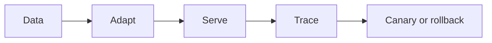

# 11.5 — Deployment and Routing

*Book 11: Training, Serving, and AI Operations · Read 25 min · Worked example 20 min · Code/design practice 45–60 min · Review 10 min*

## Before you begin

- Books 2, 4, and 10
- Containers and APIs
- Performance measurement

If a prerequisite is unfamiliar, use site search and read only enough to explain it and complete a small example. Do not block progress by mastering every upstream topic first.

## Why this chapter exists

Design containers, serverless endpoints, Kubernetes, autoscaling, routing, fallbacks, regional placement, and disaster recovery.

The engineering objective is not to memorize vocabulary. By the end, you should be able to describe the mechanism, build or inspect a small implementation, recognize its failure modes, and decide where it belongs in a larger system.

## Learning objectives

- Explain why deployment and routing matters using the chapter scenario, not abstract definitions alone.
- Trace how **containers** and **autoscaling** interact in the book-level visual.
- Implement or design the bounded practice while holding evaluation cases fixed.
- Diagnose at least two failure modes specific to resilience.
- Decide where this chapter's mechanism belongs in a production architecture and what evidence justifies it.

!!! note "Enduring principle"
    Deployment choices allocate control, cost, latency, and operational burden.

## Mental model



Read the visual from left to right, then trace failures from right to left. The diagram is a book-level map; this chapter explains how **deployment and routing** changes one or more transitions.

## Core concepts

The concepts form a system, not a vocabulary list. Read each section below before attempting the practice exercise.

### Containers

Containers package model servers with dependencies for reproducible deployment across environments. See the [Containers concept card](../../concepts/cards/containers.md).

**Example:** Docker image pins CUDA, Python, and model weights hash for prod inference.

**Evidence of understanding:** Scan container image for CVEs; block deploy on critical unfixed vulnerabilities.

### Autoscaling

Autoscaling adjusts inference replica count based on CPU, GPU utilization, or queue depth. See the [Autoscaling concept card](../../concepts/cards/autoscaling.md).

**Example:** Scale GPU pods from 2 to 10 when p95 queue wait exceeds 500ms.

**Evidence of understanding:** Load spike test verifies scale-up within target minutes without error burst.

### Model Routing

Model routing directs requests to appropriate models by task, risk, cost, or latency policy. See the [Model Routing concept card](../../concepts/cards/model-routing.md).

**Example:** Regex on ticket category routes billing to fine-tuned small model, general to large.

**Evidence of understanding:** Log route decisions; compare blended cost and quality versus single-model baseline.

### Fallbacks

Fallbacks switch to alternate models, cached answers, or human handoff when primary path fails. See the [Fallbacks concept card](../../concepts/cards/fallbacks.md).

**Example:** If primary API 503, serve smaller local model with degraded-quality banner.

**Evidence of understanding:** Chaos-test primary failure; verify fallback activates within SLA with metric logged.

### Resilience

Resilience designs for partial failure—retries, circuit breakers, multi-region—without total service loss. See the [Resilience concept card](../../concepts/cards/resilience.md).

**Example:** Circuit breaker stops calling failing embedding API after 50% errors, uses lexical only.

**Evidence of understanding:** Fault injection test: verify graceful degradation and recovery per runbook.

## Worked example

**Book scenario:** A service must route requests across models while controlling cost and retaining rollback.

**Situation:** Team chooses between hosted API and self-hosted Kubernetes for inference with rollback requirements.

**Baseline:** Direct latest-model endpoint in production code.

**Application:** Write ADR comparing containers vs serverless vs hosted: control, cost at forecast load, latency, failover, regional placement, disaster recovery, model routing and fallbacks.

**Test cases:** (1) Normal: primary model available. (2) Boundary: provider outage triggers fallback. (3) Adversarial: silent provider behavior change without version pin.

**Measurement:** Failover time, cost at 1M req/mo, ops burden score (1–5).

**Design question:** What requirement forces self-host despite higher ops burden?

## Chapter hook

Run this short snippet first to anchor **deployment and routing** before the book-level sample:

```python
CHAPTER = "11.5"
print("chapter hook:", CHAPTER)
options = {"hosted": {"control": 2, "cost": 3}, "self": {"control": 5, "cost": 4}}
need = "data residency strict"
choice = "self" if "residency" in need else "hosted"
print({"choice": choice, **options[choice]})
print("---")
print("change one input above, predict output, re-run")
```

Predict the printed values, then change one line tied to **containers** or **autoscaling** and observe how the chapter mechanism moves.

## Runnable code sample

The following dependency-free sample supports this book. Download it from the [code-sample library](../../code-samples/11-model-router.py) or run the matching file under `examples/`.

```python
--8<-- "docs/code-samples/11-model-router.py"
```

Expected output is printed to the terminal. Before running it, predict which values or decisions should change. Then introduce one failure and convert the observation into a test.

??? success "Expected observation"
    Low-risk simple work routes to the cheaper model; high-risk work routes to the higher-quality model.

This is a **book-level sample**. Its relevance to this chapter is the boundary between **containers** and **autoscaling**. Modify that boundary, not unrelated lines, when completing the chapter exercise.

## Engineering practice

**Build:** Write a deployment ADR comparing hosted and self-hosted inference.

Work in three passes tailored to this chapter:

1. **Baseline:** Implement the task without containers and record quality, latency, and failure cases.
2. **Mechanism:** Add autoscaling while keeping inputs and evaluation fixed; note what changed in intermediate state.
3. **Judgment:** Compare outcomes on normal, boundary, and adversarial cases; document when deployment and routing earns its operational cost.

Capture assumptions, test cases, results, and one architecture decision record. A successful lab explains *why* behavior changed, not merely that the program ran.

## Architecture lens

For a production design in **Training, Serving, and AI Operations**, make the following explicit for **deployment and routing**:

| Concern | Question to answer |
|---|---|
| **Ownership** | Which service owns containers versus downstream consumers of its output? |
| **Contract** | What typed inputs, outputs, errors, and version does the model routing boundary expose? |
| **Evidence** | Which eval slices prove deployment and routing meets requirements before and after each release? |
| **Security** | What untrusted data crosses the resilience boundary and how is it sanitized or authorized? |
| **Operations** | What is logged at this chapter's transition, what triggers retry or rollback, and what is cached? |
| **Economics** | Which resource—tokens, retrieval calls, GPU seconds, human review—dominates cost for this mechanism? |

## Failure clinic

Reproduce failures at the chapter boundary—do not debug only final output.

| Failure | Symptom | Likely cause | First response |
|---|---|---|---|
| **Baseline illusion** | The system looks fine on demo prompts but fails on the book scenario | Evaluation cases do not cover containers or autoscaling | Add the chapter's normal, boundary, and adversarial cases before tuning |
| **Mechanism mismatch** | Adding complexity does not improve the measured outcome | deployment and routing is applied at the wrong layer or without fixing inputs | Trace the book visual and verify the transition this chapter owns |
| **Silent degradation** | Outputs remain fluent while decisions become wrong | Failure in resilience without observability at that boundary | Log intermediate state, version config, and compare against the baseline |
| **Operational drift** | Quality changes after deploy though prompts are unchanged | Data, permissions, or upstream containers behavior shifted | Pin versions, inspect ingestion and policy filters, re-run slice evals |

Design containers, serverless endpoints, Kubernetes, autoscaling, routing, fallbacks, regional placement, and disaster recovery. When triaging, preserve full inputs, retrieved evidence, tool traces, and model or index versions.

## Evolution lens

- **Yesterday:** Manual playbooks, brittle rules, or single-pass models handled parts of deployment and routing without explicit containers.
- **Today:** Engineering teams implement deployment and routing as testable components with baselines, typed boundaries, and stage-specific evaluation.
- **Tomorrow:** Better automation may reduce toil, but resilience and governance constraints will still require explicit design.
- **What survives:** Deployment choices allocate control, cost, latency, and operational burden.

## Knowledge check

1. How do deployment choices allocate control and cost?
2. When are fallbacks mandatory?
3. What deployment baseline has no ADR?

??? question "Answer guidance"
    Q1: Hosted trades control for speed; self-host inverts. Q2: Any production user-facing path with SLA needs fallback model/route. Q3: First vendor picked ad hoc.

## Mastery questions

??? tip "Model answers (proficient level)"
        1. **Explain containers without jargon and give a counterexample.**
       *Proficient answer:* containers package model servers with dependencies for reproducible deployment across environments. Counterexample: applying it when the task is fully deterministic and cheaper to hard-code.
    2. **Compare autoscaling with resilience using quality, cost, latency, and risk.**
       *Proficient answer:* autoscaling adjusts inference replica count based on cpu, gpu utilization, or queue depth; resilience designs for partial failure—retries, circuit breakers, multi-region—without total service loss. Trade quality gains against operational and security cost on the chapter scenario.
    3. **Design a minimal experiment that tests the chapter's central claim.**
       *Proficient answer:* Fix a baseline and three cases (normal, boundary, adversarial). Add only the chapter mechanism, measure one task metric plus cost/latency, and pre-register what result would falsify the claim.
    4. **Identify which component should own validation, authorization, and observability.**
       *Proficient answer:* Validation belongs at the typed boundary after autoscaling; authorization before any side effect or retrieval of restricted data; observability at the transition deployment and routing introduces in the book visual.
    5. **State what would remain true if today's leading libraries and vendors disappeared.**
       *Proficient answer:* Deployment choices allocate control, cost, latency, and operational burden.

## Self-assessment rubric

| Level | Evidence |
|---|---|
| Not yet | Can repeat terms but cannot trace the visual or predict the sample. |
| Developing | Can explain the mechanism and complete the normal case with help. |
| Proficient | Can implement the exercise, diagnose a failure, and compare a baseline. |
| Transfer | Can defend an architecture choice in a new domain with evaluation evidence. |

## Evidence and further study

- Hu et al. — LoRA
- Ouyang et al. — InstructGPT
- Official inference-server documentation

Use primary sources for technical claims and official documentation for current product behavior. Record the version or access date for evolving material.

## Continue

Return to the [book index](index.md) or use site search to follow the chapter's concepts into the knowledge-area and reference pages.
