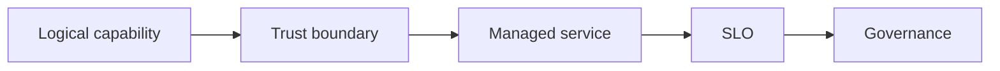

# 12.1 — Enterprise AI Building Blocks

*Book 12: Cloud and Enterprise AI Architecture · Read 25 min · Worked example 20 min · Code/design practice 45–60 min · Review 10 min*

## Before you begin

- Books 5–11
- Cloud and identity fundamentals
- Architecture documentation

If a prerequisite is unfamiliar, use site search and read only enough to explain it and complete a small example. Do not block progress by mastering every upstream topic first.

## Why this chapter exists

Decompose platforms into gateways, model access, retrieval, tool integration, identity, policy, observability, evaluation, and developer experience.

The engineering objective is not to memorize vocabulary. By the end, you should be able to describe the mechanism, build or inspect a small implementation, recognize its failure modes, and decide where it belongs in a larger system.

## Learning objectives

- Explain why enterprise ai building blocks matters using the chapter scenario, not abstract definitions alone.
- Trace how **AI gateways** and **model catalog** interact in the book-level visual.
- Implement or design the bounded practice while holding evaluation cases fixed.
- Diagnose at least two failure modes specific to platform engineering.
- Decide where this chapter's mechanism belongs in a production architecture and what evidence justifies it.

!!! note "Enduring principle"
    Stable capability boundaries make vendor choices replaceable and governance consistent.

## Mental model



Read the visual from left to right, then trace failures from right to left. The diagram is a book-level map; this chapter explains how **enterprise ai building blocks** changes one or more transitions.

## Core concepts

The concepts form a system, not a vocabulary list. Read each section below before attempting the practice exercise.

### Ai Gateways

AI gateways centralize model access with auth, rate limits, logging, routing, and policy enforcement for enterprise teams. See the [Ai Gateways concept card](../../concepts/cards/ai-gateways.md).

**Example:** All Bedrock and OpenAI calls flow through gateway applying PII scrub and budget caps.

**Evidence of understanding:** Block direct model endpoint access; verify 100% traffic appears in gateway logs.

### Model Catalog

Model catalog lists approved models with risk tier, eval status, and allowed use cases for developers. See the [Model Catalog concept card](../../concepts/cards/model-catalog.md).

**Example:** Catalog shows gpt-4o approved tier-2; llama-local approved tier-1 air-gapped only.

**Evidence of understanding:** Reject deployment requests for models not in catalog with approved version.

### Shared Retrieval

Shared retrieval services provide governed indexes, embedding pipelines, and search APIs reused across products. See the [Shared Retrieval concept card](../../concepts/cards/shared-retrieval.md).

**Example:** Enterprise policy index serves HR bot and IT bot with tenant filters from one platform team.

**Evidence of understanding:** Measure index freshness SLA and per-tenant isolation in platform tests.

### Tool Registry

Tool registry catalogs approved agent tools with schemas, owners, and security review status. See the [Tool Registry concept card](../../concepts/cards/tool-registry.md).

**Example:** Registry entry for create_jira_ticket includes schema v2 and pentest date.

**Evidence of understanding:** Agents may only bind tools present in registry with current approval.

### Platform Engineering

Platform engineering builds self-service AI infrastructure—gateways, eval harnesses, templates—so product teams ship faster safely. See the [Platform Engineering concept card](../../concepts/cards/platform-engineering.md).

**Example:** Platform provides RAG starter kit with auth, ingest, eval wired to corporate SSO.

**Evidence of understanding:** Track internal customer time-to-first-production-feature as platform KPI.

## Worked example

**Book scenario:** An architect must implement the same governed AI capability on different cloud providers.

**Situation:** An architect must implement the same governed AI capability on different cloud providers without rewriting product logic each migration.

**Baseline:** Vendor-specific SDK calls scattered through application code.

**Application:** Draw logical platform: gateway, model catalog, shared retrieval, tool registry, identity, policy, observability, eval service—name products only after capabilities mapped.

**Test cases:** (1) Normal: swap model provider behind gateway. (2) Boundary: shared retrieval ACL model portable. (3) Adversarial: leaky abstraction hiding provider limits (context size).

**Measurement:** Portability score (# provider-locked calls), time to map architecture on second cloud.

**Design question:** Which capability boundary must stay stable across vendors?

## Chapter hook

Run this short snippet first to anchor **enterprise ai building blocks** before the book-level sample:

```python
CHAPTER = "12.1"
print("chapter hook:", CHAPTER)
capabilities = ["gateway", "retrieval", "tool registry", "identity", "observability"]
products = {"aws": "bedrock", "azure": "foundry", "gcp": "vertex"}
for cap in capabilities:
    print(cap, "maps to provider-specific service behind interface")
print("---")
print("change one input above, predict output, re-run")
```

Predict the printed values, then change one line tied to **AI gateways** or **model catalog** and observe how the chapter mechanism moves.

## Runnable code sample

The following dependency-free sample supports this book. Download it from the [code-sample library](../../code-samples/12-cloud-capability-map.py) or run the matching file under `examples/`.

```python
--8<-- "docs/code-samples/12-cloud-capability-map.py"
```

Expected output is printed to the terminal. Before running it, predict which values or decisions should change. Then introduce one failure and convert the observation into a test.

??? success "Expected observation"
    The logical architecture remains stable while provider-specific service names change.

This is a **book-level sample**. Its relevance to this chapter is the boundary between **AI gateways** and **model catalog**. Modify that boundary, not unrelated lines, when completing the chapter exercise.

## Engineering practice

**Build:** Draw a logical platform architecture before naming products.

Work in three passes tailored to this chapter:

1. **Baseline:** Implement the task without ai gateways and record quality, latency, and failure cases.
2. **Mechanism:** Add model catalog while keeping inputs and evaluation fixed; note what changed in intermediate state.
3. **Judgment:** Compare outcomes on normal, boundary, and adversarial cases; document when enterprise ai building blocks earns its operational cost.

Capture assumptions, test cases, results, and one architecture decision record. A successful lab explains *why* behavior changed, not merely that the program ran.

## Architecture lens

For a production design in **Cloud and Enterprise AI Architecture**, make the following explicit for **enterprise ai building blocks**:

| Concern | Question to answer |
|---|---|
| **Ownership** | Which service owns ai gateways versus downstream consumers of its output? |
| **Contract** | What typed inputs, outputs, errors, and version does the shared retrieval boundary expose? |
| **Evidence** | Which eval slices prove enterprise ai building blocks meets requirements before and after each release? |
| **Security** | What untrusted data crosses the platform engineering boundary and how is it sanitized or authorized? |
| **Operations** | What is logged at this chapter's transition, what triggers retry or rollback, and what is cached? |
| **Economics** | Which resource—tokens, retrieval calls, GPU seconds, human review—dominates cost for this mechanism? |

## Failure clinic

Reproduce failures at the chapter boundary—do not debug only final output.

| Failure | Symptom | Likely cause | First response |
|---|---|---|---|
| **Baseline illusion** | The system looks fine on demo prompts but fails on the book scenario | Evaluation cases do not cover ai gateways or model catalog | Add the chapter's normal, boundary, and adversarial cases before tuning |
| **Mechanism mismatch** | Adding complexity does not improve the measured outcome | enterprise ai building blocks is applied at the wrong layer or without fixing inputs | Trace the book visual and verify the transition this chapter owns |
| **Silent degradation** | Outputs remain fluent while decisions become wrong | Failure in platform engineering without observability at that boundary | Log intermediate state, version config, and compare against the baseline |
| **Operational drift** | Quality changes after deploy though prompts are unchanged | Data, permissions, or upstream ai gateways behavior shifted | Pin versions, inspect ingestion and policy filters, re-run slice evals |

Decompose platforms into gateways, model access, retrieval, tool integration, identity, policy, observability, evaluation, and developer experience. When triaging, preserve full inputs, retrieved evidence, tool traces, and model or index versions.

## Evolution lens

- **Yesterday:** Manual playbooks, brittle rules, or single-pass models handled parts of enterprise ai building blocks without explicit ai gateways.
- **Today:** Engineering teams implement enterprise ai building blocks as testable components with baselines, typed boundaries, and stage-specific evaluation.
- **Tomorrow:** Better automation may reduce toil, but platform engineering and governance constraints will still require explicit design.
- **What survives:** Stable capability boundaries make vendor choices replaceable and governance consistent.

## Knowledge check

1. Why define logical capabilities before products?
2. What makes vendor choices replaceable?
3. What architecture baseline embeds SDKs in app code?

??? question "Answer guidance"
    Q1: Capabilities survive vendor renames and mergers. Q2: Stable interfaces and owned data. Q3: Direct Bedrock/OpenAI calls everywhere.

## Mastery questions

??? tip "Model answers (proficient level)"
        1. **Explain AI gateways without jargon and give a counterexample.**
       *Proficient answer:* ai gateways centralize model access with auth, rate limits, logging, routing, and policy enforcement for enterprise teams. Counterexample: applying it when the task is fully deterministic and cheaper to hard-code.
    2. **Compare model catalog with platform engineering using quality, cost, latency, and risk.**
       *Proficient answer:* model catalog lists approved models with risk tier, eval status, and allowed use cases for developers; platform engineering builds self-service ai infrastructure—gateways, eval harnesses, templates—so product teams ship faster safely. Trade quality gains against operational and security cost on the chapter scenario.
    3. **Design a minimal experiment that tests the chapter's central claim.**
       *Proficient answer:* Fix a baseline and three cases (normal, boundary, adversarial). Add only the chapter mechanism, measure one task metric plus cost/latency, and pre-register what result would falsify the claim.
    4. **Identify which component should own validation, authorization, and observability.**
       *Proficient answer:* Validation belongs at the typed boundary after model catalog; authorization before any side effect or retrieval of restricted data; observability at the transition enterprise ai building blocks introduces in the book visual.
    5. **State what would remain true if today's leading libraries and vendors disappeared.**
       *Proficient answer:* Stable capability boundaries make vendor choices replaceable and governance consistent.

## Self-assessment rubric

| Level | Evidence |
|---|---|
| Not yet | Can repeat terms but cannot trace the visual or predict the sample. |
| Developing | Can explain the mechanism and complete the normal case with help. |
| Proficient | Can implement the exercise, diagnose a failure, and compare a baseline. |
| Transfer | Can defend an architecture choice in a new domain with evaluation evidence. |

## Evidence and further study

- Official AWS, Azure, and Google Cloud architecture and service documentation
- Organization security and data-governance standards

Use primary sources for technical claims and official documentation for current product behavior. Record the version or access date for evolving material.

## Continue

Return to the [book index](index.md) or use site search to follow the chapter's concepts into the knowledge-area and reference pages.
