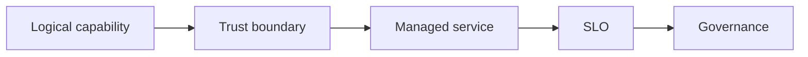

# 12.2 — Identity, Data, and Trust Boundaries

*Book 12: Cloud and Enterprise AI Architecture · Read 25 min · Worked example 20 min · Code/design practice 45–60 min · Review 10 min*

## Before you begin

- Books 5–11
- Cloud and identity fundamentals
- Architecture documentation

If a prerequisite is unfamiliar, use site search and read only enough to explain it and complete a small example. Do not block progress by mastering every upstream topic first.

## Why this chapter exists

Apply authentication, authorization, tenancy, secrets, encryption, residency, lineage, and audit to AI data flows.

The engineering objective is not to memorize vocabulary. By the end, you should be able to describe the mechanism, build or inspect a small implementation, recognize its failure modes, and decide where it belongs in a larger system.

## Learning objectives

- Explain why identity, data, and trust boundaries matters using the chapter scenario, not abstract definitions alone.
- Trace how **identity** and **authorization** interact in the book-level visual.
- Implement or design the bounded practice while holding evaluation cases fixed.
- Diagnose at least two failure modes specific to audit.
- Decide where this chapter's mechanism belongs in a production architecture and what evidence justifies it.

!!! note "Enduring principle"
    A model call does not suspend ordinary identity and data-security requirements.

## Mental model



Read the visual from left to right, then trace failures from right to left. The diagram is a book-level map; this chapter explains how **identity, data, and trust boundaries** changes one or more transitions.

## Core concepts

The concepts form a system, not a vocabulary list. Read each section below before attempting the practice exercise.

### Identity

Identity establishes who users and services are—SSO, service principals, workload identity—for AI data access. See the [Identity concept card](../../concepts/cards/identity.md).

**Example:** Employee SSO identity flows to retrieval filters and audit logs on every query.

**Evidence of understanding:** Verify deprovisioned user loses model and index access within one hour.

### Authorization

Authorization ensures retrieved and acted-upon data respects user permissions—not just authentication. RAG without authZ leaks restricted documents into answers. See the [Authorization concept card](../../concepts/cards/authorization.md).

**Example:** An employee should not retrieve executive compensation docs via semantic search without role checks.

**Evidence of understanding:** Run queries as low-privilege users and confirm zero restricted chunks appear in context.

### Multi-Tenancy

Multi-tenancy isolates customer data, indexes, quotas, and configs in shared AI platforms. See the [Multi-Tenancy concept card](../../concepts/cards/multi-tenancy.md).

**Example:** Tenant A embeddings never appear in Tenant B vector search results.

**Evidence of understanding:** Cross-tenant penetration tests must return zero data leaks.

### Data Residency

Data residency restricts processing and storage to approved geographic regions for legal compliance. See the [Data Residency concept card](../../concepts/cards/data-residency.md).

**Example:** EU customer prompts and indexes stay in eu-west inference and storage only.

**Evidence of understanding:** Validate data plane region tags on every storage and inference resource.

### Audit

Audit logs record who accessed which models, documents, and tools with immutable retention for compliance. See the [Audit concept card](../../concepts/cards/audit.md).

**Example:** Log entry: user, query hash, retrieved doc IDs, model version, timestamp.

**Evidence of understanding:** Simulate auditor request; produce complete trail for sample user within SLA.

## Worked example

**Book scenario:** An architect must implement the same governed AI capability on different cloud providers.

**Situation:** Enterprise assistant crosses HR data, IT tickets, and manager identity—auditors ask who can see what at each hop.

**Baseline:** Single shared API key to all backend services.

**Application:** Threat-model flows with authentication, authorization, tenancy, encryption in transit/at rest, residency, lineage, audit logs on model and retrieval calls.

**Test cases:** (1) Normal: employee accesses own onboarding status. (2) Boundary: manager views direct report. (3) Adversarial: confused deputy via tool using admin credentials.

**Measurement:** Unauthorized access test pass rate, audit log completeness, data residency compliance checklist.

**Design question:** Where must authorization occur—in the model prompt or at each tool/data boundary?

## Chapter hook

Run this short snippet first to anchor **identity, data, and trust boundaries** before the book-level sample:

```python
CHAPTER = "12.2"
print("chapter hook:", CHAPTER)
boundaries = ["user->gateway", "gateway->retrieval", "tool->HR API"]
for b in boundaries:
    print(b, "requires authZ check")
print("inspect step", 1)
print("---")
print("change one input above, predict output, re-run")
```

Predict the printed values, then change one line tied to **identity** or **authorization** and observe how the chapter mechanism moves.

## Runnable code sample

The following dependency-free sample supports this book. Download it from the [code-sample library](../../code-samples/12-cloud-capability-map.py) or run the matching file under `examples/`.

```python
--8<-- "docs/code-samples/12-cloud-capability-map.py"
```

Expected output is printed to the terminal. Before running it, predict which values or decisions should change. Then introduce one failure and convert the observation into a test.

??? success "Expected observation"
    The logical architecture remains stable while provider-specific service names change.

This is a **book-level sample**. Its relevance to this chapter is the boundary between **identity** and **authorization**. Modify that boundary, not unrelated lines, when completing the chapter exercise.

## Engineering practice

**Build:** Threat-model an enterprise assistant across trust boundaries.

Work in three passes tailored to this chapter:

1. **Baseline:** Implement the task without identity and record quality, latency, and failure cases.
2. **Mechanism:** Add authorization while keeping inputs and evaluation fixed; note what changed in intermediate state.
3. **Judgment:** Compare outcomes on normal, boundary, and adversarial cases; document when identity, data, and trust boundaries earns its operational cost.

Capture assumptions, test cases, results, and one architecture decision record. A successful lab explains *why* behavior changed, not merely that the program ran.

## Spec-driven habit

Every chapter lab pairs reading with **executable acceptance**. Before implementing book 12.2 — identity, data, and trust boundaries:

1. Draft cases in `test_lab.py` or `specs/lab-1202.yaml`.
2. Use [Cursor Plan/Agent](https://cursor.com/) with "read spec first, then minimal diff".
3. Or use [OpenSpec](https://openspec.dev/) `/opsx:propose` so requirements live in `openspec/` next to code.

→ [Spec-driven workflow guide](../../getting-started/spec-driven-workflow.md) · [Lab 12.2](../../labs/1202-identity-data-and-trust-boundaries.md)


## Architecture lens

For a production design in **Cloud and Enterprise AI Architecture**, make the following explicit for **identity, data, and trust boundaries**:

| Concern | Question to answer |
|---|---|
| **Ownership** | Which service owns identity versus downstream consumers of its output? |
| **Contract** | What typed inputs, outputs, errors, and version does the multi-tenancy boundary expose? |
| **Evidence** | Which eval slices prove identity, data, and trust boundaries meets requirements before and after each release? |
| **Security** | What untrusted data crosses the audit boundary and how is it sanitized or authorized? |
| **Operations** | What is logged at this chapter's transition, what triggers retry or rollback, and what is cached? |
| **Economics** | Which resource—tokens, retrieval calls, GPU seconds, human review—dominates cost for this mechanism? |

## Failure clinic

Reproduce failures at the chapter boundary—do not debug only final output.

| Failure | Symptom | Likely cause | First response |
|---|---|---|---|
| **Baseline illusion** | The system looks fine on demo prompts but fails on the book scenario | Evaluation cases do not cover identity or authorization | Add the chapter's normal, boundary, and adversarial cases before tuning |
| **Mechanism mismatch** | Adding complexity does not improve the measured outcome | identity, data, and trust boundaries is applied at the wrong layer or without fixing inputs | Trace the book visual and verify the transition this chapter owns |
| **Silent degradation** | Outputs remain fluent while decisions become wrong | Failure in audit without observability at that boundary | Log intermediate state, version config, and compare against the baseline |
| **Operational drift** | Quality changes after deploy though prompts are unchanged | Data, permissions, or upstream identity behavior shifted | Pin versions, inspect ingestion and policy filters, re-run slice evals |

Apply authentication, authorization, tenancy, secrets, encryption, residency, lineage, and audit to AI data flows. When triaging, preserve full inputs, retrieved evidence, tool traces, and model or index versions.

## Evolution lens

- **Yesterday:** Manual playbooks, brittle rules, or single-pass models handled parts of identity, data, and trust boundaries without explicit identity.
- **Today:** Engineering teams implement identity, data, and trust boundaries as testable components with baselines, typed boundaries, and stage-specific evaluation.
- **Tomorrow:** Better automation may reduce toil, but audit and governance constraints will still require explicit design.
- **What survives:** A model call does not suspend ordinary identity and data-security requirements.

## Knowledge check

1. Why doesn't a model call suspend security requirements?
2. How does tenancy differ from authentication?
3. What trust baseline uses one global API key?

??? question "Answer guidance"
    Q1: Models do not enforce policy; services must. Q2: AuthN proves identity; tenancy scopes data access. Q3: Shared key with no per-user scopes.

## Mastery questions

??? tip "Model answers (proficient level)"
        1. **Explain identity without jargon and give a counterexample.**
       *Proficient answer:* identity establishes who users and services are—sso, service principals, workload identity—for ai data access. Counterexample: applying it when the task is fully deterministic and cheaper to hard-code.
    2. **Compare authorization with audit using quality, cost, latency, and risk.**
       *Proficient answer:* authorization ensures retrieved and acted-upon data respects user permissions—not just authentication; audit logs record who accessed which models, documents, and tools with immutable retention for compliance. Trade quality gains against operational and security cost on the chapter scenario.
    3. **Design a minimal experiment that tests the chapter's central claim.**
       *Proficient answer:* Fix a baseline and three cases (normal, boundary, adversarial). Add only the chapter mechanism, measure one task metric plus cost/latency, and pre-register what result would falsify the claim.
    4. **Identify which component should own validation, authorization, and observability.**
       *Proficient answer:* Validation belongs at the typed boundary after authorization; authorization before any side effect or retrieval of restricted data; observability at the transition identity, data, and trust boundaries introduces in the book visual.
    5. **State what would remain true if today's leading libraries and vendors disappeared.**
       *Proficient answer:* A model call does not suspend ordinary identity and data-security requirements.

## Self-assessment rubric

| Level | Evidence |
|---|---|
| Not yet | Can repeat terms but cannot trace the visual or predict the sample. |
| Developing | Can explain the mechanism and complete the normal case with help. |
| Proficient | Can implement the exercise, diagnose a failure, and compare a baseline. |
| Transfer | Can defend an architecture choice in a new domain with evaluation evidence. |

## Evidence and further study

- Official AWS, Azure, and Google Cloud architecture and service documentation
- Organization security and data-governance standards

Use primary sources for technical claims and official documentation for current product behavior. Record the version or access date for evolving material.

## Continue

Return to the [book index](index.md) or use site search to follow the chapter's concepts into the knowledge-area and reference pages.
