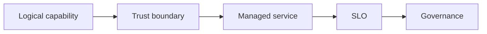

# 12.3 — AWS Managed AI

*Book 12: Cloud and Enterprise AI Architecture · Read 25 min · Worked example 20 min · Code/design practice 45–60 min · Review 10 min*

## Before you begin

- Books 5–11
- Cloud and identity fundamentals
- Architecture documentation

If a prerequisite is unfamiliar, use site search and read only enough to explain it and complete a small example. Do not block progress by mastering every upstream topic first.

## Why this chapter exists

Map foundation models, ML lifecycle, retrieval, serverless compute, containers, workflow, identity, storage, and monitoring to AWS services.

The engineering objective is not to memorize vocabulary. By the end, you should be able to describe the mechanism, build or inspect a small implementation, recognize its failure modes, and decide where it belongs in a larger system.

## Learning objectives

- Explain why aws managed ai matters using the chapter scenario, not abstract definitions alone.
- Trace how **Amazon Bedrock** and **SageMaker** interact in the book-level visual.
- Implement or design the bounded practice while holding evaluation cases fixed.
- Diagnose at least two failure modes specific to cloudwatch and iam.
- Decide where this chapter's mechanism belongs in a production architecture and what evidence justifies it.

!!! note "Enduring principle"
    Start with logical capabilities; use managed services where their constraints match the system.

## Mental model



Read the visual from left to right, then trace failures from right to left. The diagram is a book-level map; this chapter explains how **aws managed ai** changes one or more transitions.

## Core concepts

The concepts form a system, not a vocabulary list. Read each section below before attempting the practice exercise.

### Amazon Bedrock

Amazon Bedrock provides managed access to foundation models from multiple providers via unified AWS APIs with IAM integration and private networking. See the [Amazon Bedrock concept card](../../concepts/cards/amazon-bedrock.md).

**Example:** Invoke Claude and Titan through Bedrock in VPC without exposing keys on laptops.

**Evidence of understanding:** Compare Bedrock latency and cost versus self-hosted on same region for target workload.

### SageMaker

Amazon SageMaker covers ML training, tuning, hosting, and monitoring for custom and foundation models on AWS. See the [SageMaker concept card](../../concepts/cards/sagemaker.md).

**Example:** Fine-tune and deploy custom classifier on SageMaker endpoint with autoscaling and Model Monitor.

**Evidence of understanding:** Document training job config hash linked to endpoint version in registry.

### OpenSearch

Amazon OpenSearch supports lexical, vector, and hybrid search with k-NN indexes for RAG on AWS. See the [OpenSearch concept card](../../concepts/cards/opensearch.md).

**Example:** OpenSearch k-NN index stores policy embeddings filtered by IAM-scoped document metadata.

**Evidence of understanding:** Benchmark recall@10 and p95 query latency on OpenSearch versus managed alternative.

### Lambda And Eks

AWS Lambda and EKS provide serverless functions and Kubernetes clusters for AI orchestration, agents, and custom servers. See the [Lambda And Eks concept card](../../concepts/cards/lambda-and-eks.md).

**Example:** Lambda handles lightweight ingest triggers; EKS hosts vLLM GPU workloads with Karpenter scaling.

**Evidence of understanding:** Map workload to Lambda versus EKS based on duration, GPU need, and cold-start tolerance.

### Cloudwatch And Iam

CloudWatch and IAM deliver AWS monitoring, alerting, and access control for AI workloads—metrics, logs, roles, policies. See the [Cloudwatch And Iam concept card](../../concepts/cards/cloudwatch-and-iam.md).

**Example:** IAM role grants Bedrock invoke only; CloudWatch alarm on 5xx rate triggers runbook.

**Evidence of understanding:** Least-privilege IAM review quarterly; zero overly broad bedrock:* on human roles.

## Worked example

**Book scenario:** An architect must implement the same governed AI capability on different cloud providers.

**Situation:** Organization standardizes on AWS; team maps enterprise RAG design to Bedrock, OpenSearch, Lambda/EKS, IAM, CloudWatch.

**Baseline:** Lift-and-shift generic diagram with wrong service couplings.

**Application:** Map each logical component to AWS managed services, estimate trade-offs (ops vs control), document IAM boundaries, cost drivers, and gaps needing custom code.

**Test cases:** (1) Normal: Bedrock invoke with IAM role. (2) Boundary: OpenSearch Serverless vs managed cluster for ACL needs. (3) Adversarial: overly broad IAM policy on Lambda retriever.

**Measurement:** Architecture review score, IAM least-privilege pass, estimated monthly cost at 1M queries.

**Design question:** When would EKS beat Lambda for the tool execution layer?

## Chapter hook

Run this short snippet first to anchor **aws managed ai** before the book-level sample:

```python
CHAPTER = "12.3"
print("chapter hook:", CHAPTER)
mapping = {"models": "Bedrock", "search": "OpenSearch", "compute": "Lambda/EKS", "identity": "IAM"}
for cap, svc in mapping.items():
    print(f"{cap} -> {svc}")
print("inspect step", 1)
print("---")
print("change one input above, predict output, re-run")
```

Predict the printed values, then change one line tied to **Amazon Bedrock** or **SageMaker** and observe how the chapter mechanism moves.

## Runnable code sample

The following dependency-free sample supports this book. Download it from the [code-sample library](../../code-samples/12-cloud-capability-map.py) or run the matching file under `examples/`.

```python
--8<-- "docs/code-samples/12-cloud-capability-map.py"
```

Expected output is printed to the terminal. Before running it, predict which values or decisions should change. Then introduce one failure and convert the observation into a test.

??? success "Expected observation"
    The logical architecture remains stable while provider-specific service names change.

This is a **book-level sample**. Its relevance to this chapter is the boundary between **Amazon Bedrock** and **SageMaker**. Modify that boundary, not unrelated lines, when completing the chapter exercise.

## Engineering practice

**Build:** Map the enterprise RAG design to AWS and estimate managed-service trade-offs.

Work in three passes tailored to this chapter:

1. **Baseline:** Implement the task without amazon bedrock and record quality, latency, and failure cases.
2. **Mechanism:** Add sagemaker while keeping inputs and evaluation fixed; note what changed in intermediate state.
3. **Judgment:** Compare outcomes on normal, boundary, and adversarial cases; document when aws managed ai earns its operational cost.

Capture assumptions, test cases, results, and one architecture decision record. A successful lab explains *why* behavior changed, not merely that the program ran.

## Architecture lens

For a production design in **Cloud and Enterprise AI Architecture**, make the following explicit for **aws managed ai**:

| Concern | Question to answer |
|---|---|
| **Ownership** | Which service owns amazon bedrock versus downstream consumers of its output? |
| **Contract** | What typed inputs, outputs, errors, and version does the opensearch boundary expose? |
| **Evidence** | Which eval slices prove aws managed ai meets requirements before and after each release? |
| **Security** | What untrusted data crosses the cloudwatch and iam boundary and how is it sanitized or authorized? |
| **Operations** | What is logged at this chapter's transition, what triggers retry or rollback, and what is cached? |
| **Economics** | Which resource—tokens, retrieval calls, GPU seconds, human review—dominates cost for this mechanism? |

## Failure clinic

Reproduce failures at the chapter boundary—do not debug only final output.

| Failure | Symptom | Likely cause | First response |
|---|---|---|---|
| **Baseline illusion** | The system looks fine on demo prompts but fails on the book scenario | Evaluation cases do not cover amazon bedrock or sagemaker | Add the chapter's normal, boundary, and adversarial cases before tuning |
| **Mechanism mismatch** | Adding complexity does not improve the measured outcome | aws managed ai is applied at the wrong layer or without fixing inputs | Trace the book visual and verify the transition this chapter owns |
| **Silent degradation** | Outputs remain fluent while decisions become wrong | Failure in cloudwatch and iam without observability at that boundary | Log intermediate state, version config, and compare against the baseline |
| **Operational drift** | Quality changes after deploy though prompts are unchanged | Data, permissions, or upstream amazon bedrock behavior shifted | Pin versions, inspect ingestion and policy filters, re-run slice evals |

Map foundation models, ML lifecycle, retrieval, serverless compute, containers, workflow, identity, storage, and monitoring to AWS services. When triaging, preserve full inputs, retrieved evidence, tool traces, and model or index versions.

## Evolution lens

- **Yesterday:** Manual playbooks, brittle rules, or single-pass models handled parts of aws managed ai without explicit amazon bedrock.
- **Today:** Engineering teams implement aws managed ai as testable components with baselines, typed boundaries, and stage-specific evaluation.
- **Tomorrow:** Better automation may reduce toil, but cloudwatch and iam and governance constraints will still require explicit design.
- **What survives:** Start with logical capabilities; use managed services where their constraints match the system.

## Knowledge check

1. Why start from logical design before naming AWS products?
2. What trade do managed services impose?
3. What cloud baseline copies tutorial architecture unchanged?

??? question "Answer guidance"
    Q1: Prevents forcing problems into familiar services. Q2: Less ops, more coupling and constraint. Q3: Default serverless RAG blog with no ACL model.

## Mastery questions

??? tip "Model answers (proficient level)"
        1. **Explain Amazon Bedrock without jargon and give a counterexample.**
       *Proficient answer:* amazon bedrock provides managed access to foundation models from multiple providers via unified aws apis with iam integration and private networking. Counterexample: applying it when the task is fully deterministic and cheaper to hard-code.
    2. **Compare SageMaker with CloudWatch and IAM using quality, cost, latency, and risk.**
       *Proficient answer:* amazon sagemaker covers ml training, tuning, hosting, and monitoring for custom and foundation models on aws; cloudwatch and iam deliver aws monitoring, alerting, and access control for ai workloads—metrics, logs, roles, policies. Trade quality gains against operational and security cost on the chapter scenario.
    3. **Design a minimal experiment that tests the chapter's central claim.**
       *Proficient answer:* Fix a baseline and three cases (normal, boundary, adversarial). Add only the chapter mechanism, measure one task metric plus cost/latency, and pre-register what result would falsify the claim.
    4. **Identify which component should own validation, authorization, and observability.**
       *Proficient answer:* Validation belongs at the typed boundary after sagemaker; authorization before any side effect or retrieval of restricted data; observability at the transition aws managed ai introduces in the book visual.
    5. **State what would remain true if today's leading libraries and vendors disappeared.**
       *Proficient answer:* Start with logical capabilities; use managed services where their constraints match the system.

## Self-assessment rubric

| Level | Evidence |
|---|---|
| Not yet | Can repeat terms but cannot trace the visual or predict the sample. |
| Developing | Can explain the mechanism and complete the normal case with help. |
| Proficient | Can implement the exercise, diagnose a failure, and compare a baseline. |
| Transfer | Can defend an architecture choice in a new domain with evaluation evidence. |

## Evidence and further study

- Official AWS, Azure, and Google Cloud architecture and service documentation
- Organization security and data-governance standards

Use primary sources for technical claims and official documentation for current product behavior. Record the version or access date for evolving material.

## Continue

Return to the [book index](index.md) or use site search to follow the chapter's concepts into the knowledge-area and reference pages.
