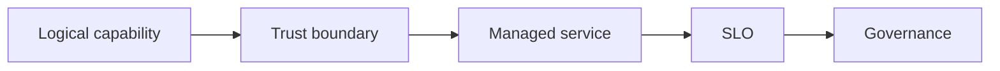

# 12.4 — Azure Managed AI

*Book 12: Cloud and Enterprise AI Architecture · Read 25 min · Worked example 20 min · Code/design practice 45–60 min · Review 10 min*

## Before you begin

- Books 5–11
- Cloud and identity fundamentals
- Architecture documentation

If a prerequisite is unfamiliar, use site search and read only enough to explain it and complete a small example. Do not block progress by mastering every upstream topic first.

## Why this chapter exists

Map models, ML, search, functions, containers, integration, identity, data, security, and operations to Azure.

The engineering objective is not to memorize vocabulary. By the end, you should be able to describe the mechanism, build or inspect a small implementation, recognize its failure modes, and decide where it belongs in a larger system.

## Learning objectives

- Explain why azure managed ai matters using the chapter scenario, not abstract definitions alone.
- Trace how **Azure AI Foundry** and **Azure OpenAI** interact in the book-level visual.
- Implement or design the bounded practice while holding evaluation cases fixed.
- Diagnose at least two failure modes specific to entra id and monitor.
- Decide where this chapter's mechanism belongs in a production architecture and what evidence justifies it.

!!! note "Enduring principle"
    Cloud-native integration can accelerate governance but increases platform coupling.

## Mental model



Read the visual from left to right, then trace failures from right to left. The diagram is a book-level map; this chapter explains how **azure managed ai** changes one or more transitions.

## Core concepts

The concepts form a system, not a vocabulary list. Read each section below before attempting the practice exercise.

### Azure Ai Foundry

Azure AI Foundry is Microsoft's unified portal for model deployment, fine-tuning, evaluation, and agent tooling integrated with Azure services. See the [Azure Ai Foundry concept card](../../concepts/cards/azure-ai-foundry.md).

**Example:** Deploy GPT-4o mini, run eval flow, and promote to managed endpoint from Foundry pipeline.

**Evidence of understanding:** Trace model from Foundry project through to production endpoint with eval artifact link.

### Azure Openai

Azure OpenAI Service hosts OpenAI models in Azure regions with private networking, content filters, and Entra ID auth. See the [Azure Openai concept card](../../concepts/cards/azure-openai.md).

**Example:** Enterprise chatbot calls gpt-4o in tenant VNet with content safety filters enabled.

**Evidence of understanding:** Verify no traffic bypasses Azure content filter policy on red-team prompt set.

### Azure Ai Search

Azure AI Search provides hybrid lexical-vector search, semantic ranker, and skill pipelines for RAG on Azure. See the [Azure Ai Search concept card](../../concepts/cards/azure-ai-search.md).

**Example:** Indexer pipeline OCRs PDFs, enriches metadata, and indexes vectors for copilot retrieval.

**Evidence of understanding:** Measure indexer lag from blob upload to searchable document against freshness SLA.

### Aks And Functions

AKS and Azure Functions run containerized model servers and event-driven AI glue code on Azure. See the [Aks And Functions concept card](../../concepts/cards/aks-and-functions.md).

**Example:** Function triggers on blob upload; AKS serves GPU embedding model with HPA.

**Evidence of understanding:** Compare cold start and cost for Functions versus always-on AKS for ingest path.

### Entra Id And Monitor

Microsoft Entra ID and Azure Monitor provide identity, RBAC, and observability for Azure AI workloads. See the [Entra Id And Monitor concept card](../../concepts/cards/entra-id-and-monitor.md).

**Example:** Entra groups map to AI Search index ACLs; Monitor alerts on token spike anomalies.

**Evidence of understanding:** Validate disabled Entra user cannot invoke Azure OpenAI within minutes.

## Worked example

**Book scenario:** An architect must implement the same governed AI capability on different cloud providers.

**Situation:** Same RAG design must map to Azure for a subsidiary already on Entra ID and Azure AI Search.

**Baseline:** Assume Azure equals AWS with different names.

**Application:** Map to Azure AI Foundry/OpenAI, AI Search, Functions/AKS, Entra ID, Monitor; compare identity integration advantages and coupling risks vs AWS map.

**Test cases:** (1) Normal: Entra-scoped search index. (2) Boundary: hybrid search skill configuration. (3) Adversarial: guest account excessive search permissions.

**Measurement:** Identity integration effort score, feature parity gaps list, migration effort from AWS map.

**Design question:** Which Azure-native integration most reduces custom auth code—and what coupling does it create?

## Chapter hook

Run this short snippet first to anchor **azure managed ai** before the book-level sample:

```python
CHAPTER = "12.4"
print("chapter hook:", CHAPTER)
integrations = {"identity": "Entra ID", "search": "Azure AI Search", "models": "Azure OpenAI"}
benefit = "group-based ACL on indexes"
coupling = "Entra-specific token claims"
print({"benefit": benefit, "coupling": coupling})
print("---")
print("change one input above, predict output, re-run")
```

Predict the printed values, then change one line tied to **Azure AI Foundry** or **Azure OpenAI** and observe how the chapter mechanism moves.

## Runnable code sample

The following dependency-free sample supports this book. Download it from the [code-sample library](../../code-samples/12-cloud-capability-map.py) or run the matching file under `examples/`.

```python
--8<-- "docs/code-samples/12-cloud-capability-map.py"
```

Expected output is printed to the terminal. Before running it, predict which values or decisions should change. Then introduce one failure and convert the observation into a test.

??? success "Expected observation"
    The logical architecture remains stable while provider-specific service names change.

This is a **book-level sample**. Its relevance to this chapter is the boundary between **Azure AI Foundry** and **Azure OpenAI**. Modify that boundary, not unrelated lines, when completing the chapter exercise.

## Engineering practice

**Build:** Map the same RAG design to Azure and compare identity integration.

Work in three passes tailored to this chapter:

1. **Baseline:** Implement the task without azure ai foundry and record quality, latency, and failure cases.
2. **Mechanism:** Add azure openai while keeping inputs and evaluation fixed; note what changed in intermediate state.
3. **Judgment:** Compare outcomes on normal, boundary, and adversarial cases; document when azure managed ai earns its operational cost.

Capture assumptions, test cases, results, and one architecture decision record. A successful lab explains *why* behavior changed, not merely that the program ran.

## Spec-driven habit

Every chapter lab pairs reading with **executable acceptance**. Before implementing book 12.4 — azure managed ai:

1. Draft cases in `test_lab.py` or `specs/lab-1204.yaml`.
2. Use [Cursor Plan/Agent](https://cursor.com/) with "read spec first, then minimal diff".
3. Or use [OpenSpec](https://openspec.dev/) `/opsx:propose` so requirements live in `openspec/` next to code.

→ [Spec-driven workflow guide](../../getting-started/spec-driven-workflow.md) · [Lab 12.4](../../labs/1204-azure-managed-ai.md)


## Architecture lens

For a production design in **Cloud and Enterprise AI Architecture**, make the following explicit for **azure managed ai**:

| Concern | Question to answer |
|---|---|
| **Ownership** | Which service owns azure ai foundry versus downstream consumers of its output? |
| **Contract** | What typed inputs, outputs, errors, and version does the azure ai search boundary expose? |
| **Evidence** | Which eval slices prove azure managed ai meets requirements before and after each release? |
| **Security** | What untrusted data crosses the entra id and monitor boundary and how is it sanitized or authorized? |
| **Operations** | What is logged at this chapter's transition, what triggers retry or rollback, and what is cached? |
| **Economics** | Which resource—tokens, retrieval calls, GPU seconds, human review—dominates cost for this mechanism? |

## Failure clinic

Reproduce failures at the chapter boundary—do not debug only final output.

| Failure | Symptom | Likely cause | First response |
|---|---|---|---|
| **Baseline illusion** | The system looks fine on demo prompts but fails on the book scenario | Evaluation cases do not cover azure ai foundry or azure openai | Add the chapter's normal, boundary, and adversarial cases before tuning |
| **Mechanism mismatch** | Adding complexity does not improve the measured outcome | azure managed ai is applied at the wrong layer or without fixing inputs | Trace the book visual and verify the transition this chapter owns |
| **Silent degradation** | Outputs remain fluent while decisions become wrong | Failure in entra id and monitor without observability at that boundary | Log intermediate state, version config, and compare against the baseline |
| **Operational drift** | Quality changes after deploy though prompts are unchanged | Data, permissions, or upstream azure ai foundry behavior shifted | Pin versions, inspect ingestion and policy filters, re-run slice evals |

Map models, ML, search, functions, containers, integration, identity, data, security, and operations to Azure. When triaging, preserve full inputs, retrieved evidence, tool traces, and model or index versions.

## Evolution lens

- **Yesterday:** Manual playbooks, brittle rules, or single-pass models handled parts of azure managed ai without explicit azure ai foundry.
- **Today:** Engineering teams implement azure managed ai as testable components with baselines, typed boundaries, and stage-specific evaluation.
- **Tomorrow:** Better automation may reduce toil, but entra id and monitor and governance constraints will still require explicit design.
- **What survives:** Cloud-native integration can accelerate governance but increases platform coupling.

## Knowledge check

1. How can cloud-native integration accelerate governance?
2. When does platform coupling become risky?
3. What multi-cloud baseline ignores identity differences?

??? question "Answer guidance"
    Q1: Uses existing directory groups for retrieval ACLs. Q2: Harder migration when IdP-specific claims embed in logic. Q3: Same IAM assumptions on every cloud.

## Mastery questions

??? tip "Model answers (proficient level)"
        1. **Explain Azure AI Foundry without jargon and give a counterexample.**
       *Proficient answer:* azure ai foundry is microsoft's unified portal for model deployment, fine-tuning, evaluation, and agent tooling integrated with azure services. Counterexample: applying it when the task is fully deterministic and cheaper to hard-code.
    2. **Compare Azure OpenAI with Entra ID and Monitor using quality, cost, latency, and risk.**
       *Proficient answer:* azure openai service hosts openai models in azure regions with private networking, content filters, and entra id auth; microsoft entra id and azure monitor provide identity, rbac, and observability for azure ai workloads. Trade quality gains against operational and security cost on the chapter scenario.
    3. **Design a minimal experiment that tests the chapter's central claim.**
       *Proficient answer:* Fix a baseline and three cases (normal, boundary, adversarial). Add only the chapter mechanism, measure one task metric plus cost/latency, and pre-register what result would falsify the claim.
    4. **Identify which component should own validation, authorization, and observability.**
       *Proficient answer:* Validation belongs at the typed boundary after azure openai; authorization before any side effect or retrieval of restricted data; observability at the transition azure managed ai introduces in the book visual.
    5. **State what would remain true if today's leading libraries and vendors disappeared.**
       *Proficient answer:* Cloud-native integration can accelerate governance but increases platform coupling.

## Self-assessment rubric

| Level | Evidence |
|---|---|
| Not yet | Can repeat terms but cannot trace the visual or predict the sample. |
| Developing | Can explain the mechanism and complete the normal case with help. |
| Proficient | Can implement the exercise, diagnose a failure, and compare a baseline. |
| Transfer | Can defend an architecture choice in a new domain with evaluation evidence. |

## Evidence and further study

- Official AWS, Azure, and Google Cloud architecture and service documentation
- Organization security and data-governance standards

Use primary sources for technical claims and official documentation for current product behavior. Record the version or access date for evolving material.

## Continue

Return to the [book index](index.md) or use site search to follow the chapter's concepts into the knowledge-area and reference pages.
