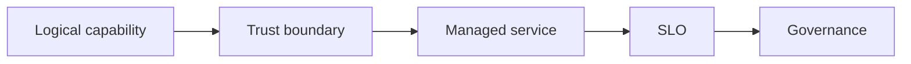

# 12.5 — Google Cloud and Portable Patterns

*Book 12: Cloud and Enterprise AI Architecture · Read 25 min · Worked example 20 min · Code/design practice 45–60 min · Review 10 min*

## Before you begin

- Books 5–11
- Cloud and identity fundamentals
- Architecture documentation

If a prerequisite is unfamiliar, use site search and read only enough to explain it and complete a small example. Do not block progress by mastering every upstream topic first.

## Why this chapter exists

Map Vertex AI, search, Cloud Run, GKE, data, events, identity, and operations while identifying portable seams.

The engineering objective is not to memorize vocabulary. By the end, you should be able to describe the mechanism, build or inspect a small implementation, recognize its failure modes, and decide where it belongs in a larger system.

## Learning objectives

- Explain why google cloud and portable patterns matters using the chapter scenario, not abstract definitions alone.
- Trace how **Vertex AI** and **Vertex AI Search** interact in the book-level visual.
- Implement or design the bounded practice while holding evaluation cases fixed.
- Diagnose at least two failure modes specific to portable interfaces.
- Decide where this chapter's mechanism belongs in a production architecture and what evidence justifies it.

!!! note "Enduring principle"
    Portability is achieved through deliberate contracts and data ownership, not lowest-common-denominator design.

## Mental model



Read the visual from left to right, then trace failures from right to left. The diagram is a book-level map; this chapter explains how **google cloud and portable patterns** changes one or more transitions.

## Core concepts

The concepts form a system, not a vocabulary list. Read each section below before attempting the practice exercise.

### Vertex Ai

Google Vertex AI offers unified model training, tuning, deployment, and evaluation on GCP with Gemini and open models. See the [Vertex Ai concept card](../../concepts/cards/vertex-ai.md).

**Example:** Fine-tune Gemini on proprietary data and deploy to private endpoint with VPC-SC.

**Evidence of understanding:** Compare Vertex eval pipeline scores pre/post deploy on held-out set.

### Vertex Ai Search

Vertex AI Search (Discovery Engine) provides enterprise search and grounding APIs with document ingest and ranking. See the [Vertex Ai Search concept card](../../concepts/cards/vertex-ai-search.md).

**Example:** Ingest GCS policy PDFs; grounding API returns answers with source references.

**Evidence of understanding:** Measure grounding citation accuracy versus self-built OpenSearch RAG baseline.

### Cloud Run And Gke

Cloud Run and GKE deploy serverless containers and Kubernetes GPU workloads on Google Cloud. See the [Cloud Run And Gke concept card](../../concepts/cards/cloud-run-and-gke.md).

**Example:** Cloud Run serves CPU embedding API; GKE Autopilot runs LLM inference with TPU/GPU node pools.

**Evidence of understanding:** Document when Cloud Run max duration forces move to GKE for long jobs.

### Cloud Iam

Google Cloud IAM binds roles to identities for least-privilege access to Vertex, Storage, and BigQuery in AI pipelines. See the [Cloud Iam concept card](../../concepts/cards/cloud-iam.md).

**Example:** Service account invokes Vertex prediction only; humans cannot read raw training bucket.

**Evidence of understanding:** IAM policy audit: no allUsers on AI artifact buckets.

### Portable Interfaces

Portable interfaces—OpenAI-compatible APIs, OTel traces, standard embedding dims—reduce lock-in across clouds. See the [Portable Interfaces concept card](../../concepts/cards/portable-interfaces.md).

**Example:** Gateway speaks OpenAI schema; backends swap Bedrock, Azure, or vLLM without client changes.

**Evidence of understanding:** Migrate one backend in staging with zero client SDK changes verified by integration tests.

## Worked example

**Book scenario:** An architect must implement the same governed AI capability on different cloud providers.

**Situation:** Global corp wants Google Cloud option for one region while keeping portable core elsewhere.

**Baseline:** Lowest-common-denominator design avoiding all managed features—shipping nothing.

**Application:** Map to Vertex AI, Vertex AI Search, Cloud Run/GKE, Cloud IAM; mark portable seams (OpenAPI gateway, OIDC, exportable embeddings index) vs GCP-specific optimizations.

**Test cases:** (1) Normal: Cloud Run tool service behind portable gateway. (2) Boundary: Vertex feature unavailable in region. (3) Adversarial: proprietary index format blocking migration.

**Measurement:** Portable interface count, migration drill time to alternate cloud stub.

**Design question:** Which seam is worth duplicating to preserve data ownership?

## Chapter hook

Run this short snippet first to anchor **google cloud and portable patterns** before the book-level sample:

```python
CHAPTER = "12.5"
print("chapter hook:", CHAPTER)
portable = ["OpenAPI gateway", "OIDC auth", "Parquet export of embeddings"]
gcp_specific = ["Vertex native grounding API"]
print({"portable": portable, "avoid_lockin": len(gcp_specific) == 0 or True})
print("inspect step", 1)
print("---")
print("change one input above, predict output, re-run")
```

Predict the printed values, then change one line tied to **Vertex AI** or **Vertex AI Search** and observe how the chapter mechanism moves.

## Runnable code sample

The following dependency-free sample supports this book. Download it from the [code-sample library](../../code-samples/12-cloud-capability-map.py) or run the matching file under `examples/`.

```python
--8<-- "docs/code-samples/12-cloud-capability-map.py"
```

Expected output is printed to the terminal. Before running it, predict which values or decisions should change. Then introduce one failure and convert the observation into a test.

??? success "Expected observation"
    The logical architecture remains stable while provider-specific service names change.

This is a **book-level sample**. Its relevance to this chapter is the boundary between **Vertex AI** and **Vertex AI Search**. Modify that boundary, not unrelated lines, when completing the chapter exercise.

## Engineering practice

**Build:** Map the design to Google Cloud and identify the migration boundary.

Work in three passes tailored to this chapter:

1. **Baseline:** Implement the task without vertex ai and record quality, latency, and failure cases.
2. **Mechanism:** Add vertex ai search while keeping inputs and evaluation fixed; note what changed in intermediate state.
3. **Judgment:** Compare outcomes on normal, boundary, and adversarial cases; document when google cloud and portable patterns earns its operational cost.

Capture assumptions, test cases, results, and one architecture decision record. A successful lab explains *why* behavior changed, not merely that the program ran.

## Architecture lens

For a production design in **Cloud and Enterprise AI Architecture**, make the following explicit for **google cloud and portable patterns**:

| Concern | Question to answer |
|---|---|
| **Ownership** | Which service owns vertex ai versus downstream consumers of its output? |
| **Contract** | What typed inputs, outputs, errors, and version does the cloud run and gke boundary expose? |
| **Evidence** | Which eval slices prove google cloud and portable patterns meets requirements before and after each release? |
| **Security** | What untrusted data crosses the portable interfaces boundary and how is it sanitized or authorized? |
| **Operations** | What is logged at this chapter's transition, what triggers retry or rollback, and what is cached? |
| **Economics** | Which resource—tokens, retrieval calls, GPU seconds, human review—dominates cost for this mechanism? |

## Failure clinic

Reproduce failures at the chapter boundary—do not debug only final output.

| Failure | Symptom | Likely cause | First response |
|---|---|---|---|
| **Baseline illusion** | The system looks fine on demo prompts but fails on the book scenario | Evaluation cases do not cover vertex ai or vertex ai search | Add the chapter's normal, boundary, and adversarial cases before tuning |
| **Mechanism mismatch** | Adding complexity does not improve the measured outcome | google cloud and portable patterns is applied at the wrong layer or without fixing inputs | Trace the book visual and verify the transition this chapter owns |
| **Silent degradation** | Outputs remain fluent while decisions become wrong | Failure in portable interfaces without observability at that boundary | Log intermediate state, version config, and compare against the baseline |
| **Operational drift** | Quality changes after deploy though prompts are unchanged | Data, permissions, or upstream vertex ai behavior shifted | Pin versions, inspect ingestion and policy filters, re-run slice evals |

Map Vertex AI, search, Cloud Run, GKE, data, events, identity, and operations while identifying portable seams. When triaging, preserve full inputs, retrieved evidence, tool traces, and model or index versions.

## Evolution lens

- **Yesterday:** Manual playbooks, brittle rules, or single-pass models handled parts of google cloud and portable patterns without explicit vertex ai.
- **Today:** Engineering teams implement google cloud and portable patterns as testable components with baselines, typed boundaries, and stage-specific evaluation.
- **Tomorrow:** Better automation may reduce toil, but portable interfaces and governance constraints will still require explicit design.
- **What survives:** Portability is achieved through deliberate contracts and data ownership, not lowest-common-denominator design.

## Knowledge check

1. How is portability achieved deliberately?
2. What is wrong with lowest-common-denominator portability?
3. What portability baseline avoids all managed AI?

??? question "Answer guidance"
    Q1: Contracts, owned data, swappable adapters—not weakest design. Q2: It sacrifices needed features without real exit path. Q3: Self-host everything with no SLA plan.

## Mastery questions

??? tip "Model answers (proficient level)"
        1. **Explain Vertex AI without jargon and give a counterexample.**
       *Proficient answer:* google vertex ai offers unified model training, tuning, deployment, and evaluation on gcp with gemini and open models. Counterexample: applying it when the task is fully deterministic and cheaper to hard-code.
    2. **Compare Vertex AI Search with portable interfaces using quality, cost, latency, and risk.**
       *Proficient answer:* vertex ai search (discovery engine) provides enterprise search and grounding apis with document ingest and ranking; portable interfaces—openai-compatible apis, otel traces, standard embedding dims—reduce lock-in across clouds. Trade quality gains against operational and security cost on the chapter scenario.
    3. **Design a minimal experiment that tests the chapter's central claim.**
       *Proficient answer:* Fix a baseline and three cases (normal, boundary, adversarial). Add only the chapter mechanism, measure one task metric plus cost/latency, and pre-register what result would falsify the claim.
    4. **Identify which component should own validation, authorization, and observability.**
       *Proficient answer:* Validation belongs at the typed boundary after vertex ai search; authorization before any side effect or retrieval of restricted data; observability at the transition google cloud and portable patterns introduces in the book visual.
    5. **State what would remain true if today's leading libraries and vendors disappeared.**
       *Proficient answer:* Portability is achieved through deliberate contracts and data ownership, not lowest-common-denominator design.

## Self-assessment rubric

| Level | Evidence |
|---|---|
| Not yet | Can repeat terms but cannot trace the visual or predict the sample. |
| Developing | Can explain the mechanism and complete the normal case with help. |
| Proficient | Can implement the exercise, diagnose a failure, and compare a baseline. |
| Transfer | Can defend an architecture choice in a new domain with evaluation evidence. |

## Evidence and further study

- Official AWS, Azure, and Google Cloud architecture and service documentation
- Organization security and data-governance standards

Use primary sources for technical claims and official documentation for current product behavior. Record the version or access date for evolving material.

## Continue

Return to the [book index](index.md) or use site search to follow the chapter's concepts into the knowledge-area and reference pages.
