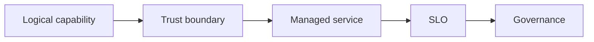

# 12.6 — Enterprise Operating Model

*Book 12: Cloud and Enterprise AI Architecture · Read 25 min · Worked example 20 min · Code/design practice 45–60 min · Review 10 min*

## Before you begin

- Books 5–11
- Cloud and identity fundamentals
- Architecture documentation

If a prerequisite is unfamiliar, use site search and read only enough to explain it and complete a small example. Do not block progress by mastering every upstream topic first.

## Why this chapter exists

Define platform teams, product teams, centers of enablement, governance, service catalogs, SLOs, chargeback, vendor management, and adoption.

The engineering objective is not to memorize vocabulary. By the end, you should be able to describe the mechanism, build or inspect a small implementation, recognize its failure modes, and decide where it belongs in a larger system.

## Learning objectives

- Explain why enterprise operating model matters using the chapter scenario, not abstract definitions alone.
- Trace how **team topology** and **service catalog** interact in the book-level visual.
- Implement or design the bounded practice while holding evaluation cases fixed.
- Diagnose at least two failure modes specific to vendor management.
- Decide where this chapter's mechanism belongs in a production architecture and what evidence justifies it.

!!! note "Enduring principle"
    Architecture succeeds only when ownership, incentives, operations, and delivery practices align.

## Mental model



Read the visual from left to right, then trace failures from right to left. The diagram is a book-level map; this chapter explains how **enterprise operating model** changes one or more transitions.

## Core concepts

The concepts form a system, not a vocabulary list. Read each section below before attempting the practice exercise.

### Team Topology

Team topology assigns platform, product, and enabling teams for AI delivery with clear interaction modes. See the [Team Topology concept card](../../concepts/cards/team-topology.md).

**Example:** Platform team owns gateway; product teams own prompts and evals within guardrails.

**Evidence of understanding:** RACI matrix covers model approve, incident on-call, and data ingest ownership.

### Service Catalog

Service catalog lists internal AI products—approved models, RAG templates, tools—for self-service discovery. See the [Service Catalog concept card](../../concepts/cards/service-catalog.md).

**Example:** Developer portal shows tier-2 chatbot template with cost estimate and onboarding steps.

**Evidence of understanding:** Track catalog entry usage and time from discovery to first successful API call.

### SLOs

SLOs define target reliability and latency—availability, p95 latency, eval faithfulness—for AI platform services. See the [SLOs concept card](../../concepts/cards/slos.md).

**Example:** Gateway SLO: 99.9% availability, p95 <2s excluding model provider outages.

**Evidence of understanding:** Error budget policy triggers feature freeze when SLO burn exceeds threshold.

### FinOps

FinOps tracks and optimizes AI spend—tokens, GPU hours, API fees—against business value. See the [FinOps concept card](../../concepts/cards/finops.md).

**Example:** Dashboard shows cost per successful ticket deflection by model route.

**Evidence of understanding:** Monthly review: top three cost drivers and optimization actions with owner.

### Vendor Management

Vendor management evaluates AI providers on security, compliance, cost, performance, and exit strategy. See the [Vendor Management concept card](../../concepts/cards/vendor-management.md).

**Example:** Annual review of OpenAI/Azure/Bedrock DPAs, data retention, and failover plan.

**Evidence of understanding:** Maintain vendor scorecard with exit migration test date documented.

## Worked example

**Book scenario:** An architect must implement the same governed AI capability on different cloud providers.

**Situation:** AI platform rollout fails because product teams bypass central services; leadership wants operating model clarity.

**Baseline:** Ad hoc "AI champions" with no ownership or funding model.

**Application:** Define platform vs product team responsibilities, service catalog, SLOs, FinOps chargeback, vendor management, enablement cadence, roadmap tied to adoption metrics.

**Test cases:** (1) Normal: team consumes model gateway. (2) Boundary: exception for regulated experiment. (3) Adversarial: shadow stack duplicates retrieval without security review.

**Measurement:** Catalog adoption %, platform SLO attainment, shadow IT incidents.

**Design question:** What incentive aligns product teams with central platform without blocking innovation?

## Chapter hook

Run this short snippet first to anchor **enterprise operating model** before the book-level sample:

```python
CHAPTER = "12.6"
print("chapter hook:", CHAPTER)
RACI = {"platform": "operate gateway", "product": "own use-case evals", "governance": "tier approvals"}
for role, duty in RACI.items():
    print(role, duty)
print("inspect step", 1)
print("---")
print("change one input above, predict output, re-run")
```

Predict the printed values, then change one line tied to **team topology** or **service catalog** and observe how the chapter mechanism moves.

## Runnable code sample

The following dependency-free sample supports this book. Download it from the [code-sample library](../../code-samples/12-cloud-capability-map.py) or run the matching file under `examples/`.

```python
--8<-- "docs/code-samples/12-cloud-capability-map.py"
```

Expected output is printed to the terminal. Before running it, predict which values or decisions should change. Then introduce one failure and convert the observation into a test.

??? success "Expected observation"
    The logical architecture remains stable while provider-specific service names change.

This is a **book-level sample**. Its relevance to this chapter is the boundary between **team topology** and **service catalog**. Modify that boundary, not unrelated lines, when completing the chapter exercise.

## Engineering practice

**Build:** Create a responsibility matrix and platform roadmap.

Work in three passes tailored to this chapter:

1. **Baseline:** Implement the task without team topology and record quality, latency, and failure cases.
2. **Mechanism:** Add service catalog while keeping inputs and evaluation fixed; note what changed in intermediate state.
3. **Judgment:** Compare outcomes on normal, boundary, and adversarial cases; document when enterprise operating model earns its operational cost.

Capture assumptions, test cases, results, and one architecture decision record. A successful lab explains *why* behavior changed, not merely that the program ran.

## Architecture lens

For a production design in **Cloud and Enterprise AI Architecture**, make the following explicit for **enterprise operating model**:

| Concern | Question to answer |
|---|---|
| **Ownership** | Which service owns team topology versus downstream consumers of its output? |
| **Contract** | What typed inputs, outputs, errors, and version does the slos boundary expose? |
| **Evidence** | Which eval slices prove enterprise operating model meets requirements before and after each release? |
| **Security** | What untrusted data crosses the vendor management boundary and how is it sanitized or authorized? |
| **Operations** | What is logged at this chapter's transition, what triggers retry or rollback, and what is cached? |
| **Economics** | Which resource—tokens, retrieval calls, GPU seconds, human review—dominates cost for this mechanism? |

## Failure clinic

Reproduce failures at the chapter boundary—do not debug only final output.

| Failure | Symptom | Likely cause | First response |
|---|---|---|---|
| **Baseline illusion** | The system looks fine on demo prompts but fails on the book scenario | Evaluation cases do not cover team topology or service catalog | Add the chapter's normal, boundary, and adversarial cases before tuning |
| **Mechanism mismatch** | Adding complexity does not improve the measured outcome | enterprise operating model is applied at the wrong layer or without fixing inputs | Trace the book visual and verify the transition this chapter owns |
| **Silent degradation** | Outputs remain fluent while decisions become wrong | Failure in vendor management without observability at that boundary | Log intermediate state, version config, and compare against the baseline |
| **Operational drift** | Quality changes after deploy though prompts are unchanged | Data, permissions, or upstream team topology behavior shifted | Pin versions, inspect ingestion and policy filters, re-run slice evals |

Define platform teams, product teams, centers of enablement, governance, service catalogs, SLOs, chargeback, vendor management, and adoption. When triaging, preserve full inputs, retrieved evidence, tool traces, and model or index versions.

## Evolution lens

- **Yesterday:** Manual playbooks, brittle rules, or single-pass models handled parts of enterprise operating model without explicit team topology.
- **Today:** Engineering teams implement enterprise operating model as testable components with baselines, typed boundaries, and stage-specific evaluation.
- **Tomorrow:** Better automation may reduce toil, but vendor management and governance constraints will still require explicit design.
- **What survives:** Architecture succeeds only when ownership, incentives, operations, and delivery practices align.

## Knowledge check

1. Why does architecture fail without operating model alignment?
2. What belongs in a platform service catalog?
3. What enterprise baseline is tools-only with no ownership?

??? question "Answer guidance"
    Q1: Unclear ownership → bypass, inconsistency, incidents. Q2: SLOs, APIs, support tier, cost model. Q3: Purchased licenses with no shared platform team.

## Mastery questions

??? tip "Model answers (proficient level)"
        1. **Explain team topology without jargon and give a counterexample.**
       *Proficient answer:* team topology assigns platform, product, and enabling teams for ai delivery with clear interaction modes. Counterexample: applying it when the task is fully deterministic and cheaper to hard-code.
    2. **Compare service catalog with vendor management using quality, cost, latency, and risk.**
       *Proficient answer:* service catalog lists internal ai products—approved models, rag templates, tools—for self-service discovery; vendor management evaluates ai providers on security, compliance, cost, performance, and exit strategy. Trade quality gains against operational and security cost on the chapter scenario.
    3. **Design a minimal experiment that tests the chapter's central claim.**
       *Proficient answer:* Fix a baseline and three cases (normal, boundary, adversarial). Add only the chapter mechanism, measure one task metric plus cost/latency, and pre-register what result would falsify the claim.
    4. **Identify which component should own validation, authorization, and observability.**
       *Proficient answer:* Validation belongs at the typed boundary after service catalog; authorization before any side effect or retrieval of restricted data; observability at the transition enterprise operating model introduces in the book visual.
    5. **State what would remain true if today's leading libraries and vendors disappeared.**
       *Proficient answer:* Architecture succeeds only when ownership, incentives, operations, and delivery practices align.

## Self-assessment rubric

| Level | Evidence |
|---|---|
| Not yet | Can repeat terms but cannot trace the visual or predict the sample. |
| Developing | Can explain the mechanism and complete the normal case with help. |
| Proficient | Can implement the exercise, diagnose a failure, and compare a baseline. |
| Transfer | Can defend an architecture choice in a new domain with evaluation evidence. |

## Evidence and further study

- Official AWS, Azure, and Google Cloud architecture and service documentation
- Organization security and data-governance standards

Use primary sources for technical claims and official documentation for current product behavior. Record the version or access date for evolving material.

## Continue

Return to the [book index](index.md) or use site search to follow the chapter's concepts into the knowledge-area and reference pages.
