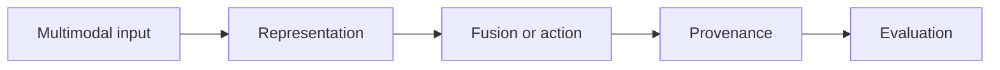

# 13.1 — Vision and Document Intelligence

*Book 13: Multimodal and Frontier Systems · Read 25 min · Worked example 20 min · Code/design practice 45–60 min · Review 10 min*

## Before you begin

- Books 3–12 as relevant
- Evidence-oriented research reading
- Risk awareness

If a prerequisite is unfamiliar, use site search and read only enough to explain it and complete a small example. Do not block progress by mastering every upstream topic first.

## Why this chapter exists

Understand image representations, vision-language models, OCR, layout, tables, charts, spatial relationships, and provenance.

The engineering objective is not to memorize vocabulary. By the end, you should be able to describe the mechanism, build or inspect a small implementation, recognize its failure modes, and decide where it belongs in a larger system.

## Learning objectives

- Explain why vision and document intelligence matters using the chapter scenario, not abstract definitions alone.
- Trace how **vision encoders** and **OCR** interact in the book-level visual.
- Implement or design the bounded practice while holding evaluation cases fixed.
- Diagnose at least two failure modes specific to visual grounding.
- Decide where this chapter's mechanism belongs in a production architecture and what evidence justifies it.

!!! note "Enduring principle"
    Preserve spatial structure and provenance when converting visual documents into model context.

## Mental model



Read the visual from left to right, then trace failures from right to left. The diagram is a book-level map; this chapter explains how **vision and document intelligence** changes one or more transitions.

## Core concepts

The concepts form a system, not a vocabulary list. Read each section below before attempting the practice exercise.

### Vision Encoders

Vision encoders map images to embeddings or tokens for multimodal models—ViT, CLIP-style architectures. See the [Vision Encoders concept card](../../concepts/cards/vision-encoders.md).

**Example:** Chart screenshot encoded to tokens fused with text question about Q3 revenue trend.

**Evidence of understanding:** Compare OCR-plus-text baseline versus vision encoder on chart QA accuracy.

### OCR

OCR extracts text from scanned images and photos, introducing recognition errors that propagate to chunks and answers. Confidence scores help gate low-quality extractions. See the [OCR concept card](../../concepts/cards/ocr.md).

**Example:** Scanned contracts with skewed pages need deskew preprocessing before OCR.

**Evidence of understanding:** Report word-error rate on ten scanned pages and abstain when mean confidence < threshold.

### Layout Models

Layout models detect reading order, tables, figures, and headings in documents beyond raw OCR boxes. See the [Layout Models concept card](../../concepts/cards/layout-models.md).

**Example:** Invoice layout model separates line items table from footer terms for field extraction.

**Evidence of understanding:** Evaluate field F1 with layout-aware parsing versus OCR-only on 50 document layouts.

### Document Ai

Document AI pipelines combine OCR, layout, extraction, and validation for structured data from unstructured files. See the [Document Ai concept card](../../concepts/cards/document-ai.md).

**Example:** Extract vendor, line items, tax from PDF invoices into ERP JSON with confidence scores.

**Evidence of understanding:** Report field-level accuracy and human review rate on production document sample.

### Visual Grounding

Visual grounding links language to regions or objects in images—pointing, bounding boxes, UI elements. See the [Visual Grounding concept card](../../concepts/cards/visual-grounding.md).

**Example:** Model clicks 'Submit' button coordinates in screenshot for computer-use agent.

**Evidence of understanding:** Measure grounding accuracy IoU on labeled UI element dataset.

## Worked example

**Book scenario:** A document system must combine tables, charts, and text without losing source provenance.

**Situation:** A document system must combine tables, charts, and text without losing source provenance for compliance audits.

**Baseline:** OCR plain text dump—table cells merge, chart values lost.

**Application:** Pipeline with layout detection, OCR confidence per block, table structure recovery, vision-language model for chart reading, store bounding boxes and page IDs with extracted fields.

**Test cases:** (1) Normal: digital PDF table. (2) Boundary: skewed scan 80% OCR confidence. (3) Adversarial: chart image with misleading axis scale.

**Measurement:** Field-level F1, page-level citation accuracy, provenance completeness.

**Design question:** When must human review gate fields below OCR confidence threshold?

## Chapter hook

Run this short snippet first to anchor **vision and document intelligence** before the book-level sample:

```python
CHAPTER = "13.1"
print("chapter hook:", CHAPTER)
blocks = [
    {"type": "table", "text": "PTO cap 240", "page": 3, "confidence": 0.96},
    {"type": "chart", "text": "headcount trend", "page": 4, "confidence": 0.71},
]
THRESH = 0.85
for b in blocks:
    print(b["type"], "auto_extract:", b["confidence"] >= THRESH)
print("---")
print("change one input above, predict output, re-run")
```

Predict the printed values, then change one line tied to **vision encoders** or **OCR** and observe how the chapter mechanism moves.

## Runnable code sample

The following dependency-free sample supports this book. Download it from the [code-sample library](../../code-samples/13-multimodal-provenance.py) or run the matching file under `examples/`.

```python
--8<-- "docs/code-samples/13-multimodal-provenance.py"
```

Expected output is printed to the terminal. Before running it, predict which values or decisions should change. Then introduce one failure and convert the observation into a test.

??? success "Expected observation"
    Only evidence above the confidence threshold is emitted, and every output retains source, page, and modality.

This is a **book-level sample**. Its relevance to this chapter is the boundary between **vision encoders** and **OCR**. Modify that boundary, not unrelated lines, when completing the chapter exercise.

## Engineering practice

**Build:** Extract fields from documents and evaluate field and page-level accuracy.

Work in three passes tailored to this chapter:

1. **Baseline:** Implement the task without vision encoders and record quality, latency, and failure cases.
2. **Mechanism:** Add ocr while keeping inputs and evaluation fixed; note what changed in intermediate state.
3. **Judgment:** Compare outcomes on normal, boundary, and adversarial cases; document when vision and document intelligence earns its operational cost.

Capture assumptions, test cases, results, and one architecture decision record. A successful lab explains *why* behavior changed, not merely that the program ran.

## Spec-driven habit

Every chapter lab pairs reading with **executable acceptance**. Before implementing book 13.1 — vision and document intelligence:

1. Draft cases in `test_lab.py` or `specs/lab-1301.yaml`.
2. Use [Cursor Plan/Agent](https://cursor.com/) with "read spec first, then minimal diff".
3. Or use [OpenSpec](https://openspec.dev/) `/opsx:propose` so requirements live in `openspec/` next to code.

→ [Spec-driven workflow guide](../../getting-started/spec-driven-workflow.md) · [Lab 13.1](../../labs/1301-vision-and-document-intelligence.md)


## Architecture lens

For a production design in **Multimodal and Frontier Systems**, make the following explicit for **vision and document intelligence**:

| Concern | Question to answer |
|---|---|
| **Ownership** | Which service owns vision encoders versus downstream consumers of its output? |
| **Contract** | What typed inputs, outputs, errors, and version does the layout models boundary expose? |
| **Evidence** | Which eval slices prove vision and document intelligence meets requirements before and after each release? |
| **Security** | What untrusted data crosses the visual grounding boundary and how is it sanitized or authorized? |
| **Operations** | What is logged at this chapter's transition, what triggers retry or rollback, and what is cached? |
| **Economics** | Which resource—tokens, retrieval calls, GPU seconds, human review—dominates cost for this mechanism? |

## Failure clinic

Reproduce failures at the chapter boundary—do not debug only final output.

| Failure | Symptom | Likely cause | First response |
|---|---|---|---|
| **Baseline illusion** | The system looks fine on demo prompts but fails on the book scenario | Evaluation cases do not cover vision encoders or ocr | Add the chapter's normal, boundary, and adversarial cases before tuning |
| **Mechanism mismatch** | Adding complexity does not improve the measured outcome | vision and document intelligence is applied at the wrong layer or without fixing inputs | Trace the book visual and verify the transition this chapter owns |
| **Silent degradation** | Outputs remain fluent while decisions become wrong | Failure in visual grounding without observability at that boundary | Log intermediate state, version config, and compare against the baseline |
| **Operational drift** | Quality changes after deploy though prompts are unchanged | Data, permissions, or upstream vision encoders behavior shifted | Pin versions, inspect ingestion and policy filters, re-run slice evals |

Understand image representations, vision-language models, OCR, layout, tables, charts, spatial relationships, and provenance. When triaging, preserve full inputs, retrieved evidence, tool traces, and model or index versions.

## Evolution lens

- **Yesterday:** Manual playbooks, brittle rules, or single-pass models handled parts of vision and document intelligence without explicit vision encoders.
- **Today:** Engineering teams implement vision and document intelligence as testable components with baselines, typed boundaries, and stage-specific evaluation.
- **Tomorrow:** Better automation may reduce toil, but visual grounding and governance constraints will still require explicit design.
- **What survives:** Preserve spatial structure and provenance when converting visual documents into model context.

## Knowledge check

1. Why preserve spatial structure in document AI?
2. How do layout models change RAG chunk quality?
3. What document baseline is plain OCR text only?

??? question "Answer guidance"
    Q1: Citations need page/bbox; tables need cell structure. Q2: Chunks align to semantic blocks not arbitrary splits. Q3: strip-all-layout text file.

## Mastery questions

??? tip "Model answers (proficient level)"
        1. **Explain vision encoders without jargon and give a counterexample.**
       *Proficient answer:* vision encoders map images to embeddings or tokens for multimodal models—vit, clip-style architectures. Counterexample: applying it when the task is fully deterministic and cheaper to hard-code.
    2. **Compare OCR with visual grounding using quality, cost, latency, and risk.**
       *Proficient answer:* ocr extracts text from scanned images and photos, introducing recognition errors that propagate to chunks and answers; visual grounding links language to regions or objects in images—pointing, bounding boxes, ui elements. Trade quality gains against operational and security cost on the chapter scenario.
    3. **Design a minimal experiment that tests the chapter's central claim.**
       *Proficient answer:* Fix a baseline and three cases (normal, boundary, adversarial). Add only the chapter mechanism, measure one task metric plus cost/latency, and pre-register what result would falsify the claim.
    4. **Identify which component should own validation, authorization, and observability.**
       *Proficient answer:* Validation belongs at the typed boundary after ocr; authorization before any side effect or retrieval of restricted data; observability at the transition vision and document intelligence introduces in the book visual.
    5. **State what would remain true if today's leading libraries and vendors disappeared.**
       *Proficient answer:* Preserve spatial structure and provenance when converting visual documents into model context.

## Self-assessment rubric

| Level | Evidence |
|---|---|
| Not yet | Can repeat terms but cannot trace the visual or predict the sample. |
| Developing | Can explain the mechanism and complete the normal case with help. |
| Proficient | Can implement the exercise, diagnose a failure, and compare a baseline. |
| Transfer | Can defend an architecture choice in a new domain with evaluation evidence. |

## Evidence and further study

- Primary papers for the selected modality or frontier claim
- Model and dataset cards for every reproduced system

Use primary sources for technical claims and official documentation for current product behavior. Record the version or access date for evolving material.

## Continue

Return to the [book index](index.md) or use site search to follow the chapter's concepts into the knowledge-area and reference pages.
