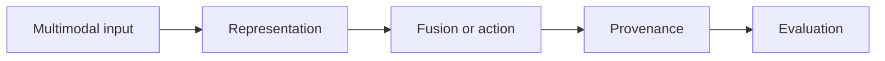

# 13.2 — Speech and Audio

*Book 13: Multimodal and Frontier Systems · Read 25 min · Worked example 20 min · Code/design practice 45–60 min · Review 10 min*

## Before you begin

- Books 3–12 as relevant
- Evidence-oriented research reading
- Risk awareness

If a prerequisite is unfamiliar, use site search and read only enough to explain it and complete a small example. Do not block progress by mastering every upstream topic first.

## Why this chapter exists

Connect ASR, diarization, audio understanding, TTS, streaming, latency, consent, and voice safety.

The engineering objective is not to memorize vocabulary. By the end, you should be able to describe the mechanism, build or inspect a small implementation, recognize its failure modes, and decide where it belongs in a larger system.

## Learning objectives

- Explain why speech and audio matters using the chapter scenario, not abstract definitions alone.
- Trace how **speech recognition** and **diarization** interact in the book-level visual.
- Implement or design the bounded practice while holding evaluation cases fixed.
- Diagnose at least two failure modes specific to voice safety.
- Decide where this chapter's mechanism belongs in a production architecture and what evidence justifies it.

!!! note "Enduring principle"
    Audio systems are temporal, identity-sensitive, and latency-constrained.

## Mental model



Read the visual from left to right, then trace failures from right to left. The diagram is a book-level map; this chapter explains how **speech and audio** changes one or more transitions.

## Core concepts

The concepts form a system, not a vocabulary list. Read each section below before attempting the practice exercise.

### Speech Recognition

Speech recognition (ASR) transcribes audio to text with word error rate varying by accent, noise, and domain. See the [Speech Recognition concept card](../../concepts/cards/speech-recognition.md).

**Example:** Call center ASR feeds ticket summary pipeline with custom vocabulary for product names.

**Evidence of understanding:** Report WER on held-out audio including noisy and accented slices.

### Diarization

Diarization labels who spoke when in multi-speaker audio—essential for meetings and support calls. See the [Diarization concept card](../../concepts/cards/diarization.md).

**Example:** Support call transcript tags agent versus customer utterances for QA scoring.

**Evidence of understanding:** Diarization error rate on labeled two-speaker test set ≤ target before deploy.

### Text-To-Speech

Text-to-speech synthesizes natural audio from text with voice, prosody, and latency trade-offs. See the [Text-To-Speech concept card](../../concepts/cards/text-to-speech.md).

**Example:** IVR reads dynamic account balance with consistent brand voice under 500ms first byte.

**Evidence of understanding:** MOS evaluation and latency p95 on 50 test phrases monthly.

### Streaming Audio

Streaming audio processes speech incrementally for real-time captions and voice agents. See the [Streaming Audio concept card](../../concepts/cards/streaming-audio.md).

**Example:** Live meeting captions display partial hypotheses updated as speaker continues.

**Evidence of understanding:** Measure caption delay from speech to stable text on streaming benchmark.

### Voice Safety

Voice safety covers consent, voice cloning abuse, deepfake detection, and secure storage of biometric voice data. See the [Voice Safety concept card](../../concepts/cards/voice-safety.md).

**Example:** Require explicit opt-in before cloning executive voice for IVR.

**Evidence of understanding:** Red-team voice clone misuse scenarios; verify detection or block triggers.

## Worked example

**Book scenario:** A document system must combine tables, charts, and text without losing source provenance.

**Situation:** Onboarding includes live HR briefing recordings; system must transcript, diarize speakers, and flag low-confidence spans for review.

**Baseline:** Batch ASR with no timestamps—cannot align to policy mentions.

**Application:** Streaming ASR simulation with chunk timestamps, speaker diarization labels, confidence-based review queue, consent logging for voice data retention.

**Test cases:** (1) Normal: clean single speaker. (2) Boundary: overlapping crosstalk. (3) Adversarial: synthetic voice command injection in recording.

**Measurement:** WER, diarization error rate, p95 streaming latency, flagged-span review rate.

**Design question:** What latency budget forces streaming vs batch ASR architecture?

## Chapter hook

Run this short snippet first to anchor **speech and audio** before the book-level sample:

```python
CHAPTER = "13.2"
print("chapter hook:", CHAPTER)
segments = [
    {"start": 0.0, "end": 2.5, "speaker": "HR", "text": "welcome", "conf": 0.95},
    {"start": 2.5, "end": 4.0, "speaker": "?", "text": "mumbled", "conf": 0.55},
]
for s in segments:
    flag = s["conf"] < 0.75
    print(s, "review:", flag)
print("---")
print("change one input above, predict output, re-run")
```

Predict the printed values, then change one line tied to **speech recognition** or **diarization** and observe how the chapter mechanism moves.

## Runnable code sample

The following dependency-free sample supports this book. Download it from the [code-sample library](../../code-samples/13-multimodal-provenance.py) or run the matching file under `examples/`.

```python
--8<-- "docs/code-samples/13-multimodal-provenance.py"
```

Expected output is printed to the terminal. Before running it, predict which values or decisions should change. Then introduce one failure and convert the observation into a test.

??? success "Expected observation"
    Only evidence above the confidence threshold is emitted, and every output retains source, page, and modality.

This is a **book-level sample**. Its relevance to this chapter is the boundary between **speech recognition** and **diarization**. Modify that boundary, not unrelated lines, when completing the chapter exercise.

## Engineering practice

**Build:** Build a transcript pipeline with timestamps and confidence handling.

Work in three passes tailored to this chapter:

1. **Baseline:** Implement the task without speech recognition and record quality, latency, and failure cases.
2. **Mechanism:** Add diarization while keeping inputs and evaluation fixed; note what changed in intermediate state.
3. **Judgment:** Compare outcomes on normal, boundary, and adversarial cases; document when speech and audio earns its operational cost.

Capture assumptions, test cases, results, and one architecture decision record. A successful lab explains *why* behavior changed, not merely that the program ran.

## Architecture lens

For a production design in **Multimodal and Frontier Systems**, make the following explicit for **speech and audio**:

| Concern | Question to answer |
|---|---|
| **Ownership** | Which service owns speech recognition versus downstream consumers of its output? |
| **Contract** | What typed inputs, outputs, errors, and version does the text-to-speech boundary expose? |
| **Evidence** | Which eval slices prove speech and audio meets requirements before and after each release? |
| **Security** | What untrusted data crosses the voice safety boundary and how is it sanitized or authorized? |
| **Operations** | What is logged at this chapter's transition, what triggers retry or rollback, and what is cached? |
| **Economics** | Which resource—tokens, retrieval calls, GPU seconds, human review—dominates cost for this mechanism? |

## Failure clinic

Reproduce failures at the chapter boundary—do not debug only final output.

| Failure | Symptom | Likely cause | First response |
|---|---|---|---|
| **Baseline illusion** | The system looks fine on demo prompts but fails on the book scenario | Evaluation cases do not cover speech recognition or diarization | Add the chapter's normal, boundary, and adversarial cases before tuning |
| **Mechanism mismatch** | Adding complexity does not improve the measured outcome | speech and audio is applied at the wrong layer or without fixing inputs | Trace the book visual and verify the transition this chapter owns |
| **Silent degradation** | Outputs remain fluent while decisions become wrong | Failure in voice safety without observability at that boundary | Log intermediate state, version config, and compare against the baseline |
| **Operational drift** | Quality changes after deploy though prompts are unchanged | Data, permissions, or upstream speech recognition behavior shifted | Pin versions, inspect ingestion and policy filters, re-run slice evals |

Connect ASR, diarization, audio understanding, TTS, streaming, latency, consent, and voice safety. When triaging, preserve full inputs, retrieved evidence, tool traces, and model or index versions.

## Evolution lens

- **Yesterday:** Manual playbooks, brittle rules, or single-pass models handled parts of speech and audio without explicit speech recognition.
- **Today:** Engineering teams implement speech and audio as testable components with baselines, typed boundaries, and stage-specific evaluation.
- **Tomorrow:** Better automation may reduce toil, but voice safety and governance constraints will still require explicit design.
- **What survives:** Audio systems are temporal, identity-sensitive, and latency-constrained.

## Knowledge check

1. Why are audio systems latency- and identity-sensitive?
2. How should low-confidence spans surface in UX?
3. What speech baseline is batch-only with no diarization?

??? question "Answer guidance"
    Q1: Real-time use needs streaming; speakers matter for attribution. Q2: Highlight for human verify before acting. Q3: Whole-file transcript paragraph.

## Mastery questions

??? tip "Model answers (proficient level)"
        1. **Explain speech recognition without jargon and give a counterexample.**
       *Proficient answer:* speech recognition (asr) transcribes audio to text with word error rate varying by accent, noise, and domain. Counterexample: applying it when the task is fully deterministic and cheaper to hard-code.
    2. **Compare diarization with voice safety using quality, cost, latency, and risk.**
       *Proficient answer:* diarization labels who spoke when in multi-speaker audio—essential for meetings and support calls; voice safety covers consent, voice cloning abuse, deepfake detection, and secure storage of biometric voice data. Trade quality gains against operational and security cost on the chapter scenario.
    3. **Design a minimal experiment that tests the chapter's central claim.**
       *Proficient answer:* Fix a baseline and three cases (normal, boundary, adversarial). Add only the chapter mechanism, measure one task metric plus cost/latency, and pre-register what result would falsify the claim.
    4. **Identify which component should own validation, authorization, and observability.**
       *Proficient answer:* Validation belongs at the typed boundary after diarization; authorization before any side effect or retrieval of restricted data; observability at the transition speech and audio introduces in the book visual.
    5. **State what would remain true if today's leading libraries and vendors disappeared.**
       *Proficient answer:* Audio systems are temporal, identity-sensitive, and latency-constrained.

## Self-assessment rubric

| Level | Evidence |
|---|---|
| Not yet | Can repeat terms but cannot trace the visual or predict the sample. |
| Developing | Can explain the mechanism and complete the normal case with help. |
| Proficient | Can implement the exercise, diagnose a failure, and compare a baseline. |
| Transfer | Can defend an architecture choice in a new domain with evaluation evidence. |

## Evidence and further study

- Primary papers for the selected modality or frontier claim
- Model and dataset cards for every reproduced system

Use primary sources for technical claims and official documentation for current product behavior. Record the version or access date for evolving material.

## Continue

Return to the [book index](index.md) or use site search to follow the chapter's concepts into the knowledge-area and reference pages.
