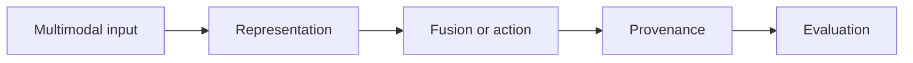

# 13.6 — How to Track the Frontier

*Book 13: Multimodal and Frontier Systems · Read 25 min · Worked example 20 min · Code/design practice 45–60 min · Review 10 min*

## Before you begin

- Books 3–12 as relevant
- Evidence-oriented research reading
- Risk awareness

If a prerequisite is unfamiliar, use site search and read only enough to explain it and complete a small example. Do not block progress by mastering every upstream topic first.

## Why this chapter exists

Develop research literacy, evidence hierarchies, reproduction habits, forecasting, and a review cadence for a fast-moving field.

The engineering objective is not to memorize vocabulary. By the end, you should be able to describe the mechanism, build or inspect a small implementation, recognize its failure modes, and decide where it belongs in a larger system.

## Learning objectives

- Explain why how to track the frontier matters using the chapter scenario, not abstract definitions alone.
- Trace how **primary sources** and **benchmarks** interact in the book-level visual.
- Implement or design the bounded practice while holding evaluation cases fixed.
- Diagnose at least two failure modes specific to technology forecasting.
- Decide where this chapter's mechanism belongs in a production architecture and what evidence justifies it.

!!! note "Enduring principle"
    The durable skill is evaluating claims and mapping new mechanisms to established principles.

## Mental model



Read the visual from left to right, then trace failures from right to left. The diagram is a book-level map; this chapter explains how **how to track the frontier** changes one or more transitions.

## Core concepts

The concepts form a system, not a vocabulary list. Read each section below before attempting the practice exercise.

### Primary Sources

Primary sources are original papers, specs, and official docs—not summaries or hype threads—for technical claims. See the [Primary Sources concept card](../../concepts/cards/primary-sources.md).

**Example:** Read Attention Is All You Need for architecture claims, not a blog recap.

**Evidence of understanding:** Every frontier assessment cites primary source DOI or spec version.

### Benchmarks

Benchmarks standardize task comparisons—MMLU, HumanEval, BEIR—but may not reflect your production distribution. See the [Benchmarks concept card](../../concepts/cards/benchmarks.md).

**Example:** High MMLU does not guarantee payroll policy QA performance.

**Evidence of understanding:** Reproduce one benchmark subset plus in-domain eval before vendor selection.

### Ablations

Ablations remove components to measure contribution—essential for judging which mechanism drives reported gains. See the [Ablations concept card](../../concepts/cards/ablations.md).

**Example:** Paper claims graph RAG helps; ablation removing graph should show drop if claim holds.

**Evidence of understanding:** Require ablation table or run own component removal on reproduction attempt.

### Reproduction

Reproduction reruns experiments with disclosed details to verify claims before betting architecture on results. See the [Reproduction concept card](../../concepts/cards/reproduction.md).

**Example:** Reproduce reported recall gain within 2 points using authors' config or document differences.

**Evidence of understanding:** Publish internal reproduction note with confidence level and blocking gaps.

### Technology Forecasting

Technology forecasting estimates when emerging capabilities become production-ready using evidence tiers and uncertainty bounds. See the [Technology Forecasting concept card](../../concepts/cards/technology-forecasting.md).

**Example:** Estimate computer-use reliability for your UI stack as low/med/high with dated reassessment.

**Evidence of understanding:** Quarterly frontier review updates confidence levels with new reproductions, not headlines.

## Worked example

**Book scenario:** A document system must combine tables, charts, and text without losing source provenance.

**Situation:** Leadership overwhelmed by weekly AI announcements; needs durable process to assess claims affecting onboarding roadmap.

**Baseline:** Adopt every trending technique immediately.

**Application:** Write one-page frontier assessment: primary source, benchmark limits, ablations, reproduction plan, confidence level, mapping to book principles, review cadence.

**Test cases:** (1) Normal: peer-reviewed reproducible result. (2) Boundary: strong benchmark, weak real-world slice. (3) Adversarial: vendor-funded eval with hidden prompt tuning.

**Measurement:** Time to produce assessment, prediction accuracy of adopted vs deferred choices at 6 months.

**Design question:** What confidence level triggers a paid pilot versus continued monitoring?

## Chapter hook

Run this short snippet first to anchor **how to track the frontier** before the book-level sample:

```python
assessment = {
    "claim": "new agent framework 2x faster",
    "evidence": "vendor blog",
    "reproduced": False,
    "confidence": "low",
}
action = "monitor" if assessment["confidence"] == "low" else "pilot"
print({"action": action, **assessment})
```

Predict the printed values, then change one line tied to **primary sources** or **benchmarks** and observe how the chapter mechanism moves.

## Runnable code sample

The following dependency-free sample supports this book. Download it from the [code-sample library](../../code-samples/13-multimodal-provenance.py) or run the matching file under `examples/`.

```python
--8<-- "docs/code-samples/13-multimodal-provenance.py"
```

Expected output is printed to the terminal. Before running it, predict which values or decisions should change. Then introduce one failure and convert the observation into a test.

??? success "Expected observation"
    Only evidence above the confidence threshold is emitted, and every output retains source, page, and modality.

This is a **book-level sample**. Its relevance to this chapter is the boundary between **primary sources** and **benchmarks**. Modify that boundary, not unrelated lines, when completing the chapter exercise.

## Engineering practice

**Build:** Write a one-page frontier assessment with confidence levels.

Work in three passes tailored to this chapter:

1. **Baseline:** Implement the task without primary sources and record quality, latency, and failure cases.
2. **Mechanism:** Add benchmarks while keeping inputs and evaluation fixed; note what changed in intermediate state.
3. **Judgment:** Compare outcomes on normal, boundary, and adversarial cases; document when how to track the frontier earns its operational cost.

Capture assumptions, test cases, results, and one architecture decision record. A successful lab explains *why* behavior changed, not merely that the program ran.

## Architecture lens

For a production design in **Multimodal and Frontier Systems**, make the following explicit for **how to track the frontier**:

| Concern | Question to answer |
|---|---|
| **Ownership** | Which service owns primary sources versus downstream consumers of its output? |
| **Contract** | What typed inputs, outputs, errors, and version does the ablations boundary expose? |
| **Evidence** | Which eval slices prove how to track the frontier meets requirements before and after each release? |
| **Security** | What untrusted data crosses the technology forecasting boundary and how is it sanitized or authorized? |
| **Operations** | What is logged at this chapter's transition, what triggers retry or rollback, and what is cached? |
| **Economics** | Which resource—tokens, retrieval calls, GPU seconds, human review—dominates cost for this mechanism? |

## Failure clinic

Reproduce failures at the chapter boundary—do not debug only final output.

| Failure | Symptom | Likely cause | First response |
|---|---|---|---|
| **Baseline illusion** | The system looks fine on demo prompts but fails on the book scenario | Evaluation cases do not cover primary sources or benchmarks | Add the chapter's normal, boundary, and adversarial cases before tuning |
| **Mechanism mismatch** | Adding complexity does not improve the measured outcome | how to track the frontier is applied at the wrong layer or without fixing inputs | Trace the book visual and verify the transition this chapter owns |
| **Silent degradation** | Outputs remain fluent while decisions become wrong | Failure in technology forecasting without observability at that boundary | Log intermediate state, version config, and compare against the baseline |
| **Operational drift** | Quality changes after deploy though prompts are unchanged | Data, permissions, or upstream primary sources behavior shifted | Pin versions, inspect ingestion and policy filters, re-run slice evals |

Develop research literacy, evidence hierarchies, reproduction habits, forecasting, and a review cadence for a fast-moving field. When triaging, preserve full inputs, retrieved evidence, tool traces, and model or index versions.

## Evolution lens

- **Yesterday:** Manual playbooks, brittle rules, or single-pass models handled parts of how to track the frontier without explicit primary sources.
- **Today:** Engineering teams implement how to track the frontier as testable components with baselines, typed boundaries, and stage-specific evaluation.
- **Tomorrow:** Better automation may reduce toil, but technology forecasting and governance constraints will still require explicit design.
- **What survives:** The durable skill is evaluating claims and mapping new mechanisms to established principles.

## Knowledge check

1. What durable skill survives rapid AI change?
2. How do ablations strengthen evidence?
3. What tracking baseline follows hype cycles?

??? question "Answer guidance"
    Q1: Evaluating claims and mapping to principles. Q2: Show which component drives gains—not just headline number. Q3: Rewrite stack every launch week.

## Mastery questions

??? tip "Model answers (proficient level)"
        1. **Explain primary sources without jargon and give a counterexample.**
       *Proficient answer:* primary sources are original papers, specs, and official docs—not summaries or hype threads—for technical claims. Counterexample: applying it when the task is fully deterministic and cheaper to hard-code.
    2. **Compare benchmarks with technology forecasting using quality, cost, latency, and risk.**
       *Proficient answer:* benchmarks standardize task comparisons—mmlu, humaneval, beir—but may not reflect your production distribution; technology forecasting estimates when emerging capabilities become production-ready using evidence tiers and uncertainty bounds. Trade quality gains against operational and security cost on the chapter scenario.
    3. **Design a minimal experiment that tests the chapter's central claim.**
       *Proficient answer:* Fix a baseline and three cases (normal, boundary, adversarial). Add only the chapter mechanism, measure one task metric plus cost/latency, and pre-register what result would falsify the claim.
    4. **Identify which component should own validation, authorization, and observability.**
       *Proficient answer:* Validation belongs at the typed boundary after benchmarks; authorization before any side effect or retrieval of restricted data; observability at the transition how to track the frontier introduces in the book visual.
    5. **State what would remain true if today's leading libraries and vendors disappeared.**
       *Proficient answer:* The durable skill is evaluating claims and mapping new mechanisms to established principles.

## Self-assessment rubric

| Level | Evidence |
|---|---|
| Not yet | Can repeat terms but cannot trace the visual or predict the sample. |
| Developing | Can explain the mechanism and complete the normal case with help. |
| Proficient | Can implement the exercise, diagnose a failure, and compare a baseline. |
| Transfer | Can defend an architecture choice in a new domain with evaluation evidence. |

## Evidence and further study

- Primary papers for the selected modality or frontier claim
- Model and dataset cards for every reproduced system

Use primary sources for technical claims and official documentation for current product behavior. Record the version or access date for evolving material.

## Continue

Return to the [book index](index.md) or use site search to follow the chapter's concepts into the knowledge-area and reference pages.
