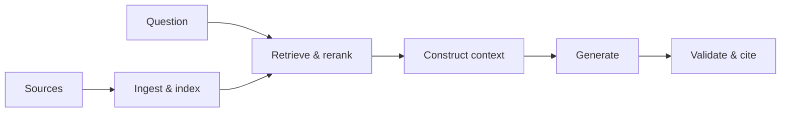

# Retrieval-Augmented Generation (RAG)

**Purpose:** Supply selected external evidence to a generative model at request time.

**Prerequisites:** Chunking, embeddings, lexical search, context windows, prompting, evaluation.

## Pipeline

## What it solves

RAG helps with private, fresh, traceable, or large knowledge without changing model weights. It does not guarantee truth: parsing, retrieval, ranking, context use, and generation can each fail.

## Variants

Basic, hybrid, multi-query, parent-child, late-interaction, graph, multi-hop, adaptive, and agentic retrieval.

## Evaluate by stage

- Ingestion: completeness and parsing fidelity
- Retrieval: recall@k, precision@k, MRR/nDCG, authorization correctness
- Generation: answer correctness, faithfulness, citation precision
- System: latency, cost, availability, and user task success

## When not to use it

Prefer direct structured queries for exact transactional facts; long-context input for small bounded corpora; fine-tuning for behavior/style changes; and deterministic software for rules that must always hold.
