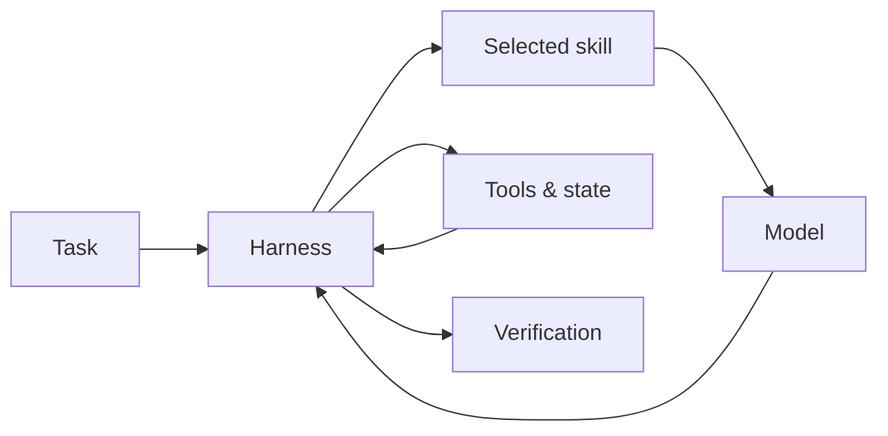

# Skills and Harnesses

## Skills

A skill is a reusable package of instructions, procedures, examples, and sometimes scripts or assets that teaches an agent how to perform a bounded class of work. Durable skills define triggers, inputs, outputs, constraints, verification, and failure handling—not only a prompt.

## Harnesses

A harness is the surrounding execution and evaluation environment: context assembly, tools, permissions, state, retries, sandboxing, traces, tests, and stopping conditions. The same model can behave very differently inside different harnesses.

## Relationship

## Code practice

Specify a document-analysis skill and implement a tiny harness that validates inputs, supplies tools, captures traces, checks the output schema, and stops after bounded retries.

## Enduring principle

Capability is produced by a system around a model. Reusable procedural knowledge and reliable execution boundaries remain useful even when packaging formats change.
