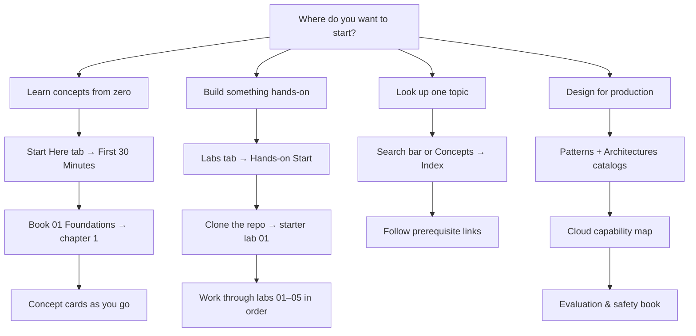

# Newcomer Guide

Use this page when you are **new to AIEBOK** and want a clear order of operations. The site is large by design—you do not need to read everything at once.

## Choose your goal

## Recommended first week

| Day | Read (on this site) | Do (in the repo) |
|---|---|---|
| 1 | [First 30 minutes](first-30-minutes.md) · [How to use AIEBOK](how-to-use.md) | Clone the [repository](https://github.com/mahalingam-inapp/aiebok){target="_blank" rel="noopener"} · run `mkdocs serve` locally |
| 2 | Book 03 ch. 5 — [Similarity & vector search](../books/03-language-and-representation/05-similarity-and-vector-search.md) | [Starter lab 01 — Cosine similarity](https://github.com/mahalingam-inapp/aiebok/blob/main/labs/01-cosine-similarity/lab.ipynb){target="_blank" rel="noopener"} |
| 3 | Same book · ch. 6 [Embedding systems](../books/03-language-and-representation/06-embedding-systems-in-production.md) | [Starter lab 02 — Semantic search](https://github.com/mahalingam-inapp/aiebok/blob/main/labs/02-semantic-search/lab.ipynb){target="_blank" rel="noopener"} |
| 4 | Book 06 ch. 3 — [Retrieval](../books/06-knowledge-and-retrieval-systems/03-retrieval.md) | [Starter lab 03 — Basic RAG](https://github.com/mahalingam-inapp/aiebok/blob/main/labs/03-basic-rag/lab.ipynb){target="_blank" rel="noopener"} |
| 5 | Book 08 ch. 2 — [Agent loop](../books/08-agent-systems/02-the-agent-loop.md) | [Starter lab 04 — Agent loop](https://github.com/mahalingam-inapp/aiebok/blob/main/labs/04-agent-loop/lab.ipynb){target="_blank" rel="noopener"} |
| 6 | Book 10 ch. 1 — [Evaluation as requirements](../books/10-evaluation-safety-and-governance/01-evaluation-as-requirements.md) | [Starter lab 05 — Eval harness](https://github.com/mahalingam-inapp/aiebok/blob/main/labs/05-eval-harness/lab.ipynb){target="_blank" rel="noopener"} |
| 7 | [Learning paths](learning-paths.md) · pick a role track | Write three things you still cannot explain |

!!! tip "Repository links open in a new tab"
    Links to GitHub (notebooks, clone, source files) leave this site so you keep your reading place. Look for the ↗ marker.

## Where to go in the site

<!-- site-stats:nav-cards:start -->

-   :material-home:{ .lg .middle } __Start Here__

    Orientation, setup, and first-week plan.

    [You are here](newcomer-guide.md)

-   :material-bookshelf:{ .lg .middle } __Guided Books__

    13 books · 78 chapters.

    [Book catalog →](../books/index.md)

-   :material-sitemap:{ .lg .middle } __Knowledge Areas__

    20 curriculum maps with lesson paths.

    [KA map →](../knowledge-areas/index.md)

-   :material-notebook:{ .lg .middle } __Guided Lessons__

    163 lessons (120 KA + 43 supplemental).

    [Lesson catalog →](../lessons/index.md)

-   :material-lightbulb:{ .lg .middle } __Concepts__

    361 reference cards.

    [Featured concepts →](../concepts/index.md)

-   :material-puzzle:{ .lg .middle } __Patterns & Architectures__

    100 patterns · 25 studios.

    [Pattern library →](../patterns/index.md)

-   :material-flask-outline:{ .lg .middle } __Labs__

    83 runnable labs.

    [Hands-on start →](../labs/start-here.md)

-   :material-book-alphabet:{ .lg .middle } __Reference__

    Glossary, prerequisites, and question index.

    [Glossary →](../reference/glossary.md)

<!-- site-stats:nav-cards:end -->

!!! tip "Fewer clicks"
    Large catalogs (patterns, labs, lessons, cloud capabilities, glossary, concept cards) use **collapsed accordion groups** — expand one section instead of scrolling long link lists. Chapters are listed on each **book overview** page; use **search** (`/`) to jump anywhere.

## What lives on GitHub Pages vs in the repo

| On the website (read-only) | In the repository (run code) |
|---|---|
| Books, concepts, patterns, search | `labs/*/main.py` and `test_lab.py` |
| Static guides and architecture pages | `labs/*/lab.ipynb` guided notebooks |
| MkDocs site content | Dev Container / Codespaces environment |

You **clone or open Codespaces** once, then alternate: read a chapter on the site, run the matching lab in the repo.

## Next steps

- **Hands-on path:** [Labs → Hands-on start](../labs/start-here.md)
- **Role-based depth:** [Learning paths](learning-paths.md)
- **Full catalog:** [Lab guide](../labs/index.md) · [Book catalog](../books/index.md)
